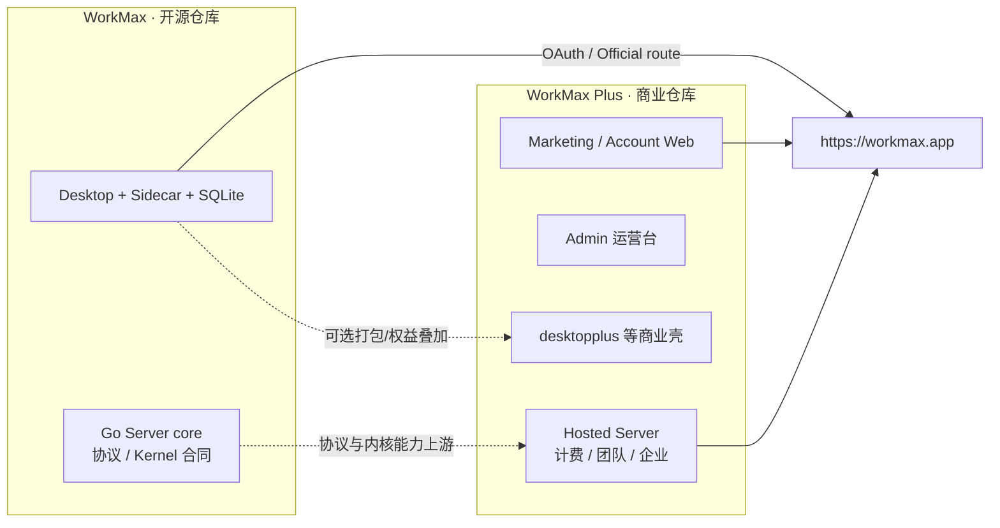
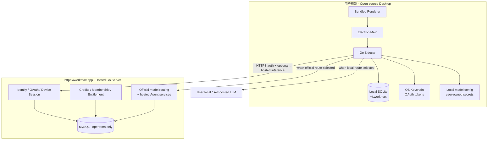

# WorkMax 开源本地 Desktop 运行时模式

| Field | Value |
|---|---|
| **Document** | OSS Local-First Desktop Runtime Mode |
| **Date** | 2026-08-07 |
| **Status** | Product decision (authoritative for end-user runtime) |
| **Related** | `writer-work-agent-plugin-platform-design-2026-08.md` v1.45 · `p0-049-production-wiring-evidence-gates-design-2026-08.md` · sibling repo `workmaxplus` |

---

## 0. 双产品：WorkMax（开源）与 WorkMax Plus（商业）

| | **WorkMax**（本仓库） | **WorkMax Plus**（sibling：`../workmaxplus`） |
|---|---|---|
| **定位** | 开源核心 / 本地优先 Agent 客户端 | 基于 WorkMax 的**商业化**产品线 |
| **交付面** | `server/` + `desktop/`（AGPL） | 托管 SaaS 控制面 + 商业能力：`web/`、`admin/`、`server/` 商业扩展、`desktopplus/` 等 |
| **终端用户怎么跑** | Desktop 本地 SQLite 启动；可选连官方云 | 主要消费 **workmax.app** 托管服务（Web / Desktop 权益 / 支付 / 团队） |
| **模型** | **Local 自配** ∥ **Official 额度** 双路径 | 官方托管模型 + Credits / 订阅为主；商业策略可限制「掏空毛利」的 BYOK 包装 |
| **身份 / 支付** | 登录可走 `https://workmax.app`；本仓不背完整营销站与 Admin SPA | Stripe、定价页、会员、Team/Enterprise、运营 Admin |
| **MySQL / Worker / Commerce 账本** | 可选：自建 Server 或官方云 | **运营必需**（Plus 托管后端） |
| **许可与边界** | 开源可审计、可自建、可接本地模型 | 商业 SKU、合同、SLA、协作与企业能力（见 Plus 内 `commercial-edition-design.md`） |



**关系原则：**

1. **WorkMax 是底座** — Agent 合同、Desktop 本地运行、Local 模型路径、开源可构建性都在本仓。
2. **WorkMax Plus 是商业化** — 把托管、支付、增长、Admin、Team/Enterprise、营销 Web 放在 Plus；不强迫开源用户装 Web/Admin。
3. **共享协议，分仓交付** — 身份 / Credits / Official 模型以云端为准时，OSS Desktop 只当客户端；Plus 拥有运营与商品包装。
4. **不互相污染启动路径** — OSS 用户：SQLite + 可选登录 + Local/Official 模型。Plus 用户：完整 SaaS 漏斗（注册/定价/Checkout/团队）。
5. **BYOK 策略可以分叉** — OSS Desktop **明确支持**用户本地/自建模型配置；Plus 商业文档可对「官方托管路径上的 BYOK 掏空 Credits」说不，二者不矛盾：Local route 属于开源本地能力，Official route 属于托管商品。

Plus 侧权威商业设计（不在本仓展开）：`workmaxplus/ProjectDocs/design/commercial-edition-design.md`、`pricing-strategy-v3.md`、Team/Enterprise 系列文档。

---

## 1. 产品一句话

> **WorkMax Desktop 是开源、本地运行的 Agent 客户端：启动即用本地 SQLite，登录走 `https://workmax.app` 远程授权；登录后用户可选用自配本地/自建大模型，或使用账户在官方侧的大模型额度与配置。商业化能力（Web、Admin、Team/Enterprise、增长与合同）在 WorkMax Plus。**

用户**不需要**安装或连接 MySQL 才能使用开源 Desktop。MySQL / 云端 Agent Worker / Commerce 账本属于 **workmax.app / WorkMax Plus 托管运营面**（以及自建 Server 的部署者），不是 Desktop 终端用户的启动前提。

---

## 2. 双平面架构



| 平面 | 谁运行 | 数据 | 职责 |
|---|---|---|---|
| **Local Edge** | 用户安装的 Desktop + Sidecar | SQLite + Keychain + 本地模型配置 | UI、本地缓存、登录协调、本地 Agent 执行、本地模型调用 |
| **Cloud Control Plane** | workmax.app（或自建 Server） | MySQL 等 | 授权、账户、套餐/额度、官方模型代理、可选云端 Durable Agent |

---

## 3. 启动与数据（本地 SQLite）

### 3.1 启动路径（已有基线）

1. Electron 启动 → 拉起 Go Sidecar（`server/cmd/workagent-desktop`）。
2. Sidecar `OpenLocalDB()` 打开/创建 `~/.workmax`（或 `WORKMAX_DESKTOP_DATA_DIR`）下的 SQLite。
3. 本地 migration、integrity check、日备份按现有 Desktop 合同执行。
4. **不**要求本机 MySQL，**不**读取用户机器上的 `server/config.yaml` 作为「用 App 的前提」。

### 3.2 SQLite 里放什么

| 类别 | 示例 | 权威性 |
|---|---|---|
| 会话缓存 | threads / messages / cursors | **镜像**；云端为账户同步真源（登录后） |
| 本地意图 | Alpha.6 turn intent / interrupted recovery | 本地执行状态 |
| 诊断/日志元数据 | 非密钥诊断 | 本地 |
| 模型路由选择 | `preferred_route=local\|official`、本地 endpoint 引用 | 本地偏好；密钥不进明文 SQLite |
| 密钥 | OAuth refresh/access、本地 API Key | **Keychain / OS 密钥库**，不进 git、不进明文 DB |

### 3.3 云端 MySQL 与谁有关

- **终端用户 / OSS 日常开发跑 Desktop**：无关。
- **运营 workmax.app 或自建完整云端**：有关（P0-049 migration runner、Worker、Commerce 等仍适用）。
- **Hermetic CI**：继续 SQLite/fake；不得把 MySQL 合同测试当成 Desktop 必跑项。

---

## 4. 登录：远程 `https://workmax.app` 授权

### 4.1 默认 Cloud Base

| 环境 | Cloud Base |
|---|---|
| 生产打包 | `https://workmax.app`（或发布时钉死的官方 Origin） |
| 开发 | 可覆盖 `WORKMAX_CLOUD_BASE`；仅 loopback / 明确 staging 白名单 |
| 自建 Server | 用户/发行版配置自定义 Origin（仍须 HTTPS，除精确 loopback 开发例外） |

### 4.2 登录后本地得到什么

- Device Session / Access + Refresh（Keychain）
- 用户身份与会员/额度摘要（可缓存，以 Bootstrap/UserInfo 刷新为准）
- **不**把云端 MySQL schema 搬到本机

登录是 **控制面授权**，不是「把整个后端装进笔记本」。

### 4.3 与现有 Login Transaction / OAuth

- 密码 Login Transaction、OAuth Device Session 等继续以 **远程 Server** 为权威。
- Sidecar 只做 loopback 协调与本地 token 保管（Current 方向保持）。
- 离线：可读本地 SQLite 缓存历史；**写 Agent / 官方模型** 在无有效 session 时 fail closed 或明确降级提示（沿用 offline-disabled writes 精神）。

---

## 5. 模型双路径（登录后）

用户登录成功后，Agent 推理走两条互斥路由（线程级或账号默认级；UI 可切换）。

### 5.1 路径 A — 用户本地 / 自建大模型（Local route）

| 项 | 规则 |
|---|---|
| 配置者 | **用户自己** |
| 配置内容 | Base URL、API 兼容协议（如 OpenAI-compatible / Anthropic-compatible）、model id、可选温度等 |
| 密钥存放 | OS Keychain 或加密本地 store；Renderer 永不持久化明文 key |
| 执行位置 | **本机 Sidecar**（或 Sidecar 拉起的本地 runtime）直接调用用户 endpoint |
| 积分 | **不消耗** workmax.app 官方模型额度（除非未来产品明确「本地路由仍记审计」——默认不计费） |
| 网络 | 默认只访问用户配置的 endpoint；不强制经 workmax.app 转发 body |
| 开源价值 | 用户可用 Ollama / vLLM / 私有网关 / 自有 API Key，不绑死官方供应商 |

### 5.2 路径 B — 官方大模型额度（Official route）

| 项 | 规则 |
|---|---|
| 配置者 | **平台**（workmax.app Server 下发允许的 model catalog + 路由策略） |
| 额度 | 登录账户的 Credits / Membership / Entitlement（云端权威） |
| 执行位置 | 请求经 Desktop → 云端 **hosted model / Agent API**；密钥与供应商合同留在服务端 |
| 密钥 | 用户 **拿不到** 官方供应商 API Key；只持有自己的 Desktop session |
| 失败 | 余额不足、模型下线、策略拒绝 → 稳定错误，可提示切换到 Local route |
| 开源价值 | 零配置也能干活；付费/会员用户走托管质量与合规 |

### 5.3 路由裁决（实现合同草案）

```text
StartTurn / local Agent execution:
  1. Read account preference: route = local | official
  2. If local:
       - require valid local model profile (endpoint + model + secret present)
       - execute on Sidecar with user credentials
       - do not call official credit reserve for model tokens
  3. If official:
       - require valid session + positive entitlement path
       - call https://workmax.app Agent/model surface
       - cloud owns reserve/settle for hosted usage
  4. Never mix: one turn one route; no silent fallback local→official that burns credits
```

**禁止静默回退**：Local 失败不得自动改走 Official 扣费；Official 失败不得自动把用户 key 发到未知 endpoint。UI 可提供「一键切换路由后重试」。

### 5.4 与 Durable Cloud Kernel（P0-045…049）的关系

| 能力 | Local route | Official route |
|---|---|---|
| Desktop SQLite 缓存 / 续聊 UI | 是 | 是 |
| 云端 Durable Turn / Worker / Settlement Ledger | 否（本机执行生命周期） | 是（云端权威，渐进接线） |
| 用户本机 MySQL | 永不需要 | 永不需要 |
| 运营方 MySQL | N/A | workmax.app 部署需要 |

P0-049 的 migration runner / Worker wiring 仍是 **云端运营与自建 Server** 的工程切片，**不是** Desktop 用户启动清单。

---

## 6. 用本模式重答 P0-049 Open Questions

| # | 原问题（运营向） | 在「开源本地 Desktop」下的含义 | **决议** |
|---|---|---|---|
| 1 | 19 legacy 列在哪些库采样？ | **仅** cloud/自建 Server 运营关心；Desktop 用户无关 | **Deferred to cloud-ops**。Desktop 不依赖。采样对象 = workmax.app staging + 生产只读结构副本（运营 runbook），与 App 启动无关。 |
| 2 | Worker attestation URL / mTLS？ | 双进程 API↔Worker 是 **云端**拓扑 | **Desktop 默认不需要**。本机 Sidecar 单进程承载 Local route；Official route 的 Durable Worker 在云端，attestation 属 workmax.app 部署 ADR。Lab 云端 canary 仍可用 loopback/mTLS，但不进入用户安装包。 |
| 3 | Null lab 积分从哪来？ | 终端用户不跑 Null lab | **分轨**：① Desktop 开发/CI = SQLite + fake，无真实积分；② Local route = 用户自有模型，无官方额度；③ Official route / 云端 lab = workmax.app 测试账号的 lab_grant 或真实会员额度。 |
| 4 | Commerce 多 topic？ | 仅云端支付 | **保持** P0-049：只消费 `commerce.order.completed.v1`；与 Desktop 启动无关。 |

---

## 7. 开源发行边界

| 仓库交付 | 说明 |
|---|---|
| `desktop/` + Sidecar 源码 | 用户可本地构建、审计、改 Local route |
| `server/` 源码 | 可自建与 workmax.app 对等的控制面（AGPL） |
| 默认连接 | 官方构建默认可指向 `https://workmax.app`；允许文档化覆盖 |
| 密钥 | 仓库不提交任何用户/官方 API Key；example 配置无秘密 |
| MySQL | **可选**：仅自建 Server / 官方云需要；README 启动路径以 Desktop+SQLite 为主叙事 |

---

## 8. 实现切片建议（相对现状）

| 优先级 | 切片 | 状态意向 |
|---|---|---|
| P0 | 保持/强化：SQLite 启动、远程 OAuth/Login、Keychain、offline 禁写 | Current 大部分已有 |
| P1 | **Local model profile**：Sidecar 配置 CRUD + Keychain 密钥 + 路由偏好 | **Partial（2026-08-08）**：Sidecar + bridge `settings.*` alpha.7 + Models 侧栏 UI；**尚无** Local 推理执行 |
| P1 | **Official route catalog**：登录后 Bootstrap 下发允许模型列表与「用额度」入口 | Partial（UserInfo/tier 粗粒度） |
| P2 | 单 Turn 路由冻结 + 无静默扣费回退 + UI 切换 | 待实现（读 ModelSettings） |
| P2 | Local route 下 Agent 执行不经过云端 Worker | 设计冻结；实现随 Agent 路径演进 |
| Cloud | P0-049 wiring / MySQL runner | **仅云端/自建 Server**；与 Desktop OSS 默认路径解耦 |

---

## 9. Key Decisions

| ID | Decision |
|---|---|
| OSS-0 | **WorkMax（本仓）= 开源底座；WorkMax Plus（`workmaxplus`）= 商业化**。Web/Admin/Team/Enterprise/增长漏斗归属 Plus，不恢复进开源必选交付面 |
| OSS-1 | 终端用户运行时 = **Desktop + 本地 SQLite**；不强制本机 MySQL |
| OSS-2 | 登录默认 **`https://workmax.app`** 远程授权；token 本地 Keychain |
| OSS-3 | 登录后 **双路径模型**：Local（用户自配）∥ Official（官方额度/配置） |
| OSS-4 | 一 Turn 一路由；禁止静默跨路由扣费回退 |
| OSS-5 | 本地 API Key 永不进入 Renderer 持久化与 git |
| OSS-6 | P0-049 / 云端 MySQL / Worker attestation 属 **托管与自建 Server / Plus** 平面，不写入 Desktop 必选启动步骤 |
| OSS-7 | 开源仓库交付 Desktop 与 Server core；默认产品体验以本地 Desktop 为准 |
| OSS-8 | Plus 可驳回「官方路径上掏空 Credits 的 BYOK 包装」；**不**否定 OSS Desktop 的 Local route（自建/本地模型） |

---

## 10. References

- Desktop SQLite：`server/desktop/db.go`、`server/cmd/workagent-desktop/main.go`
- Cloud Base / OAuth 校验：`desktop/electron` security helpers；`WORKMAX_CLOUD_BASE`
- 仓库边界 ADR：`ProjectDocs/adr/2026-08-08-workmax-plus-repository-boundary.md`
- Local/Official 设置合同：`ProjectDocs/design/local-model-route-settings-2026-08.md`（Sidecar `GET|PUT /settings/model-route`）
- 架构基线：`ProjectDocs/writer-work-agent-plugin-platform-design-2026-08.md`
- 云端接线切片：`ProjectDocs/p0-049-production-wiring-evidence-gates-design-2026-08.md`
