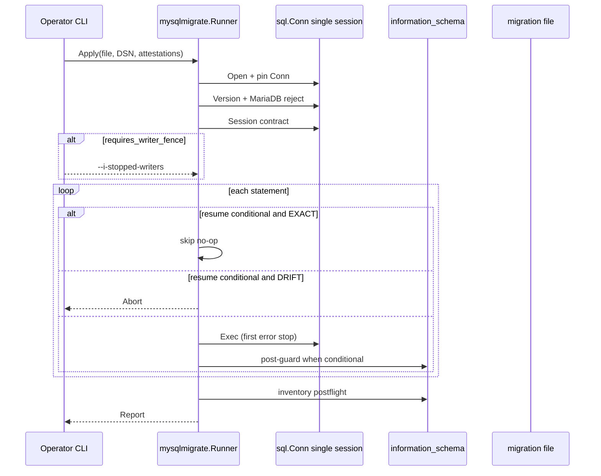
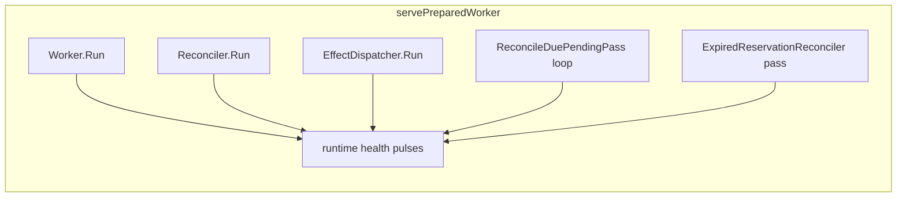
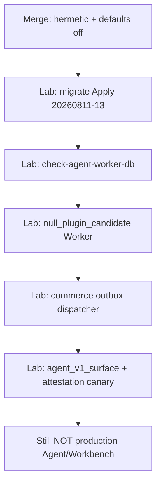
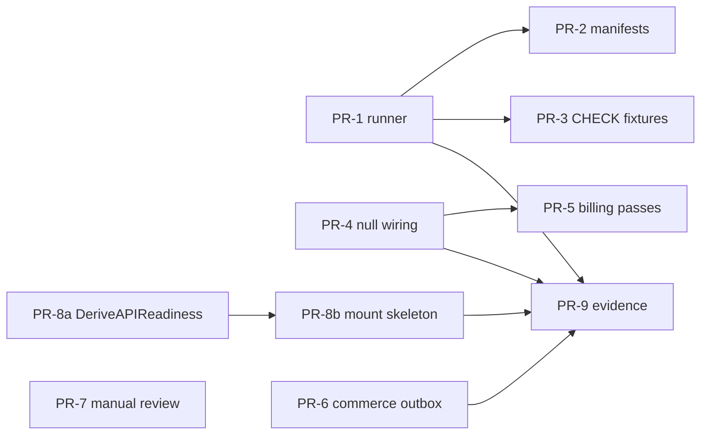
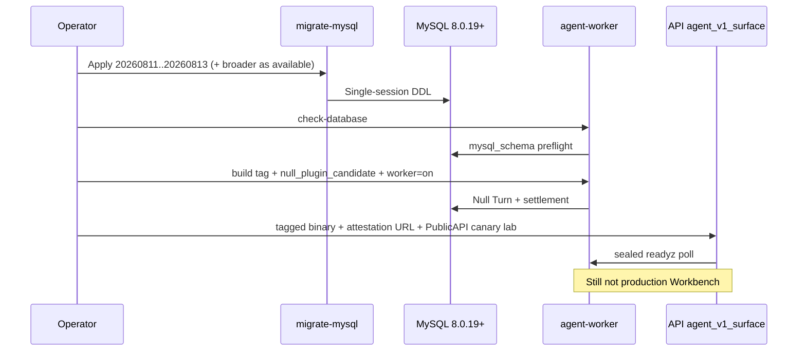

# WorkMax P0-049: Production Wiring & Evidence Gates

| Field | Value |
|---|---|
| **Document** | P0-049 Production Wiring & Evidence Gates |
| **Author** | Platform (design) |
| **Date** | 2026-08-07 |
| **Status** | Draft (revision 4 — Null commercial lifecycle aligned to Provider Usage kernel) |
| **Baseline** | `ProjectDocs/writer-work-agent-plugin-platform-design-2026-08.md` v1.45 |
| **Product boundary** | `server/` + `desktop/` only |
| **Prerequisite slices** | P0-045 … P0-048 (hermetic contracts + schema-first SQL) |
| **Product runtime mode** | End-user / OSS Desktop is **local SQLite + remote auth** (`oss-local-desktop-runtime-mode-2026-08.md`). This document is the **cloud / self-hosted Server wiring** slice, not the Desktop user start checklist. |

---

## Overview

P0-045 through P0-048 delivered deep hermetic Agent Kernel, Credits Reservation hardening, Commerce Provider Event Inbox/Outbox producer, and Turn-to-Reservation Settlement Outcome Ledger candidates. Production remains fail-closed: `cmd/agent-worker` still uses `unwiredWorkerComposition`, `initialize.Routers()` deliberately does not mount `api/agent/v1`, Commerce Outbox has no Deliverer, and there is no generic Oracle MySQL migration runner or real-MySQL migration execution evidence.

**Audience split (2026-08-07 product decision):** WorkMax’s open-source **Desktop** starts with local SQLite and authorizes against `https://workmax.app`; users may use self-configured local models or official hosted quota. P0-049 does **not** require end users to run MySQL or a local Agent Worker. The machinery below applies to **workmax.app operators and self-hosted Server deployments** that want opt-in Durable Worker / migration / Commerce outbox evidence gates.

P0-049 designs the **next code-structure and wiring slice**: how to move from hermetic candidates to **opt-in, evidence-gated production readiness paths** without claiming a production-ready Agent or Desktop Workbench. The slice freezes:

1. A generic, safe MySQL migration runner aligned with existing guarded SQL style.
2. A real-but-default-off Production Worker Builder path that can wire sealed Authorities, reconcilers, and Null/Test Plugin first — with exact static plan, build-identity, and settlement adapter contracts matching today’s sealed Builder.
3. Dual-role readiness (API vs Worker processes) and an Agent v1 mount **skeleton** under build-tag isolation; live PublicAPI canary enablement is gated on sealed Worker attestation, not YAML alone.
4. Commerce Outbox Dispatcher + minimal protected manual-review operator surface (separate from Agent Effect Outbox), config under existing `system.cron`.
5. Explicit evidence gates that prevent hermetic tests from being misreported as real MySQL/Provider production evidence.

---

## Background & Motivation

### Current verified state

| Area | State | Evidence location |
|---|---|---|
| Agent Turn Kernel | Deep hermetic candidate (48 `*.go` files): SQLStore, Fenced Execution, ClaimNext, Reconciler, Worker, Effect Outbox/Dispatcher, EventStream, Settlement Review, Provider Usage Journal, Reservation admission | `server/service/agentturn/` |
| Agent Billing | Turn-to-Reservation Binding, Settlement Outcome Ledger, pending reconciler, expired reservation reconciler (default-off, not imported by agent-worker) | `server/service/agentbilling/` |
| Worker process | Full composition skeleton; production entry still `unwiredWorkerComposition` (fail-closed) | `server/cmd/agent-worker/main.go` |
| Agent v1 API | Start/Status/Stream/Cancel handlers exist; **not** mounted; locked by test | `server/api/agent/v1/`, `production_mount_test.go` |
| Dep fence | `go list -deps ./initialize` has **no** `service/agentturn` or `api/agent/v1` (verified 2026-08-07). This is **not** the Makefile `test-boundaries` target (that audits Desktop source paths). | Live `go list`; living design §6.5 |
| Commerce P0-047 | Inbox producer + default-off inbox reconciler under `system.cron.commerce_event_reconciler`; Outbox rows produced (topic `commerce.order.completed.v1`); **no** Deliverer | `server/service/commerce/`, `server/scheduler/commerce_provider_event_reconciler.go`, `server/config/system.go`, `server/initialize/cron_v2.go` |
| Migrations | `20260807`–`20260813` schema-first SQL + SQLite mirrors + schema tests; **no real MySQL execution evidence**, no generic runner | `server/migrations/` |
| Rollout config | Default-off `AgentPlatformRollout`; config can only lower readiness; Worker/API consumers partial | `server/config/agent_platform_rollout.go` |
| Desktop | Alpha.6 PPT preview + legacy recovery; not Durable Attach; legacy WorkAgent still production traffic | `desktop/`, legacy routes in `initialize/router_surfaces.go` |

### Pain points

1. **Cannot prove schema on Oracle MySQL 8.0.19+** without a runner that respects single-session TEMPORARY guards, first-error stop, and ABSENT/EXACT/DRIFT forward-resume.
2. **Authorities and reconcilers cannot be activated** while `unwiredWorkerComposition` is the only production build path.
3. **Agent v1 cannot be canaried safely** because (a) mount is hard-off and (b) single-process `DeriveReadiness` cannot mark PublicAPI Ready when Worker loops live in another binary.
4. **Commerce Outbox is half-built**: financial mutations write `w_commerce_outbox` rows that never drain.
5. **Evidence misclassification risk**: SQLite/hermetic green is regularly mistaken for production readiness.

---

## Goals & Non-Goals

### Goals (P0-049)

| ID | Goal |
|---|---|
| G1 | Ship a generic MySQL migration runner CLI + library that safely executes reviewed SQL files on Oracle MySQL 8.0.19+ with preflight/postflight hooks into existing runtime schema contracts. |
| G2 | Replace `unwiredWorkerComposition` with a **default-off Production Builder** path that, when all static/evidence gates pass, wires Database → Store/Claim → ProviderUsage → Settlement adapter → Null/Test Plugin → Null Effects, plus pending/expired reconcilers with health coupling. |
| G3 | Design dual-role readiness + Agent v1 mount skeleton under build-tag isolation; define principal/credential boundaries and parallel legacy WorkAgent (no dual-write). **Live PublicAPI canary enablement** requires sealed Worker attestation (not merge-default). |
| G4 | Complete Commerce Outbox Dispatcher/Deliverer + minimal protected manual_review inspection API/CLI; keep tables separate from `w_agent_effect_outbox`; config under `system.cron`. |
| G5 | Freeze evidence gates: which tests must be green before each flag flip; explicit “not production-ready Agent/Workbench” until listed items pass; codify default-off assertions. |

### Non-Goals (must not expand scope)

- Mind Canvas / monetization scenario packs
- Full Durable Desktop Workbench UI / Durable Attach event-cursor productization
- Writer / Workbook / Media domain plugin migration or real domain executors
- Third-party Marketplace
- Restoring `web/` or `admin/`
- Google login production adapter (parallel dependency; note only)
- Claiming Provider authenticity without signature verifier + `ProviderRequestIssued`
- AutoMigrate for Agent/Commerce financial tables
- Multi-tenant multi-schema migration orchestration
- Online schema-change at scale (gh-ost/pt-osc) in this slice
- Merging Commerce Outbox with Agent Effect Outbox
- **API process must not construct or Run `agentturn.Worker` / `Reconciler` / `EffectDispatcher` loops** (negative test when `agentapi` lands)
- **API process must not claim Worker readiness via free-form YAML** without a sealed attestation channel (see §B.5 / §C.1)
- Shipping production traffic for Agent v1 or Null Plugin against real users

---

## Proposed Design

### Architecture (target process roles)

```mermaid
flowchart TB
  subgraph Desktop[Desktop - only user client]
    Electron[Electron + Sidecar]
  end

  subgraph API[Go API process - production traffic]
    LegacyWA[Legacy WorkAgent JWT routes]
    AgentV1[Agent v1 - build-tag mount skeleton]
    CommerceWH[Stripe webhook + Inbox receipt]
    OpAPI[AdminAuth manager read-only commerce inspect]
    Attest[WorkerRoleAttestation client]
    LegacyWA -. parallel no dual-write .-> AgentV1
  end

  subgraph Worker[agent-worker independent binary]
    Builder[Production Builder default unwired]
    Store[SQLStore + Claim + Outbox]
    Auth[productionSettlementAuthority adapter]
    Loops[Worker + Reconciler + Effect Dispatcher]
    BillRec[Pending + Expired Reservation passes]
    Health[livez/readyz + pass freshness]
  end

  subgraph Migrate[migrate-mysql CLI - operator only]
    Runner[Single-session Migration Runner]
    PrePost[Postflight fingerprints]
  end

  subgraph DB[(Oracle MySQL 8.0.19+)]
    AgentTables[w_agent_* + binding/outcome]
    Credits[w_credit_reservation*]
    Commerce[w_commerce_provider_event + w_commerce_outbox]
    EffectOB[w_agent_effect_outbox]
  end

  Electron -->|legacy chat| LegacyWA
  Electron -.->|future canary Agent Resource| AgentV1
  CommerceWH --> Commerce
  AgentV1 --> AgentTables
  Attest -->|poll sealed readyz| Health
  Builder --> Store
  Store --> AgentTables
  Auth --> Credits
  Auth --> AgentTables
  Loops --> EffectOB
  BillRec --> Credits
  BillRec --> AgentTables
  OpAPI --> Commerce
  Runner --> PrePost
  Runner --> DB
  Health --> BillRec
```

### Design principle: fail-closed, evidence-gated, config lowers only

Reuse the existing readiness law from `agentturn.DeriveReadiness`:

> Configuration can only **lower** readiness; it can never raise it. Overclaimed YAML booleans are blockers.

P0-049 extends that law to migrations, Worker wiring modes, dual-role API readiness, and commerce cron flags (details below).

---

## A. MySQL Migration Runner Design

### A.1 Placement and package boundary

| Component | Path | Responsibility |
|---|---|---|
| Library | `server/service/mysqlmigrate/` | Parse, classify, execute, fingerprint, report |
| CLI | `server/cmd/migrate-mysql/` | Operator entry; **no** import of `service/agentturn` |
| Schema contracts | Worker/check paths keep `agentturn` preflight; runner owns version/session guards | Separation of “migrated” vs “Worker ready” |
| Existing inventory | `server/migrations/*.sql` + `*_schema_test.go` | Source of truth for SQL text |
| Testdb mirror guard | `server/scripts/guard/check_migrations.go` | Unchanged |

Dependency rule:

```
cmd/migrate-mysql → service/mysqlmigrate → database/sql + go-sql-driver/mysql
cmd/agent-worker  → service/agentturn (mysql_schema / mysql_runtime)  [runtime preflight only]
initialize/       ↛ service/agentturn, ↛ api/agent/v1  [default build; see §C.2 build tag]
```

### A.2 Runner semantics (aligned with 20260812 / 20260813)

1. **Pins one physical MySQL session** (`sql.Conn`). TEMPORARY tables, user variables, and `GET_LOCK` are connection-scoped.
2. **Rejects** MariaDB and MySQL &lt; 8.0.19 before persistent DDL.
3. **Session contract** before DDL: FK/CHECK/UNIQUE enforcement on, `time_zone='+00:00'`, isolation ∈ {RC, RR}, UTC agreement, page size as required by file family.
4. **First-error stop**; no best-effort continuation.
5. **No-backfill** by default; `allows_dml: true` only if manifest opts in (Agent financial files stay no-DML).
6. **Forward-resume only** after ABSENT/EXACT/DRIFT classification where manifests support it.
7. **No AutoMigrate**; `multiStatements=false`; one statement per `ExecContext`.

**PR-1 required hermetic test:** prove a TEMPORARY table created on Conn A is invisible on Conn B, and that the runner aborts if code paths attempt pool multi-conn execution for a single-session file.

### A.3 Statement model and file manifest (aligned scope)

| File set | P0-049 runner support | Manifest requirement |
|---|---|---|
| `20260811`–`20260813` | Full classify + conditional resume (ABSENT/EXACT/DRIFT) | **Required** before production Apply (PR-2) |
| `20260807`–`20260810` | **Sequential-only** (first-error stop; no automatic EXACT skip) | Optional manifests; production Apply allowed sequential with writer fence + postflight |
| `20260665`–`20260672` and earlier Agent Turn SQL | Lab Apply sequential; **not** a PR-1–3 deliverable | Later gate for E.3 full evidence list |

A.3 **must-have** for P0-049 production runner use of commerce/billing hardening = manifests for **`20260811`–`20260813` only**. Earlier files stay sequential-only because their TEMPORARY version/baseline guards are not structured as 20260813-style ABSENT/EXACT/DRIFT object pairs.

Example sidecar:

```yaml
# server/migrations/20260813_harden_agent_billing_owner_graph.manifest.yaml
version: "20260813_harden_agent_billing_owner_graph"
mysql_min: "8.0.19"
oracle_mysql_only: true
single_session: true
stop_on_first_error: true
allows_dml: false
requires_writer_fence: true
innodb_page_size_min: 16384
resume_mode: conditional   # 20260811-13 only
statements:
  - id: budget_check
    kind: ddl
    resume: conditional
  - id: allocation_pack_fk
    kind: ddl
    resume: conditional
  - id: order_membership_index
    kind: ddl
    resume: conditional
```

### A.4 Execution algorithm



### A.4.1 Migration ledger (optional in P0-049)

**Decision (KD-ledger):** For P0-049 the ledger table `_schema_migrations_workmax` is **fully optional**. Primary proof of Apply is:

1. Operator runbook record (version, file SHA-256 of exact bytes, wall clock, operator id).
2. Runner `ApplyReport` JSON printed to stdout.
3. Subsequent `make check-agent-worker-db` / runtime preflight.

If a later PR adds the ledger:

- Bootstrap SQL creates it with the same single-session / version gates as other financial migrations.
- Mark version applied **only** after full file success; partial success never inserts `status=applied`.
- Checksum = SHA-256 of exact file bytes (no newline normalization).
- Concurrent Apply of the same version: unique key on `version` + status check; second operator gets conflict.
- Automated guard: assert Desktop `_schema_migrations` name ≠ server ledger name in a unit test under `mysqlmigrate` or `scripts/guard`.

P0-049 does **not** require ledger creation to land PR-1.

### A.5 Preflight / postflight vs `mysql_schema.go` / `mysql_runtime.go`

| Layer | When | Owner | Proves |
|---|---|---|---|
| Migration runner postflight | After Apply | `mysqlmigrate` | File-local fingerprints |
| Worker runtime preflight | `-check-database` / Worker start | `agentturn` + `mysql_runtime.go` | Full 19-table runtime contract |

Rules: runner never opens Worker loops; `make check-agent-worker-db` and `make test-agent-platform-mysql` remain separate targets; runner green ≠ Worker-on ready.

### A.6 `20260812` predecessor CHECK_CLAUSE exactness

1. Lab-capture `information_schema.CHECK_CONSTRAINTS.CHECK_CLAUSE` on Oracle MySQL 8.0.19+.
2. Golden fixtures under `server/migrations/testdata/mysql_check_clauses/`.
3. Reuse / align with `mysql_schema.go` canonicalizer.
4. Blocking for production Apply of 20260812+ once fixtures exist; not a hermetic SQLite claim.

### A.7 Remaining 19 legacy presence-only columns

Two-phase: inventory on real installs → normalize migration → then promote runtime exact contract. Normalize SQL is **follow-on** after lab inventory; not invented in this design.

### A.8 CLI interface

```text
go run ./cmd/migrate-mysql \
  -c /path/to/secure-mysql.yaml \
  -file migrations/20260813_harden_agent_billing_owner_graph.sql \
  -i-stopped-writers \
  -i-understand-forward-only
```

Flags: `-c`, `-file` (single file; no directory apply-all in v1), attestations, `-dry-run`, `-resume-classify`.

### A.9 Risks (Migration Runner)

| Risk | Severity | Mitigation |
|---|---|---|
| Re-run after partial DDL | High | Classify + refuse DRIFT |
| Multi-conn TEMPORARY break | High | Pin Conn; PR-1 hermetic test |
| CHECK_CLAUSE printer variance | Medium | Lab fixtures |
| Runner green as production-ready | High | Dual postflight / runtime |

---

## B. Production Worker Authority Wiring (default-off)

### B.1 Problem

`productionWorkerRuntime().build` is hard-wired to `unwiredWorkerComposition`. The sealed Builder (`buildValidatedWorkerComposition`) implements:

`Database → Store → Claim → ProviderUsage → Settlement → Plugin executors → Effect deliverers → CompositeProbe → exact Compose → ownership transfer`

…but no production catalog registers factories, and main never calls the Builder. `validateWorkerDependencyPlan` is a hard pure gate that PR-4 must satisfy without weakening.

### B.2 Production path structure + secure config

```go
// production_wiring.go
func productionWorkerComposition(ctx context.Context, snapshot workerStartupSnapshot) (*WorkerComposition, error) {
    switch snapshot.ProductionWiringMode() {
    case workerWiringUnwired:
        return unwiredWorkerComposition(ctx, snapshot)
    case workerWiringNullPluginCandidate:
        return buildNullPluginProductionComposition(ctx, snapshot)
    default:
        return nil, errWorkerDependenciesUnavailable
    }
}
```

`productionWorkerRuntime` sets `build: productionWorkerComposition`. Default mode remains `unwired`.

#### B.2.1 Worker secure-config schema additions

Extend **Worker-only** decode (not shared API config). New document section sibling to `agent_platform_rollout` / `mysql_system`:

```yaml
# Worker secure config only — API process must not define or honor these keys.
agent_worker:
  production_wiring_mode: unwired   # unwired | null_plugin_candidate
  worker_id: ""                     # required when mode=null_plugin_candidate
  build_digest_path: ""             # optional file containing sha256:…; see digest source rule
  billing:
    pending_settlement_pass: off    # off | on
    expired_reservation_pass: off   # off | on
```

Mapstructure:

```go
type workerAgentWorkerDocument struct {
    ProductionWiringMode string `mapstructure:"production_wiring_mode"`
    WorkerID             string `mapstructure:"worker_id"`
    BuildDigestPath      string `mapstructure:"build_digest_path"`
    Billing struct {
        PendingSettlementPass  string `mapstructure:"pending_settlement_pass"`
        ExpiredReservationPass string `mapstructure:"expired_reservation_pass"`
    } `mapstructure:"billing"`
}
```

Closed enums / fields (strings, consistent with rollout modes — **not** free booleans):

| Field | Values / rule | Default |
|---|---|---|
| `production_wiring_mode` | `unwired`, `null_plugin_candidate` | `unwired` |
| `worker_id` | printable ASCII, trimmed, ≤ `MaxWorkerIDBytes`; empty allowed only when mode=`unwired` | `""` |
| `build_digest_path` | optional path to file whose entire content is one `sha256:…` digest | `""` |
| `billing.pending_settlement_pass` | `off`, `on` | `off` |
| `billing.expired_reservation_pass` | `off`, `on` | `off` |

**Build digest source rule (exactly one when mode=`null_plugin_candidate`):**

1. If env `WORKMAX_AGENT_WORKER_BUILD_DIGEST` is non-empty → use it (must be canonical non-zero `sha256:…`).
2. Else if `build_digest_path` is non-empty → read file (same format).
3. Else → **reject** at decode/plan time (`errWorkerDependencyIdentityUnavailable`).
4. If **both** env and path are set → **reject** (ambiguous source).
5. Injected digest must be **≠** `sha256:`+hex(config file digest).

`workerStartupSnapshot` gains:

```go
wiringMode              workerWiringMode
workerID                string
buildDigestPath         string // raw path; digest resolved at inject time
pendingSettlementPass   workerPassMode
expiredReservationPass  workerPassMode
```

**Validation matrix** (decode-time + plan-time):

| Worker role | wiring mode | worker_id / digest | billing passes | Result |
|---|---|---|---|---|
| off | unwired | ignored | off/off | Clean exit (today) |
| off | null_plugin_candidate | * | * | **Reject** `errWorkerRoleConfig` — wiring only with Worker-on |
| off | * | * | any on | **Reject** — passes require Worker-on |
| on | unwired | ignored | * | `unwiredWorkerComposition` (still fails closed if someone expects traffic) |
| on | null_plugin_candidate | empty worker_id **or** no unique digest source | * | **Reject** at decode/plan |
| on | null_plugin_candidate | valid id + unique digest source | off/off | Allowed if static plan + factories + probes pass |
| on | null_plugin_candidate | valid | pass on | Allowed; health coupling applies (§B.4) |
| on | unknown mode | * | * | **Reject** |

`ValidateWorkerRole` remains the rollout projection gate (SQLStore / fencing / outbox / settlement **declared** readiness). Wiring mode is **additional** Worker-secure state; it never appears under `agent_platform_rollout` in the API process config.

**API process:** must ignore the entire `agent_worker` block (no decode into API structs).
### B.3 Null Plugin candidate static plan (exact fields)

**Dual gate for candidate mode:** build tag `agentworker_null_plugin` **AND** `production_wiring_mode=null_plugin_candidate`. YAML alone cannot enable. Default (untagged) builds always compile via stub pair (§B.7); selecting null mode without the tag returns `errWorkerDependenciesUnavailable` at runtime.

#### B.3.1 Frozen Null Plugin identity

| Field | Frozen value |
|---|---|
| Plugin ID | `workmax.null` |
| Version | `0.1.0` |
| ReleaseDigest | `sha256:` + lowercase hex of canonical Null Plugin release artifact bytes (pinned file `server/cmd/agent-worker/testdata/null_plugin_release.sha256` content = full `sha256:…` string) |
| EffectTopics | exactly one: `workmax.null.effect.v1` |
| ExecutionTimeout | `2m` |
| ProgressTimeout | `30s` |
| Promotion.marker | `1` |
| Promotion.snapshot | equal to Snapshot above |
| Promotion.ledgerDigest | `sha256:` + pinned parity ledger digest in `server/cmd/agent-worker/testdata/null_plugin_parity.sha256` |
| ProviderUsage plan kind | `journal_registry_v1` |
| Settlement plan kind | `credits_v1` |

#### B.3.2 Build identity (candidate)

Today production has **no** artifact injector. Candidate mode supplies:

| Field | Source |
|---|---|
| `provenance` | `workerBuildIdentityFromArtifact` (required by `validProductionBuildIdentity`) |
| `WorkerID` | Secure config `agent_worker.worker_id` only (no hostname fallback); empty when mode=null ⇒ decode/plan reject |
| `BuildDigest` | Exactly one of env `WORKMAX_AGENT_WORKER_BUILD_DIGEST` **or** file at `agent_worker.build_digest_path` (§B.2.1). Canonical non-zero `sha256:…` and **≠** config digest |

Hermetic tests use fixed digests (pattern in `production_dependencies_test.go`: `validBuildIdentityForTest`).

#### B.3.3 Factory → concrete type map

| Factory slot | Concrete implementation | Ownership |
|---|---|---|
| Database | Open MySQL from `workerValidatedDatabaseConfig` via existing `mysql_runtime` helpers; probe = Ping + schema subset | `workerFactoryRegisteredResources` |
| ProviderUsage | **Required path only** — mirror `newRealProviderUsageBindingForTest` (§B.3.3.1); **empty registry is invalid** | Borrowed-only after DB+Store owned |
| Settlement | `productionSettlementAuthority` (§B.3.4) wrapping `agentbilling.ProviderUsageCreditAuthority` | Borrowed-only |
| Executor | `nullPluginExecutor` — deterministic terminal **`completed`**; may Emit zero or one effect on `workmax.null.effect.v1` | Borrowed-only |
| Effect | `nullEffectDeliverer` — immediate success (`Delivered`) | Borrowed-only |

**Hermetic tests (PR-4):** `validateWorkerDependencyPlan(snapshot, build, nullPlan, nullCatalog)` succeeds without opening MySQL; factory tripwires prove no I/O at validate time (existing pattern). Integration-style tests (SQLite/testutil) exercise the real ProviderUsage binding path.

#### B.3.3.1 ProviderUsage for `workmax.null` (single frozen path)

`normalizeWorkerProviderUsageRecorderRegistry` requires `len(registry) == len(plugins)` and **≥1 registration per plugin**, each with non-missing `MeterReleaseID`, validated `Source`, and `Recorder` that `MatchesScope(journal, plugin, …)`. Empty registry **always fails** binding construction — do not design around it.

**Frozen lab path** (same shape as `provider_usage_test.go` `newRealProviderUsageBindingForTest`):

1. `journal := agentturn.NewProviderUsageJournal(store)`.
2. Build exactly **one** `UsageMeterReleaseRecord` for plugin `workmax.null@0.1.0` with pinned digests from testdata:
   - `BillingPolicyKey`: `credits.v1`
   - `MeterKey` / `MeterVersion`: `provider.usage` / `1`
   - `PricingSnapshotJSON`: lab-fixed e.g. `{"currency":"credits","unitPrice":1}` (canonical bytes pinned)
   - **≥1** `ProviderUsageSourceRegistration` (freeze **exactly one** lab source for Null to minimize surface):
     - `ProviderKey`: `provider.lab.workmax.null`
     - `SourceKey` / versions / verification kind digests: pinned constants in `testdata/null_plugin_provider_source.json` (or equivalent Go constants under build tag)
3. **Insert** the MeterRelease row in the ProviderUsage factory at startup (lab/candidate only) via the same table write pattern as `insertUsageMeterReleaseForTest` — not expected to be pre-seeded by migration (migrations remain no-backfill). Factory is idempotent on exact `release_id` replay; conflict on digest drift fails closed.
4. `journal.ScopeRecorder(ctx, plugin, release.ReleaseID, source)` for each source (≥1).
5. `newWorkerProviderUsageBinding(db, store, journal, []plugin, registry)` with registry keyed by `workerPluginSnapshotKey(workmax.null)`.

**No alternate path:** zero-source MeterRelease, empty registry, or “skip journal for Null” are forbidden.

#### B.3.4 Settlement adapter (required)

`agentbilling.ProviderUsageCreditAuthority` **cannot** implement private `matchesWorkerProviderUsageBinding` (package boundary). Production composition requires:

```go
// cmd/agent-worker/production_settlement.go  (always compiled — unit-testable without catalog tag)
// productionSettlementAuthority is the only Settlement object allowed into
// buildValidatedWorkerComposition for null_plugin_candidate.
type productionSettlementAuthority struct {
    inner   *agentbilling.ProviderUsageCreditAuthority
    binding *workerProviderUsageBinding // exact pointer from ProviderUsage factory
    identity *workerProviderUsageIdentity
}

func (a *productionSettlementAuthority) matchesWorkerProviderUsageBinding(b *workerProviderUsageBinding) bool {
    return a != nil && b != nil && a.binding == b && a.identity != nil &&
        b.intact(/* db, store, plugins from seal */) && a.identity == b.identity
}

// Embed / delegate all agentturn.SettlementReviewProviderUsageAuthority methods to inner.
```

**Null meter + terminal settlement (single path, kernel-valid under Provider Usage):**

Production Builder requires `workerJournalBackedSettlementAuthority` / Provider Usage mode. Under that mode the kernel enforces (verified in `sql_execution_store.go`, `settlement_review_usage.go`):

| Rule | Code fact |
|---|---|
| Executor must **not** assert Release or positive `UsedUnits` on terminal Commit | `providerUsageCallerAssertionUntrusted` is true for `SettlementIntentRelease` **or** `UsedUnits > 0` on any terminal status → `ErrSettlementCompletedUsageUntrusted` |
| Measurement request only | nil / default / explicit **Finalize(0)** means “measure this Review” |
| Measure receipt `UsedUnits` | `SettlementReviewProviderUsageAuthorityReceipt.Validate` requires **`UsedUnits >= 1`** |
| Resolution | Finalize path requires `UsedUnits >= 1` and `UsedUnits <= ReservedUnits` |

Therefore the lab commercial path is **not** “Reserve → Release unused”:

1. **Admission:** Reserve(**1**) lab credit (`workmax.null.lab`).
2. **Executor Commit:** `TerminalStatus=completed` with settlement **nil / default / Finalize(0)** only — never `Release`, never positive `UsedUnits` from the Plugin.
3. **`nullProviderUsageMeter`:** implements `agentbilling.ProviderUsageMeter`; accepts only §B.3.3.1 Null MeterRelease/source digests; returns a stable receipt with **`UsedUnits = 1`** (consume the single lab unit). Rejects foreign plugins/releases or `UsedUnits != 1`.
4. **Kernel / Authority:** Review → Measure → Resolve/**Finalize(1)** on the same binding via `productionSettlementAuthority` / agentbilling (not executor-asserted settle).
5. **Hermetic test:** `TestNullPluginReserveOneMeasureOneFinalizeLifecycle`.

**Rejected (kernel-invalid under this Builder):** measure used=0; executor Release; executor Finalize(positive); Review-hold-only Null path as the success lifecycle; plain Credits-only Authority for `null_plugin_candidate`.

**Explicit reject:** plain `*agentbilling.CreditSettlementAuthority` **without** the journal-backed provider usage interface is **not** installable into `null_plugin_candidate` production Builder (Builder type-asserts `workerJournalBackedSettlementAuthority`). Legacy public Compose test fakes remain test-only.
### B.4 Settlement + reconciler wiring + expired ClaimNext semantics

Inside Worker serve path after successful composition, optionally start **default-off** billing passes:



#### B.4.1 Decision table: expired sentinel vs pass health

**Refinement of living-design language:** keeping `claimNextSkips(ErrTurnReservationExecutionExpired) == true` (current kernel in `sql_claim_next.go`) is **required** so one expired commercial hold cannot head-of-line block healthy work. Disabling skip when pass is off would return that error from `ClaimNext` and stop the scan — worse than accumulation.

| Pass mode | Pass health | ClaimNext on exact expired | Healthy work behind expired | Readyz |
|---|---|---|---|---|
| `off` | n/a | **Skip** (unchanged kernel) | Continues | Ready if other probes OK; emit metric `agent_expired_binding_skipped_total`; if skipped-expired count over window exceeds threshold **and** bindings exist, optional **degraded reason** (not necessarily not-ready in P0-049) |
| `on` | healthy (last success within freshness) | **Skip**; pass retires eligible owners | Continues | Ready |
| `on` | stale / failed | **Skip** (still no HOL block) | Continues | **Not Ready** — reasons include `expired_pass_stale` / `expired_pass_failed` |
| `on` | never succeeded since start | Skip | Continues | **Not Ready** until first successful pass |

**Package ownership:**

- Skip list stays in `agentturn` (`claimNextSkips`) — **no behavior change** to skip set in P0-049.
- Pass enablement + health in `cmd/agent-worker` (`production_billing_loops.go` + `runtime_health.go`).
- `ExpiredReservationReconciler` stays in `agentbilling`; Worker constructs and ticks it.

**Tests:**

- Keep existing `sql_claim_next` / `reservation_execution` tests that assert expired is skippable.
- **Add** Worker health tests: pass on+stale ⇒ not ready; pass on+healthy ⇒ ready; pass off ⇒ ready (wiring candidate) without requiring ClaimNext option bits.
- Document that production **retirement** of expired owners requires pass `on` + healthy; skip alone does not settle Credits.

### B.5 Dual-role readiness (API vs Worker)

#### B.5.1 Problem (frozen)

`agentturn.DeriveReadiness` derives `WorkerLeaseFencing` only when `components.Execution != nil && components.Worker != nil`, and PublicAPI intent requires `intent.WorkerEnabled && derived.WorkerLeaseFencing` on the **same** `PlatformComponents` (`readiness.go` intentBlockers). An API composition with SQLStore + Stream but **no** local `*Worker` can never be Ready for PublicAPI under current rules. Config `Validate()` checking `durable_turn.worker == on` is YAML overclaim if no Worker process is proven.

#### B.5.2 Chosen design: sealed `WorkerRoleAttestation` + split derive helpers

```go
// package agentturn — additive, hermetic-tested

// WorkerRoleAttestation is proof that a peer Worker process is live, ready,
// and bound to the same schema/plugin/build coordinates the API will admit.
// It is not a *Worker and does not grant Claim/Fence rights in-process.
type WorkerRoleAttestation interface {
    // Intact reports whether the attestation was produced by a trusted
    // channel and has not been tampered with (private seal / marker).
    Intact() bool
    // MatchesAdmission returns true when plugin release digests and
    // schema generation the API will use equal the Worker's advertised set.
    MatchesAdmission(plugins []agentv1.EventPluginRef, schemaGen string) bool
    // Fresh reports last successful probe within the API's freshness budget.
    Fresh(now time.Time, budget time.Duration) bool
}

// APIPlatformComponents is what the API process actually installed.
type APIPlatformComponents struct {
    Store      Store
    Stream     *TurnEventStream
    Settlement SettlementAuthority // admission + status paths as needed
    // WorkerAttestation is required for PublicAPI; never raised by YAML alone.
    WorkerAttestation WorkerRoleAttestation
}

func DeriveAPIReadiness(
    intent RolloutIntent,
    declared DeclaredReadiness,
    components APIPlatformComponents,
) ReadinessReport
```

Rules for `DeriveAPIReadiness`:

1. Config still can only **lower** readiness. Overclaim is evaluated only against **API-projected** declared readiness (§B.5.2.1), never the raw full-block YAML.
2. PublicAPI requires: durable SQLStore, Stream, Settlement, credential enforcement intent as today, **and** `WorkerAttestation.Intact() && Fresh && MatchesAdmission`.
3. `WorkerEnabled` in API intent means “Worker role is required for this traffic,” satisfied by **attestation**, not by installing `*Worker` in the API binary.
4. Existing `DeriveReadiness` + `PlatformComponents` remain for **Worker process** composition (unchanged single-process semantics; still uses `declaredWorkerReadiness` in `compose.go`).

#### B.5.2.1 `declaredAPIReadiness` — API-role projection (symmetric to Worker)

Worker already avoids cross-role overclaim via `declaredWorkerReadiness` (`compose.go`): it maps only Worker-owned booleans and **excludes** token/device/public-API stream/Desktop claims.

API needs the symmetric projection so shared YAML with `worker_lease_fencing: true` and `transactional_outbox: true` (required for Worker-on validation) does **not** permanently overclaim when the API process has no local Execution/Worker/Outbox+Dispatcher.

```go
// package agentturn or service/agentapi — pure projection, hermetic-tested

// declaredAPIReadiness maps only API-owned declares from the shared rollout block.
// It deliberately leaves WorkerLeaseFencing and TransactionalOutbox as false in the
// DeclaredReadiness value passed to overclaim checks: those capabilities are proven
// for PublicAPI solely by WorkerRoleAttestation, not by local PlatformComponents.
func declaredAPIReadiness(rollout config.AgentPlatformRollout) DeclaredReadiness {
    return DeclaredReadiness{
        TokenRolloverComplete: rollout.Readiness.TokenRolloverComplete,
        ActiveDeviceSessions:  rollout.Readiness.ActiveDeviceSessions,
        SQLStore:              rollout.Readiness.SQLStore,
        AtomicLiveEventStream: rollout.Readiness.AtomicLiveEventStream,
        ExactlyOnceSettlement: rollout.Readiness.ExactlyOnceSettlement,
        // WorkerLeaseFencing:    false  // not API-local; attestation only
        // TransactionalOutbox:   false  // not API-local; attestation only
    }
}
```

| Declared field | API overclaim target? | How PublicAPI proves it |
|---|---|---|
| `sql_store` | Yes vs local SQLStore | Installed `*SQLStore` |
| `atomic_live_event_stream` | Yes vs local Stream | Installed `*TurnEventStream` |
| `exactly_once_settlement` | Yes vs local Settlement | Installed admission Settlement authority |
| `worker_lease_fencing` | **No** (ignored in declared projection) | `WorkerAttestation` Intact+Fresh+MatchesAdmission |
| `transactional_outbox` | **No** (ignored in declared projection) | Same attestation (Worker owns Dispatcher) |
| token / device session | Credential intent gates (existing) | Credential middleware + readiness as today |

**Hermetic tests (PR-8a):**

- Shared YAML with **all** readiness booleans true + API components (Store, Stream, Settlement) **without** Worker/Dispatcher ⇒ `DeriveAPIReadiness` Ready **iff** attestation good.
- Same components, attestation missing/stale ⇒ **not** Ready even when YAML claims `worker_lease_fencing` / `transactional_outbox`.
- Naively passing full `DeclaredReadiness{…WorkerLeaseFencing: true…}` into an API-local overclaim helper that compares to components without Worker **must not** be the production call path (test the projection function returns fencing/outbox false).

#### B.5.3 Attestation channel (implementation sketch)

Current `workerOpsResponse` (`ops_handler.go`) is a **closed** contract: `schema`, `role`, `status`, `phase`, `reasons` only; reasons must pass `workerOpsReasonAllowed`. Extending carelessly breaks sanitizer tests.

| Piece | Behavior |
|---|---|
| Ops schema | Keep `workmax.agent-worker.ops/v1` for base fields; **additive optional** attestation object only when Ready, e.g. `"attestation": { "build_digest", "plugin_snapshots", "schema_fingerprint" }` — digests are non-secret build/plugin coordinates (not credentials/DSN). If additive fields are rejected by existing encoder tests, bump to `…/v1.1` with dual-read in the attestor |
| New reasons | Extend `workerOpsReasonAllowed` with closed codes: `expired_pass_stale`, `expired_pass_failed`, `pending_pass_stale`, `pending_pass_failed` (PR-5) |
| Listener | Ops handler **still does not bind a port** (existing design). Live attestation client assumes a **future protected operator listener** (Open Question #4). PR-8a ships hermetic **fake** `WorkerRoleAttestation` only; HTTP client is default-unused |
| API attestor (lab) | Polls configured URL over private network / mTLS when enabled; verifies schema + Ready + attestation block; builds sealed `liveWorkerRoleAttestation` |
| Failure | Not Ready — do not mount or do not pass Start gate |
| Forbidden | Copying Worker readiness booleans from YAML; scraping without seal; installing no-op attestation in production builds; putting secrets in reasons/attestation |

#### B.5.4 P0-049 delivery split

| Deliverable | In P0-049 merge? | Lab enable? |
|---|---|---|
| `WorkerRoleAttestation` interface + `DeriveAPIReadiness` + hermetic fakes | **Yes** (PR-8a) | n/a |
| Live HTTP attestor client | Yes, default unused | Lab |
| PublicAPI canary traffic | **No as default**; only after lab attestation green | Explicit |
| Install `*Worker` in API | **Never** | — |

Mount panic sketch removed: **startup policy** is deterministic (see §C.2).

### B.6 Dependency fence

Default CI / default build:

```bash
go list -deps ./initialize | grep -E 'service/agentturn|api/agent'  # must be empty
```

This is the **initialize dep fence**. It is **not** Makefile `test-boundaries` (Desktop path audit). Document in PR-8 and doctor script optionally.

### B.7 Factory registration module layout (compile matrix)

Default CI `go test ./cmd/agent-worker` (no tags) **must compile**. Pattern matches existing `secure_config_owner_unix.go` / `secure_config_owner_other.go` stubs.

| File | Build tag | Behavior |
|---|---|---|
| `production_wiring.go` | none | Mode switch; null branch always calls `buildNullPluginProductionComposition` (symbol present in every build) |
| `production_catalog_null.go` | `agentworker_null_plugin` | Real Null plan, factories, MeterRelease insert path, build-identity wiring into Builder |
| `production_catalog_null_stub.go` | `!agentworker_null_plugin` | `buildNullPluginProductionComposition` → `errWorkerDependenciesUnavailable` (stable); no MySQL I/O |
| `production_settlement.go` | none | Adapter type always present for unit tests without full catalog |
| `production_build_identity.go` | none | Digest resolve helpers; candidate plan only uses them when mode+tag allow |
| `production_billing_loops.go` | none | Pass runners (default-off) |
| `testdata/null_plugin_*.sha256` (+ source pins) | n/a | Digests / source constants |

Mode=`null_plugin_candidate` on an untagged binary: wiring switch calls stub → fail closed with `errWorkerDependenciesUnavailable` (do not panic). Mode=`unwired` on tagged binary: still unwired path (tag alone does not start Null).

### B.8 Risks (Worker wiring)

| Risk | Severity | Mitigation |
|---|---|---|
| Accidental Null Plugin on real users | High | Dual gate build tag + mode; AllowNewStarts false; no default mount |
| Settlement without adapter | High | Type assert journal-backed; plain Credits rejected |
| YAML-only PublicAPI | High | DeriveAPIReadiness + attestation |
| Weakening validateWorkerDependencyPlan | High | Forbidden; exact plan §B.3 |

---

## C. Agent v1 Mount Gate Design (default-off, skeleton-first)

### C.1 Mount conditions and dual-role readiness

`config.AgentPlatformRollout` already encodes PublicAPI off/canary/on, canary percent, credential enforce, Worker-on YAML, readiness booleans.

**P0-049 implementable rule:**

1. **Default production build:** PublicAPI=off; routes unmounted; `initialize` has no agentturn import (fence holds).
2. **Canary/on config without sealed attestation:** process **refuses to start** if the build includes the mount surface **or** if config PublicAPI≠off while attestation cannot be constructed — never half-mount.
3. Config `Validate()` remains necessary but **not sufficient**; runtime uses `DeriveAPIReadiness`.

### C.2 Composition root + initialize dep fence strategy (**build tag**)

**Frozen approach (KD-fence): build tag `agent_v1_surface`.**

| Build | Files | Deps | Behavior |
|---|---|---|---|
| Default (no tag) | No `agent_v1_surface*.go` in initialize | No agentturn / api/agent | `production_mount_test` green; fence green |
| ` -tags agent_v1_surface` | `initialize/agent_v1_surface.go` registers mount helper | May import `api/agent/v1` + `service/agentapi` | Used only for canary lab/staging binaries |

```go
// initialize/agent_v1_surface.go
//go:build agent_v1_surface

func mountAgentV1Surface(engine *gin.Engine, db *gorm.DB, rollout config.AgentPlatformRollout) {
    // Fail closed: PublicAPI≠off requires DeriveAPIReadiness Ready including attestation.
    // PublicAPI=off ⇒ return without mounting.
}
```

Default `Routers()` calls a no-op stub in `agent_v1_surface_stub.go` (`//go:build !agent_v1_surface`).

**CI:** default `go test ./...` and `TestInitializeRouterLeavesAgentV1CandidateUnmounted` remain green without the tag. Tagged package tests live under `initialize` with build tag or under `service/agentapi` hermetic tests that compose a router explicitly (pattern already used by agent v1 handler tests).

**PR-8 dependencies:** decoupled from Worker Null catalog. Depends on:

- Shared contracts (`agentturn` readiness attestation API, reservation admission types)
- `service/agentapi` composition
- **Not** `production_catalog_null.go` factories

Worker Null catalog evidence is a **lab enable** dependency for end-to-end canary, not a code-merge dependency for mount skeleton.

### C.3 Principal resolver + credential policy

- Agent Resource policy: audience, credential_type, client_id, device claims, scope `agent.run`.
- Middleware: `OAuthBearerAuthWithPolicy(AgentResourceBearerPolicy)` before Handler.
- PrincipalResolver maps `sub` → `agentturn.PrincipalID`.
- Desktop transport switch remains later; server contract only.

### C.4 Parallel with legacy WorkAgent JWT

No dual-write of Turn state; canary subject selection server-owned via `IncludesSubject`; legacy tables vs `w_agent_turn*`.

### C.5 Null Start commercial policy (**single frozen path**)

Handler needs Runtime / Principals / Starts / Events. P0-048 commercial path is `StartWithReservationAuthority`.

**Only lab path (aligned with §B.3.4 / Provider Usage kernel — no dual option):**

| Step | Behavior |
|---|---|
| 1 | Always `Service.StartWithReservationAuthority` — never bare Start that skips binding ledger |
| 2 | Server-owned `ReservationAdmission`: tool `workmax.null.lab`, **Reserve(1)** credit from lab-only pack (hermetic seed / lab runbook). **Reserve(0) forbidden** |
| 3 | Null executor `CommitAttempt`: `TerminalStatus=completed`, settlement **nil / default / Finalize(0)** only (measurement request). **Never** Release or positive `UsedUnits` from executor (`providerUsageCallerAssertionUntrusted`) |
| 4 | `nullProviderUsageMeter` returns **`UsedUnits = 1`** for the frozen Null release/source digests only |
| 5 | Kernel Review → Measure → Resolve/**Finalize(1)** on the same binding via `productionSettlementAuthority` / agentbilling |
| 6 | Hermetic test: `TestNullPluginReserveOneMeasureOneFinalizeLifecycle` |
| 7 | `AllowNewStarts` false until that hermetic path is green |
| 8 | Client cannot supply reservation ids/digests/pricing; body schema `{ "plugin": "workmax.null", "prompt": "..." }` only |

**Rejected alternatives:** measure used=0 + Release; executor-asserted Release/Finalize(n>0); Review-hold-only as success path; non-billable Turns without binding rows; shadow Start Worker cannot settle; plain-Authority Finalize(0) shortcut (Builder is journal-backed).

If Credits cannot reserve 1 unit → `INSUFFICIENT_CREDITS` (existing handler mapping) — fail closed.

### C.6 Event stream

API installs `TurnEventStream` for Stream route. Worker does not own public EventStream readiness.

---

## D. Commerce Outbox Dispatcher + Manual Review Ops Surface

### D.1 Complete the missing half of P0-047

Producer writes Outbox; inbox reconciler only; no outbox deliverer.

### D.2 Commerce Outbox Dispatcher + config placement

```text
server/service/commerce/outbox_dispatcher.go
server/service/commerce/outbox_deliverer.go
server/scheduler/commerce_outbox_dispatcher.go
```

**Config (existing path — do not invent top-level `commerce:`):**

```yaml
system:
  cron:
    enable: false
    commerce_event_reconciler: false   # existing
    commerce_outbox_dispatcher: false  # NEW, default false
```

```go
// config/system.go Cron struct
CommerceOutboxDispatcher bool `mapstructure:"commerce_outbox_dispatcher" ...`
```

Wire in `initialize/cron_v2.go` next to inbox reconciler: construct, Start on enable, Stop on SIGTERM lifecycle (same pattern as `CommerceProviderEventReconciler`).

**Topic inventory (P0-049):** Stripe processor already writes `commerce.order.completed.v1` (`stripe_provider_event_processor.go`). Null/Log deliverers **only** accept that topic in this slice; unknown topics → dead_letter with closed error code `unknown_topic`.

State machine: `pending|delivering|delivered|dead_letter` (matches schema; no `review_hold`). Delivery timeout &lt; lease; unknown ≠ success. **No** import of agentturn Effect types; **no** FK to `w_agent_effect_outbox`.

### D.3 Deliverer interface

```go
type CommerceOutboxDeliverer interface {
    Deliver(ctx context.Context, msg CommerceOutboxMessage) (CommerceDeliveryResult, error)
}
```

First deliverers: `NullCommerceDeliverer`, `LogCommerceDeliverer` (staging).

### D.4 Manual review operator surface (auth frozen)

**Frozen for PR-7:**

| Item | Decision |
|---|---|
| Auth | Existing `middleware.AdminAuth` (manager role via authenticated user id) **+** network ACL / private operator network (operational) |
| Scope | **Read-only** list + get |
| Mutations | **Deferred** (requeue not in PR-7; CLI-only later under dual-control design) |
| Desktop / Agent tokens | **Rejected** — routes not on Desktop OAuth groups; negative tests required |
| Unauthenticated | 401/403 |
| Path | Prefer existing admin-protected router group, e.g. under admin API prefix already using AdminAuth — **not** a new unauthenticated `/api/v1/operator` path |

```text
GET .../commerce/provider-events?status=manual_review&limit=50
GET .../commerce/provider-events/:id
```

Payload redacted by default (digest + status + error code); full payload only if existing admin privilege model already allows sensitive fields — default redact.

Negative tests in PR-7:

- No auth → fail
- Device Session / Agent Resource bearer → fail  
- Non-manager user → fail
- Manager → 200 list shape without raw secrets

CLI `cmd/commerce-ops` uses same DB read path with secure config (operator workstation), not Desktop TokenStore.

### D.5 Separation invariant (tests)

Commerce dispatcher ↛ agentturn; no FK between outboxes; topic namespaces distinct.

---

## E. Evidence & Release Gates

### E.1 Evidence classes

| Class | Proves | Examples |
|---|---|---|
| Hermetic | Logic + SQLite/mock | `make test-agent-platform` (+ agentbilling) |
| Schema static | SQL + mirrors | `*_schema_test.go` |
| Real MySQL preflight | Runtime schema | `make check-agent-worker-db` |
| Real MySQL write | Owned-row lifecycle | `make test-agent-platform-mysql` |
| Migration lab | Runner Apply on Oracle 8.0.19+ | Manual `migrate-mysql` |
| Wiring candidate | Null Plugin Worker under dual gate | Lab |
| Production traffic | Real users / money | **Out of P0-049** |

### E.2 Flag flip vs merge criteria (separated)



| Action | Merge criteria (PR DoD) | Lab enable criteria |
|---|---|---|
| Land migrate runner | Hermetic splitter/session tests; no CI Apply | Oracle Apply + postflight |
| `null_plugin_candidate` code | Dual gate; validate plan hermetic; default unwired | Migrations applied; check-agent-worker-db; probes green |
| `expired_reservation_pass=on` | Health tests hermetic | Pass healthy under load |
| `system.cron.commerce_outbox_dispatcher=true` | Default false test; dispatcher unit tests | Lab Null/Log deliver |
| PublicAPI canary | Mount skeleton + DeriveAPIReadiness fakes; default off; fence holds without tag | Live attestation; Null Start commercial path; Worker-on peer |
| PublicAPI on / Desktop durable | Out of P0-049 | Domain parity + Provider authenticity |

### E.3 Explicit “not production-ready until”

Same 10-item bar as before (migrations through 20260665–20260813 + normalize, real MySQL contracts, real domain plugins, Provider authenticity, dual-control Review ops, commerce consumers, packaged Desktop E2E, multi-instance soak, quarantine runbook, legacy drain). P0-049 success = **machinery + defaults off + documented gates**, not cutover.

Clarify: full `20260665`–`20260813` Apply evidence is an **E.3 production bar**, not a PR-1–3 merge requirement. PR-1–3 deliver runner + manifests for 20260811–13 + fixture harness.

### E.4 Makefile / CI targets

| Target | Change |
|---|---|
| `test-agent-platform` | **Extend** package list to include `./service/agentbilling`, and when landed `./service/mysqlmigrate`, `./service/commerce` outbox tests, `./service/agentapi` |
| `test-mysql-migrate` | New hermetic runner tests |
| `test-agent-platform-mysql` / `check-agent-worker-db` | Unchanged |
| CI | Never set Worker-on, PublicAPI canary, wiring mode, or commerce dispatchers by default |

**PR-9 automated assertions:**

- `EffectiveAgentPlatformRollout(nil)` all traffic off (extend existing config tests)
- Default `production_wiring_mode` unwired
- `system.cron.commerce_outbox_dispatcher` default false (mirror `TestCommerceEventReconcilerDefaultsClosed`)
- Document lab runbook path: migrate-mysql → check-agent-worker-db → optional null wiring

---

## API / Interface Changes

```go
// mysqlmigrate
type Runner interface {
    DryRun(ctx context.Context, file string) (PlanReport, error)
    Classify(ctx context.Context, file string) (ResumeReport, error)
    Apply(ctx context.Context, file string, att Attestation) (ApplyReport, error)
}

// agentturn
type WorkerRoleAttestation interface { Intact() bool; MatchesAdmission(...) bool; Fresh(...) bool }
func DeriveAPIReadiness(intent RolloutIntent, declared DeclaredReadiness, c APIPlatformComponents) ReadinessReport

// commerce
type CommerceOutboxDeliverer interface { Deliver(context.Context, CommerceOutboxMessage) (CommerceDeliveryResult, error) }

// api/agent/v1
func Register(r gin.IRoutes, h *Handler)

// config.Cron
CommerceOutboxDispatcher bool `mapstructure:"commerce_outbox_dispatcher"`
```

Worker secure config (`agent_worker.*`) as in §B.2.1 — **not** under API-consumed `agent_platform_rollout` for wiring mode.

---

## Data Model Changes

- No new business tables required in P0-049.
- Optional later: `_schema_migrations_workmax` (not required for PR-1).
- Optional later: CHECK_CLAUSE / legacy normalize migrations after lab inventory.

---

## Alternatives Considered

### Alt-1: GORM AutoMigrate for financial tables
Rejected — bypasses CHECK/FK guards; schema tests forbid it.

### Alt-2: Wire Writer/Media executors first
Rejected — parity ledger / domain order.

### Alt-3: Always mount Agent v1, flag inside handlers
Rejected — attack surface; fence break.

### Alt-4: Merge Commerce Outbox into Agent Effect Outbox
Rejected — domain coupling; living design forbids.

### Alt-5: Migration runner inside agent-worker `-migrate`
Rejected — privilege mix; prefer `cmd/migrate-mysql`.

### Alt-6: Defer PublicAPI mount entirely from P0-049
- **Pros:** Avoids dual-process readiness and initialize fence complexity; ship only runner + Worker Null + commerce outbox.
- **Cons:** Delays API composition learning; mount skeleton still needed soon for Phase 1.
- **Decision:** **Partial adopt** — P0-049 ships mount **skeleton** + `DeriveAPIReadiness` + build tag, but **does not** treat live canary enablement as a P0-049 success criterion. Full canary traffic is lab-gated.

### Alt-7: Dual-process readiness options
| Option | Pros | Cons |
|---|---|---|
| 7a Sealed WorkerRoleAttestation (chosen) | Preserves process isolation; config cannot forge Worker | Needs private poll channel + freshness |
| 7b Collocate Worker loops in API for canary only | Single DeriveReadiness works | Violates independent binary / non-goal; couples scale |
| 7c Canary without PublicAPI readiness until later | Simple | Accepts Starts with no executor proof — forbidden by intentBlockers spirit |

**Decision:** **7a**. Never 7b. 7c rejected for production-shaped canary.

---

## Security & Privacy Considerations

| Topic | Control |
|---|---|
| Migration credentials | Separate DDL role; secure file ownership |
| Writer fence | Attestation flags |
| Agent v1 auth | Agent Resource enforce; no Cookie JWT |
| Manual review | AdminAuth manager + ACL; read-only; negative token tests |
| Attestation channel | Private mTLS/network; sealed struct; no YAML Worker ready |
| Canary | Server-side subject hash |
| Fail-closed | Missing deps + enabled flags ⇒ fatal or unmounted |

---

## Observability

Worker readyz: closed ops schema (§B.5.3); new pass reasons allowlisted; optional additive attestation digests when Ready. API readiness blockers include `worker_attestation_missing|stale|mismatch`. Commerce: delivered/dead_letter counters. Migration: ApplyReport JSON only.

---

## Rollout Plan

1. Merge machinery default-off (all PRs).
2. Lab migrate 20260811–13 (+ broader set toward E.3).
3. Lab Worker null_plugin_candidate (build tag + mode).
4. Lab commerce outbox dispatcher.
5. Lab API binary with `agent_v1_surface` + attestation + Null Start commercial path.
6. Rollback: modes off, unwired, cron flags false, non-tagged API binary. Migrations forward-only.

---

## Open Questions

1. ~~Operator auth for manual_review~~ → **Resolved:** AdminAuth manager + ACL, read-only in PR-7.
2. ~~Promotion evidence for Null Plugin~~ → **Resolved:** dual gate build tag + pinned testdata digests + build digest injector env/file.
3. ~~Legacy column inventory topologies~~ → **Resolved (product mode 2026-08-07):** only **cloud / self-hosted Server ops**, never Desktop end-user runtime. Sample workmax.app staging + production read-only structure copies per cloud runbook. Desktop starts on **local SQLite** and does not depend on these columns. See `ProjectDocs/oss-local-desktop-runtime-mode-2026-08.md` OSS-1 / OSS-6.
4. ~~Worker attestation URL / mTLS mesh~~ → **Resolved (product mode):** attestation is a **hosted dual-process** concern. End-user Desktop does not run a separate cloud Worker; Local model route executes in Sidecar. Cloud lab canary may use loopback then private mTLS; not part of the packaged Desktop start path.
5. ~~Null lab credits funding~~ → **Resolved (product mode):** three tracks — (a) CI/hermetic = fake/SQLite zero credits; (b) Desktop **Local route** = user-owned models, no official credit burn; (c) **Official route** / cloud lab = workmax.app test account `lab_grant` or real membership. No “shared Null lab pack” required for OSS Desktop.
6. ~~Commerce topics beyond `commerce.order.completed.v1`~~ → **Resolved:** P0-049 allowlist stays single-topic; further Stripe outcomes need a later cloud PR. Irrelevant to Desktop SQLite start.

---

## Key Decisions

| ID | Decision | Rationale |
|---|---|---|
| KD-1 | Separate `cmd/migrate-mysql` + `service/mysqlmigrate` | DDL least privilege; single-session guards |
| KD-2 | Single session, one Exec per statement, first-error, forward-resume | Matches 20260812/13 |
| KD-3 | Runtime preflight separate from migration postflight | Migrated ≠ ready |
| KD-4 | `production_wiring_mode` default `unwired`; dual gate with build tag for null | Prevent accidental factories |
| KD-5 | Null/Test Plugin first | Phase 1 spirit without domain parity |
| KD-6 | Billing passes in Worker; keep ClaimNext expired **skip**; ready fails if pass on+stale | Avoid HOL starvation; retirement via pass |
| KD-7 | PublicAPI uses `DeriveAPIReadiness` + sealed attestation; never local `*Worker` | Fixes dual-process readiness |
| KD-8 | Legacy WorkAgent ∥ Agent v1; no Turn dual-write | Safe canary |
| KD-9 | Commerce Outbox ≠ Agent Effect Outbox; cron flag under `system.cron` | P0-047 invariant + existing config path |
| KD-10 | Manual review: AdminAuth read-only; no Admin SPA; no Desktop tokens | Boundary + existing middleware |
| KD-11 | Evidence classes explicit | Prevent misreporting |
| KD-12 | No production-ready Agent/Workbench claim | Scope honesty |
| KD-13 | `WorkerRoleAttestation` + `DeriveAPIReadiness`; config cannot raise API readiness | Issue 1 |
| KD-14 | Exact Null static plan + candidate build-identity injector; no validator weakening | Issue 2 |
| KD-15 | `productionSettlementAuthority` adapter; reject plain Credits-only in production Builder | Issue 3 |
| KD-16 | Initialize dep fence preserved via `agent_v1_surface` build tag | Issue 7 |
| KD-17 | Null Start: Reserve(1) → Commit Finalize(0) measure request → meter used=1 → Resolve/Finalize(1); never executor Release / used=0 measure | Issue 12 / rev3 #5 / rev4 #1 |
| KD-18 | Migration ledger optional in P0-049 | Issue 9 |
| KD-19 | Manifests required for 20260811–13; 20260807–10 sequential-only | Issue 8 |
| KD-20 | ProviderUsage: ≥1 MeterRelease+Source+ScopeRecorder per plugin; empty registry forbidden | rev3 #1 |
| KD-21 | Null catalog dual-gate compile stubs (`agentworker_null_plugin` / `!…`) | rev3 #2 |
| KD-22 | `declaredAPIReadiness` ignores local fencing/outbox overclaim; attestation proves Worker | rev3 #3 |

---

## PR Plan

Each PR lists **(a) merge DoD** and **(b) lab enable** where relevant. Defaults remain fail-closed.

### PR-1: MySQL migration runner library + CLI

| | |
|---|---|
| **Title** | `P0-049: add mysqlmigrate runner and migrate-mysql CLI` |
| **Files** | `server/service/mysqlmigrate/**`, `server/cmd/migrate-mysql/**`, Makefile `test-mysql-migrate` |
| **Depends on** | — |
| **Merge DoD** | Hermetic splitter tests; Conn A TEMPORARY invisible on Conn B; abort if multi-conn; no agentturn import; dry-run works |
| **Lab enable** | N/A for merge; lab Apply later |
| **Description** | Single-session runner, version gate, first-error stop, attestations. Ledger optional/not required. |

### PR-2: Manifests + resume for 20260811–20260813

| | |
|---|---|
| **Title** | `P0-049: migration manifests and ABSENT/EXACT/DRIFT resume for 20260811–13` |
| **Files** | `server/migrations/2026081{1,2,3}*.manifest.yaml`, classify logic, tests |
| **Depends on** | PR-1 |
| **Merge DoD** | Classify hermetic/sqlmock tests; sequential path still works for 20260807–10 without manifests |
| **Description** | Align A.3 must-have set with this PR only. |

### PR-3: CHECK_CLAUSE fixture harness

| | |
|---|---|
| **Title** | `P0-049: CHECK_CLAUSE fixture harness and runner postflight hooks` |
| **Files** | `server/migrations/testdata/mysql_check_clauses/**`, capture script, env-gated tests |
| **Depends on** | PR-1 |
| **Merge DoD** | Harness compiles; placeholders documented |
| **Lab enable** | Capture on real MySQL before production Apply of 20260812+ |

### PR-4: Worker production wiring mode + Null Plugin catalog

| | |
|---|---|
| **Title** | `P0-049: production_wiring_mode + null_plugin_candidate Builder path` |
| **Files** | `production_wiring.go` (untagged); `production_catalog_null.go` (`agentworker_null_plugin`); `production_catalog_null_stub.go` (`!agentworker_null_plugin`); `production_settlement.go` (untagged); `production_build_identity.go`; `startup_config.go` (`worker_id`, `build_digest_path`); testdata digests + source pins; tests |
| **Depends on** | — for merge (parallel PR-1); lab needs migrations |
| **Merge DoD** | Untagged `go test ./cmd/agent-worker` compiles; default unwired; null mode without tag → unavailable error; Worker-off rejects non-unwired; `validateWorkerDependencyPlan` green without MySQL; ProviderUsage factory path uses ≥1 registration (SQLite helper tests); adapter match method; plain Credits rejected; `worker_id`+digest source validation |
| **Lab enable** | After migrate + check-agent-worker-db; tagged binary + mode |
| **Description** | Mode switch; dual-gate stubs; exact §B.3 plan including real MeterRelease insert; settlement adapter. |

### PR-5: Billing pending + expired passes + health

| | |
|---|---|
| **Title** | `P0-049: Worker billing passes + ready health coupling` |
| **Files** | `production_billing_loops.go`, `runtime_health.go`, tests |
| **Depends on** | PR-4 |
| **Merge DoD** | Pass off default; on+stale ⇒ not ready; ClaimNext skip set unchanged; new reasons in `workerOpsReasonAllowed`; no agentturn skip API change |
| **Lab enable** | Pass on under lab load |

### PR-6: Commerce Outbox Dispatcher

| | |
|---|---|
| **Title** | `P0-049: commerce outbox dispatcher under system.cron` |
| **Files** | `service/commerce/outbox_*.go`, `scheduler/commerce_outbox_dispatcher.go`, `config/system.go`, `initialize/cron_v2.go`, example yaml, tests |
| **Depends on** | — |
| **Merge DoD** | Default `commerce_outbox_dispatcher: false`; Start/Stop lifecycle; only topic `commerce.order.completed.v1`; no agentturn import |
| **Lab enable** | Null/Log deliverer on lab |

### PR-7: Manual review list/get (AdminAuth read-only)

| | |
|---|---|
| **Title** | `P0-049: AdminAuth commerce manual_review inspection (read-only)` |
| **Files** | Admin-group handlers, optional `cmd/commerce-ops` read path, negative auth tests |
| **Depends on** | — (inbox table already exists); independent of PR-6 |
| **Merge DoD** | AdminAuth only; Desktop/Agent/unauth negative tests; no requeue mutation |
| **Description** | Freeze Issue 10 decisions. |

### PR-8a: Dual-role readiness API (agentturn)

| | |
|---|---|
| **Title** | `P0-049: WorkerRoleAttestation + DeriveAPIReadiness` |
| **Files** | `service/agentturn/readiness_api.go`, tests |
| **Depends on** | — |
| **Merge DoD** | Hermetic: PublicAPI Ready only with fresh matching attestation; `declaredAPIReadiness` ignores fencing/outbox overclaim; full YAML readiness true + no attestation ⇒ not Ready; Worker `DeriveReadiness` / `declaredWorkerReadiness` unchanged |

### PR-8b: agentapi + build-tagged mount skeleton

| | |
|---|---|
| **Title** | `P0-049: agentapi composition + agent_v1_surface mount skeleton` |
| **Files** | `service/agentapi/**`, `api/agent/v1/register.go`, `initialize/agent_v1_surface.go` (+tag), stub, `production_mount_test.go` still green default, Null Start reservation tests hermetic |
| **Depends on** | PR-8a; **not** PR-4 catalog |
| **Merge DoD** | Default build: fence holds (`go list -deps ./initialize` clean); PublicAPI off unmounted; tagged tests for mount; Null Start commercial policy hermetic; negative test API does not construct Worker loops |
| **Lab enable** | Tagged binary + live attestation + Worker null candidate + AllowNewStarts careful lab only |

### PR-9: Evidence gates + Makefile package list

| | |
|---|---|
| **Title** | `P0-049: evidence gate tests and test-agent-platform package coverage` |
| **Files** | `Makefile` (add agentbilling, mysqlmigrate, agentapi as landed), config default-off tests, system cron default test, wiring mode default test, lab runbook doc pointer in ProjectDocs or scripts |
| **Depends on** | PR-1…PR-8 as they land |
| **Merge DoD** | Defaults off asserted; no production-ready claim; hermetic CI unsets MySQL contract env (existing HERMETIC_TEST_ENV) |
| **Description** | Codify E.2 merge vs lab split. |

### PR dependency graph



---

## References

- Living architecture: `ProjectDocs/writer-work-agent-plugin-platform-design-2026-08.md` v1.45 §§6.5, 21, 22, 24, 25
- Worker: `server/cmd/agent-worker/{main,production_builder,production_dependencies,provider_usage,startup_config,mysql_runtime}.go`
- Readiness: `server/service/agentturn/readiness.go` (single-process); ClaimNext skip: `sql_claim_next.go` `claimNextSkips`
- Agent billing: `server/service/agentbilling/*`
- Agent v1: `server/api/agent/v1/*`
- Rollout: `server/config/agent_platform_rollout.go`
- Commerce cron: `server/config/system.go`, `server/initialize/cron_v2.go`
- Stripe outbox topic: `server/api/callback/stripe_provider_event_processor.go` (`commerce.order.completed.v1`)
- Admin auth: `server/middleware/admin_auth.go`
- Dep fence check: `go list -deps ./initialize` (not `make test-boundaries`)
- Make: root `Makefile` (`HERMETIC_TEST_ENV`, `test-agent-platform`, `test-agent-platform-mysql`, `check-agent-worker-db`)

---

## Appendix: Sequence — Null Plugin lab activation (non-prod)


