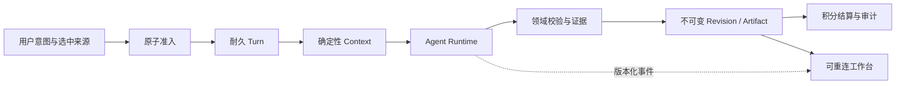
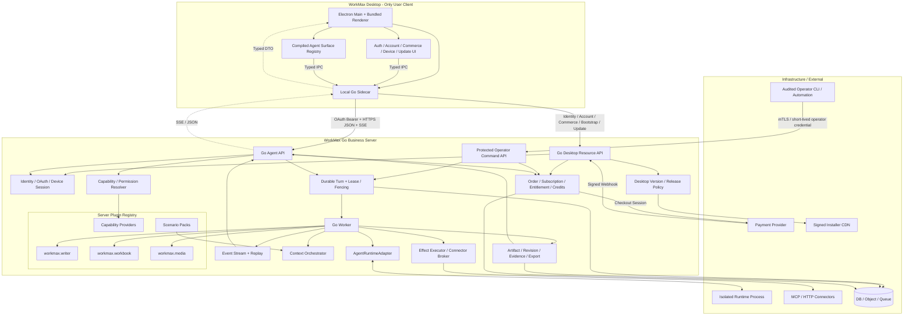

# Writer Agent、Work Agent 与插件式业务平台设计

> 文档状态：Living Design / 部分实现（以各节 Current / Partial / Proposed 分级为准）
> 版本：1.46
> 日期：2026-08-08
> 目标仓库：WorkMax（开源底座）；商业化 sibling：`../workmaxplus`（WorkMax Plus）
> 交付客户端：WorkMax Desktop（唯一用户客户端与唯一 Agent UI）
> 独立 Web / Admin 客户端：无；顶层 `web/`、`admin/` 已删除且不得恢复（商业 Web/Admin 在 Plus 仓）
> 目标服务端：WorkMax Go Server
> 分析对象：`../writego` Writer Agent、`../excelgpt` Work Agent，以及 WorkMax 当前 Work Agent / Skill / Desktop 基线
> 事实口径：以当前代码为准；历史设计文档仅作背景，不等同于已实现能力
> 来源系统工作树口径：Writer / ExcelGPT 的取证截点为 2026-08-01 15:12 CST；ExcelGPT 已提交基线 `8eddffaa`，截点可见的未提交 Workspace / Cell Style / ChatExcel 改动按 Partial 取证，之后漂移不在本文来源系统口径内。WorkMax Current 实现与文档状态另更新至 2026-08-08
> 本版增量（2026-08-08，v1.46）：开源本地 Desktop 运行时决议见 `oss-local-desktop-runtime-mode-2026-08.md` 与 ADR `adr/2026-08-08-workmax-plus-repository-boundary.md`——终端用户启动用本机 SQLite，登录默认可走 `https://workmax.app`，模型路由 Local∥Official；商业化 Web/Admin/Team 在 Plus。Desktop Bridge 升至 **`1.0.0-alpha.7`**：新增 `settings.getModelRoute` / `settings.putModelRoute`，Sidecar `GET|PUT /settings/model-route`（非密钥 SQLite + Keychain API Key，兼容 fetch 封锁 settings 路径），Bundled Renderer 侧栏 Models 表单；本地 Sidecar Route Inventory **24** 条（相对 Alpha.6 的 22 条 +2 settings）。**尚无** Local 推理执行：Turn 仍可走 legacy 云路径。Current 机械真相：Bridge `1.0.0-alpha.7`、本地 Sidecar **24** 条 Route（含 settings）、Cloud Sidecar-consumed **14** 条；`desktop-boundaries.v0.json` 为准。Alpha.6 仍作为 Turn 恢复里程碑名称保留在时间线叙述中。
> 验证口径：本文 Worker 里程碑中的“未连接/迁移/写数据库”若未另行限定，专指真实或外部 MySQL；Server 全量测试仍会使用内存 SQLite 夹具和 fake runtime，不得把测试夹具误报为生产数据库接线
> 本版产品边界：WorkMax 只交付 `server/` 与 `desktop/`。Desktop 承载登录注册、账户、会员、购买、账单、设备、更新及全部 Agent 交互；Go Server 提供 Identity、Commerce、Distribution 与 Agent 的全部后端服务。Writer / ExcelGPT 的既有 Web Workbench 仅作为来源系统历史事实、功能取证和迁移输入，不是 WorkMax 交付面，也不构成恢复顶层 Web / Admin 的理由。
> 本版变更：P0-048 已以 `w_agent_turn_reservation_binding` 和 `w_agent_turn_settlement_outcome` 交付 **Turn-to-Reservation / SettlementKey Outcome Ledger** 的 internal/hermetic Candidate。前者是 Turn 与 Credits Reservation 的不可变一对一收据，冻结 Principal、Turn command digest、Reservation request/tool/units/project 与 pricing snapshot；后者是每个 Turn / Reservation / SettlementKey 的单调当前投影，冻结 operation 或 reconcile 授权类型、Attempt/Fence/Operation、终态、intent、units、Review/Resolution 与 Credits 结果。Operation / Reconcile 路径都会由 exact 授权 tuple 重算 SettlementKey，不允许只凭 caller-supplied key 发布商业结果。
> Agent 准入现以一个 caller-owned 事务原子执行 Reserve + Binding + Turn + initial Event；同一 Turn 准入重放只在 Turn command、Reservation request digest 和 pricing snapshot 全部 exact 时返回既有胜者，任一商业输入改变都在再扣款前 fail closed。新 Attempt / reclaim 还必须通过 fresh execution gate：在 Turn 锁内重验 exact Binding、Reservation 快照、`reserved` 状态与 DB-clock TTL；已有 Attempt 的 exact replay 不重复授权，已进入 `review_hold/refund_pending` 或过期的 Reservation 不再授权新执行纪元。TTL 只裁决 fresh execution：在过期前已授权并持有有效 Attempt/Fence 的长任务可跨过 TTL，仍能在 Turn-locked Authority 中 finalize 或进入 Review；绕过 Turn 的 generic Credits Finalize/Hold 对过期 Reservation 继续 fail closed。
> Credits 边界已提供 transaction-local structured settlement snapshot/result，使 Authority 能把 `review_held / refund_pending / finalized / released`、Reservation state version、refund target/due 和 Review tuple 写入 durable Outcome，而不把“方法无错”误当作已退款。`ProviderUsageCreditAuthority` 是单个 provider-aware sealed composite：Meter 只负责基于 Kernel-owned Journal/Registry 命令生成可验证的计量 receipt，Credits Authority 独占 Reservation 查找、Hold/Resolve/Settle 和 fresh execution 授权，typed-nil 或不完整组合在构造或调用时 fail closed。
> `refund_pending` 恢复使用 Turn-first 锁序：Turn -> 可选 Review -> immutable Binding -> Outcome -> 可选 Resolution -> Reservation -> Project -> Pack/Allocation，于同一 SettlementKey 上恢复 Credits 动作并单调推进 Outcome。Review/Resolution recovery 水化完整 Kernel record 并调用其 `Validate`；Resolution child 在恢复中加锁，价格快照和 Authority Receipt 从持久记录重算绑定，Outcome `updated_at` 还必须与 Reservation `state_changed_at` 表示同一时刻，Resolution `created_at` 必须与其 Review `updated_at` 精确相等。不存在的 Turn 与不属于调用 Principal 的 Turn 归一为同一 owner-not-found 语义，不提供存在性探针。due pass 改为 **Outcome-led LEFT JOIN**，把 Binding/Reservation 缺失或 tuple drift 作为有界、稳定的失败身份返回，不再由 INNER JOIN 静默遗失；每个扫描代捕获 eligible Outcome ID high-watermark，只在该有限代内前进，代际耗尽后才开始新代，持续新增行不能使旧 poison 候选永久饥饿。每批仍限 1..200 个 owner transaction，失败明细有固定上限；若 Context 在单个 owner attempt 中途取消，该候选不计 Attempted、不推进 cursor、不污染收敛/失败统计，持久 scheduler 可安全重试。通用 Reservation TTL/refund sweeper 显式排除已被 Agent Binding 拥有的行，防止绕过 Turn Outcome 发布第二个财务意见。
> 另新增默认关闭的 owner-aware expired Reservation reconciliation Candidate：`ClaimNext` 只可跳过 full binding/reservation proof 返回的 exact expired sentinel，generic unauthorized 不可跳过；回收只接受 queued 且无 Attempt，或 running 且 active lease 已过期的 Turn，live Attempt 永不因 Reservation TTL 被退休。事务内按 Turn -> Attempt -> Review absent -> Binding -> Outcome absent -> Reservation 复核后，复用 `ReconcileTerminal` 原子 timeout、fence/release；扫描使用 LEFT JOIN、稳定闭集 failure code、有界明细与 finite-generation high-watermark cursor。该 Candidate 没有 production scheduler/health wiring；只有 owner-aware pass 健康并启用后，生产 Claim 才允许跳过 exact expired 老候选。
> `20260812_create_agent_turn_reservation_settlement_ledger.sql` 以 Oracle MySQL 8.0.19+、no-backfill、无历史 Turn/Review hold、停 Start/Worker/Reconciler/sweeper、单 session 首错停止与 partial-DDL exact forward-repair 为迁移前提；其 baseline 已补充 visible UNIQUE、direct-owner `PRIMARY(id)`、ENFORCED CHECK presence、完整 Allocation→Reservation FK 和 16 KiB InnoDB page-size guard。`20260813_harden_agent_billing_owner_graph.sql` 另以 **ABSENT / EXACT / DRIFT** 三态、首条 DDL 前全量 guard、条件式 forward-resume 和每条 DDL 后 exact post-guard，补齐 Project budget CHECK、Allocation→Pack RESTRICT FK 与 visible Order owner-query 复合索引；SQLite mirror 和 schema/integration tests 已对齐。Agent Worker 当前 runtime preflight 分维度固定 **19 张 InnoDB 表 / 98 个 exact columns + 19 个 legacy owner presence-only columns / 16 项 PK、自增与默认值属性 / 6 个 exact legacy owner `PRIMARY(id)` / 49 个 full-column business unique indexes + 7 个 visible ordinary indexes / 25 个 RESTRICT FKs / 34 个 exact、ENFORCED CHECKs**。这 6 个 owner PRIMARY 与 49 个业务 UNIQUE 分开计数并核验完整有序列，不能由 `COLUMN_KEY='PRI'` 对复合主键的模糊命中代替。连接后 session preflight 要求 Oracle MySQL >= 8.0.19（拒绝 MariaDB）、`foreign_key_checks=1`、`unique_checks=1`、`check_constraint_checks=1`、exact `@@SESSION.time_zone='+00:00'` 且 UTC offset 为零，并且 transaction isolation 只允许 `READ-COMMITTED` 或 `REPEATABLE-READ`；Worker DSN 显式冻结 `READ-COMMITTED`。billing/account 的 MySQL DB clock 使用 `DATE_FORMAT(UTC_TIMESTAMP(6), ...)` 文本并在 Go 中以 UTC 解析，不依赖 driver `parseTime` 或 session location。两个 Project budget 列已有 WorkMax-owned DDL 证据，因而从 presence-only 提升为 exact；其余 19 个 legacy owner 列仍须独立 normalize migration。`20260813` 尚未在真实 MySQL 执行，`20260812` 对 11 个 predecessor CHECK 仍只验证名称与 ENFORCED presence、没有 exact `CHECK_CLAUSE` 比对，仓库也仍无通用 MySQL migration runner；这些都继续是生产阻塞项。
> P0-048 仍是 default-off hermetic Candidate：本轮未读取真实 `server/config.yaml`，未连接、迁移或写 MySQL，未启动本机 MySQL，未调用真实 Provider。Production Builder/Authority 尚未 shipped wiring，due pass 与 expired-owner pass 均尚未接 Scheduler/Health，Agent v1 HTTP Router 与 Desktop Durable Agent 交互尚未激活，受保护 Review/Recovery 运营面尚未交付；真实 Provider authenticity/signature/verifier 及 `ProviderRequestIssued` 对账、真实 MySQL migration/privilege/lock contention/deadlock recovery/unknown commit/soak 仍是生产门禁。
> 本版变更：P0-047 已把 Stripe Webhook 从“HTTP Handler 直接修改 Order”收敛为 **signature-verified Provider Event Inbox + caller-owned settlement transaction + Commerce Outbox + bounded Reconciler**。Handler 使用同一 `stripe-go/v80` Event/Webhook 合同，在 64 KiB 上限内验证签名、API release train、test/live mode、Provider account、Event/Object ID 与 Provider created time；只有 Inbox 首次持久化失败才返回 5xx。事件一旦耐久接收，inline processing 的 retry、active lease 或 manual review 都返回 200，由本地状态机恢复，避免把 Stripe 重投递当作唯一日志。
> Inbox 保存 exact signed UTF-8 JSON bytes、payload/key-epoch digest、Provider/API/account/live identity、数据库时钟 Lease、attempt/fence、closed error code 与 terminal result digest。Provider 网络读取只发生在 `Prepare`，不持数据库事务；最终事务先锁 Inbox，再按既有 Order -> User -> Pack 顺序调用 `ApplyPaidOrderTx` / `ApplySubscriptionInvoiceTx`，并原子提交业务事实、最小非 PII Outbox 和 Event 终态。相同 Event exact replay 不再调用 Provider、重复发放 Pack、重复发通知或重复写 Outbox；同 ID 异 payload/API/object/time 冲突 fail closed。未归属 Checkout 和当前明确忽略的 Stripe 类型也会以 `ignored` 留下耐久审计；owned unpaid、歧义 invoice、Provider/DB 临时错误分别进入 manual review 或有界 retry。
> `20260811_create_commerce_provider_event_inbox_outbox.sql` 以 Oracle MySQL 8.0.19+、migration-owned/no-backfill、binary identity、raw JSON round-trip、严格状态 tuple、双唯一 Outbox 与 RESTRICT FK 固定 Schema；SQLite mirror、迁移合同、事务回滚、Outbox 故障、过期 Lease、attempt budget、Reconcile、HTTP admission 与双投递测试已覆盖。默认 2 分钟 Lease 内进一步固定 90 秒 Prepare、10 秒 Complete、10 秒 detached failure persistence 与剩余安全余量；Provider/本地读取均传播 Context，达到 attempt budget 的 crash reclaim 直接进入 manual review。5 秒/32 条 Reconciler 默认关闭，只有 `system.cron.enable=true` 且 `commerce_event_reconciler=true` 才由 Server composition root 注入 Stripe projector；Main 持有可等待、并发幂等的 Cron runtime，SIGTERM 先停止并等待 Reconciler，再清理其他 Worker。当前 Outbox 只完成事务化生产与状态 Schema，尚未交付真实外部 Dispatcher/Deliverer。
> P0-047 的 Commerce 链路仍是 hermetic Candidate：真实 DDL/CHECK/collation/锁争用、Stripe timeout/429/unknown outcome、multi-instance claim、Outbox Dispatcher、manual-review 受保护运营面、退款/争议/异步支付/订阅删除、Retention/加密策略、Subscription Aggregate/Entitlement Grant 与 production health/readiness 均是发布门禁。P0-048 已另行交付 Agent Settlement Ledger 的 hermetic 应用/Schema 合同；不得用 Commerce Inbox 代替它，也不得把 Commerce Outbox 与 `w_agent_effect_outbox` 或 Agent Settlement Outcome 合表。
> 本版变更：P0-045 已完成 internal/offline Candidate 验收，把 Provider Usage 从 Authority 返回的 opaque digest 收紧为 Kernel 可校验的 Registry/scope/digest/exact-byte append-only Journal。Immutable Meter Release 冻结 exact Plugin snapshot、billing policy、canonical pricing、Meter build 与完整 canonical source registry；每个 Plugin 只获得自己 exact release/source 的 Recorder facade，同一 Provider/account/event 只有 canonical record 完全相同才 replay，否则 conflict。`AppendAttested` 只证明已注册的进程内 scoped adapter capability 提交了这些精确字节，不证明字节由真实 Provider 签发。
> Provider-aware Review 覆盖全部新终态：completed 继续使用 `executor_completion / completed_usage_unmeasured`；stopped/failed/timeout 使用 `executor_terminal` 或 `reconcile_terminal + terminal_usage_unmeasured`。零合格 receipt 必须保持 pending，不调用 Meter、finalize 或 release。新终态目标写 `workmax.agentturn.operation/v4` / `provider_usage_review_v1`，并按 v4 -> 历史 completed v3 -> 历史 v2 exact replay；旧 `executor_release / reconcile_release + usage_unknown` 仍按旧 Operation/Effect ambiguity 规则解释且 Provider count 必须为零。
> Capture 由 Kernel 读取 exact Meter Release 与 journal receipts，重新计算 canonical order、`usage_source_digest` 和 immutable EvidenceSource chain，并原子消费每条 receipt；Authority 可基于该 Kernel-bound source snapshot 计量，但不再自报 Plugin、Policy、Pricing、Meter 或 Source provenance。当前没有 Provider 签名验证、真实 verifier 或 `ProviderRequestIssued` ledger，因此不能把该链声称为端到端 Provider 真伪证明。`20260671_create_agent_provider_usage_journal.sql` 增加三表，目标 preflight 为 11 表 / 31 full-column 唯一索引 / 17 RESTRICT 外键和 8 个必需 CHECK；三个权威 JSON payload 使用 `MEDIUMBLOB` 保存 canonical UTF-8 原始字节，并由长度、`JSON_VALID(CONVERT(... USING utf8mb4))` 与 UTF-8 binary round-trip CHECK 共同约束；迁移 guard 要求旧 Evidence 与 Resolution 均为空，绝不从 legacy `total_cost_usd`、Work Agent `UsageRecord` 或 mutable conversation data 伪造 backfill。
> Production Builder acquisition 固定为 Database -> Store/Claim -> ProviderUsage -> Settlement -> Plugin -> Effects，Settlement 与 exact per-Plugin facade 必须绑定同一个 opaque Registry identity。P0-045 至 P0-048 都只是 internal/offline/default-off Candidate，绝不是 production-ready：没有 HTTP、Desktop 或 Worker Ops mutation，没有读取真实 `server/config.yaml`、连接/迁移数据库、启动本机 MySQL、调用真实 Provider 或接入 shipped Production Factory。Desktop 是唯一用户客户端与唯一 Agent UI，Go Server 提供全部后端服务，不存在独立 Web / Admin 客户端。P0-046 已完成 Credits Reservation 硬化，P0-047 已补齐 Commerce Inbox/Outbox/Reconcile Candidate，P0-048 已补齐 Agent Turn-to-Reservation / Settlement Outcome Ledger 的 hermetic 应用与 Schema 合同；下一阶段是生产 Authority/Worker/Scheduler wiring、受保护的 Go Server 运营命令面与真实 MySQL/Provider 发布证据。
> 本版 Credits Reservation 增量：Credits 状态闭合为 `reserved / review_hold / refund_pending / finalized / released / expired`；Agent Review 的 `metered_held` 仍是 Review 唯一真值，不复制到 Credits。准入先落唯一 Reservation 行作为并发锚点，以 `request_digest` 对 exact replay / conflict 分流；TTL 是可漂移的执行策略而非商业身份，不进入 digest。TTL、持有、状态变更和退款重试使用数据库时钟。Work Agent / Canvas Agent 在 Reserve 前冻结同一 execution timeout snapshot，并把 `execution timeout + 5m` 同时绑定到 Reservation 与后续 context；可变财务行按 owner -> Reservation -> Project -> User control（需要时）-> CreditsPack `id ASC` -> Allocation 的顺序组织。Pack 的到期/LIFO 只是分配与退款金额策略，不再决定 Pack 加锁/更新顺序。退款意图先持久化为 `refund_pending`，Project/Pack 财务动作在 savepoint 内原子尝试；失败时回滚全部财务变更并仅保留闭集错误码、次数与退避时间，不发布假终态。
> P0-046 Commerce/Reservation 收口由四份 schema-first migration 共同约束：`20260807` 固定 Reservation 六状态、退款与 Allocation；`20260808` 固定非空 invoice 的 binary 唯一身份；`20260809` 固定 Credits Pack `(uid,source_type,source_id)` binary 唯一身份、规范化 CHECK 与 `(uid,id)` 锁索引；`20260810` 固定 Checkout Session、Provider Price 和账期事实。四者均要求 Oracle MySQL 8.0.19+、停止 writer、同一连接、首错停止和人工对账，不做业务 backfill。Paid Order COMPLETE、User 与 Pack 仍在同一 Order-owner 事务；初次 Checkout 按本地冻结 price + immutable paid invoice 核验，正常 cycle 复用 latest completed Order 的 frozen plan/name/credits/price，`subscription_update` 只更新会员/provider 事实且不发第二份整周期 Pack。Checkout 只允许正价即时 card；一次性支付显式读取并核验 ID-only PaymentIntent 与 expanded Charge，冻结 `trans_id/charge_id`。已有付费订阅不再被 Checkout 自动取消，套餐切换在 Durable Switch Saga 交付前 fail closed。Cancel/Reactivate 以 `canceling_` / `reactivating_` 持久 marker 处理 provider/DB unknown outcome；账号删除先写 User `account deletion pending` 栅栏，并与 Checkout、结算、续费和订阅 mutation 共享 User 状态。P0-047 已在此基础上补齐 Provider Event Inbox、事务化 Commerce Outbox 与默认关闭 Reconciler Candidate；P0-048 又以独立 Agent Binding/Outcome Ledger 把 hermetic Authority 绑定到 exact Reservation。两者仍只有 SQLite/fake/schema 证据，没有真实 MySQL/Stripe 争用与故障恢复，也没有 shipped Agent Authority/Worker/Scheduler 生产组合。未读取 `server/config.yaml`，未连接或启动 MySQL。
> 本版 Desktop Identity 增量：Desktop Login Transaction Phase 1 已形成 **Partial / Server-routed slice**。`server/service/desktop/logintransaction` 已实现 10 分钟 TTL、冻结 OAuth/Device 绑定、哈希 capability、CAS 状态机、密码与 Google adapter seam、一次性交换，并把只在验证正确 Transaction Secret 后计入的密码失败固化为数据库 CAS 持久 5 次预算；第 5 次进入 `failed`，服务重启或切换实例不会重置。`DesktopLoginRouter` 已把四条 `/api/v1/desktop/identity/login-transactions*` 路径挂入 `mountDesktopResourceSurface`，Route 层只保留有界的进程内 per-IP 桶，不再用未验证的公开 Transaction ID 做限流 Key。
> 本版 Desktop Identity 安全加固：有 system DB 的生产 `LoginApi` 构造会预先校验 `WORKMAX_SECRETS_KEY` 必须是可 Base64 解码且恰好 32 字节的 AES-256 密钥，缺失或非法则 Server 启动 fail closed；无 DB 的离线 route-catalog 组合不需要该环境变量，仍以空 API 保留路由并返回 503。Gin 默认不信任任何转发代理；公网 Server 的 Header 读取上限为 15 秒 / 64 KiB；GORM 日志使用参数化 SQL；Login HTTP / Service 边界拒绝重复 JSON Key、重复 Authorization Header、未知字段、非规范 Base64URL / Scope / Device ID、非精确 Loopback 和超界输入。
> 本版 Sidecar / Desktop Identity 增量：四条 Login Transaction Server Route 的 typed client 现由 Go `LoginTransactionCoordinator` 消费。Coordinator 实际绑定 `127.0.0.1` callback，冻结 Device/Scope/OAuth State/S256 PKCE，把 Transaction Secret、Exchange Token、Code 与 Token 全部留在 Go 内，按 Password -> Exchange -> Code/Token -> Keychain 顺序执行；每阶段只有一次显式 `http.Client.Do` 且无应用层自动重放。所有 OAuth 和 Bearer 调用均重新验证 Origin，使用不携 Cookie、不跟随 Redirect 的 Client；远端明文 HTTP 被拒绝，只对精确 `127.0.0.1` / `::1` 开发 Origin 例外。Token 响应还要求 max+1 有界 Body、唯一规范 JSON MIME/Key、URL-safe ASCII Token、`Bearer`、正且有界有效期和精确 Scope。Session revision/CAS、单飞刷新、旧 OAuth commit fence 和 Coordinator generation fence 防止 Cancel、Logout、后台 Refresh 或旧 Flow 的迟到写覆盖新会话；生产 TokenStore 在变更 Keychain 前先写入 SQLite 固定非敏感 tombstone，完整新 TokenPair 持久化后才清除。刷新结果模糊或 Keychain 删除失败时，只要该 marker 可写，重启也不会重放旧 Refresh Token；若 SQLite marker 与 Keychain 删除同时失败，则只有当前进程保持 fail closed，仍是发布前必须处置的持久层双故障风险。
> 本版 Bearer Subject 绑定与诊断增量：Chat 以 Sidecar 当前本地历史 UID 作为不可变 expected subject，首次发送及 401 刷新后的唯一一次 retry 都要求 Bearer JWT UID 精确相等；初始错配时不发 Chat 业务云请求、不创建缓存消息，401 后错配时不发额外 retry、也不写缓存。MessagesSyncer 在 `Trigger` 返回前按值冻结 expected UID 与 exact `SessionLease`；goroutine 首次取 token 后以 `SameSession` 复核 TokenStore 身份和 epoch，401 刷新后继续复核同一 subject/session。即使同 UID 重登录发生在异步 Context 取消送达前，旧 Trigger 也不能采用新 lease；初始错配不会调用 Messages Delta 云接口，401 后错配不会发额外 retry，两者都不会 upsert 消息或推进 cursor。Threads Delta cursor 已按正 JWT UID 分桶，遗留全局 cursor 只保留兼容观察而不再进入生产同步，账号 B 不会继承账号 A 的历史位置。refresh gate 等待遵守 caller Context；Messages Drain 超时后保持关闭准入，Main 只在 HTTP/Auth/Sync owner 全部退出后关闭 SQLite。`/system/diagnostics` 的 `auth.persistence_state` 以 `ok` / `degraded` / `unavailable` 区分持久层正常、已知降级与不可读取，避免把 durable 异常扁平化成普通未登录。本轮这些身份安全合同只使用 fake、SQLite 与本地 `httptest` 验证；未读取真实 `server/config.yaml`，未连接任何外部数据库/MySQL、真实云或真实 Keychain，不能据此声称 packaged、fresh-profile 或生产 E2E。
> 本版 Desktop 接线增量：Sidecar 新增 begin/status/password/cancel 四条固定本地特权 Route；随 Agent create、Alpha.6 recover/list/replay/cancel 与 alpha.7 settings model-route 加入后，**24** 条本地 Route 全部继续要求 Local Token。Electron Bridge 的登录命令只经 Main IPC 调用固定 Method/Path，并限制为主窗口主 Frame、no-cookie/no-redirect、4 KiB 严格公开 envelope。Main 为每代 begin 生成并私有保管 32-byte canonical Base64URL local flow ID，通过固定 Header 绑定 begin/password/cancel，不暴露给 Preload/Renderer；旧代迟到密码或取消不能命中替换流程。兼容 fetch 禁止 `/auth/start` 和完整 `/auth/login-transaction` namespace 及编码/斜杠变体。Bundled Renderer 已提供密码表单、恢复、取消、submitting polling 和 generation fence；Password 在 IPC 前及 `finally` 清空，不记录或持久化，模糊的本地响应只查询 `/auth/status`，绝不自动重放凭据。Sidecar Shutdown 先关闭新登录准入并同步取消共同 Auth lifetime，再并行清理 Flow 与排空 HTTP，到期强制关闭连接并返回 caller deadline。旧 `/auth/start` 仅保留为 deferred compatibility Route，不再是 Bundled UI 当前登录路径。
> 本版 Desktop Agent 续聊基线（Alpha.4 引入、Alpha.5 保留）：Electron Bridge `1.0.0-alpha.4` 新增固定的 `agent.listSkills`、`agent.startTurn` 与进程内 `agent.cancelTurn`，Renderer 不获得 URL、`RequestInit`、Bearer/Local Token、`ReadableStream`、Reader 或 `AbortSignal`。Preload 将 Sidecar SSE 约束为有界 DTO 事件并实际取消底层 Reader；兼容 fetch 同时封锁 Agent Chat/Catalog。Bundled Renderer 可在已经同步且具有 `cloud_thread_id` 的 PPT 线程上续聊、乐观展示流式文本、停止、终态后重载本地缓存，并以选择/Turn generation fence 拒绝迟到写。Sidecar 从本地受信线程行强制生成 Cloud `conversationId`、`chatMode=agent`、`metadata.agentMode=ppt` 和单条规范 User Message；缺失 Cloud 映射时在任何上游调用前 fail closed。Cloud data-only `block` / `done` envelope 已进入 SSE 终态与缓存语义，未见 `done` 的干净 EOF 不再被误报为成功。
> 本版 Desktop Agent 新建线程增量：Electron Bridge 升至 `1.0.0-alpha.5`，新增固定 `agent.createThread({threadUUID,name,agentMode})`。Renderer 为一次用户创建意图生成 canonical lowercase RFC 4122 v4 UUID，并在响应丢失、`202 pending_local_sync` 或普通失败后保留同一 UUID 重试，不自动发送 Prompt。Sidecar 只接受 `PUT /agent/threads/:uuid` 的 4 KiB 精确 JSON，使用同一 Session Lease 调用 Desktop OAuth 资源 `PUT /api/desktop/agent/threads/:uuid`，仅对真实 HTTP 401 执行一次保持 UID/UUID/body 不变的 refresh retry。该全新 Cloud mutation 强制完整 Desktop Resource Token envelope，不接受 generic JWT、Cookie 或仅带 Client ID 的 legacy Token；有状态 Active Device Session 校验仍是发布门禁。Go Server 以全局唯一 UUID 作为资源身份：首次写入 `201/created=true`，同 owner replay `200/created=false` 并返回当前行，跨 owner 碰撞只返回通用 409。Cloud 成功后，Sidecar 在 `SessionLease.WithCurrent → SQLite Begin → single upsert → Commit` 内写入当前账号缓存，不推进 Delta cursor；`session_changed` / `local_identity_conflict` 等安全冲突返回 409，其他本地提交失败返回 `202 {state:"pending_local_sync",thread_uuid}`，production-wired Sidecar 同时触发 Threads Delta 拉取。就绪响应只暴露 `LocalThreadRow`，不向 Renderer 暴露 UID 或 Cloud 数字主键。`20260806_enforce_workagent_thread_uuid_unique.sql` 只补齐 UUID 唯一不变量，如存在历史重复行则 DDL fail closed，不删除或猜测用户数据。这关闭了 PPT Preview 的新建线程缺口，但完整 Durable v1 event-cursor Attach/Replay/持续执行、Artifact/Question Form/Export 与真实 Cloud/MySQL/Keychain packaged E2E 仍未完成。
> 本版 Desktop Agent 旧链路幂等恢复基础（Alpha.6 里程碑，Current Bridge 为 `1.0.0-alpha.7`）：Electron Bridge 在 Alpha.6 升至 `1.0.0-alpha.6`（其后 alpha.7 增加 settings，不改 Turn UUID 合同），Preload 为每次用户 Turn 意图生成 canonical lowercase RFC 4122 v4 `turn_uuid`，并且恢复时不换 ID。Sidecar 以当前 Session UID 为 owner，在 SQLite 中冻结 exact `thread_uuid + user_text + chat_mode + request_digest`，用 `desktop-turn:<turn_uuid>` 同时关联 Cloud `X-Agent-Request-Id` 和本地消息缓存。启动时只把本进程遗留的 `starting/streaming` 收敛为 `interrupted`；`GET /agent/turns/recoverable`、`POST /agent/turns/:uuid/replay`、`POST /agent/turns/:uuid/cancel` 均先校验当前 Session Lease 和 owner。Renderer 只显示紧凑、键盘可达的恢复卡，必须由用户明确选择重试或放弃，启动/刷新不自动重发 Prompt。Legacy Go Server 看到同一非终态 Reservation 时现在返回 `THREAD_BUSY` 并在 Provider/结算前 fail closed；终态 Reservation 只在已找到同幂等 Key 的持久消息时 replay，否则返回通用失败。这是“同一旧请求的显式安全重试”，不是 Durable Attach：观察者断线仍会取消当次 Cloud SDK/HTTP，旧链路没有持久事件日志、Sequence/Cursor、Replay-to-live 或跨设备 Attach，完整 Durable v1 仍是明确缺口。Agent v1 Candidate 同时将 `Last-Event-ID` 上限对齐耐久合同的 320 bytes，并用文件 SQLite close/reopen 验证 Status 与 Cursor Replay，但 `initialize` 仍明确不挂载 Candidate，Production Worker 仍为 `unwiredWorkerComposition`。本轮只用 fake、临时 SQLite 和本地 `httptest`；未读取真实 `server/config.yaml`，未连接或启动 MySQL。
> 真实边界是：密码 fresh-profile 链路已在源代码中贯通，但本轮未读取真实 `server/config.yaml`、未连接/迁移/写 MySQL、未调用真实 Cloud Server，也未以 packaged app 验证真实 macOS Keychain，因此不能声称生产 E2E 已发布。尚无跨实例 IP / 账号 / 设备滥用治理、终态行 Retention、Server 已消费成功密码但响应丢失后的安全 Exchange Token 恢复、DB 权威时间或 AES-GCM Keyring/轮换/AAD；Google 仍无 production adapter/start/callback。SQLite marker 与 Keychain 删除同时失败后的跨重启恢复仍未闭合。Keychain 当前使用全 App 固定 service/account，而 Sidecar PID lock 与 marker 按 DataDir 隔离；普通生产依赖 Electron app-wide single-instance lock，独立 Sidecar/多 Profile 发布前必须改为全局单实例，或设备/Profile-scoped Keychain account 与可回滚迁移。真实 MySQL DDL/CHECK/Collation/`FOR UPDATE`/CAS 与 fresh-profile packaged password/Google E2E 继续是发布门禁。
> 本版 Session Epoch 增量：TokenStore 现以独立于 credential revision 的进程内 epoch 表达一次登录授权链。新登录 `Save`（包括同 UID、甚至相同 access token）、`Clear` 与 Logout pre-fence 会以 `ErrSessionChanged` 取消旧 lease；同会话 `SaveIfSnapshot` refresh 只推进 revision 并保留 epoch。Chat、UserInfo、Skills、Threads 与 Messages 的全部生产 Bearer 调用均取得 lease、绑定 Cloud I/O Context，并在 401 retry 和本地提交前复核同一 session；旧请求不能借用并发新登录。UserInfo/Skills 对该结果返回精确 `409 {"error":"session_changed"}`，Skills 不再把换号取消降级为 200 空目录。Threads/Messages 每页完整短本地 `Begin → entity/cursor write → Commit` 均在 `SessionLease.WithCurrent` 内执行，统一锁序为 `TokenStore → SQLite`；禁止先持有 SQLite transaction 再获取 session guard。replacement-first 时 transaction callback 完全不执行，旧页零写入；transaction-first 时旧页整页合法提交、随后 `Save/Clear` 才替换会话。Chat 已转发的缓存行在取消后允许做一次 `partial` 收尾，因此本合同不是“任意本地写绝对零”的通用数据库线性化承诺。

## 0. 执行摘要

Writer Agent 和 Work Agent 已经证明，同一套耐久 Agent 运行模式可以服务两个差异很大的业务领域：前者围绕不可变文档修订、Claim 级引用证据和写作完整性展开，后者围绕 Canonical Workbook JSON、单元格级血缘、确定性质量检查和 XLSX 交付展开。两者真正应复用的不是页面或 Prompt，而是以下平台内核：

- Project、Thread、Message、Turn、Credit Reservation 和 Usage；
- 原子准入、幂等、Lease、Fencing、取消、崩溃协调和原子结算；
- 版本化 SSE、断线重连、部分结果保留和任务中心；
- 租户隔离工作区、精确来源授权、输出约束和错误净化；
- 不可变 Artifact Revision、来源版本、读取观测和证据绑定；
- 模型 SDK 适配、Context Broker、工具策略，以及 Runtime / 领域依赖就绪检查；通用 Plugin Readiness 是在这些种子之上的目标能力。

Writer 和 Workbook 本身则必须保留为领域插件，因为它们拥有不同的业务对象、编辑语义、差异算法、证据定位、质量规则、导入导出和专属 UI Surface Contract。实际 Agent UI 代码只编译进 Desktop Client，Server Plugin 只发布受校验的 Desktop Surface Key。把二者仅表达为 Skill，会丢失最重要的领域约束；让插件接管 Turn、计费或安全内核，又会造成可靠性和授权漂移。

本设计建议采用六层模型：

1. **Agent Kernel**：不可插件化的可靠性、安全、计费和审计内核。
2. **Runtime Adapter**：隔离 Claude Agent SDK/CLI，未来允许替换模型运行时。
3. **Domain Plugin**：文档、工作簿、媒体等领域对象及其 Revision、Diff、Check、Export 和 UI Surface Contract。
4. **Capability Provider**：经平台审核的类型化 Tool、Context Provider、Checker 和 Exporter。
5. **Scenario Pack**：面向业务的声明式组合，只预填输入、Skill、能力需求和交付目标，不授予权限。
6. **Connector Adapter**：外部系统的认证与传输适配；MCP 只是传输协议，不是安全模型。

近期边界应是“第一方、编译期注册、Go Server 授权、无远程可执行 UI”。先冻结安全不变量并交付 Server Plugin Registry / Resolver / Snapshot 与 Desktop Surface Host 的草案实现，再用 WorkMax Media、14 个官方 Skill、Writer 与 Workbook 三个真实领域共同验证合同，之后才冻结 v1。第三方 Marketplace 必须等待进程隔离、网络与 Secret 隔离、签名、撤销、资源配额和审计全部成熟后再开放。

本版进一步冻结产品拓扑：**WorkMax Desktop 是唯一用户客户端与唯一 Agent UI，WorkMax Go Server 提供全部业务与平台后端服务并持有唯一云端事实；不交付独立 Web 或 Admin 客户端**。Desktop 承载登录注册、账户、套餐 / 购买、订阅 / 会员、账单、设备、更新，以及 Project、Thread、Turn、Workspace、Artifact、Scenario 和 Plugin Surface 的全部交互；支付提供商托管页或外部身份提供商页面可以由系统浏览器打开，但它们不是 WorkMax 客户端。Desktop 保留本地 Go Sidecar 作为 Loopback Edge、OAuth / Keychain、SQLite 缓存和 OS Bridge。身份、账户、订单、支付回调、订阅、权益、Desktop 分发，以及 Agent Kernel、Plugin、Revision、Check、Export、计费与外部 Effect 均由 Go Server 提供。Go Server 可以按 API、Worker、Scheduler 多进程水平扩容，但仍是一个代码基线、一个协议集合和一个事务所有者；人工运营只通过受保护、可审计的 Server 命令/API/CLI 完成，不建设顶层 `admin/`。

## 1. 范围、方法与事实分级

### 1.1 范围

本文覆盖：

- 两套 Agent 的产品属性、前端工作台、后端 API、数据模型、执行链路、安全与可靠性；
- 可复用能力与不可复用的领域差异；
- WorkMax 当前 Skill、Artifact、Surface、Connector、Desktop Sidecar 与 Go Server 能力和目标架构的关系；
- 插件合同、Manifest、数据模型、事件、权限、Desktop Agent Surface Host、生命周期和迁移路线；
- Desktop 唯一用户客户端、Desktop Local Edge 与 Go Server 的职责边界，以及顶层 `web/`、`admin/` 不得恢复的仓库边界；
- Desktop 注册 / 登录、购买、会员 / 账户 / 账单 / 设备管理、权益刷新、安装与升级的产品闭环；
- 可扩展至写作、表格、演示、法律、营销、研究、媒体等业务场景的特性设计。

本文不包含：

- 具体数据库 Migration SQL、完整 OpenAPI 或每个前端组件的像素级设计；
- 第三方插件 Marketplace 的立即实现；
- Office.js / Excel Add-in 或多人 CRDT 的近期承诺；
- 对现有业务代码的直接修改。

### 1.2 方法

初版对 Writer / ExcelGPT 的分析为只读静态审计，未运行两套产品的完整测试，也未验证生产部署环境。v1.15-v1.27 只对 WorkMax 本轮新增的合同、SQL 持久化、Fenced Execution / Effect Outbox、Worker 启动 / 健康 / 资源生命周期 / Production Dependency Plan / exact runtime scope / acquisition guard / execution-progress policy / shared admission / process quarantine / readiness-loss drain / settlement release guard / durable Settlement Review / immutable Resolution Receipt / trusted Settlement Usage Evidence / Provider Usage Journal-Registry Candidate 与相关实现证据做对齐；v1.29-v1.37 另对 Desktop Login Transaction Phase 1 的服务内核、持久化、密码适配器、HTTP Handler、Server Router / RouteSpec、持久失败预算、启动密钥校验、HTTP / SQL 日志安全加固、OAuth Code 消费、Sidecar typed client/Coordinator/local privileged Route、TokenStore session revision/epoch lease、Electron typed bridge、Bundled password UI、existing-thread Agent chat 与幂等新建线程合同做代码对齐，不改变兄弟产品的取证等级。v1.39-v1.41 另对 P0-046 Credits Reservation 六状态、DB clock、request digest replay、Project/Pack 锁序、durable `refund_pending`、review primitives、paid Order/User/Pack 原子提交，以及 `20260807` 至 `20260810` 四份 migration 所冻结的 invoice、Pack source identity、Checkout Session、Provider Price 与 billing period 事实做当前代码对齐；v1.42 对 P0-047 Stripe v80 admission、Provider Event Inbox、caller-owned Account settlement、Commerce Outbox、Lease/Fence/Reconcile、`20260811` migration 与 SQLite/fake 故障注入证据做对齐；v1.43 完成 P0-048 exact Reserve+Bind+Turn admission、fresh execution gate、structured Credits result、Turn-to-Reservation Binding/Settlement Outcome Ledger、provider-aware composite Authority、Turn-first `refund_pending` recovery、有界 due pass、generic sweeper exclusion 与 `20260812` migration 的初始对齐；v1.44 进一步按当前代码固定 Outcome-led LEFT JOIN、有界稳定失败身份、finite-generation high-watermark cursor、Resolution lock/pricing/receipt linkage、Turn not-found 归一化、Outcome/Reservation 与 Resolution/Review timestamp 对齐、mid-attempt cancellation 不消费 cursor/统计、exact-expiry-only Claim skip、owner-aware expired Reservation pass，以及 19 InnoDB tables / 96 exact + 21 presence-only columns / 16 column properties / 6 exact legacy owner PRIMARYs / 49 business unique + 7 visible ordinary indexes / 25 RESTRICT FKs / 34 exact enforced CHECKs 的分维度 MySQL runtime 合同；v1.45 又交付 `20260813` 三对象 guarded forward-resume migration，把两个 migration-owned Project budget 列提升为 exact（当前 98 exact + 19 presence-only），并补强 `20260812` 的 visible UNIQUE、owner PRIMARY、ENFORCED CHECK presence、完整 FK 与 16 KiB page guard，但仍保留 19 列 normalize、`20260812` predecessor CHECK_CLAUSE exactness 和通用 MySQL migration runner 缺口。Checkout、invoice、PaymentIntent/Charge 和 Agent Settlement 的外部语义仍只按当前代码与 hermetic fake/SQLite 证据表述。P0-045 已完成包含既有 Make 门禁与三目标编译的内部离线候选验收，但该结论不覆盖真实 Provider/MySQL/Credits 或生产部署；P0-046 至 P0-048 只有 hermetic SQLite/fake/schema 证据，不覆盖真实 MySQL 锁、真实 Stripe/Provider 故障恢复、Outbox 实际派发、Scheduler 接线与生产 Authority/Worker wiring。Desktop 密码链路、PPT 新建线程与已有同步线程续聊预览已在源代码中接通，仍没有真实 MySQL 语义、真实 Cloud/Keychain packaged fresh-profile E2E、Google adapter/callback 或完整 Durable Agent Workbench 证据。结论按以下级别标注：

| 级别 | 含义 |
|---|---|
| Current | 当前代码中存在可达的 Model、Service、Route 或 UI 调用链 |
| Partial | 有数据结构或局部实现，但未形成完整端到端能力 |
| Proposed | 本文提出的目标合同或迁移方案 |
| Historical | 历史文档中的设计，当前代码已删除、未接入或无法证明可达 |

所有“插件运行时”“Marketplace”“跨节点事件总线”等描述，除非明确写为 Current，均属于 Proposed。尤其是 ExcelGPT 历史四支柱/Plugin Host 文档与 WorkMax Desktop Marketplace 草案，不应写成现有产品能力。

审计期间 `../excelgpt` 工作树连续迁移 XLSX Export 与 Canonical Workbook：Go / Excelize Renderer 已在 `3781226c` 提交，前后端字节一致性修复已在 `8eddffaa` 提交。截点运行 `go test ./service/tools/workagent ./model/workagent` 通过，但真实 UI Header Handshake 尚未闭环，且未执行完整产品测试，因此本文仍将端到端 Export 标为 Partial。

## 2. 业务抽象：两者相同在哪里，不同在哪里

### 2.1 共同的业务闭环

两套系统都不是一次性 Chat Completion，而是“在受控工作区中，对可版本化业务对象执行长任务”的工作台：



共同不变量包括：

- 用户可见事实以应用数据库中的 Revision 和 Message 为准，Provider Session 仅是模型连续性缓存；
- 一次提交只有一个幂等身份，重试不能重复运行或扣费；
- Desktop Renderer、Sidecar 或观察连接断开不等于任务取消；只有耐久 Turn 终态才是执行终态；
- 读取、写入、网络和外部动作必须由服务端策略决定，而不是由 Prompt 或 Manifest 自行授权；
- 用户修改和 Agent 结果必须通过乐观并发或基线 Revision 绑定，不能静默覆盖新版本；
- 来源、读取结果和最终 Artifact 必须能形成可追溯证据链。

### 2.2 领域差异

| 维度 | Writer Agent | Work Agent |
|---|---|---|
| 核心对象 | 文档、Markdown 正文、Document Revision | Workbook、Sheet、Cell、Formula、Chart、Workbook Revision |
| 主要意图 | write、revise、outline、review、humanize、cite、summarize、translate | build、analyze、clean、chart、formula、explain |
| 编辑粒度 | 文本、章节、选择区、全文 | Workbook、Sheet、A1 Range、Cell |
| 并发保护 | Document Key + Version + Content Hash | Workbook Key + Revision UUID + Version + Selection |
| 证据定位 | Claim / Quote / 文本位置 | Sheet + Cell Ref + Exact Value |
| 质量机制 | 引用、写作完整性、修订 Diff | 公式/引用/混合类型/合并/图表等确定性检查 |
| 主要导出 | Markdown、DOCX、PDF | 仅 XLSX；Partial Go / Excelize 服务层可生成五类 Chart，但当前 UI Header Contract 断裂，端到端下载不可用 |
| UI 主画布 | 文档编辑器 | 虚拟化 Workbook Grid |
| 只读模式 | review 等按 Mode Contract 决定 | analyze、explain 机器级禁止写 Workbook |

由此得到最重要的设计原则：**业务名词、Canonical Schema、Revision、Diff、Evidence Locator、Check、Exporter 和主工作区合同属于 Domain Plugin；Desktop 编译并呈现对应 Agent Surface；不存在第二客户端解析 Plugin UI Manifest；Turn、SSE、计费、身份、安全和审计属于 Go Server Kernel。**

## 3. Writer Agent 现状分析

### 3.1 技术框架与调用链

Writer Agent 当前是 Next.js 16 / React 19 / TypeScript 前端，Go 1.24 / Gin / GORM 后端，通过本地 Claude Agent SDK 调用 Claude CLI。所有 Writer API 位于 JWT 私有路由下，同时保留 `/api/v1/tools/writer-agent` 和 `/api/tools/writer-agent` 双路径兼容。

```text
Current / Migration Source
Next Writer Workspace
  -> Next 同源适配层
  -> Gin Writer API
  -> Admission Transaction
  -> Detached Turn Executor
  -> Claude SDK / CLI subprocess
  -> users/<uid>/threads/<uuid>/ path- and tool-policy-isolated workspace
  -> Result Settlement Transaction
  -> SSE attach / durable polling
```

代码入口：

- 页面和登录门禁：`../writego/web/app/[locale]/(tools)/tools/writer-agent/page.tsx:29`
- 路由：`../writego/server/router/pro/tools/writer_agent_router.go:14-69`
- Runner：`../writego/server/service/tools/writeragent/runner.go:45-154,204-294,600-919`
- Turn Executor：`../writego/server/api/pro/tools/writer_agent_turn_api.go:323-634`

### 3.2 领域模型

Writer 当前模型形成一个明确聚合：

```text
Project
  └─ Thread
      ├─ Message
      ├─ Durable Turn
      ├─ Thread File
      │   └─ Artifact Registry / Version
      └─ Document Revision chain
```

- Thread 保存项目归属、写作设置、模型等级、Provider Session、消息/文件统计和最新计划。
- Writer 项目当前采用 `member_private` 任务范围：成员可共享项目入口与预算，但 Thread 仍归创建者私有，不是多人共同编辑同一 Thread 的协作文档空间。
- Message 保存用户与 Agent 文本、Token、积分、状态、结构化活动、来源、幂等键和用户反馈。
- Turn 以幂等键作为公开 Turn ID，包含 Lease Owner、Lease Expiry、Fencing Token、取消意图和终态。
- Document Revision 是不可变正文版本，拥有 Document Key、Version、Parent、Content Hash。
- File 与 Artifact 将物理文件和稳定业务制品身份分离。

证据：`../writego/server/model/writer_agent.go:24-200`、`../writego/server/model/writer_agent_turn.go:11-49`。

### 3.3 准入、执行与结算

Writer 的强项是完整的耐久交易边界：

1. API 校验项目写权限、Prompt、Tier、来源、当前文档、反馈、日限额和存储限额。
2. 同一事务锁用户和 Thread，完成幂等检查、积分预占、Processing Message 和 Turn 创建。
3. Admission 提交后启动与请求 Context 解耦的 Detached Executor；首次 POST 同时保持 SSE，客户端断开不会取消 Turn，Executor 持续运行并刷新 Lease。
4. Runner 只负责单次执行和事件转换，不直接操作计费与业务数据库。
5. 结果在单一事务中提交 Message、Files、Artifact、Document Revision、Citation Evidence、Usage、Credits、Thread Snapshot 和 Turn Terminal。
6. 失败、停止或超时若已有可用正文，可保存 `agent_partial`；失去 Fencing 所有权的旧执行器不得落库。

仓库内 `config-prod.yaml` 对 Standard / Pro Turn 配置 8 / 16 Credits 的固定报价，`reserve_cap_units=1`；澄清回合结算为 0，Standard 可受 Unlimited 计划豁免，Pro 仍计费。实际部署可能被环境或其他配置覆盖。Integrity Review 使用独立按正文长度计价的 Reservation 与 Worker 生命周期。这些差异说明目标 `billing.policyKey` 必须冻结报价、豁免、澄清和独立 Check 计费语义，而不能只保存一个整数。

关键证据：

- Admission：`../writego/server/api/pro/tools/writer_agent_admission.go:47-173`
- API 前置校验：`../writego/server/api/pro/tools/writer_agent_api.go:453-701`
- Lease 与执行：`../writego/server/service/tools/writeragent/turn_registry.go:19`、`../writego/server/api/pro/tools/writer_agent_turn_api.go:323-634`
- 结算：`../writego/server/service/tools/writeragent/result_persistence.go:598-794`
- 当前计费：`../writego/server/config-prod.yaml:169-175`、`../writego/server/api/pro/tools/writer_agent_admission.go:28-36`、`../writego/server/api/pro/tools/writer_agent_turn_api.go:636-650`、`../writego/server/api/pro/tools/writer_agent_integrity_api.go:145-213`

### 3.4 Context、工具和安全

Context Broker 将 Reference、Preference、Assignment 分级，按稳定顺序和 Token Budget 组合本次 Assignment、选中来源、Canonical Document、最近计划、反馈和恢复历史。大型正文写入内容寻址、只读的 Canonical Context 文件，并校验 Hash。

Runner 使用关闭式工具集合：Read、Write、Edit、Grep、Todo/Task、AskUserQuestion；WebSearch/WebFetch 仅在本次请求明确开启时加入；Claim 级 Citation 通过内部 MCP 记录。每次执行显式设置 CWD、CLI、HOME、`CLAUDE_CONFIG_DIR`、模型和凭据，并清理已知的继承 Provider Credential 与 Gateway Base URL；当前尚不是完整 Runtime Env 白名单重建。

安全策略的关键不是 Prompt，而是 PreToolUse：

- 仅可读取本 Turn 精确授权的来源和允许的旧输出；
- 仅可在 outputs 创建新文件；
- Edit 只能作用于本 Turn 创建的文件；
- WebFetch 经过 SSRF / 公网地址校验；
- Unknown Tool 默认拒绝；
- Settings Source 显式传递，空列表也不能省略。

证据：`../writego/server/service/tools/writeragent/context_broker.go:15-225`、`../writego/server/service/tools/writeragent/canonical_context.go:13-112`、`../writego/server/service/tools/writeragent/runner.go:922-1007,1043-1111,1187-1447`。

### 3.5 文档、引用和完整性

Writer 的业务壁垒不只是“生成文本”：

- 用户保存、Agent 生成、历史恢复均追加不可变 Revision；
- Agent 基于旧版运行时不能覆盖用户后来保存的新 Revision；
- 对于 Agent 已提交的 Claim Evidence，后端会校验 Claim 位于最终 Revision、Quote 来自实际 Read 返回，并绑定 Source Version Hash、Read Result Hash 和最终 Revision Hash；当前实现不保证每个 Claim 都有 Citation 覆盖；
- Integrity Review 只接受 Revision 身份，由后端读取正文，报告与 Revision 严格绑定；
- 导入、导出、选择区动作和文档 Diff 均围绕同一 Document Key 进行。

当前导出并非 Go Durable Turn 的一部分：Go Router 没有 Export Route，来源产品 Next Renderer 读取精确 Revision、复核 Hash 后生成 Markdown / DOCX / PDF，并单独执行并发、队列与 30 秒超时控制。Integrity Review 同样不复用 Writer Turn，而是独立预占积分、Processing Lease、Worker Pool 和前端轮询。在本版冻结的拓扑中，这是明确迁移债：权威 Export / Check、Canonical 校验、Revision / Content Hash Identity 与作业状态迁入 Go Server；Desktop 发起、观察和保存 Agent 导出，WorkMax 不依赖来源 Web Agent Export / Check。来源入口是否下线由来源 Owner 决策，不是 WorkMax 发布项。目标平台应统一 Export / Check 的 Envelope、权限与计费合同，但不必强行把所有作业塞进 Agent Turn。

证据：`../writego/server/service/tools/writeragent/citation_evidence.go:37-550`、`../writego/server/api/pro/tools/writer_agent_integrity_api.go:88-245`、`../writego/server/router/pro/tools/writer_agent_router.go:59-61`、`../writego/web/lib/writer-agent-document-export-server.ts:900-1094`。

### 3.6 前端架构

前端已有显式 Turn 状态机、增量 SSE Decoder、Document-first 分栏、Agent/Sources/Outputs/Overview/Checks 伴随面板、Local Draft、Autosave、Pagehide 保护和 Durable Turn 恢复。

优点：

- 任务状态与消息结果分离，避免把断线误判为失败；
- Document Canvas 是一等对象，Conversation 只是协作入口；
- Revision、Citation、Integrity、Export 均有专属组件；
- 前端状态机限制非法转换。

结构债：`WriterAgentClient.tsx` 约 7,236 行，仍集中管理请求、SSE、项目、线程、文档、上传、导出、恢复和大量状态。进入插件化前，应先拆成 `useTurnController`、`useWorkspaceController`、`ArtifactStore`、`DocumentDomainAdapter` 和纯布局组件，再以功能等价方式迁入 Desktop Workbench；该拆分不用于建设新的 Web Agent Host。

证据：`../writego/web/app/[locale]/(tools)/tools/writer-agent/turn-machine.ts:1-121`、`../writego/web/app/[locale]/(tools)/tools/writer-agent/sse-decoder.ts:1-53`、`../writego/web/app/[locale]/(tools)/tools/writer-agent/WriterAgentClient.tsx:468-590,2207-2227,2373-2545,2613-2910,5038-5147`。

### 3.7 Writer 缺口

| 优先级 | 缺口 | 影响 |
|---|---|---|
| P0 | 仓库内 `config-prod.yaml` 出现非占位 Provider Credential | 必须轮换并从版本历史清除，改为 Secret Manager / 环境注入；本文不记录任何值，也未假定实际部署一定使用该文件 |
| P1 | Live Turn、Broadcaster、并发计数均为进程内 | 跨节点只保证最终状态，无法完整重放中间事件 |
| P1 | 无可跨进程恢复的 completed-result journal | Provider 已成功但 DB 持续失败时，短重试和不确定提交回读仍可能最终失败退款并丢失交付物；这是成功交付可恢复性取舍，不是 DB 原子一致性缺口，外部副作用才必须使用 Transactional Outbox |
| P1 | `setting_sources` 可配置非空 | 多租户生产应强制空或只允许平台控制的只读源 |
| P1 | Go Module 依赖兄弟目录 SDK Replace | 干净 CI、容器和可复现构建受阻 |
| P1 | 来源产品 Legacy Next SSE 900 秒低于后端单次 1,800 秒上限 | 来源产品迁移期会提前断开观察连接并依靠 Attach / 轮询恢复；WorkMax Desktop 通过 Sidecar 直接 Attach Go Server，不把源 Route 下线作为自身交付项 |
| P1 | Writer CLI 仅是 `/api/ready` 的 optional degraded check | Stream 已在积分预占前用 `runner.Available()` 拒绝，不会因此扣费；但全局 Readiness 仍可能返回 200，使负载均衡继续把 Writer 流量发往不可运行节点 |
| P2 | 前端超级组件 | 插件 Slot、状态隔离和并行开发困难 |
| P2 | 工具、模式和路由均硬编码 | 当前不存在真实 Plugin / Capability Registry |

## 4. Work Agent 现状分析

### 4.1 技术框架与定位

Work Agent 是 Next.js 16 / React 19 / TypeScript 前端和 Go 1.25 / Gin / GORM 后端，使用 Excelize、SheetJS 与 Claude Agent SDK。它不是 Office Add-in，也不控制用户当前打开的 Excel；它是“上传/导出 Excel 文件 + 浏览器 Workbook 编辑器 + Agent”的独立工作台。

调用链为：

```text
Current / Migration Source
WorkAgentClient
  -> Next /api/work-agent 同源适配层
  -> Go /api/tools/work-agent
  -> POST durable turn admission
  -> separate GET SSE attach
  -> Claude CLI in isolated workspace
  -> Canonical Workbook validation
  -> immutable workbook revision + XLSX delivery
```

路由覆盖 Project、Thread、Turn、File、Workbook、Revision、Quality Check 和 Rating，同时保留版本化与非版本化别名：`../excelgpt/server/router/pro/tools/workagent/work_agent_router.go:22-96`。

### 4.2 Canonical Workbook 领域模型

Work Agent 的关键设计是一个前后端对齐的 Canonical Workbook Schema，而不是直接把二进制 Excel 当作可编辑事实：

- `schemaVersion=1`；
- Sheet 包含 rows、cols、稀疏 Cells、Merges、Named Ranges、Charts；
- Cell 保存 Value、Type、Formula Source 和 Number Format；
- Chart 是 Renderer-independent Schema，数据仍来自 Cell；
- Canonical JSON 的稳定顺序用于 Content Hash；
- 每次保存追加完整不可变 Revision，并通过 `expectedVersion` 乐观并发；
- Selection 绑定 Workbook Key、Version、Revision UUID、Sheet 和 A1 Range。

提交 `8eddffaa` 已用前后端同一 Fixture 固定 Go 字符串键序与 Cell `v/t/f/z` 字段顺序，并覆盖“自身保存后保留 Undo 栈”，使字节级 Content Hash 合同有了双端回归证据。

证据：`../excelgpt/server/model/workagent/workbook_content.go:15-137,238-289`、`../excelgpt/server/model/workagent/workbook_canonical_parity_test.go:5-47`、`../excelgpt/web/app/[locale]/(tools)/work-agent/workbook-model.ts:105-152,214-249`、`../excelgpt/web/app/[locale]/(tools)/work-agent/__tests__/workbook-model.test.ts:391-452`、`../excelgpt/web/app/[locale]/(tools)/work-agent/__tests__/WorkbookWorkspace.test.tsx:569-620`、`../excelgpt/web/app/[locale]/(tools)/work-agent/types.ts:345-417`。

### 4.3 业务模式、检查和证据

六种模式为 build、analyze、clean、chart、formula、explain。模式不是普通标签：后端定义交付合同和禁止边界，analyze/explain 被机器级限制为只读。

Workbook Check 是确定性代码，可检查：

- 未知 Sheet 与越界引用；
- 循环引用；
- 混合类型与数字文本；
- 空行、重叠 Merge；
- Chart 数值范围缺失等。

Lineage Evidence 将来源文件的成功 Read、精确片段、Source Hash、Read Result Hash 与最终 Workbook Revision 的 Sheet / Cell 建立服务端绑定。它校验读取 Tuple、片段和最终 Cell/Revision 身份，但当前并不普遍证明 Cell 值由该片段等值或变换而来，也不声称外部来源本身真实。

证据：`../excelgpt/server/service/tools/workagent/workbook_modes.go:12-120`、`../excelgpt/server/service/tools/workagent/workbook_checks.go:20-60,225-360,493-837`、`../excelgpt/server/service/tools/workagent/lineage_evidence.go:163-225,337-470,493-565`、`../excelgpt/server/service/tools/workagent/result_persistence.go:730-817`。

### 4.4 执行、可靠性与安全

Work Agent 复用了 Writer 形状的 Durable Turn：

- POST 只完成原子准入并返回 Acceptance JSON；
- 客户端另行 GET Attach SSE，启动和观察彻底分离；
- Admission 同事务完成设置一致性、积分、Message 和 Turn；
- Executor 负责 Lease Heartbeat、Provider Session 恢复、部分结果、结算和 Fencing；
- SSE 使用 v1 Envelope、Sequence、Last-Event-ID、Replay Gap 和 Durable Row 兜底；
- 断线时客户端指数退避重连，只有终态 Frame 或 Turn Row 才完成 UI。

这一点比 Writer 的“首次 POST 直接 SSE、之后 Attach”更统一，建议作为平台标准。

工具策略与 Writer 相似：关闭式 Tool 白名单、选中来源精确读取、本 Turn 新输出、未知工具拒绝、WebFetch SSRF 校验。`setting_sources=[]` 会显式传空，防止宿主 Settings、Skills 和 Hooks 泄漏到租户 Turn。

截点工作树还开始把上传、Quarantine、删除与恢复抽成 `work_agent` 和内部 `chat_excel_upload` 两种受控 Thread Type 共用的基础设施，同时在查询中精确绑定调用方 `agent_type`。这加强了把 Workspace Security 下沉 Kernel 的证据；目标 package tests 已通过，但该批改动尚未提交，不视为干净 Checkout 的 Current 能力。

证据：`../excelgpt/server/service/tools/workagent/runner_query_options.go:16-95,205-237`、`../excelgpt/server/service/tools/workagent/runner_tool_policy.go:14-228`、`../excelgpt/web/app/[locale]/(tools)/work-agent/use-turn-stream.ts:35-300`。

### 4.5 前端工作台

Work Agent 前端把 Workbook 作为主舞台：

- 自研虚拟化 WorkbookGrid；
- Cell 编辑、复制/剪切/粘贴、填充、列宽、键盘操作；
- Workbook Autosave、Local Draft、Conflict、Undo/Redo、Find/Replace、Sheet 和 Selection Action；
- 在宽屏（>= 1280 px）下，Agent、Sources、Outputs、Overview、Checks 五个伴随面板保持 Mount；小屏仅渲染 Workbook 主工作区；
- Thread 加载并行获取 Thread、Workbook Index 和 Active Turn；
- Submit 前保存 Workbook，失败或版本冲突会阻止扣费。

相比 Writer，Work 已将流观察抽为 `use-turn-stream.ts` 和 Reducer，插件化基础稍好；但 `WorkAgentClient.tsx` 仍约 5,647 行，`WorkbookWorkspace.tsx` 约 1,730 行，页面级业务状态尚未成为统一可测试的 Workspace State Machine。

证据：`../excelgpt/web/app/[locale]/(tools)/work-agent/WorkbookGrid.tsx:59-67`、`../excelgpt/web/app/[locale]/(tools)/work-agent/WorkbookWorkspace.tsx:565-694`、`../excelgpt/web/app/[locale]/(tools)/work-agent/workspace/WorkbookModeWorkspace.tsx:82-252`、`../excelgpt/web/app/[locale]/(tools)/work-agent/WorkAgentClient.tsx:1470-1659,2596-2855`。

### 4.6 Work 缺口

| 优先级 | 缺口 | 影响 |
|---|---|---|
| P1 | 无公式计算引擎 | Formula 源码可保存，但浏览器不具备 Excel 等价实时重算 |
| P1 | Canonical v1 未覆盖完整 Excel 语义 | 截点工作树仅开始加入有限 Cell Style，且尚未提交；行高、图片、透视表、条件格式、验证、宏等仍缺失 |
| P0 | XLSX API 未返回前端强制校验的 Workbook / Revision / Content Hash Headers | Go 返回 200，但 UI 身份校验必然拒绝下载；当前端到端 Export 未闭环 |
| P1 | 稀疏远端 Cell 无 Worksheet Bounding-area Gate，40 MiB 仅在完整内存渲染后检查 | 极端 A1 坐标可能触发 Excelize 大量内存分配；同步 API 也无独立 Timeout / 并发门禁 |
| P2 | Chart 构建错误静默忽略，Anchor 只有 8 个派生位置 | Chart 可能省略或重叠，且模型不保存布局；应输出 Export Diagnostic / Omission Manifest |
| P2 | Cell Type、Active Sheet、重命名后的跨 Sheet Formula 保真不足 | `cell.T` 未处理、未设置 Active Sheet、Sheet 净化后 Formula 未重写 |
| P1 | Revision 最大 4 MiB、全量快照 | 不适合超大 Workbook 或多人 CRDT |
| P1 | Broadcaster 为进程内 | 跨实例只能轮询最终状态，实时中间事件会丢失 |
| P1 | 本地 SDK Replace | 独立构建与发布不可复现 |
| P2 | 前端大组件 | 动态场景和 UI Slot 扩展困难 |
| P2 | 现有 CLI 仍调用退休路由 | CLI 路径疑似失效，应删除或迁移 |
| P2 | 无 Work Agent Packaged E2E 发布门禁 | 核心长任务流程缺少 Desktop Packaged E2E 与 Go Direct Contract Gate |
| P0 | 审计期间未提交的 `server/main.go` 将 Schema Validation Failure 从 Panic 降为 Warning | 可能在结构不兼容时继续接流量；应与 Export 迁移拆分并单独评审 |

Partial Export 由来源产品 Go API 读取精确 Workbook Revision，Excelize 写入 Cell、Formula、Number Format、Merge、Named Range 和 bar/line/area/pie/scatter Chart；但 API 成功响应缺少前端强制验证的 Workbook Key、Revision ID/UUID/Version 与 Content SHA-256 Headers，来源 Proxy 也不会补齐，因而真实 UI 会把 200 XLSX 判为 `exportFailed`。截点定向 package tests 通过，但未覆盖这一真实 Header Handshake。目标 Desktop Sidecar 必须逐字节保留 WorkMax Go Server 的状态码、身份 Header、二进制 Body 与 SSE，不得猜测、补写或重算业务身份；现有来源 Web Proxy 仅作迁移取证，不是 WorkMax 运行时兼容层。证据：`../excelgpt/server/service/tools/workagent/workbook_xlsx_export.go:28-147,160-238,291-361`、`../excelgpt/server/api/pro/tools/workagent/work_agent_api.go:761-818`、`../excelgpt/server/router/pro/tools/workagent/work_agent_router.go:78-88`、`../excelgpt/web/app/api/work-agent/threads/[id]/workbooks/[workbookKey]/revisions/[revisionId]/export/xlsx/route.ts:43-82`、`../excelgpt/web/app/[locale]/(tools)/work-agent/workbook-export.ts:71-112`、`../excelgpt/web/app/[locale]/(tools)/work-agent/WorkbookRevisionExport.tsx:97-121`、`../excelgpt/server/main.go:38-44`。

### 4.7 插件现状澄清

当前 Work Agent **不存在**通用业务插件运行时：

- Router 没有 Plugin、Scene、Connector、Manifest 或安装 API；
- 前后端硬编码六种 Mode；
- Tool 与内部 Lineage MCP 在 Go 中硬编码；
- Thread 模型已移除历史 Plugins / LocalPlugins 字段；
- `SettingSources` 是部署级 CLI 配置隔离，不是租户插件入口；
- 历史 Plugin Host / 四支柱设计文档属于退休系统的设计资产。

## 5. 对比结论与抽取边界

### 5.1 能力成熟度矩阵

| 能力 | Writer | Work | 平台结论 |
|---|---:|---:|---|
| Project / Thread / Message | 成熟 | 成熟 | 下沉 Kernel |
| Durable Turn / Lease / Fencing | 成熟 | 成熟 | 下沉 Kernel |
| 原子准入与结算 | 成熟 | 成熟 | 下沉 Kernel |
| SSE / Replay / Reconnect | 成熟 | 更统一 | 采用 Start + Attach 标准 |
| Workspace / Tool Policy | 成熟 | 成熟 | Kernel 策略 + Plugin 上限 |
| Context Broker | 文档特化 | Workbook 特化 | Kernel 调度 + Plugin Provider |
| Immutable Revision | Document | Workbook | 通用 Envelope + 领域 Codec |
| Evidence | Claim / Quote | Cell / Value | 通用 Binding + 领域 Locator |
| Checks | Integrity | Deterministic Workbook | Plugin Checker |
| Export | MD/DOCX/PDF | XLSX | Plugin Exporter |
| Primary Workspace | Document Editor | Workbook Grid | 编译期 UI Surface |
| Generic Plugin Runtime | 无 | 无 | 新建合同，不能宣称迁移现成系统 |

### 5.2 不可插件化的 Kernel

以下能力必须只有一份平台实现，插件不得覆盖：

- 身份、Project Membership、所有权与租户边界；
- Thread / Message / Turn 的公共状态机；
- 幂等键、Admission Transaction、Credit Reservation 和 Usage；
- Lease、Fencing、Cancel、Timeout、Reconciler、Shutdown Drain；
- SSE Envelope、Sequence、Replay、Heartbeat 和终态语义；
- Workspace Root、路径解析、Source Grant、Output Staging、Quarantine；
- Secret 注入、Credential 清理、错误净化和审计；
- Plugin Registry 验签、兼容性、Kill Switch 和能力解析；
- 数据保留、删除、合规和平台级可观测性。

### 5.3 应插件化的领域能力

- Artifact Kind、Canonical Schema 与 Revision Codec；
- Mode / Intent 与 Deliverable Contract；
- Import、Normalize、Diff、Patch、Validate、Check、Export；
- Evidence Locator 和领域级 Provenance；
- Context Provider、领域 Prompt Contract、类型化工具；
- 主工作区、伴随面板、结果渲染、选择区动作的 Surface Contract；实际组件只进入 Desktop Build；
- 领域计费因子和只读/写入语义，但最终价格由平台冻结与结算；
- 领域 Readiness，例如 Renderer、Parser、公式引擎或外部依赖。

## 6. WorkMax 当前基线及承接策略

### 6.1 可复用资产

WorkMax 当前已有 14 个用户可见官方 Skill 和 1 个程序化 Critique Skill。`skill.yaml` 已表达：

- Name、Version、Description 和 `agent_mode` Trigger；
- Required Inputs；
- Shared / Local References；
- Post-generation Scripts；
- Artifact Primary Type、Output、Preview、Export 和 Critique Anchors；
- Question Form 与视觉方向 Fallback。

Loader 使用 Embed FS、Manifest 校验和缓存，将 Skill、Shared Rules、Local References 和 Preflight Additions 组装为 System Prompt。WorkMax 还已有 Artifact Registry、Review State、Comparison、Export Job、Asset Candidate、Project Design System、外部 MCP Connector 和 Desktop Sidecar / Allowlist。

Desktop 已具备可复用的三层 Client 骨架：Electron Main 启动本地 Go Sidecar，Preload 以固定、类型化 Facade 隔离 Loopback Token 与流式 Reader，Sidecar 管理 SQLite、OAuth / Keychain、Cloud Proxy、Sync、诊断与 SSE Relay。云端也已有 Go 实现的 Desktop OAuth、Sync、Agent Thread 与 Version Route。打包 Renderer 当前覆盖登录、缓存历史读取、幂等新建 PPT 线程，以及已经同步且具有 Cloud 映射的 PPT 线程续聊预览；它不是完整 Workbench，仍没有 Durable Attach/Replay/跨重启恢复、Artifact、Question Form 或 Export Surface。当前 WorkMax 工作区没有正式 `web/` 或 `admin/` 源码树，这是主动产品边界而不是待补仓库；Phase 0 不得把它重新解释成 Portal / Admin Owner 或发布链缺口。

WorkMax 也不是从零开始做可靠性：它已有 `X-Agent-Request-Id` 幂等、Credit Reservation 的 reserve / finalize / release，以及终态重复请求 replay。但 Current Production 的 Reservation、Message 与执行状态尚未统一成带 Lease / Fencing 的 Durable Turn，跨进程并发也没有可靠 Claim 边界。本轮新增的 SQL Fenced Execution Candidate 只冻结未挂载的持久化语义，没有替换当前 Handler、Worker 或 Credit 路径。因此这些资产应迁入 Kernel，而不是继续沿用当前 HTTP 生命周期。

这些能力非常适合作为以下目标组件的种子：

- 现有 `skill.yaml` -> `Capability/Scenario Content Pack`；
- Artifact Metadata -> Domain Plugin 的 Artifact Descriptor；
- Question Form -> Scenario Input Schema；
- Checklist / Critique -> Checker Provider；
- Export Job -> 通用 Export Orchestrator；
- Desktop Allowlist -> Desktop 生成式 Client Capability Manifest 与编译期 Surface Compatibility Gate；
- MCP Connector -> Connector Adapter。

证据：`server/service/tools/workagent/skills/manifest.go:25-192`、`server/service/tools/workagent/skills/loader.go:9-149`、`server/model/workagent/artifact.go:52-185`、`server/api/pro/tools/workagent/agent_turn_phases.go:490-650`、`server/service/tools/workagent/agent_idempotency.go:12-47`、`server/service/tools/workagent/agent_reservation.go:13-94`、`desktop/electron/src/main.ts:53-88,104-164`、`desktop/electron/src/preload.ts:1-58,152-168`、`server/desktop/server.go:97-152`。

### 6.2 当前不能直接当作插件平台的原因

WorkMax 当前 Skill 体系仍是静态内容注册表，而不是通用领域插件：

- `agent_mode` 与 Skill 名一一绑定，新增 Skill 需修改 Embed、后端 Allowlist、前端 Union 和多语言等多个位置；
- Skill 构建失败会对用户无提示地回退为 PPT，服务端仅 warn-once；业务语义可能错误但请求继续；
- Surface 抽象只覆盖部分身份与 Turn 行为，通用 Work Agent Handler 仍内联大量生命周期；
- 生产 Turn Lock、SSE 与执行仍主要绑定 HTTP 连接和进程内 Mutex，不具备 Writer/Work 的 Durable Turn；本轮新增的 Target-only Service、SQL Turn/Event 与 Fenced Execution / Effect Outbox Candidate、Candidate Adapter 均未挂载，不能用来证明生产链路已经迁移；
- 允许的 Agent Tool 含 Bash、Python、Glob、Web 等宽工具，且 Settings Source 为空时沿用 SDK 默认；
- Hook 层对非 Map Payload、缺失/非 Map `tool_input`，路径校验层对未纳入 `pathTools` 的工具及缺失/非字符串路径参数存在 Fail-open；这不等于绕过 SDK AllowedTools，但会削弱附加策略层；
- MCP Connector 直接加入运行时 Server Map，尚未进入不可变 Capability Snapshot 和 Action Grant；
- Desktop 当前是关闭式 Skill Allowlist；打包 Renderer 已具备 PPT 新建线程与 existing-thread 续聊预览，但身份 / 商业 / 账户体验、Durable Turn 恢复和完整领域工作区仍不完整。这是唯一用户客户端的核心交付缺口。不得用补齐营销、账户或运营体验为名恢复独立 Web / Admin 或云端下发可执行前端。

关键证据：

- Skill 注册、Embed 与 Desktop Allowlist：`server/service/tools/workagent/skills/registry.go:65-174`、`server/desktop/skills_filter.go:5-50`
- PPT Fallback：`server/service/tools/workagent/skills/registry.go:81-126`
- Partial Surface：`server/service/tools/workagent/agent_surface.go:5-41`
- 进程内 Turn Lock / 直接 SSE：`server/service/tools/workagent/turn_lifecycle.go:38-75,127-163`
- 宽 Tool List：`server/service/tools/workagent/agent_client_manager.go:299-324`
- 可选 Settings Source：`server/service/tools/workagent/claude_agent_go_client.go:183-189`
- Connector Bridge / Runtime Wiring：`server/service/tools/workagent/mcp_connector_bridge.go:32-90`、`server/service/tools/workagent/agent_processor.go:556-583`
- Hook / Path Validator：`server/service/tools/workagent/agent_turn_hooks.go:61-89`、`server/service/tools/workagent/path_validator.go:137-165`

### 6.3 承接决策

1. 不直接在 WorkMax 旧 Handler 上继续叠加业务分支。
2. 以 Writer/Work 的 Durable Turn 为新 Kernel 基线。
3. 将 WorkMax 现有媒体/创意能力整理为首个 `workmax.media` Domain Plugin。
4. 将 14 个官方 Skill 转为该插件下的 Skill Pack / Scenario Pack，保持现有用户入口。
5. Writer 与 Workbook 作为两个独立 Domain Plugin 接入同一 Kernel。
6. 旧路由保持兼容代理，逐步迁入 `/api/v1/agent` 合同。
7. 在任何第三方插件前，先收紧 WorkMax 当前 Fail-open Hook、宽 Tool 和 Secret 配置。

### 6.4 Go Server、Desktop 唯一客户端与数据所有权

本文选择 **一个逻辑 WorkMax Go Business Server + 一个正式 Desktop Client**，而不是把三个现有 Server 组成联邦，也不是恢复独立 Web / Admin 客户端：

- WorkMax Go Server 是全部业务 API 和云端业务写入的唯一所有者，持有 Identity、OAuth、Tenant、Account、Order、Subscription、Entitlement、Credits、Project、Turn、Admission、Settlement、Plugin Catalog、Canonical Revision、Effect、Desktop Distribution 与 Audit；
- “唯一 Server”不表示单进程。API、Worker、Scheduler / Reconciler 可以拆成多个 Go Binary 或 Deployment 并水平扩容，但必须来自同一 Go Codebase、实现同一 Versioned Contract、使用同一事实源；Admission 与 Settlement 分别在同一事务数据库中使用独立短事务完成，不跨整个 Turn 持有事务；
- Writer / Workbook 的 Go 领域代码按阶段迁入 WorkMax，兄弟仓库在兼容期只作为旧入口、Desktop UX 迁移来源与数据迁移来源；三个 `go.mod` 都声明 `module server`，不通过跨仓库 Go Import 拼装运行时；
- Desktop 是唯一用户交互宿主，承载注册登录、账户、套餐 / Checkout 发起、订阅 / 会员、账单、设备、更新，以及 Project、Thread、Turn、Writer、Workbook、Media、Scenario、上传、来源、Connector、Revision、Evidence、Check、Agent Export 和 Action Confirmation 的完整体验；支付提供商托管 Checkout 只是外部协议页面；
- 本地 Go Sidecar 属于 **Desktop Client Runtime / Local Edge**，负责 Loopback API、OAuth PKCE / Keychain、SQLite Cache、Offline Read、SSE Relay、Sync、诊断和 OS 文件桥接，但不是第二业务 Server；
- Desktop 使用 Go Server 的 Desktop Resource REST / JSON 合同完成 Identity、Account、Commerce、Membership、Device、Distribution、OAuth、Bootstrap、Sync 与 Update，并使用独立的 Agent REST / JSON、SSE、Resource Ref、Error 与下载身份合同执行 Agent。两套 API 共享用户、租户、订单、权益和审计事实，但按最小 Scope 与 Resource Policy 分离；
- WorkMax 目标态没有 Next / Node 业务应用、Portal Bundle 或 Admin SPA；仓库 Architecture Gate 必须阻止顶层 `web/`、`admin/` 重新成为产品交付面。人工运营使用受保护的 Go Server 命令/API/CLI，不能从客户端请求体推导 Operator 身份；
- 三仓现有 `w_workagent_thread/message/turn/artifact` 同名但字段、索引、默认值和自增主键彼此独立，禁止直接导入同一物理表。迁移先落到 `mig_writego_* / mig_excelgpt_* / mig_workmax_*` Staging，再重建目标 Kernel 表 `w_agent_thread/message/turn/...` 和领域私表 `w_writer_* / w_workbook_* / w_media_*`；
- `w_agent_migration_map(source_system, entity_kind, legacy_pk, legacy_uuid, target_id, target_uuid, content_hash)` 保存身份映射。UUID 冲突时生成新 UUID 并保留映射；历史 Idempotency Key 先增加 Source Scope，再写入目标唯一约束；所有 FK、Artifact Ref 与 Evidence Ref 按映射回填；
- Writer / Work 源产品的既有 Web Agent API 只作为迁移取证与数据来源。是否停止新 Turn、返回 `410 Gone` 或删除源产品代码由其各自 Owner 另行决策，不是 WorkMax `server/` + `desktop/` 的交付项或发布 blocker；WorkMax 数据切换仍采用短暂停写 -> 一致性快照 -> Staging -> Hash/计数/FK 校验 -> 路由切换，不做长期双写；
- Kernel 表位于同一事务数据库，领域 Revision 表保持独立语义而不是强行合并。支付 Provider、Release CDN、对象存储和模型 Runtime 都是外部依赖，不拥有 WorkMax 业务终态；若未来选择服务联邦，必须另立 ADR，并明确它不再满足本文合同。

前端的 **general-first** 在本版中解释为“Desktop 内共享 User Client Core、Agent Client Core、Host SDK、Slot 与 Domain Surface 合同”。Writer / ExcelGPT 的现有 Web Workbench 是 Current 事实和迁移设计资产，不是 WorkMax 产品。Desktop 正式发布使用随安装包签名的本地 Renderer，不依赖 Hosted Web JavaScript。

Scenario Pack 仍不恢复已退休 Recipe Registry：它不复制系统 Prompt、不执行代码、不授予权限；它可与 Domain / Skill 内容同包，并仅由 Desktop 编译期场景入口引用。产品说明、价格与场景发现也由 Desktop 展示；Go Server 保存解析后的不可变 Scenario Snapshot。

证据：Go 云端入口与路由见 `server/main.go:22-62`、`server/core/server.go:15-40`、`server/initialize/router.go:96-150`、`server/router/pro/tools/workagent/aichat_router.go:67-161`；Desktop 本地边界见 `desktop/electron/src/main.ts:53-88,104-164`、`desktop/electron/src/preload.ts:1-58,152-168`、`server/desktop/server.go:97-152`、`server/desktop/cloud_proxy/proxy.go:86-182,251-278`；三仓模块与表冲突见 `../writego/server/go.mod:1`、`../excelgpt/server/go.mod:1`、`server/go.mod:1`、`../writego/server/model/writer_agent.go:60-194`、`../excelgpt/server/model/workagent/chat_thread.go:69`、`server/model/workagent/chat_thread.go:90`。

### 6.5 Phase 0 可执行候选与生产边界

本轮已经形成若干块可执行但分层不同的基础代码，必须按以下状态解读：

- **OAuth Current 增量**：Authorize 和 `authorization_code` Token 分支现在通过 Client Registry 校验并规范化请求 Scope；新签发的 Desktop Access JWT 携带 `aud=workmax.desktop`、`credential_type=device-session`、`scope`、`sub`、`device_id` 和 `device_session_id`，通用 JWT Parser 固定为 HS256。当前对外 Scope 仍是兼容性的 `workagent`，不是目标最小 Scope `agent.run` / `desktop.session`；Refresh 分支沿用已持久化 Scope，Client / Allowlist 变更后的重新验证仍需与 Strict Resource Policy 一起完成；
- **Desktop Login Transaction Phase 1 Server Slice（Partial / Router-mounted）**：`server/service/desktop/logintransaction` 已实现 Create、密码完成、Google start/complete seam、受 capability 保护的 Inspect、一次性 Exchange，以及 10 分钟 TTL、冻结 `client_id + exact loopback + OAuth state + S256 challenge + canonical scope + device_id`、哈希 Transaction/Provider/Exchange capability、常量时间比较、CAS 状态转换和过期/Replay 裁决。GORM Repository 使用共享数据库、`SELECT ... FOR UPDATE` 与 Version CAS，并以平台 `WORKMAX_SECRETS_KEY` AES-GCM 密封必须跨实例恢复的 OAuth State / Google PKCE Verifier。密码拒绝在验证 Transaction Secret 之后，以同一行的 Version CAS 原子累加 `failed_attempts`、记录 `last_failed_at`，第 5 次把 Transaction 终态化为 `failed`；该预算可跨 Server 重启 / 实例共享，错误 Secret 不调 Authenticator，Identity 基础设施错误不消耗凭据失败预算。`20260672_create_desktop_login_transaction.sql` 固定该字段与 `failed_attempts <= 5` CHECK，并给 authorization code 增加 nullable `device_id`，旧 code 以 NULL 保持兼容。`server/service/identity/PasswordAuthenticator` 将未知账号、禁用账号和密码错误收敛为同一 sentinel，兼容读取历史 MD5 并在成功时 CAS 升级为 bcrypt；新代码不再生成 MD5。Exchange 在同一 DB Transaction 中消费 exchange capability、写入 device-bound authorization code，并只 303 到冻结 Loopback；
- **Phase 1 Server 可达性与密钥就绪（Current code）**：`DesktopApiGroup` 已持有 `LoginApi`，`DesktopLoginRouter` 已注册 Create / Status / Password / Exchange 四条 `/api/v1/desktop/identity/login-transactions*` 路径，并由 `mountDesktopResourceSurface` 挂入 Gin 组合根。有 system DB 时，`initialize.Routers` 调用生产 `NewLoginApi`，它会立即验证 `WORKMAX_SECRETS_KEY` 能被 Base64URL（或带 padding 的标准 Base64）解码为恰好 32 字节；DB、密钥或依赖构造失败会让启动 panic，而不是等到首个用户请求才 500。只有不打开 DB 的 route-catalog / offline composition test 不要求该密钥，它们注入空 API、保留路由并在调用时 fail closed。RouteSpec 将 Create 冻结为 `DesktopLoginBootstrap`，其余冻结为 `DesktopLoginTransaction`；
- **Phase 1 HTTP / 日志安全加固（Current code）**：Route 层先写 no-store / anti-embed 响应头，再应用 Desktop Client Info 和有界的进程内 per-IP 桶；密码的 per-transaction 防暴破边界是上述经 Secret 验证的 DB CAS 5 次预算，不是对公开 Transaction ID 的进程内限流。Gin 组合根调用 `SetTrustedProxies(nil)`，默认不信任 `X-Forwarded-For`；未来若经反向代理部署，必须另行明确 CIDR 和测试。公网 Server 将 `ReadHeaderTimeout` 从长任务窗口分离为 15 秒，并将 `MaxHeaderBytes` 限制为 64 KiB；GORM Logger 启用 `ParameterizedQueries`，不把密码、OAuth Code 或 capability 参数展开到 SQL 日志。Login API 只接受单一、大小受限的 JSON Object，拒绝重复 Key / Header、未知字段、trailing JSON 和带 body 的 Status / Exchange；Service 再校验 exact `127.0.0.1` Loopback、canonical Base64URL State / PKCE / capability、canonical Scope、lowercase-hex Device ID 与有界非控制字符输入；
- **Phase 1 仍存安全 / 运维边界（Current blocker）**：数据库 5 次预算只约束单个 Transaction，per-IP 桶只在当前进程内；尚无跨实例 IP 聚合、账号 / 设备级节流、递增延迟 / 挑战、全局洪泛保护或完整审计告警。没有 Sweeper / Retention 清理 `failed / expired / exchanged` 行；Server 成功消费密码但其响应在 Sidecar 收到 Exchange Token 前丢失时，当前只持久 exchange-token digest，没有可重放且不扩大权限的恢复 / 重颁机制。TTL / `updated_at` 仍由 Server 进程 `systemClock` 决定，不是 DB 权威时间；`secrets` 只写/读单密钥 `v1` AES-GCM，尚无 Key ID / Keyring / 轮换回填，且 `Seal/Open` 的 AAD 为 nil，密文未绑定表 / 行 / 列身份。本轮只有 fake、内存 / SQLite 和静态 SQL 合同证据，未在真实 MySQL 验证 DDL / CHECK / ASCII Collation、InnoDB 行锁、`SELECT ... FOR UPDATE`、Version CAS 竞争、时间精度 / 时区和故障语义。Constructor 仍只注入 Password Authenticator，Google Authenticator 为 nil，且没有 Google provider-start/callback Handler 与专用 callback 配置；
- **Desktop 密码登录协调（Current code / production E2E unverified）**：`login_transaction_client.go` 的 Create / Inspect / Password / Exchange typed client 已由 `LoginTransactionCoordinator` 消费，Transaction/Exchange capability、OAuth State、PKCE、Code 和 Token 仅在 Go 内流转。独立 no-cookie/no-redirect Client 要求 HTTPS（精确 Loopback dev 除外），限制请求/响应并严格验证 Loopback / State / Code / Scope；Coordinator 以实际 listener、generation fence、自动到期清理、TokenStore session revision/CAS 和旧 OAuth commit fence管理单一当前事务。Sidecar 公开四条固定 Local-Token Route，只返回闭集状态；Electron Bridge（Current `alpha.7`）保留四条 Main-only 登录 IPC，Bundled Renderer 提供瞬时密码输入、恢复/取消/轮询并在发送前与 finally 清空。`cloud_routes.go` 现登记 14 条 Sidecar-consumed Cloud 合同；本地 Sidecar inventory 为 **24** 条（Alpha.6 Turn 恢复 22 + alpha.7 settings get/put）。旧 `/auth/start` 仅为 deferred compatibility；密码源代码链路不再依赖 generic JWT Cookie，但真实 MySQL/Cloud/Keychain packaged E2E 尚无证据，Google production adapter/callback 仍缺；
- **Desktop PPT Agent Preview（Current code / production E2E unverified）**：`desktopBridge.agent` 只暴露固定的技能目录、新建线程、按本地线程 UUID 启动 Turn 和进程内取消；Preload 内部解析并限制 SSE，再以闭集 `text_delta / unknown / done / proxy_error / canceled / protocol_error` DTO 回调 Renderer。兼容 fetch 不再能直达 Agent Chat/Catalog 或新建线程 Route。Renderer 可以用手工名称创建 PPT 线程，每个创建意图生成并在重试期间保留同一 canonical v4 UUID；创建就绪后选中新线程，但不自动发送 Prompt。既有续聊以选择/Turn generation fence 阻止 A 线程或旧会话的迟到事件写入 B；`session_changed` 与对应 JSON 409 统一转入重新鉴权/刷新历史，不自动重放 Prompt 或换 UUID。Sidecar 从当前账号拥有的本地线程行获取 `cloud_thread_id`，覆盖 Renderer 可伪造的 conversation/mode/messages 字段，并识别真实 Cloud data-only `block` / `done` envelope；无 Cloud ID 或无 terminal done 的流分别在上游前和 EOF 处 fail closed。新建线程 Cloud PUT 只在当前 Session Lease 内执行一次 401 refresh/replay，Cloud 成功后的本地 upsert 也在同一 lease 下事务化提交；会话替换时不得写入新账号缓存。当前仍只启用 PPT，且没有完整 Durable v1 event-cursor Attach/Replay/持续执行、Artifact/Question Form/Export，故不得称为完整 Agent Workbench；
- **Desktop Agent Alpha.6 旧链路幂等恢复（Current code / non-durable）**：Bridge 为 Start 生成 canonical v4 `turn_uuid`，Sidecar 按 Session UID 冻结 immutable intent/digest，以同一 `desktop-turn:<turn_uuid>` 调用 legacy Cloud Chat；启动清理仅把遗留 `starting/streaming` 变为 `interrupted`。新增的 list/replay/cancel 固定 Route 使 Renderer 能显示 owner-scoped 恢复卡，但只有用户点击才会重发冻结请求；刷新、重启或 `THREAD_BUSY` 都不自动发 Prompt。Legacy Server 对非终态重复在 Provider/结算前返回 `THREAD_BUSY`，对终态重复仅在持久消息存在时 replay。当前本地 Route Inventory 由 19 增至 22，兼容 fetch 封闭完整 Agent Turn mutation namespace。该功能没有 Event Sequence/Cursor/Replay-to-live，断线仍取消当次上游 Context，因此必须标为 legacy recovery foundation，不得标为 Durable Attach 或跨重启持续执行；
- **Authorization Code 消费加固（Current compatibility change）**：现有 `/api/desktop/oauth/token` 已调用 `ConsumeValidated`，在改变 `used` 前校验 client、精确 redirect、PKCE 和新 code 的冻结 device，并以 `FOR UPDATE + used=false CAS` 保证并发单赢家；旧 authorize 生成的 `device_id=NULL` code 仍按兼容窗口兑换。该改动修复“错误请求先烧毁合法 code”和普通 `SELECT` 不构成行锁的问题，但不等价于新首次登录链路已接通；
- **Admission 部分切换**：Alpha.5 新增的 `PUT /api/desktop/agent/threads/:uuid` 是全新持久资源写入口，已直接挂载 `OAuthBearerAuthWithPolicy(DesktopResourceBearerPolicy)`，强制 Client ID、Audience、Credential Type、Subject、`workagent` Scope 与 Device / Device Session Claim，旧 Desktop Token 不能调用该 Route。其余既有 Desktop Route 仍使用原有 `OAuthBearerAuth` 的 Client ID 兼容准入，只把严格结果以有界、非 PII Reason Code 写入 Shadow Evaluation；生产指标消费者尚未接入。`StrictDesktopResourceBearerPolicy` 和有状态 `DeviceSessionService` 已可组合验证活跃 Refresh Chain，但尚未挂到当前资源 Route，因此 Alpha.5 创建入口仍未证明 Refresh Chain 当前活跃；
- **Typed Credential Target 合同**：`server/contracts/credential/v1` 当前定义 Portal Session、Admin Session、Agent Resource、Device Session 的 Audience、Scope、Subject / Device Presence、解析和 Fail-closed 校验。新产品边界只采用 Agent Resource / Device Session 作为用户客户端合同，以 `agent.run` / `desktop.session` 及更细 Resource Scope 区分最小权限；Portal / Admin Profile 是目标合同残留，不是恢复客户端的依据，但 legacy Go Portal / Admin Routes 当前仍由 `initialize/router.go` 挂载并继续使用既有 Middleware，属于待收敛的 Server consolidation debt。受保护运营命令另用 mTLS、Workload Identity 或短期 Operator Credential，并且不进入 Desktop TokenStore；
- **Durable Turn 合同与 Reference Harness**：`server/contracts/agent/v1` 和 `server/service/agentturn` 已提供 Start / Status / Attach-Replay / Cancel、状态转换、所有权、幂等冲突、单调 Event Sequence 与 Replay Boundary 的合同和服务边界。`MemoryStore` 只是并发安全的测试 / 本地合同 Harness，进程重启即丢数据，明确禁止支撑 Production 或 Pilot Endpoint；
- **Durable Turn SQL Persistence Candidate**：`20260665_create_agent_turn.sql` 定义 `w_agent_turn` 与 append-only `w_agent_turn_event`，固定精确 Principal / Thread / Idempotency 准入唯一性、不可变 Plugin Snapshot JSON、单调 Sequence、完整 Event Envelope JSON 与 RESTRICT 外键。`SQLStore` 只接受外部注入的 GORM DB，不 AutoMigrate，不回退 `MemoryStore`；它用短事务提供 Turn + 首事件准入、事件 / 状态原子变更、Owner-first Replay Snapshot 和脱敏存储错误。该 Candidate 已进入独立 Worker 的假依赖 E2E composition 与对象化 Readiness 推导，但未进入 API Router、Desktop Transport、生产数据库组合或生产流量；P0-036 的数据库工厂只服务显式只读检查，不把该 Store 接入普通 Worker。这个基础 Store Slice 本身仍不提供执行 Claim、Outbox 派发、Settlement、原子 Replay-to-live 或保留策略操作；
- **Fenced Execution / Agent Effect Outbox Candidate**：`20260666_create_agent_turn_execution.sql` 为 Turn 增加 Active Attempt 指针与单调 Fence，并定义 `w_agent_turn_attempt`、不可变 `w_agent_turn_operation` 和 `w_agent_effect_outbox`。`ExecutionStore` 有 `ClaimNext`、`ClaimAttempt(turnId, ...)`、`HeartbeatAttempt`、`CommitAttempt`：数据库时间决定 Lease，过期 Attempt 可被更高 Fence 替换，旧 Fence 不得 Heartbeat 或首次 Commit；Operation Digest v2 除 Event / Effect 初始命令外还绑定终态归一化后的 Settlement Intent / UsedUnits，同一 Operation 改变商业结果会在调用 Authority 前返回 `ErrOperationConflict`；Receipt 恢复逐项复核 Event Type、顺序化 Resource Ref、规范化 JSON Data，以及每个 Effect 的 Ordinal / Outbox ID / Topic / Dedupe / Payload，篡改返回 `ErrStoreIntegrity`；派发状态、Lease、重试计数与 Dispatcher 会推进的当前 `AvailableAt` 属于可变投递状态，不参与 Receipt 内容比较。Effect 唯一键探测只分类未知存储错误，不得覆盖 Fence、Lease、取消、Settlement 或 Integrity 错误。首个 Commit 将 Event、Operation、可选 pending Effect 和终态 Turn/Attempt 原子提交；已记录取消意图的 Turn 拒绝新执行纪元，但仍重放该 Turn 自身的活跃 Attempt，使其持有者能提交 `stopped` 终态。独立 Worker / Reconciler / Dispatcher 候选与假实现组合已经存在，但没有生产配置、真实依赖、运行实例或流量；Provider Idempotency / Unknown Outcome Recovery、`ActionExecution` 与真实 Credits Settlement 仍未交付；
- **Queue Discovery / Reclaim Scan Candidate**：`server/service/agentturn/sql_claim_next.go` 的 `ClaimNext` 把显式 `ClaimAttempt` 补成可用队列。它是建在权威 Turn 表之上的队列而非第二个 Store：候选无锁读取，逐个经 `ClaimAttempt` 竞争，所有权仲裁仍然唯一，因此不产生第二个活跃执行器，竞争失败者观察到 `ErrAttemptBusy` 后继续下一个候选。扫描按 `created_at` 最旧优先取无活跃 Attempt 的 `queued` 与活跃 Attempt 租约已过期的 `running`，以此防饥饿；拒绝已记录取消意图与 Fence 耗尽的 Turn，两者都需要 Reconciler 决策而非新纪元；`ScanLimit` 上界内无可认领时返回 `ErrNoClaimableTurn`。`AttemptID` 仍由调用方提供并在扫描前解析，崩溃或超时后重发同一命令可恢复原纪元，而不是每次重试搁浅一个 Turn 直到租约失效。P0-039 增加可选 Plugin Scope 作为底层合同兼容面，并提供生产专用 `PluginScopedExecutionStore`：它拥有非空、规范化的完整 Snapshot 集，始终覆盖调用方命令；扫描在 FIFO `LIMIT` 前对 JSON 中 ID / Version / ReleaseDigest 做 binary exact 过滤，锁内 `ClaimAttempt` 在 Replay / Mutation 前再次裁决，避免无锁发现后的 TOCTOU 越权。配套的只读 `ReclaimScanner` / `ListReclaimableTurns` 为候选 Lease-expiry Reconciler 提供发现，区分 `lease_expired` 与 `cancellation_pending`，并排除"已取消但 Attempt 仍存活"的 Turn（其持有者经 `HeartbeatAttempt` 获知意图并自行提交终态）；它独立于 `ExecutionStore`，因为列出卡住的工作不授予任何所有权，仍需 Fenced Claim 或 Commit 才能动作。独立 default-off Worker 已在 exact 测试组合中消费该候选，但没有生产配置、真实依赖、运行实例、通知或流量；
- **Attempt 预算与 Lease-expiry Reconciler Candidate**：可靠性模型要求 Crash 后的 Turn 最终抵达终态，但只有 `ClaimNext` 时，执行器反复死亡的 Turn 会被无限回收而永不退休。`DefaultMaxTurnAttempts`（3）复用单调 Turn Fence 作为 Attempt 计数器，无需改 Schema：超预算时 `ClaimAttempt` 返回 `ErrAttemptBudgetExhausted`，`ClaimNext` 不再扫描。`ListReclaimableTurns` 按"为何无法自行恢复"分级——取消意图、预算耗尽、尚有预算的租约失效——只有前两者 `Actionable`，第三者是正常重试流量，失败化它会把可恢复的 Worker 重启变成丢失的 Turn。`ReconcileStore` / `ReconcileTerminal` 是独立于 `ExecutionStore` 的退休权威：Reconciler 不是执行器，不持 Lease、不写 Operation Receipt；它在锁内按扫描所用的同一组谓词重新推导状态，Turn 已恢复、被活跃 Worker 认领或不再匹配所声明 Reason 时以 `ErrReconcilePrecondition` fail closed，调用方的 Reason 是前置条件而非指令。成功时它使死亡 Attempt 过期、推进 Fence 使被分区的执行器无法对已退休纪元提交、清空 Active Attempt 指针，并追加一条带退休原因的终态事件；取消归 `stopped`，预算耗尽归 `timeout` 而非 `failed`（这些纪元都终止于租约失效而非上报的执行失败）；已终态 Turn 返回 `Changed: false`，重复扫描不会追加第二条终态事件。`Reconciler` 提供有界 Pass，`Reconciler.Run` 已用 Interval + Jitter 调度并被独立 Worker 的测试组合消费；没有生产配置、Leader / 分片或运行实例，真实 Credits Reservation 仍不会被释放——退休一个 Turn 不是已交付的 Settlement；
- **Worker 运行时 Candidate**：`server/service/agentturn/worker.go` 把 ClaimNext / HeartbeatAttempt / CommitAttempt 组合成执行循环，域运行时通过 `TurnExecutor` 边界留在 Kernel 之外——这正是让 Writer / Workbook / Media 不各自重造准入、租约、Fencing、事件持久化与取消的关键。执行器只看到 `ExecutionSession`（Turn、Attempt、提交一次非终态 Operation 的 `Emit`、`CancellationRequested`），拿不到 Fence、Store 句柄或终态权威。循环编码的可靠性决策：Heartbeat 协程续租，遇所有权丢失（`ErrAttemptFenced` / `ErrAttemptLeaseExpired` / `ErrAttemptNotFound` / `ErrTurnTerminal`）或观察到取消时取消执行器 Context；P0-040 以完整 Plugin Snapshot 安装执行 / 进度上限，且只有新的 durable non-replay Emit 刷新进度，Heartbeat 不刷新；协作停止且 Fence 仍归属时提交 `timeout`，不协作的 executor / Emit 则 poison Worker、撤销 Session 并要求重启，不写终态或 Settlement；Heartbeat 的偶发 Store 错误不等于失去所有权，由租约裁决而非一次往返；**Fence 丢失时 Worker 什么都不提交**，在那里写终态会与接管它的纪元竞争；Drain 让在途执行拥有独立截止时间，正在关闭的 Worker 会写完自己拥有的 Turn，超过截止时间则把 Turn 留作可认领而非强制失败化；解析终态时取消优先于执行器错误，因为被取消的执行器通常上报 Context 错误，记成 `failed` 会把用户主动停止误判为产品故障；执行器不得上报 `running`，也不得自行选择 `stopped`，两者都被拒绝且 Turn 仍以 `failed` 提交；终态 Operation ID 由 Attempt 派生，重试的终态提交解析到不可变 Receipt 而不是创建第二个。`Reconciler.Run` 以 Interval + Jitter 调度 `ReconcileOnce`，装满 Batch 的 Pass 立即续跑，使超过一页的积压按扫描速度而非每 Interval 一页消化。独立 `cmd/agent-worker` 进程候选已经存在且默认关闭；不可变文件快照与 Worker-only 启动门禁已经交付，但真实域执行器、Leader / 分片、队列通知、真实 Credits Settlement 与生产依赖接线仍未交付；
- **Effect Outbox Dispatcher Candidate**：`server/service/agentturn/effect_outbox.go` 与 `effect_dispatcher.go` 驱动 20260666 早已冻结但无人使用的 `pending / delivering / delivered / dead_letter`、`delivery_attempts`、独立 `dispatch_fencing_token`、`lease_owner_id`、`lease_expires_at`、`last_error_code` 列。`ClaimEffects` 租约领取有界批次（退避到期的 `pending`，以及派发者死亡导致租约失效的 `delivering`），每行独立短事务，单行争用不阻塞整批；Topic 扫描只是发现，P0-039 把 Dispatcher 拥有的 exact Topic 集传到锁内 `claimEffect`，在改变 Lease / Fence / Attempts / Timestamp 前做区分大小写的最终裁决，越界时整行不变；`CompleteEffect` 要求 `(outbox_id, dispatch token, lease owner)` 精确匹配，被接管的滞后派发者无法把继任者仍在处理的 Effect 标记为已投递，同一完成的重复上报被识别为 Replay 而非第二次投递。四条关键决策：**Dispatch Fence 独立于 Turn Fence**——Effect 的生命周期长于产生它的纪元，Turn 被回收、退休或接管都不应作废一个已承诺投递的外部副作用；**`DedupeKey` 是 Provider 幂等键且永不再生**——投递是 at-least-once，安全性来自 Provider 自身去重，重投时另造新 Key 会把"结果不确定"变成用户真实看到的重复；**Unknown 结果绝不臆测**——超时或连接中断是 `unknown` 而非 `retry`，只有 Deliverer 声明重试幂等时才重发，否则转 Dead Letter 等待显式处置，Deliverer 直接报错同样按 `unknown` 处理；**投递超时必须短于租约**，否则被接管的派发者与其继任者可能同时在 Provider 侧在途，`NewEffectDispatcher` 在构造期拒绝这种配置。Dispatcher 已进入独立 Worker 的 default-off exact 测试组合，但没有真实 Deliverer、生产配置 / 运行实例、`ActionExecution / ActionReceipt`、Dead Letter 运营（告警 / 检视 / 授权重放），也不提供支付 Provider Event / Commerce Outbox；
- **原子 Replay-to-live Event Stream Candidate**：`server/service/agentturn/event_stream.go` 补上 `api/agent/v1` 早已声明却无实现的 `EventStream` 边界。关键设计决策是**根本不存在需要原子化的接缝**：订阅只从自己的 Cursor 向前读耐久日志，所谓"历史回放"与"实时输出"是同一个数据源读了两次，单调 Sequence 是唯一排序权威，因而把常见的 replay/live 交接竞态整个消除，而不是用锁去守护它。`TurnEventBroker` 因此只决定"下一次读发生得多快"：通知丢失、重复或完全不存在都只影响延迟，测试中包含完全不用 Broker 的路径；等待者在**读日志之前**注册，避免读与等待之间落地的提交要等到轮询超时才被发现。其余固定语义：`io.EOF` 只在 Turn 已终态**且**权威最新 Sequence 之前的事件全部交付后返回——终态不等于可以丢弃日志尾部；Cursor 错误（`ErrReplayCursorAhead` / `ErrReplayGap`）与归属校验在 `Subscribe` 阶段暴露，使 Attach 请求可以直接被回答而不必先开流再中止；`Close` 只脱离一个观察者，绝不取消、Fence 或结算 Turn——客户端中途断开是 Observer Detached 而非取消；`Cursor()` 报告最后交付的 Sequence 以便重连精确续读。该 Candidate 没有 Retention / Compaction 授权与落后 Cursor 的恢复路径、没有从提交路径发出 Broker 通知、没有 Fan-out 上限与慢消费者驱逐、没有 Stream 路由的严格认证与生产 Composition；
- **Credits Settlement 边界与 P0-048 Outcome Ledger Candidate**：结算与终态提交仍使用同一 caller-owned 短事务；Kernel 只产生 exact operation/reconcile 授权 tuple 和 SettlementKey，不导入 Credits Schema、不搜索 Reservation、不持有定价。P0-048 的 `CreditSettlementAuthority` 通过 immutable `w_agent_turn_reservation_binding` 解析 exact Reservation，通过 `w_agent_turn_settlement_outcome` 将一个 SettlementKey 的 `review_held / refund_pending / finalized / released` 结果持久为单调投影；每次读取/重试都重验 Turn、Review/Resolution、Binding、Reservation snapshot 和可重算 digest，同 key 改 intent/units/授权身份将 conflict 而不会发布第二个商业结果。`refund_pending` 是成功写入的 durable 中间结果，不冒充已退款；`ReconcilePending` 从 Turn owner 开始锁定同一账本并完成或保留有界退避。`ProviderUsageCreditAuthority` 将 server-owned Provider Meter 与同一 Credits Authority 密封为单个 provider-aware Review 能力；无 Authority 仍 nil-default，不移动 Credits。这关闭了应用/Schema 层的 Turn→Reservation 查找、SettlementKey outcome、`Finalize(0)` 绕过、generic sweeper 竞争和 unknown-commit 恢复缺口，但不等于生产激活：Authority/Worker/Scheduler/HTTP/Desktop 尚未 shipped wiring，受保护 Resolve/Recovery 运营面、真实 Provider Meter/authenticity、真实 MySQL DDL/锁争用/deadlock/soak 与 production probe 均未交付，Readiness 必须保持 false；
- **P0-043/P0-045 计量审计增量**：P0-042 的 caller-asserted usage 只保留为历史 Candidate。P0-043 要求 sealed Usage Authority 生成 immutable Evidence；P0-044 让 exact sealed composition 的普通 completed path 先进入 meter-required Review，不再直接 `Finalize(0)`；P0-045 已完成内部离线候选验收，把 opaque source digest 收紧为 Kernel 可校验 Registry/scope/digest/exact-byte 的 Meter Release、Provider Journal 与 EvidenceSource 本地完整性链，并让 stopped/failed/timeout 也进入 provider-aware Review。该链仍不验证 Provider 签名或 outbound request ledger。调用方不能提交 Units、Price、Policy 或 Evidence provenance，全部 Effects 始终 `review_hold`。真实 Provider/Adapter/Factory/verifier、`ProviderRequestIssued` admission/overflow 对账与故障注入完成前，任何 Candidate Evidence 都不能作为生产计费事实；
- **P0-046 Credits Reservation 内部硬化（Current code / hermetic verification）**：Credits 独立使用 `reserved / review_hold / refund_pending / finalized / released / expired` 六状态，不复制 Agent Review 的 `metered_held`。Reservation 唯一行是 same-key 准入并发锚点，`request_digest` 冻结商业/幂等输入；重复键只有在 exact digest 匹配时 replay，冲突在 Project/Pack 扣减前 fail closed。TTL、hold、sweep 和 refund retry 使用 DB clock；`review_hold` 越过普通 TTL，而 `refund_pending` 仍经济性扣款但不再授权执行。可变财务行统一 owner -> Reservation -> Project -> Pack `id ASC` 顺序；subscription ensure 也先按 ID 锁住用户既有 Pack，Pack expiry/LIFO 只决定金额而不决定变更顺序。发布终态前先持久 `refund_pending` 意图，Project/Pack 在 savepoint 内严格验证和原子退回；失败只留可重试的闭集错误码/次数/退避，不允许部分退款后进入假终态。`HoldForReview / FinalizeReview / ReleaseReview` 仅为 transaction-local 内部原语；P0-048 已将 Turn/Review 与 exact Reservation 绑定到持久 Outcome Ledger，但 Production Authority/Worker/Scheduler 仍 unwired；
- **P0-047 Commerce Provider Event Inbox / Outbox / Reconciler（Current code / hermetic verification）**：`StripeCallback` 使用 `stripe-go/v80/webhook` 验证签名、API release train、test/live mode 与有界完整 Event identity，签名成功后先将 exact payload 写入 `w_commerce_provider_event`。唯一身份是 `(provider, provider_account_id, live_mode, event_id)`；同一身份只接受 API version、type、object、created time、payload 全部 exact 的 replay。事件以 DB-clock Lease、attempt 与 processing fence 在 `received / processing / retry_wait / processed / ignored / manual_review` 间转换，闭集错误码不复制 Provider/DB payload；达到 attempt budget 的 crash reclaim 直接进入 manual review。Stripe `Prepare` 在事务外以有界 Context 补齐 PaymentIntent/Charge 或 Invoice line snapshot；最终短事务也受独立 Complete deadline 约束，锁 Inbox 后调用 caller-owned `ApplyPaidOrderTx` / `ApplySubscriptionInvoiceTx`，再写最小 Commerce Outbox 与 terminal digest，取消后的失败状态通过短时 detached Context 落盘。HTTP 在 durable receipt 后即 ACK，崩溃、temporary error 和过期 Lease 由 default-off 5 秒/32 条 Reconciler 恢复，SIGTERM 会先停止并等待该 loop。`20260811` 与 SQLite mirror 固定 raw UTF-8 JSON、binary identity、状态 tuple、Outbox 双唯一/FK；但真实 MySQL/Stripe、多实例 contention、受保护 manual review、Retention/at-rest protection 与 Outbox Dispatcher/Deliverer 未交付。该 Inbox 只拥有支付 Provider Event，不得复用为 Agent Provider Usage Journal；该 Outbox 只拥有 Commerce handoff，不得与 `w_agent_effect_outbox` 合表；
- **P0-048 Turn-to-Reservation / Settlement Outcome Ledger（Current code / hermetic verification）**：`CreditSettlementAuthority.Admission` 冻结 server-owned Principal、Reservation request digest 与 pricing snapshot，`StartWithReservationAuthority` 在同一事务原子落 Reserve/Binding/Turn/initial Event，exact replay 锁定并重验原 Binding。`TurnReservationExecutionAuthority` 在 fresh claim/reclaim 修改 Attempt 前重验未过期 `reserved` hold；TTL 只阻断 fresh execution，过期前已授权的长 Attempt 可跨 TTL 在 Turn 锁内 finalize/Review，而 generic Credits Finalize/Hold 仍拒绝过期行。`ClaimNext` 只跳过 full owner proof 返回的 exact expired sentinel，generic unauthorized 不可跳过。`TurnReservationExpiryAuthority` 与默认关闭的 `ExpiredReservationReconciler` 只退休 queued/no-attempt 或 running/lease-expired owner，保护 live Attempt，并以 Turn-first `reservation_expired -> timeout` 复用原子 settlement；其 LEFT JOIN scanner 使用 stable failure code、有界明细和 finite-generation high-watermark cursor，但尚无 scheduler/health/production wiring。`CreditReservationService` 的 structured result 与 `CreditSettlementAuthority` 将 Hold/Finalize/Release/Resolve 投影为单一 durable Outcome。`ProviderUsageCreditAuthority` 组合 trusted meter 与 Credits 权威，防止 provider-aware Review 计量和 Credits 寻址分裂。`ReconcilePending` 按 Turn-first 锁序从账本恢复 unknown commit；完整 Review/Resolution record 都经 Kernel `Validate`，Resolution child 加锁后还重验 pricing snapshot 与 Authority Receipt，Outcome/Reservation 的状态版本和 timestamp 必须一致，Resolution `created_at` 还必须等于 Review `updated_at`，Turn 不存在与不属于 Principal 也使用同一归一化失败。`DiscoverDuePending` / `ReconcileDuePendingPass` 以 DB clock 和 Outcome-led LEFT JOIN 发现 1..200 条，以 bounded stable failure identity 显式报告 owner tuple drift，并用 finite-generation high-watermark cursor 防止持续新增 Outcome 使旧 poison 候选饥饿；mid-attempt Context cancellation 不消费候选 cursor 或 Attempted/收敛/失败统计；generic sweeper 不再处理已绑定的 Agent Reservation。`20260812` 固定两张账本与 no-backfill owner graph，`20260813` 以三态 conditional DDL / exact post-guard补齐 Allocation→Pack FK、Project budget CHECK 和 visible Order owner-query 复合索引；MySQL runtime preflight 当前为 19 InnoDB tables / 98 exact + 19 legacy presence-only columns / 16 PK-AI-default properties / 6 exact legacy owner PRIMARYs / 49 business unique + 7 visible ordinary indexes / 25 RESTRICT FKs / 34 exact enforced CHECKs，Session 要求 FK/UNIQUE/CHECK enforcement=1、exact `+00:00`/UTC 与 RC/RR，Worker DSN 固定 READ-COMMITTED。迁移尚未在真实 MySQL 执行，19 个 legacy owner 列仍待 normalize，`20260812` predecessor CHECK_CLAUSE exactness 与通用 migration runner 仍缺；当前无 shipped Authority/Worker/Scheduler/HTTP/Desktop activation，无真实 Provider/MySQL 发布证据；
- **Readiness 推导 Candidate**：`config.AgentPlatformReadiness` 是七个由运维手填的布尔值，开发计划直接点名"生产 Readiness 必须从已安装依赖推导，而非可信 YAML 布尔值"。`DeriveReadiness` 提供该推导，其治理规则是单向的：**配置只能降低 Readiness，永远不能提高它**。配置声称但组合未提供的能力是 *overclaim* 且一律阻断——一个"以为自己有 exactly-once 结算"的部署比一个"知道自己没有"的部署危险得多；组合提供但配置关闭的能力只是关着。不存在任何靠改 YAML 让缺失依赖凭空出现的路径。Readiness 因此从 `PlatformComponents` 推导，该结构持有对象而非布尔值：配置布尔值不能让缺失依赖凭空出现；已安装对象只证明组合存在，当前可工作性还必须由密封 `RuntimeProbe` 与三循环新鲜脉冲共同证明。各项拒绝规则编码了每个组件存在的理由：内存 Harness 无论配置如何都不被接受为生产 Store（且最先检查，因为其余能力建立在它之上毫无意义）；`worker_lease_fencing` 需要 ExecutionStore **和** Worker 运行时同时存在——没有东西在其上运行的 ExecutionStore 什么也没 Fence；`transactional_outbox` 需要 Outbox **和** Dispatcher——没人消费的 Outbox 只是一队未投递的副作用；Worker 流量必须有 Reconciler，否则耗尽预算的 Turn 会永远停在非终态；Public API 流量必须同时开启 Worker 执行，否则接受的 Start 无人运行即被搁浅；任何流量都需要 Settlement Authority——终态 Turn 不是结算；Desktop 不得在无严格凭据强制的情况下离开 legacy 传输。分层上 Kernel 不导入运行期配置，由调用方把 config 映射进纯数据 `DeclaredReadiness`，并有测试断言 `config` 仍不依赖 `service/agentturn`。独立 Worker composition 现先做 Worker 专属声明校验，再只把 SQL Store、Lease Fencing、Transactional Outbox 和 Exactly-once Settlement 映射给推导；API EventStream、Token / Device Session 与 Desktop Credential 声明不会让该进程 Ready 或 Unready。文件快照、运行期健康状态机与未绑定的角色化 Handler 已交付，但真实 `RuntimeProbe` 和受保护 Listener 仍缺；仅有一个 Adapter 指针也不得冒充完整 Settlement capability，Token Rollover 与 Active Device Session 仍是声明而非推导；
- **Worker 进程与首份端到端证据 Candidate**：`cmd/agent-worker` 是**独立二进制**——API Server 的组合根在迁移门禁通过前必须与耐久内核隔离，负向组合门禁正是断言这一点；把循环放进独立进程也意味着 Worker 部署可以独立启用、扩缩与回滚，不触碰当前承载生产流量的进程。门禁仍通过：`go list -deps .` 与 `./initialize` 均不含 `service/agentturn` 或 `api/agent/v1`，`config` 也不依赖 Kernel。`Compose` 现在恒定表示 Worker 角色：Worker-off 在组合前退出，Worker-on 只构造 Worker / Reconciler / Dispatcher，绝不创建 API EventStream，也不读取 API / Desktop / Credential Readiness。它拒绝返回不该服务的组合，使配置错误成为启动失败而非运行期意外。legacy `ExecutorRegistry` 仍按 Plugin ID 索引；P0-039 exact Registry 在 ID 候选后还比较完整 Snapshot，并给执行器一个只允许其声明 Topic 的 Session。生产 Claim 更早跳过未注册或 Release 不匹配的 Turn，零 Attempt、零结算，不把它交给 ID 相同或默认执行器——把产出归属到一个从未生成它的 Plugin Snapshot，比保持队列等待正确 Release 更糟。缺省配置关闭 Worker 角色并在唯一依赖工厂前成功退出而非空转：一个运行着却什么都不认领的 Worker 看起来健康却毫无产出，比不部署更糟。**首份端到端证据**：此前每个测试都只针对一个边界与手工夹具，`TestEndToEndTurnLifecycle` 让一个 Turn 走完真实组合——准入 → `ClaimNext` → 执行 → `Emit` 一条携带 Effect 的 Operation → 终态提交且结算同事务 → Dispatcher 投递该 Effect → 无剩余可认领项；配套测试证明另一半：无观察者的取消 Turn 被 Worker 拒绝、由 Reconciler 退休并释放。该 Candidate 已有配置选择、不可变快照、fake-probe 运行期状态机、exact scope Seal 与未绑定的 `/livez` / `/readyz` Handler，但没有真实域执行器（Writer / Workbook / Media 运行时仍未编写，在其 Parity Ledger 通过前编写将违反 P0-09）、真实 Deliverer / Reservation 适配器、生产数据库构造、真实依赖探针、受保护的运维 Listener、指标、部署接线或生产 MySQL 争用与运营 Soak 证据；
- **Worker Composition 生命周期 Candidate**：`worker_resources.go` 为 SQL Pool、Provider Client 等进程级依赖提供私有所有权。`Compose` 立即接管 acquisition-order 输入并复制切片，拒绝 nil / typed-nil 和超过 64 项的栈；成功 exact 组合把同一 owner 与 shared `AdmissionGate` 绑定进 Seal；Composition Close、owner `beginClose` 与 acquisition abort 都先永久 Close Gate，再运行第一个 resource closer，开始关闭即永久失去 Readiness。Close 按 LIFO、并发幂等和底层 exactly-once 执行；第一个调用方只启动共享异步操作，不把可能阻塞的依赖放进 `sync.Once`，并把剩余总预算公平分给剩余资源。单个 Closer 的 error / panic / 不响应 Context 只形成稳定脱敏的失败 / 超时分类，且不能阻止后续资源被尝试。Build 使用 unbuffered handoff：边界已经收到但因 error / cancel / timeout 拒绝的 Composition 会在独立预算内同步关闭；真正尚未返回的非协作 Builder 只能在迟到后由 abandoned-result reaper best-effort 清理，若进程更早退出则不能保证 graceful Close。`run` / `Serve` 在 Readiness / Probe 前取得 cleanup 责任；对已 quiesce 的 unready、Probe、Serve error / panic、active-context nil return 与 normal cancel 路径执行同一 bounded Close。detached executor / Emit / loop / RuntimeProbe 则升级 process quarantine，只关闭 Gate 而故意跳过 in-process resource Close，避免与仍使用依赖的 goroutine 竞态；只有进程终止才安全。Loop supervisor 在正常取消后停留 `draining`，只有 lifecycle owner close 成功才 `stopped`；close failure / timeout 有专用 Health Reason且不覆盖更早的主错误。`workerMySQLHandle.resourceCloser()` 把无 Context 的连接池 Close 接入同一硬边界。该 Candidate 没有使 Production Builder 可用，`unwiredWorkerComposition` 仍 fail closed；P0-037 未读取真实配置、连接 / 迁移 / 写数据库或启动本地 MySQL、Worker、Listener、实例、流量；
- **Production Dependency Plan 准入合同 Candidate**：`production_dependencies.go` 把 Builder 的所有静态前提冻结成纯函数门禁，且门禁不调用 Factory、Probe 或任何 Dependency Acquisition I/O。它只接受正常 Worker-on 快照；`-check-database` 与明文远程例外不能泄漏到普通启动。Process Identity 预留 Artifact Provenance 输入形状并要求非零规范 SHA-256，不能拿 Config Digest 冒充 Build Digest，但本轮仍没有可信 Build Injector。每个 Plugin 必须绑定完整 Release Snapshot、Parity Evidence 形状、执行/进度上限声明与 Effect Topic 声明；请求 Plan 和编译 Catalog 必须精确相等，经过确定性排序、深拷贝后形成带 Integrity Digest 的静态快照。该 Digest 只覆盖静态字段与 Factory Presence，不绑定非 nil Factory 身份/行为。完整 MySQL 安全解析产物被保留为 opaque Database Factory Input，避免后续合同退回 raw Snapshot / legacy DSN。Validator 不读取真实 Parity Ledger，也不证明 Factory 行为或执行 Timeout/Topic Policy。合同继续拒绝同 ID 多版本；当前外部 Catalog 只要求 Credits v1 Settlement、Database、每 Plugin Executor 与每 Topic Deliverer Factory。P0-038 曾把 exact Claim、exact Effect Router 与 Composite Probe 也设为外部聚合槽，P0-039 已删除这些槽并让 Builder 从 acquired results 内部构造，避免交换映射或遗漏探针。候选仍没有提供任何真实 Factory、Build/Parity Evidence Producer 或生产授权；Production 默认注册为空，`unwiredWorkerComposition` 稳定拒绝；
- **Exact Runtime Scope 与 Production Acquisition Builder Candidate**：`plugin_scoped_store.go`、`runtime_scope.go`、`production_acquisition.go`、`production_builder.go` 及测试把 P0-038 的声明推进到可执行的 fake-backed composition。Claim 扫描与锁内仲裁绑定同一完整 Release Snapshot；Executor 在完整 Snapshot 匹配后运行，`ExecutionSession.Emit` 对深复制后的同一 Operation 执行 per-Plugin Topic allowlist；Effect Router 无 fallback，Dispatcher 拥有 exact Topic 副本，Outbox 加锁后再次裁决。Claim Scope、Topic→Deliverer Router 和按固定顺序调用全部 child 的 Composite Probe 均由 Builder 从 acquired results 内部构造，删除了可交换映射或遗漏探针的外部聚合槽。private exact Compose 将 Claim / Executor / Effect Scope、同一 Store、Plugin Plan、Topic Set、Resource Owner 与一个 shared `AdmissionGate` 纳入结构 Seal；同一 Gate 指针必须被 Worker / Reconciler / Dispatcher 捕获并在 Ready 前绑定 Health，nil / replacement / closed Gate 均不能通过 production readiness，但它本身不能铸造生产资格；只有 Guard 成功 commit 同一 Owner 时才同时绑定 private ownership-transfer Seal，production lifecycle 明确拒绝 legacy global Compose 和 uncommitted exact candidate。可取消 Guard 在每个 Factory 的 step-scoped `Own` 起接管资源，要求外部 Factory 显式返回 `registered` 或 `borrowed-only`，并对本步骤 Own 数、可信 parent receipt、取消、panic、error、typed nil、late Own、seal 与一次性 commit 做 fail-closed 处理。Guard 无法回收 Factory 在 `Own` 前隐藏或对 borrowed-only 合同撒谎的资源；非协作 Factory/Closer 超时后也可能留下隔离 goroutine，因此 real Factory 必须立即唯一交接并遵守 Context。P0-039 的历史 acquisition 顺序是 Database → Store → Claim → Settlement → Executors → Deliverers → Probe → exact Compose；P0-045 已把内部离线候选目标收紧为 Database -> Store/Claim -> ProviderUsage -> Settlement -> Plugin -> Effects，并要求 same opaque ProviderUsage binding / exact Plugin facade，但 shipped runtime 仍没有调用它；
- **P0-040 Runtime Safety Candidate**：`PluginExecutionLimits` 把执行/进度 Ceiling 绑定完整 Release Snapshot，并进入 exact runtime Seal；只有 fresh durable non-replay Emit 刷新进度。shared exact `AdmissionGate` 在 Worker `ClaimNext`、Dispatcher `ClaimEffects` 和 Reconciler 每次 `ReconcileTerminal` 前线性化 authority；`ListReclaimableTurns` 是 Gate 之前允许的 read-only discovery。Gate Close 不等待已 admitted call，但永久阻止后续 call。首次 recurring Probe failure 或 derived Probe/loop freshness loss 在 Health 锁内先 Close Gate、锁存 reason/phase 并 signal，之后才 cancel/drain；`Snapshot()` 先发现 stale 时执行同一顺序。Probe 遇 parent cancel/child deadline 后有独立 stop grace：grace 内 unwind 才是 canceled/cooperative timeout，`completedAt` 按实际完成时刻与有效 deadline 分类且 parent cancel/deadline 优先，仍运行则 detached。detached executor/Emit/loop/Probe 统一 process quarantine、no terminal/Settlement、no in-process composition Close；只有 process exit 安全。安装 `SettlementAuthority` 时 Operation/Effect 证据以 `ErrSettlementUsageUnknown` 阻止错误 release 并零变更，但不提供价格或 durable retry isolation；可信 Meter/人工 adjudication、retry-isolation state/fence 与 `Finalize(0)` 规则仍缺；
- **P0-041 Durable Settlement Review Candidate（历史里程碑口径）**：P0-040 的 plain `SettlementAuthority` 路径继续以 `ErrSettlementUsageUnknown` 零变更；只有增强 `SettlementReviewAuthority` 才把 ambiguous release 原子变成 terminal Turn、pending Review 和 `review_hold` Effects，并在同一事务调用 `HoldForReview`。Reconciler 路径终态化/fence 而不伪造 Operation。Effect Claim 与 Review 都使用 Turn -> Effect 锁序：Review 可把 `pending` / `delivering` 置为 `review_hold`、清 lease 并 fence late complete，先完成的 `delivered` 保留。Operation/Review replay 复核 immutable receipt 和 durable evidence，缺失/篡改返回 `ErrStoreIntegrity`；hold/review/authority 任一步失败原子回滚。exact production Builder 在继续 Factory acquisition 前要求增强 Authority capability，但 shipped Builder 仍 unwired。在 P0-041 截点只有 bounded read-only `ListSettlementReviews`，没有 `Resolve`、真实 Meter/Settlement/Authority Factory 或生产接线；`Finalize(0)` 和 P0-039 Factory quiescence 继续阻断。当时 Schema-first 只兼容 P0-040 plain Authority/旧 Dispatcher；20260667 要求 MySQL 8.0.19+，且真实切流必须 stop Start、Close shared Admission、Drain/等待旧 Attempt lease 后仅启动 P0-041+ review-capable fleet。`20260667_create_agent_turn_settlement_review.sql` 把该里程碑只读兼容性合同扩为 6 表、15 个完整列唯一索引和 9 个 RESTRICT 外键；
- **P0-042 Settlement Review Resolution Candidate（历史里程碑口径）**：未挂载的 `ResolveSettlementReview` 只接受正数 `finalize` + `metered_usage_confirmed` + 严格 SHA-256 Evidence；它在 Turn -> Review 锁序内校验 terminal marker、Review immutable evidence 和 held Effects，要求 exact sealed `SettlementReviewResolutionAuthority`，在同事务调用 `ResolveReview`、追加确定性 immutable Resolution Receipt 并 CAS 为 `finalized_held`。Receipt 绑定 Review/decision/units/actor/reason/evidence/reserved/authority receipt/规范化微秒时间；同命令 replay 不再调 Authority，不同命令 conflict，provider 错误脱敏，`used > reserved` 稳定拒绝，失败全回滚。Pending List 对并发单调 Resolve 重读父行并省略已完成项，但仍拒绝 pending parent 下的偷渡 Receipt。`finalized_held` 的全部 Effects 仍为 `review_hold`；这不是 Effect release/delivery authority。`ListSettlementReviewResolutions` 只是有界只读审计模型。该里程碑 preflight 为 7/18/10，而 P0-041 的 6/15/9 保留为更早的历史语义。P0-043 已取代其 caller-asserted usage 激活路径；
- **P0-043 Trusted Settlement Usage Evidence Candidate（历史里程碑口径）**：未挂载的 `CaptureSettlementReviewUsageEvidence` 只接受 Turn、Review 和 expected Review Request Digest，不能接受 Units、Price / Pricing Input、Policy、Usage Source 或 Evidence Digest。exact sealed `SettlementReviewUsageAuthority` 在 Turn -> Review 锁内从服务端 Plugin release、billing policy、pricing snapshot、meter build、provider source 和 measurement journal 生成 immutable Evidence；第一事务 `pending -> metered_held`，第二事务 `ResolveSettlementReview` 只消费同一 Evidence 的 units / pricing anchors 并 `metered_held -> finalized_held`。Exact replay 返回原 Evidence / Resolution，交叉绑定、篡改或 caller commercial override 均 fail closed。所有 Effects 全程 `review_hold`。`20260669_create_agent_turn_settlement_usage_evidence.sql` 把该里程碑兼容目标推进为 8/22/12；迁移/激活要求旧 P0-042 Resolution 与 `finalized_held` Review 都为零行，禁止伪造 Evidence backfill。当时没有 HTTP/Desktop/Worker ops mutation、真实 Provider Journal/Registry、Credits、受保护双人运营审批、config-backed DB run、Factory 或 production wiring；
- **P0-044 Meter-required Completion Candidate（历史里程碑口径）**：只有 exact `BindSettlementReviewUsageAuthority` 会启用普通完成态计量门禁。`completed` 的 nil/default/zero finalize 在终态事务创建一个 `executor_completion / completed_usage_unmeasured` Review、商业 Hold 与 `review_hold` Effects，不再调用 `Settle(Finalize, 0)`；caller release 或正数 units 在零变更处拒绝。该 Review 允许零 Operation/Effect 计数，旧 release Review 的 ambiguous-evidence 要求不变。新完成态使用 v3 policy digest，历史 v2 receipt 保持 exact replay。Production Builder 要求完整 Usage Authority。`20260670_require_completed_settlement_metering.sql` 与独立四-CHECK preflight 固定新约束，该里程碑的 8/22/12 不变；P0-048 已补齐 hermetic Credits Binding/Outcome Ledger，但真实 Journal/Provider authenticity、route、config-backed DB run 与 shipped wiring 仍缺；
- **P0-045 Provider Usage Journal/Registry Candidate（内部离线验收完成）**：`UsageMeterReleaseRecord` 冻结 exact Plugin snapshot、billing policy、canonical pricing、Meter build 与完整 sorted source registry；生产 Plugin 只获得 exact release/source Recorder。`AppendAttested` 只证明已注册的进程内 scoped adapter capability 提交了 exact canonical bytes；Kernel 复核 Registry/scope/digest/fence 并把字节写成不可变 receipt，同一 Provider/account/event 只有 canonical record 完全相同才 replay，否则 conflict。它没有 Provider 签名验证、真实 verifier 或 `ProviderRequestIssued` ledger，不能证明 Provider 端身份或 receipt 真伪。全部新终态进入 provider-aware Review，零 receipt 保持 pending；Capture 重新排序 receipt、计算 `usage_source_digest` 并原子写 EvidenceSource chain，Authority 不再自报 provenance。Append/Capture 对共享资源统一按 Provider event/journal -> MeterRelease 加锁，已消除已知反向锁序。新写为 v4，历史 completed v3/v2 exact replay。20260671 增加三表并把预检目标推进到 11/31/17 + 八个必需 CHECK；三个 canonical JSON payload 固定为 `MEDIUMBLOB` + UTF-8/JSON/binary-roundtrip CHECK。Evidence/Resolution 非空时 guard 在 mutation 前拒绝，禁止 legacy cost/UsageRecord backfill。Production acquisition 顺序是 Database -> Store/Claim -> ProviderUsage -> Settlement -> Plugin -> Effects。focused service/cmd/migrations、race、count=20、go vet、full Go test、`make test-agent-platform`、`make test-boundaries`、`make test-config` 与 macOS arm64/Linux amd64/Windows amd64 编译均已通过。该结论绝非 production-ready：生产默认关闭，真实 MySQL 跨 Turn same event/release contention、deadlock retry/soak，DB 最小权限/append-only grants 或 trigger，非原子 MySQL DDL 的 exact-old preflight/恢复演练、`ProviderRequestIssued` admission/overflow、route、config-backed DB、真实 Provider/Credits 与 shipped wiring 均缺；
- **存储时钟时间权威**：`SQLStore` 的 `Admit`、`AppendEvent`、`Transition`、`RequestCancel` 与全部执行变更均由注入的存储时钟为 Turn、Attempt、Operation 与 Event 行盖时间戳。`Store` 接口上的 `at` 参数只是经校验的调用方意图，不是存储权威，因此"一个进程准入、另一个进程转换"不会在墙钟偏斜下逆序；
- **Agent v1 Candidate Adapter**：`server/api/agent/v1` 只提供未挂载的四条候选 Method / Path 清单与 Handler：Start、Status、Stream、Cancel。Handler 对 Principal、Idempotency-Key、单个 JSON Body、Owner Path、Cursor、错误 Envelope 和 SSE Frame 做边界校验，并冻结 `REVISION_CONFLICT`、`TOO_MANY_TURNS`、`INSUFFICIENT_CREDITS` 与 `START_DISABLED` 等准入错误；仓库已有未挂载 Durable EventStream 与 Adapter，但 Principal Resolver、Start Resolver、严格认证和 Production Router / 启动组合仍未实现；
- **Rollout 配置候选**：`agent_platform_rollout` 已定义 Credential `off / shadow / enforce`、Durable Public API `off / canary / on`、Worker、Desktop Transport、停止新 Start、Readiness 交叉 Gate 与基于服务端 Subject 的稳定 Canary 分桶。缺省保持新能力关闭和现有 Desktop `legacy` Transport；`agent-worker` 现按 `-c` → `BODO_CONFIG` → 本地 `config.yaml` 单次读取不可变快照，并且只消费 Worker 所拥有的 Rollout / Readiness 投影。API Router 与 Desktop Transport 仍没有消费者，因此修改 YAML 不能切换 Agent v1 API 或 Desktop 流量。

因此，P0-046 已改变 Current Credits Reservation 服务和 legacy caller 的幂等/终态失败语义，P0-047 已改变 Current Stripe Webhook 的耐久接收与结算入口，P0-048 已将 Agent Candidate 在 internal/hermetic 路径接入 exact Credits Reservation/Review primitive 和 durable Outcome Ledger；它们都没有改变 Current WorkAgent 的通用 `JWTAuth`、Direct POST/SSE 或 HTTP 生命周期，也没有自动满足生产 Readiness。严格 OAuth Policy 和 Agent v1 仍须等待活跃 Device Session、最小 Scope、真实 SQL/Domain/Provider/Credits factories、shipped Authority/Worker/Scheduler wiring、可信 dependency probes 与 Build/Parity Evidence、真实 Provider source/authenticity、`ProviderRequestIssued` admission/overflow、受保护的 HTTP Review/Recovery/Commerce manual-review 运营面、Commerce Outbox Deliverer、provider-backed production activation、`ActionExecution`、Retention、真实 MySQL Migration/Privilege/Recovery/Contention/Deadlock/Operational Soak、quarantined process 终止后再替换以及 Desktop 分阶段切流。

P0-039/P0-045 的内部离线验收只证明“若静态 Plan 与 fake-backed Authority/Factory/Journal 守约，runtime authority/owner transfer/timeout/drain、ambiguous settlement retry isolation、server-derived evidence binding、meter-required all-terminal Review 与 provenance tamper detection 可以 fail closed”。这些 Candidate 不证明 Factory 已 quiesce、依赖存在或正确、Provider receipts 是生产商业事实、人工运营面已受保护、Credits 已由生产 Ledger 真实结算或流量已授权。shipped `unwiredWorkerComposition` 仍不会运行生产 Agent 或释放/冻结真实 Credits Reservation。

## 7. 目标总体架构



### 7.1 架构规则

- Kernel 调用 Plugin，Plugin 不反向持有数据库事务、HTTP Writer 或 Credit Service。
- Plugin 返回领域值、校验结果与 Effect Plan；Kernel-owned Effect Executor 负责授权、持久化状态、调度与提交，Provider 只在 Broker 后执行具体协议动作。
- Runtime Adapter 不认识 Writer/Workbook；只接收已解析的 Prompt、Tools、Context、Workspace 和 Policy Snapshot。
- Agent UI Manifest 只能引用 Desktop Build 内已编译的 `surfaceKey`，不能提供 JS URL；不存在第二客户端或远程页面读取 UI Manifest，也不存在 Desktop Surface 缺失时的 Web Fallback。
- Connector 只提供通信和 Credential Ref，实际 Tool 是否可用仍由 Capability Resolver 决定。
- 一个 Turn 在准入时冻结 Plugin、Manifest、Prompt Contract、Capability、Pricing 和 Artifact Schema 版本。
- Go Server 是唯一业务事实源；Desktop Sidecar 的校验只能更早拒绝明显坏请求，不能代替 Server 最终校验或创造业务终态。Gateway、CDN、支付托管页和成功回跳同样不能创造订单、订阅或权益终态。
- Desktop Header、Bootstrap Profile、Allowlist 和 Surface Digest 都不是权限边界；Agent API 必须校验 Go 签发的 OAuth Audience / Scope，并在每次业务操作上重新校验 Tenant、Project、Entitlement、Snapshot、Grant 与 Revision。
- Desktop Sidecar 对云端权威业务 Payload / Event 必须透明保真：不得缓冲后改写事件、自动重试非幂等 Start 或重算 Content Hash。它仍可执行本地安全前置、身份适配、诊断、派生缓存与 Offline Read。
- 顶层 `web/`、`admin/` 不是空缺模块；Architecture Gate 必须阻止它们被恢复成产品客户端。Writer / Work 源产品的 Web Route 仅是外部迁移事实，不得成为 WorkMax Runtime 依赖。
- Desktop 必须保留 Generic History / Artifact / Download Fallback，使可选插件 Surface 缺失或版本不兼容时仍能安全查看历史事实。
- Desktop-only 首先是产品支持与授权合同。公开 OAuth Client ID 或 `X-WorkMax-Client` 不能证明官方二进制；若未来要求阻止非官方实现调用，还需 DPoP、设备密钥或平台证明，另立安全 ADR。

### 7.2 功能所有权与产品边界

| 能力 | WorkMax Desktop（唯一用户客户端） | WorkMax Go Server |
|---|---|---|
| 产品说明、帮助、版本说明 | Bundled UI 展示，必要时打开非 WorkMax 外部链接 | 提供版本化内容与发布元数据 |
| 注册、登录、登出、Consent | Bundled UI 发起 PKCE / Device Session 并接收 Loopback Code | Identity、Code、Token、Device Session 权威 |
| 套餐、Checkout、订阅、会员、账单 | 展示并发起；可打开支付提供商托管页，回到 Desktop 刷新 | 创建订单 / Checkout、处理 Webhook、退款、对账与权益 |
| Credits / Usage 摘要 | 展示短期快照与购买入口 | Ledger、Reserve、Finalize、Release 唯一权威 |
| 安装、更新与设备 | 校验、下载、安装、回滚和设备管理 | Release Policy、最低版本、签名 Manifest 与撤销 |
| Agent Project / Thread / Turn | 唯一完整入口 | 持久化、Admission、执行、结算、审计 |
| Writer 编辑、引用、Integrity、MD / DOCX / PDF | 完整 UI 与 OS 保存 | Canonical Revision、Evidence、Check、Export 权威 |
| Workbook Grid、Selection、Undo、Conflict、Checks、XLSX | 完整 UI 与 OS 保存 | Canonical Workbook、CAS、Lineage、Check、Export 权威 |
| Media、14 Skills、Review、Comparison、Scenario | 完整 Surface、发现与交互 | Catalog、Snapshot、Runtime、Artifact 与计费权威 |
| 上传、来源、Connector、Action Confirmation | 选择文件、展示授权与确认 | Source Grant、Connector Policy、Effect / Receipt 权威 |
| SSE Attach、Cancel、Reconnect、Agent Download | Sidecar 透明中转、缓存观察、OS 落盘 | 事件、终态、下载身份 Header 与二进制权威 |
| 本地数据 / Offline | SQLite Mirror、Draft、Offline Read | 云端事实与 Sync Cursor |
| 人工运营 | 无 Admin UI；必要时只显示用户可见状态 | 受保护的 Operator API/CLI、细粒度授权、双人审批与审计 |

若未来需要公开分享或新增其他用户客户端，必须另立 ADR、独立威胁模型与发布 Gate；它不属于当前 `server/` + `desktop/` 交付范围。

### 7.3 Go Server 进程角色与传输

Go Server 的公网业务 API 使用两套 Versioned HTTPS Contract。Desktop Resource REST / JSON 处理 Identity、Account、Order、Subscription、Entitlement、Invoice、Device、Distribution、OAuth、Bootstrap、Sync 与 Update；Agent REST / JSON 处理 Command / Query，SSE 处理 Attach / Replay，Signed URL 或 Go Download Route 交付 Agent 文件。Health、支付 Webhook、受保护 Operator Endpoint 与兼容别名可使用稳定专用路径，但共享 Go 身份、策略、持久化与审计。Desktop Resource Contract 与 Agent Contract 分别由 Go OpenAPI / Error Catalog，以及 Agent Event Schema / Resource Ref 生成或校验；二者使用同一 Desktop Device Session 的不同最小 Scope 与 Resource Policy。

Go 部署可拆为 API、Worker、Scheduler 三种角色，通过同一 DB / Queue / Event Contract 协作。滚动发布记录各实例 `serverBuildDigest`，Agent Gate 基于 `agentApiVersion + eventSchemaVersion + catalogDigest + implementationDigest`，Desktop Resource 与 Agent Contract 各自版本化，不要求 Build Digest 相等。Gateway 只终止 TLS、路由和做粗粒度限流，不能成为第二业务 Server。

### 7.4 Desktop 身份、付费与权益闭环

1. 用户在 Desktop Bundled UI 注册 / 登录；Sidecar 通过 Go Desktop Resource API 建立并验证 Device Session，Token 仅进入 OS Keychain。
2. 用户购买时由 Desktop 请求 Go Server 创建 Pending Order / Checkout，并可在系统浏览器打开支付提供商托管页；托管页、Success Redirect 或 Loopback 只能触发 Desktop 刷新，不能直接开通会员。
3. 支付 Provider 的签名 Webhook 直接进入 Go Server。Go 以 `provider_event_id` 唯一入库，在同一事务中更新 Order、Subscription、Credits / Entitlement 与 Outbox；重复、乱序、退款、争议和续费失败均按状态机处理。
4. Desktop 登录由 Sidecar 生成 PKCE、State 和 Loopback Redirect；Bundled UI 完成 WorkMax 身份交互，只有外部 IdP 协议确有需要时才打开系统浏览器。Authorization Code 只回到 Loopback，Sidecar 直接向 Go 换 Token，Refresh Token 进入 OS Keychain，Renderer 不读取 Token。
5. Desktop 在启动、登录完成、窗口重新聚焦、支付返回、更新检查和权益错误后调用 Go Desktop Bootstrap。Bootstrap 返回用户、会员、Credits、Entitlement、Catalog Contract 与更新策略的短期快照；每次新 Turn Admission 仍在 Go 事务中重新校验，缓存快照不能授权。
6. 已成功 Admission 的 Turn 在会员随后过期时仍允许 Attach、Cancel 和完成结算；新 Start 按最新权益拒绝。离线只允许历史读取和本地 Draft，不允许凭旧权益运行 Agent。

Current Desktop 的密码路径不再使用 Electron OAuth BrowserWindow 或系统浏览器：Bundled Renderer 只经 `desktopBridge.auth` 的 begin/status/password/cancel typed IPC 与 Electron Main 通信，Main 只调固定 Sidecar 特权 Route；Sidecar Coordinator 拥有实际 Loopback、State、PKCE、Server capability、code/token exchange 与 Keychain。Renderer 只处理闭集状态和用户当次输入的 email/password；它不获得 URL、port、transaction capability、state、PKCE、code 或 token，密码不写入日志/存储并尽快清空。Phase 1 的 Go Login Transaction Service、GORM/DDL、密码适配器、Server Handler/Router/RouteSpec、Sidecar typed client/Coordinator/local Route、Electron IPC 和密码 UI 均已进入代码；加上 Agent Thread PUT、Alpha.6 Agent Turn 恢复与 alpha.7 model-route settings 后，14 条 Sidecar-consumed Cloud 合同与 **24** 条本地 Route 已机械核对。旧 `/auth/start` 仍注册为 deferred compatibility，但 Bundled Renderer 不可通过兼容 fetch 访问。该 Current code 仍不是 production E2E：真实 MySQL/Cloud/OS Keychain packaged 路径未验证，Google production adapter/callback 缺失。外部 IdP 后续仍须让系统浏览器与 Desktop Renderer 保持两个安全域，返回值只能进入注册 Loopback。

## 8. 插件分类与职责

### 8.1 Domain Plugin

Domain Plugin 拥有业务语义，不拥有平台生命周期：

```go
type DomainPlugin interface {
    Descriptor() DomainDescriptor
    ResolveMode(mode string) (ModeContract, error)
    ContextProviders() []ContextProvider
    ArtifactCodecs() []ArtifactCodec
    EvidenceLocators() []EvidenceLocator
    Checkers() []Checker
    Exporters() []Exporter
    ToolProviders() []ToolProvider
}
```

建议避免单一巨型接口；Go Kernel 按 Capability 查询小接口，未实现某接口即没有该能力。

### 8.2 Capability Provider

每个类型化 Tool 必须声明：

```go
type ToolDescriptor struct {
    Name              string
    Version           string
    InputSchema       json.RawMessage
    OutputSchema      json.RawMessage
    SideEffect        string // none | revision | external | destructive
    RequiredActions   []string
    AllowedResources  []string
    Timeout           time.Duration
    Idempotency       string // required | supported | none; external/destructive must be required
    NetworkPolicy     string
    CostClass         string
}
```

Tool 只能从服务端 Registry 解析到受审核实现。Manifest 声明需求，不能携带任意 Command、Shell Hook、环境变量读取或 Secret 值。

### 8.3 Skill Pack

Skill Pack 是版本化的指令、Reference、Template、Checklist 与有限静态 Asset。它可以改变模型如何完成工作，但不能：

- 安装 Tool；
- 打开网络；
- 读取额外文件；
- 获得 Secret；
- 改变价格或数据保留；
- 绕过 Domain Validator。

WorkMax 当前 `SKILL.md + skill.yaml + references + assets` 可迁入这一层。现有 Manifest 仅允许内嵌 `scripts/*.py`，Runner 固定执行 `python3 <script> <target>`，并有超时、最小环境和输出上限；主要缺口是仍在服务端宿主环境执行，缺少 OS / 网络隔离。目标应把它迁入受控、隔离的 Checker Worker。

### 8.4 Scenario Pack

Scenario Pack 是面向产品入口的轻量组合，例如“论文引用核验”“月度经营分析”“合同条款审阅”“电商广告套件”。它只引用已有对象：

```yaml
schemaVersion: workmax.scenario/v1
id: academic-citation-review
plugin: workmax.writer
mode: cite
skillRefs:
  - writer.source-grounded-review@1
inputForm: forms/academic-citation-review.json
recommendedCapabilities:
  - core.files.read
  - research.web.search
deliverables:
  - kind: document
    format: docx
reviewPanels:
  - writer.citations
  - writer.integrity
desktopExperience:
  preferredSurface: writer.workspace
  optionalEnvironmentCapabilities: [device.file.open, device.file.save]
  fallbackSurface: core.generic.artifact
```

Scenario 只生成待用户确认的 Turn Draft。`desktopExperience` 是表现提示：它不能要求 Desktop 加载远程代码，也不能把设备能力转成 Server Grant；Desktop Adapter 和用户 OS Consent 决定本地能力是否可用。Desktop 内的场景说明使用版本化、经过审核的公开 Content Snapshot，不直接把私有 Plugin / Scenario Catalog 当营销数据源。推荐能力不等于授权，且不得复制 Domain Plugin 的 Prompt Contract 或重新引入已退休的可执行 Recipe Registry。

### 8.5 Connector Adapter

Connector 将 MCP、HTTP、数据库、SaaS API 等外部系统映射为类型化 Tool：

- Credential 只保存 Secret Reference；
- 连接测试与 Runtime 使用相同 URL / TLS / SSRF 策略；
- Connector Enabled 只表示可连接，不表示当前用户、项目或 Turn 已授权；
- 每个 Tool 必须有数据接收方、读写范围、幂等和审计语义；
- Stdio 用户 Connector 近期禁止；远程 Connector 通过受控 Egress Proxy。

### 8.6 Effect Executor 与外部动作状态机

文件写入、Revision 提交、网络请求和 SaaS 动作不能由 Plugin 直接执行。Runtime Tool Port 将调用交给 Kernel-owned `EffectExecutor`：它用 Capability Snapshot、Source / Action Grant、Fencing Token 和当前 Lease 再授权，然后调用受审核的本地 Provider 或 Connector Broker。

外部动作必须先写入耐久 `ActionExecution`，再发送请求：

```text
prepared
-> dispatching
-> succeeded | failed | unknown
                 unknown -> reconcile -> succeeded | failed | manual_review
```

- 唯一键绑定 `turn + grant + tool version + target + idempotency key`，并保存 Provider Request ID、Request Hash、Fencing Token、Attempt 和超时；
- Provider 支持幂等时，Crash 后使用同一 Key 查询或重试；发送成功但 Receipt 未落库时进入 `unknown`，禁止生成第二个新 Key；
- External / Destructive Tool 必须声明并通过幂等 Contract Test；不支持幂等的动作不得由 Agent 自动执行，只能转为前台人工确认且失败后不自动重试；
- 异步派发使用 Transactional Outbox，结果回写仍检查 Fencing；Revision-only 动作优先与 Artifact 事务原子提交；
- Action Receipt 只在终态生成，保留 Outcome Hash 与最小审计元数据，不保存不必要的敏感 Payload。

本轮 `w_agent_effect_outbox` 只是 Agent Execution Operation 同事务写入的 Effect Outbox Candidate。它不是 `w_agent_turn_event` Turn Event Log，也不是支付 Provider Event / Commerce Outbox。候选 Schema 中的 `pending / delivering / delivered / dead_letter / review_hold` 和独立 Dispatcher Fence 已由 default-off Dispatcher/Settlement Review Candidate 与测试驱动；`review_hold` 是不可 Claim 的商业隔离态，不是投递成功或失败。P0-043 在 `pending -> metered_held -> finalized_held` 的两个商业阶段都不改变 Effect：所有适用行始终保持 `review_hold`，Meter Evidence 或 financial Resolution 都不是 Effect release / delivery authority。当前没有生产 Dispatcher 实例、真实 Deliverer / Provider Idempotency Adapter、Unknown Outcome Reconciler、挂载的 Settlement Review HTTP mutation 或 `ActionExecution / ActionReceipt` 生产状态机。

## 9. Plugin Manifest v1 Candidate

本章描述预期冻结的 v1 语义形状，不表示合同已经发布。Phase 0 对外只能发布 `v0.x` Draft；Writer、Workbook、Media 三领域通过 Contract Suite 后，才把兼容语义提升为 `workmax.plugin/v1`。以下示例使用候选的最终 URI，实施仓在冻结前必须标记为 Candidate，禁止第三方据此声明兼容。

### 9.1 示例

```yaml
schemaVersion: workmax.plugin/v1
id: workmax.writer
version: 1.2.0
apiVersion: v1
kind: domain
releaseDigest: sha256:...

compatibility:
  serverApi: ">=1.0.0 <2.0.0"
  pluginContract: ">=1.0.0 <2.0.0"
  agentApi: ">=1.0.0 <2.0.0"
  eventSchema: ">=2.0.0 <3.0.0"
  desktopSurfaceSchema: 1
  desktopHostSdk: ">=1.0.0 <2.0.0"
  desktop:
    app: ">=2.5.0"
    renderer: ">=2.5.0"
    sidecar: ">=2.5.0"

dependencies:
  - id: workmax.kernel
    apiVersion: v1
conflicts: []

display:
  nameKey: plugin.writer.name
  descriptionKey: plugin.writer.description
  category: writing

domain:
  artifactKinds: [document]
  modes: [write, revise, outline, review, humanize, cite, summarize, translate]
  canonicalSchemas:
    document: schemas/document-v1.json

capabilities:
  required: [core.files.read, core.artifact.revision.create]
  optional: [research.web.search]

tools:
  - writer.document.propose_patch
  - writer.citation.record

contextProviders:
  - writer.canonical_document
  - writer.selected_sources
  - writer.latest_feedback

checks:
  - writer.citation_integrity
  - writer.writing_integrity

exports: [markdown, docx, pdf]

events:
  emits:
    - writer.document.proposed
    - writer.citation.recorded

ui:
  fallbackSurface: core.generic.artifact
  surfaces:
    workspace.primary:
      key: writer.workspace
      targets: [desktop]
      requiredForCommands: [turn.start, artifact.edit]
    review.panel:
      key: writer.review
      targets: [desktop]
      optional: true
    resource.preview:
      key: writer.preview
      targets: [desktop]
      optional: true
    conversation.blockRenderer:
      key: writer.blocks
      targets: [desktop]
      optional: true

permissionUpperBound:
  contentRead: [turn_selected_sources, current_artifact_revision]
  contentWrite: [new_artifact_revision, new_output_file]
  network: [user_confirmed_research]
  externalActions: []

billing:
  policyKey: writer.turn.v1

rollout:
  featureKey: plugin.workmax.writer

distribution:
  mode: in_tree_compiled
  registryKey: workmax.writer
```

### 9.2 校验规则

- `(id, version)` 全局唯一并永久映射到一个 `releaseDigest`；禁止同版本原地重发不同内容。不同 Owner 声明同一已拥有 Surface Key 时启动失败；同一插件跨 Release 可复用稳定 Key，`core.*` Fallback 是宿主共享引用且不参与所有权冲突。
- Manifest 是权限上限，不是 Grant。
- 安全关键 Unknown Field 拒绝；仅显式 `x-*` 展示扩展可忽略。
- Plugin Release 是内容寻址、只读 Descriptor；数据库不保存任意可执行定义。
- Go Server 启动只解析并校验 Server Registry 中的 Tool、Schema、Checker、Exporter、Plugin Contract 与 Desktop UI 声明结构，不依赖 Desktop 源码或当前生产 Build。
- Desktop CI 发布带 App / Renderer / Sidecar / Host SDK Version、Agent API / Event Schema Range、Surface Schema Major、平台、架构、Channel、Digest 与 Surface Keys 的 Client Capability Manifest；Release Orchestrator 将 Plugin Manifest 与已签名 Desktop Release Manifest 求交，生成可审计 Desktop / Plugin Compatibility Matrix。服务端只信任自身发布记录中的 `app + renderer + sidecar + hostSdk + surfaceSchemaMajor + surfaceRegistryDigest + platform + arch + channel` 组合；客户端自报值仅用于选择候选矩阵行并做 Fail-closed 兼容判断，不能证明官方二进制或增加权限。不存在 Portal / Admin Build 窗口或第二客户端矩阵。
- Missing Dependency、Digest 漂移、版本不兼容或 Readiness 失败必须在积分预占前拒绝。
- `serverApi + pluginContract` 决定 Go Server 能否注册该 Release；`agentApi + eventSchema + compatibility.desktop + desktopHostSdk + desktopSurfaceSchema` 决定 Desktop 是否可提交 Agent Command；`ui.surfaces[*].targets` 当前只能包含 `desktop`。
- `requiredForCommands` 的 Surface 缺失时，相应 Command 在 Pre-credit Client Command Gate 拒绝；Optional Surface 缺失时使用 `fallbackSurface`，仍可查看历史和执行不依赖该交互面的命令。Fallback 不得冒充 Required Surface。
- Desktop Compatibility 和 Surface 都不授予业务权限，也不进入 Turn Capability Snapshot；Go Admission 仍独立校验 Tenant、Project、Entitlement、Capability、Grant 与 Revision。
- Unknown Mode 不得回退为另一个业务，例如 PPT；应返回稳定的 `PLUGIN_MODE_UNAVAILABLE`。
- 修改 Prompt、Tool、权限、Context 或 Canonical Schema 时必须更新版本和 Session Contract Hash。

#### 9.2.1 Kernel Command Catalog

`requiredForCommands` 只能引用 Kernel 发布的版本化 Command Descriptor，不能使用自由字符串。每个 Descriptor 至少包含 `commandKey`、`version`、HTTP Method / Route Template、Request / Response Schema、所需 OAuth Scope、Required / Optional Surface Slot、Permission / Action Grant、Idempotency Class、Revision / CAS 前置条件和 Billing Phase。初始内核至少注册：

| Command Key | Go Route Family | 必需 Scope / Surface | 关键语义 |
|---|---|---|---|
| `turn.start@v1` | `POST .../threads/:threadId/turns` | `agent.run` / `workspace.primary` | Idempotent Start、Pre-credit Gate |
| `turn.cancel@v1` | `POST .../turns/:turnId/cancel` | `agent.cancel` / 无插件 Slot，Desktop Core Shell | 已准入 Turn 可取消，不创建新计费 |
| `artifact.edit@v1` | `POST .../artifacts/:ref/revisions` | `artifact.write` / `workspace.primary` | Base Revision + CAS + Patch Hash 创建新 Revision |
| `action.confirm@v1` | `POST .../actions/:actionId/confirm` | `action.confirm` / `composer.actions` | 原子创建一次性 Grant + Payload Hash，随后由 Effect Executor 消费 |

Manifest 中可省略 `@v1` 的展示写法，但规范化时必须解析到确定版本。未知 Command、Route / Scope / Surface 映射漂移或 Descriptor Digest 不一致均在加载或 Admission Pre-credit 阶段 Fail-closed。

`releaseDigest` 只有一个定义：`SHA-256(JCS(normalized descriptor excluding releaseDigest) || payloadMerkleRoot || implementationBindingRoot)`。构建器先把 YAML 解析并规范化为 Canonical JSON；Payload Merkle Tree 覆盖该 Release 的 Prompt、Schema、Skill / Reference 等静态内容，插件范围的 `implementationBindingRoot` 只覆盖它实际绑定的 Tool / Checker / Exporter 实现。全局 `catalogDigest` 进入 Turn Snapshot，但 `serverBuildDigest` 只进入部署与执行尝试审计，二者都不参与单插件 Digest。这样新增其他插件、改变注册顺序或兼容滚动发布不会改变旧 Release / 幂等身份。Desktop 的 `surfaceRegistryDigest` 属于 Client Build 元数据，也不改变 Plugin Release。Snapshot、Catalog、Event 与签名包一律引用同一 `releaseDigest`。

### 9.3 编译期 Descriptor 与签名分发包

Phase 0-4 只使用随 WorkMax Release 编译、审阅和部署的第一方 Server Plugin Descriptor，`releaseDigest` 用于 Catalog 一致性，不宣称 Server Plugin 已具备独立包签名。Desktop App、Sidecar、Bundled Renderer 与 Update Feed 的平台签名和 WorkMax Manifest 签名是 Phase 0-2 公共发布硬 Gate，不等待 Phase 5。Phase 5 只为可独立分发的 Server Plugin 引入 Signed Package Envelope：

```yaml
schemaVersion: workmax.package/v1
publisher: workmax
releaseDigest: sha256:...
manifestDigest: sha256:...
payloadDigest: sha256:...
canonicalPayload: jcs-v1
signature:
  algorithm: ed25519
  keyId: workmax-release-2026
  value: base64:...
sbomDigest: sha256:...
provenanceDigest: sha256:...
```

分发包还必须声明 Dependency Lock、数据 Migration Contract、Rollback Compatibility 与 Conflict；验签覆盖 Canonical Envelope，不能只签一个未绑定 Publisher 和 Manifest 的 Artifact Digest。

## 10. 能力、授权与不可变快照

### 10.1 服务端五态与 Desktop 兼容 / 可呈现状态

| 状态 | 问题 |
|---|---|
| Packaged | 当前 Release 是否包含并通过校验？ |
| ServerCompatible | Server API 与 Plugin Contract 是否在受支持范围？ |
| Offered | 部署、租户、套餐和 Plugin Rollout 是否激活该能力？ |
| Authorized | 用户/项目是否已授权所需数据与动作？ |
| Operational | Runtime、Connector、配额、Server-side Renderer 和依赖是否健康？ |
| DesktopProtocolCompatible | 当前 Desktop App / Renderer / Sidecar 是否兼容 Agent API、Event Schema 与 Host SDK？ |
| SurfaceRenderable | 当前 Desktop Build 是否具备该 Command 的 Required Surface；或对不依赖 Required Surface 的只读能力具备 Optional / Generic Fallback？ |

Turn 的实际能力集合：

```text
Packaged
∩ ServerCompatible
∩ Offered by deployment/tenant/plan
∩ Authorized by project/user
∩ Operational now
∩ Requested by scenario/turn
```

这五个服务端状态决定 Go Server 能否执行。`DesktopProtocolCompatible` 与 `SurfaceRenderable` 是独立客户端投影：前者决定协议能否安全发令，后者决定展示专属 Surface、降级为 Generic Fallback 或提示升级；二者都不得增加 Server Capability、权限或计费，也不进入 Capability Snapshot。同一 Turn 可在 Renderer Reload、Sidecar Restart、Desktop 升级或另一已授权 Desktop 设备上恢复，而不会因观察端 Build 不同改变执行语义。不存在其他 WorkMax 客户端参与这些状态或承担 Agent Fallback。

Client Command Gate 只有三种结果：

| 条件 | Desktop Bootstrap / Catalog | Go Admission |
|---|---|---|
| API / Event / Host SDK 协议不兼容 | 报告 Upgrade Required，禁用新命令 | 所有新 Start 在积分预占前拒绝 |
| Required Surface 缺失 | 标记 Command Unavailable；Fallback 不得代替该 Surface | 该 Command 在积分预占前拒绝；不创建 Snapshot |
| Optional Surface 缺失或存在 Generic Fallback | 降级为 History / Artifact / Download | 允许不依赖缺失交互面的命令；Server Capability 不变 |

Desktop Bootstrap 只报告状态和建议 UI 行为，真正的拒绝必须由 Go Admission 独立执行。Attach / 历史读取尽量保持向后兼容；即使不能渲染新领域事件，也应在 Desktop 显示 Generic Fallback 和升级动作。

权限再取更严格的交集：

```text
Deployment Policy
∩ Tenant Policy
∩ Project Grant
∩ Plugin Permission Upper Bound
∩ Scenario Need
∩ User Turn Selection
∩ One-time Action Grant
```

### 10.2 Turn Capability Snapshot

Admission 时写入不可变快照：

```json
{
  "catalogDigest": "sha256:...",
  "plugin": {"id":"workmax.writer","version":"1.2.0","releaseDigest":"sha256:..."},
  "mode": "cite",
  "scenario": {"id":"academic-citation-review","version":"1.0.0","digest":"sha256:..."},
  "skillPacks": [{"id":"writer.source-grounded-review","version":"1","digest":"sha256:..."}],
  "runtime": {
    "adapter":"claude-cli","contractHash":"sha256:...",
    "sdkBuildDigest":"sha256:...","cliBuildDigest":"sha256:..."
  },
  "tools": [
    {
      "name":"core.files.read","version":"1","implementationDigest":"sha256:...",
      "inputSchemaHash":"sha256:...","grant":"selected-source-only"
    }
  ],
  "providers": {
    "context":[{"id":"writer.canonical_document","version":"1","digest":"sha256:..."}],
    "checkers":[{"id":"writer.citation_integrity","version":"1","digest":"sha256:..."}],
    "exporters":[{"id":"writer.docx","version":"1","digest":"sha256:..."}]
  },
  "reviewPolicies": [{
    "id":"media.critique","version":"1.0.0","digest":"sha256:...",
    "thresholds":{"warn":7,"block":5},"redoLimit":1,"billingPolicy":"same-turn-total-budget"
  }],
  "connectors": [{"id":"research","configVersion":"7","authScopeHash":"sha256:..."}],
  "policies": {
    "deployment":"2026-08-01","tenant":"tenant-policy-18",
    "entitlement":"plan-7","permission":"agent-policy-v1","retention":"retention-v3"
  },
  "budgets": {"workspaceBytes":104857600,"networkBytes":10485760,"tokens":120000,"seconds":1800},
  "workspacePolicyHash": "sha256:...",
  "sourceGrants": ["source-version:..."],
  "actionPolicy": {
    "eligibleUpperBounds":["research.search"],
    "confirmation":"post_preview_required"
  },
  "pricing": {"policy":"writer.turn.v1","quotedCredits":8},
  "decisions": [{"capability":"research.web.search","state":"unavailable","reason":"tenant_policy"}],
  "hash": "sha256:..."
}
```

该快照固定所有会影响 Prompt、数据可见性、副作用、运行预算和价格的内容寻址引用，并记录候选能力的不可用原因。它用于幂等 Fingerprint、工具调用校验、账单、审计、恢复和历史解释；运行期间 Plugin、Skill、Connector、Policy、Runtime 或套餐变化不能改变本 Turn。Desktop 版本与 `serverBuildDigest` 都不进入 Capability Snapshot Hash：前者保证跨 Renderer Reload、应用升级和已授权 Desktop 设备恢复，后者保证兼容滚动发布与跨 Build Worker Claim 不改变执行身份。实际 Tool / Provider / Runtime 仍由快照中的内容 Digest 锁定。

### 10.3 Desktop Command / Attach Audit

每次 Bootstrap、Command 与 Attach 单独保存非权威客户端观测，不修改 Turn Snapshot：

```json
{
  "reportedClient": {
    "kind": "desktop",
    "appVersion": "2.5.0",
    "rendererVersion": "2.5.0",
    "sidecarVersion": "2.5.0",
    "hostSdkVersion": "1.0.0",
    "desktopResourceApiVersion": "1.0.0",
    "agentApiVersion": "1.0.0",
    "eventSchemaVersion": "2.0.0",
    "surfaceSchemaMajor": 1,
    "surfaceRegistryDigest": "sha256:...",
    "platform": "darwin",
    "arch": "arm64",
    "channel": "stable"
  },
  "observedServer": {
    "admissionServerBuild": "sha256:...",
    "workerBuild": "sha256:...",
    "edgeHop": "desktop-sidecar"
  },
  "turnId": "turn_x",
  "operation": "attach",
  "observedAt": "2026-08-01T08:00:00Z"
}
```

`reportedClient` 用于 Desktop Compatibility Gate、发布观测与问题定位，按不可信输入处理，不能授权、定价或改变历史 Turn。`observedServer` 由 Go Admission / Worker / Gateway 写入，是服务端审计事实；`workerBuild` 在每次 Claim / Attempt 时追加，而不是相信客户端上报。它们也不参与 Capability Snapshot Hash。Device Ref 只有反滥用或同步确有需要时才以租户内散列形式保存。Desktop Resource 请求使用独立 Trace 关联 Device Session、Account、Order / Subscription / Invoice、Provider Event 与 Entitlement Change，不伪造 Turn Surface 或 Agent Capability 字段。

### 10.4 Action Grant

Read、Create Revision、Overwrite、Send、Publish、Delete 必须是不同动作。Admission Snapshot 只冻结 `eligibleActionUpperBounds` 和确认策略，不预先假设运行中才会生成的精确目标。

Agent 产生动作预览后，唯一公共入口 `action.confirm` 在一个事务中校验确认上下文并创建 **独立且不可变** 的一次性 Action Grant；它不修改 Capability Snapshot，而是引用 Snapshot Hash，并绑定：

- 用户、Project、Thread、Turn；
- Tool 与目标 Resource Ref；
- 影响摘要和数据接收方；
- 动作 Preview / Payload Hash；
- Capability Snapshot Hash；
- 过期时间和幂等键；
- 使用后的 Action Receipt。

Effect Executor 随后内部消费该 Grant，并同时校验 Snapshot 上限；不存在第二个对客户端开放的“创建 Grant”授权入口。用户确认只能收窄目标和参数，不能扩大 Snapshot 权限；超出上限必须结束当前动作并用新的 Turn / Snapshot 重新准入。Effect 幂等 Fingerprint 使用 `snapshot_hash + grant_id + tool + target + payload_hash`。

## 11. 通用数据模型

### 11.1 逻辑模型

```text
Identity -> Account -> Tenant Membership
    |          |- Desktop Login Transaction
    |          |- Desktop Device Session / Refresh Chain
    |          |- Order -> Subscription -> Entitlement Grant
    |          `- Credits Pack / Ledger / Reservation
    `- Provider Event -> Commerce Transaction / Outbox

Project
  └─ Thread(immutable plugin_id, domain_mode)
      ├─ Message
      ├─ Turn(plugin_snapshot, active_attempt, fencing, cancel)
      │   ├─ TurnAttempt(worker, lease, heartbeat, fencing)
      │   ├─ TurnOperation(event, digest, effect_count)
      │   ├─ TurnEventLog
      │   ├─ AgentEffectOutbox
      │   `- SettlementReview(pending -> metered_held -> finalized_held)
      │       ├─ SettlementUsageEvidence(plugin/policy/pricing/source/measurement)
      │       `- SettlementReviewResolution(exact evidence binding)
      ├─ User Feedback / Rating
      ├─ Source -> SourceVersion -> ReadObservation
      └─ Artifact -> ArtifactRevision -> EvidenceBinding / CheckReport / Export
```

Thread 的主 Domain Plugin 创建后不可变。跨领域 Handoff 创建目标 Plugin 的新 Thread，并保存来源 Thread / Artifact Revision Ref；不在原 Thread 内切换 Plugin。

### 11.2 通用实体

| 实体 | 关键字段 | 说明 |
|---|---|---|
| Desktop Login Transaction | transaction_id/version/status, secret_hash, frozen client/device/loopback/state/PKCE/scope, provider_state_digest, exchange_token_digest, encrypted recoverable state, uid/auth_method, failed_attempts/last_failed_at, expires/authenticated/consumed | Phase 1 DDL/GORM/Service/API/Router、Sidecar typed client/Coordinator/四条本地特权 Route、Electron Main-only IPC 与 Bundled password UI 已实现；整体 Cloud Inventory 为 14 条 Sidecar-consumed 合同，本地 Sidecar Current 为 **24** 条 Route（含 Alpha.6 Turn 恢复与 alpha.7 settings）。经 Transaction Secret 验证的密码拒绝以 DB CAS 持久为最多 5 次，但真实 MySQL/Cloud/Keychain packaged E2E 未验证，且无终态清理、Server 成功响应丢失恢复或 Google adapter/callback；短期一次性登录状态只可换取绑定设备的 Code，不是业务授权 |
| Desktop Device Session | device_session_id, uid, client_id, refresh_chain, scopes, revoked_at | PKCE 后建立；Refresh Rotation / Replay 检测与设备撤销 |
| Order / Subscription | order_id, provider, plan, status, period, provider_ref | Go Server 是事实源；Checkout Return 不直接改变终态 |
| Provider Event | provider_event_id, type, occurred_at, processed_at, payload_hash | 签名校验后唯一入库，重复 / 乱序处理与审计 |
| Entitlement Grant | uid/tenant, capability, constraints, source_policy, valid_window | 套餐到 Agent / Export / 并发等权益的版本化结果 |
| Credits Pack / Reservation | source, total, used, expiry, idempotency, state | 可消费余额、预占、结算与释放；与 Entitlement 分开 |
| Desktop Release | release_id, version, manifest_version, update_epoch, issued/expires, platform, arch, channel, min_supported, size, sha256, signature, key_id, rollout, mandatory_at, revoked | Go 发布策略、抗重放与签名 Manifest；安装包可存 Release CDN |
| Plugin Release | plugin_id, version, release_digest, compatibility, state | 只存 Release 元数据和来源，不存任意执行代码 |
| Plugin Activation | tenant/project, plugin_id, release, enabled | Offered / Kill Switch / Rollout |
| Desktop Command Audit | reported_client, observed_server_builds, surface_registry_digest, device/session_ref | Desktop 上报与服务端观测分信任域保存；只做兼容、发布与遥测，不作为授权事实 |
| Thread | plugin_id, mode, settings, session_contract_hash | 业务入口与 Provider Session Identity |
| Turn | turn_id, idempotency, plugin_snapshot, active_attempt_id, fencing_token, status | 业务终态与当前执行 Fence 的耐久事实 |
| Turn Attempt | attempt_id, turn_id, fencing_token, worker/build, heartbeat, lease, status | 服务端 Claim 生成的可过期执行所有权；不改变 Turn 业务身份 |
| Turn Operation | turn_id, operation_id, digest, attempt/fence, event_sequence, effect_count | Worker 一次原子提交的幂等 Receipt；digest v2 绑定有效 Event / Effect / Settlement 命令，Replay 会复核所引用内容；仍不是 Credits Settlement |
| Agent Effect Outbox | outbox_id, operation, attempt/fence, topic/dedupe, payload, dispatch state | 外部 Effect 派发候选事实；与 Turn Event Log 和 Commerce Outbox 分离 |
| Settlement Review | review_id, turn_id, optional operation binding, settlement_key, request_digest, source/reason, terminal status, attempt/fence, evidence counts, state | ambiguous-usage 隔离事实；P0-043 当前状态机是 `pending -> metered_held -> finalized_held`，任一状态都不解除 Effect hold |
| Settlement Usage Evidence | evidence_id, review/turn/settlement binding, plugin id/version/release, billing policy, pricing snapshot, meter key/version/build, source/measurement/meter receipt digests, derived units, evidence digest, created_at | P0-043 的 append-only 服务端 Meter Evidence；调用方不能提供 units/price/evidence digest，只能由 exact sealed Authority 从当时的服务端 journal anchors 派生。这里保留 P0-043 历史语义，不代表 P0-045 已验证 Provider 签名或端到端 receipt 真伪 |
| Settlement Review Resolution | resolution_id, review/turn/settlement/evidence binding, review/decision/resolution digests, evidence-derived finalize units and pricing anchor, reserved units, actor/reason, authority receipt digest, created_at | append-only 财务 finalize receipt；P0-043 只允许从 `metered_held` 消费 exact Evidence，不是 HTTP 或 Effect authority |
| User Feedback Event / Active Rating | uid, message_ref, rating(-1/0/1), feedback_text, version, idempotency, created_at / cleared_at | Append-only 事件 + 每用户每 Message 的 Active Projection；保留更新、取消、回显和后续 Turn Feedback Context |
| Review Policy / Critique Decision | policy_version, revision_ref, decision, threshold, redo_limit, parent_revision, state | 保留 pass / warn / block、Artifact 状态转换与受限 Auto-redo；与确定性 Check、安全 Gate 分离 |
| Media Design System / Revision | design_system_id, scope, status, current_version, review_note, parent/fork_ref | Official / Project、Pending / Approved / Rejected / Archived、历史与 Fork 的权威模型 |
| Media Asset Candidate | candidate_id, project/design_system_ref, source_asset_ref, state(pending/materialized/rejected), materialized_revision | Candidate Confirm 后才物化到新的 Design System Revision；不与 Design System Review State 混用 |
| Media Review / Comparison / Export Job | revision_refs, reviewer/policy, decision, compare_set, output_ref, state | 保留 Review、并排比较与异步 Export 的版本 / 状态 / 结果身份 |
| Artifact | plugin_id, kind, artifact_key | 稳定业务对象身份 |
| Artifact Revision | schema_version, version, parent, content_hash, content_ref | 不可变版本 |
| Source Version | source_key, version_hash, encrypted_content_ref | 一次读取所针对的来源事实，继承来源保留与删除策略 |
| Read Observation | turn_id, source_version, result_hash, encrypted_result_ref, excerpt_hash, retention_policy | 证明 Agent 实际读取的版本与结果；默认不复制长期全文 |
| Evidence Binding | revision_id, locator, observation, exact_value_hash | Claim / Cell 等领域证据 |
| Capability Grant | scope, capability, constraints, expiry | 长期授权或项目策略 |
| Action Execution | grant_id, tool_version, target, state, idempotency, provider_request_id, fencing | 外部动作发送前创建的耐久状态机 |
| Action Receipt | execution_id, outcome_hash, completed_at, provider_status | 外部/破坏性动作的终态审计 |

### 11.3 表命名与身份迁移

“不立即统一领域表”不等于保留三仓冲突的 `w_workagent_*` 名称。目标按职责重新命名：

- Kernel 公共实体使用 `w_agent_*`，由 WorkMax 新建目标 Schema，不直接复用任一仓的自增主键；
- Writer 私有实体使用 `w_writer_*`，Workbook 使用 `w_workbook_*`，Media 使用 `w_media_*`；Document Revision 与 Workbook Revision 继续分表，不压成一个通用 JSON 表；
- 三个源库先只读导入独立 `mig_<source>_*` Staging，使用 Migration Map 重写主键、UUID、Idempotency、FK、Artifact / Evidence Ref；
- ExcelGPT Message 的 `user_rating / user_feedback` 回填为初始 Feedback Event 与 `(uid, message)` Active Projection，保留 -1 / 0 / 1、正文和更新时间；按“Thread 最新 Completed / Partial Response 且 Rating=-1”重建 Next-turn Active Feedback，并用回放测试验证新旧 Context 一致；
- Media 状态迁移保持 Candidate 与 Materialized Design System 为两个实体：Candidate `draft -> pending`、`confirmed -> materialized`、`rejected -> rejected`；Project Design System `confirmed -> approved`、`archived -> archived`、`rejected -> rejected`。当前没有 Project Design System `pending` 源状态，不得从未确认 Candidate 伪造；Target 新建 / Review 流程才可产生 Pending。每个 Confirmed Candidate 的 Target Ref 必须指向唯一已物化 Design System Revision；无法映射的状态进入人工审查，不做默认 Approved；
- 回填校验包括实体计数、孤儿 FK、唯一键、Content Hash、Revision Chain、Credit / Usage 守恒与抽样 UI 回放；Media 另按 Official / Project Design System、History / Version、Asset Candidate、Review、Comparison、Export Job 分别核对 Count、状态分布、Fork / Parent 链与 Candidate -> Materialized Revision。错误批次可丢弃 Staging 重跑，不污染目标表；

## 12. Artifact、来源与证据合同

### 12.1 Artifact Codec

```go
type ArtifactCodec interface {
    Kind() string
    SchemaVersion() string
    Canonicalize(input []byte) (CanonicalArtifact, error)
    Hash(artifact CanonicalArtifact) string
    Validate(artifact CanonicalArtifact) []Diagnostic
    Diff(before, after CanonicalArtifact) (DomainDiff, error)
    ApplyPatch(base CanonicalArtifact, patch DomainPatch) (CanonicalArtifact, error)
}
```

Writer Codec 规范 Markdown / AST 与文本选择；Workbook Codec 规范 Workbook JSON / Cell；Media Codec 规范 Project、Shot、Asset 和 Generation Result。Canonicalization 必须确定性、版本化并有 Golden Test。

### 12.2 Evidence Locator

统一 Binding，Locator 由插件定义：

```json
{
  "artifactRevision": "wm:workmax.workbook:workbook:wb_1@4",
  "locator": {"kind":"cell","sheet":"Revenue","ref":"B12"},
  "observedSource": "wm:source:file_8@sha256:...",
  "readResultHash": "sha256:...",
  "exactValueHash": "sha256:..."
}
```

Writer Locator 可为 `text-claim` / `text-span`，Workbook 为 `cell` / `range`，Legal 为 `clause`，Presentation 为 `slide-element`。平台只校验 Envelope、Revision 与 Observation 所有权，插件校验 Locator 和目标内容。

### 12.3 Check Report

Check 必须绑定 Artifact Revision，不接受客户端传入替代正文：

```json
{
  "checker":"workbook.formula-integrity",
  "checkerVersion":"1.3.0",
  "revisionRef":"wm:workmax.workbook:workbook:wb_1@4",
  "contentHash":"sha256:...",
  "findings":[{"code":"CIRCULAR_REFERENCE","severity":"error","locator":{}}]
}
```

LLM Review 与 Deterministic Check 必须分开标识；只有后者可作为安全、权限、Schema 或数据完整性的硬机器 Gate。LLM Critique 默认是意见，但经版本化第一方 ReviewPolicy 可以驱动可人工覆盖的产品生命周期状态和受限 Auto-redo，必须遵守 12.4 的阈值、上限、幂等与失败降级，不能授权或发布外部副作用。旧 Revision 的报告在新 Revision 上显示为 Stale，不得继续冒充当前结果。

### 12.4 Rating、Review Policy 与 Critique Decision

现有 Workbook Rating 不是一个孤立分数，目标必须保留完整语义：Desktop 对 Message 执行幂等 Upsert，`rating` 仅允许 `-1 / 0 / 1`，`0` 表示取消 Active Rating，`feedbackText` 最长 4000 字；Go 写 Append-only Feedback Event，并维护 `(uid, message_id)` 唯一 Active Projection。Message DTO 回显当前值与版本。后续 Turn 的 `workbook.active_feedback` Context Provider 只读取同一授权 Thread 中最新一条 Completed / Partial Response；仅当该最新响应的 Active Rating 为 `-1` 时注入其 Feedback，并把 `feedback_event_ref + digest` 写入 Capability Snapshot。更早负反馈在出现更新响应后即变为 Stale，取消只影响未来 Snapshot，不改写历史 Turn。

程序化 Critique 也不退化为普通 Checker 展示。版本化 `ReviewPolicy` 定义 Threshold、`pass / warn / block` 到 `approved / needs_review / changes_requested` 的 Artifact 状态转换、最大 Auto-redo 次数、计费策略、失败降级和人工覆盖规则；其 `id / version / digest / thresholds / redoLimit / billingPolicy` 在 Admission 时冻结进原 Turn Capability Snapshot，`CritiqueDecision` 必须引用该 Policy Digest、Revision、输入 / 输出 Digest 与理由。受限 Auto-redo 是同一 Turn 的耐久 Attempt，每次以 Decision ID + Attempt 作为幂等键，创建指向 Parent Revision 的新子 Revision 并重新评审；每个 Attempt 都重新校验 Lease / Fencing、Cancel、Timeout、总 Token / Credits Budget，只有当前 Fencing Owner 可以改变 Artifact 状态并执行唯一 Settlement。策略中途升级、失去 Fencing、预算不足、超过上限、Critique 不可用或结果不确定时均禁止继续 Redo，并稳定降级为 `needs_review`；禁止覆盖原 Revision、无限循环或按 Attempt 重复结算。这是产品生命周期策略，不授予权限，也不能替代 Deterministic Check、安全策略或用户确认 Gate。

## 13. Context Orchestrator

Kernel 负责预算、顺序、去重和审计；Plugin 只提供候选 Context：

```go
type ContextProvider interface {
    Key() string
    Authority() string // reference | preference | assignment
    Build(ctx ContextRequest) ([]ContextItem, error)
}

type ContextItem struct {
    StableKey    string
    Priority     int
    TokenCost    int
    Freshness    string
    ContentHash  string
    ReadOnlyRef  string
    Body         string
}
```

规则：

- 输入顺序不能影响最终 Context 顺序；
- Canonical Artifact、用户本轮 Assignment、精确来源 Grant 优先；
- 大对象转为内容寻址、只读 Context Ref，Prompt 仅携带 Preview；
- Provider 输出包含 Hash 和来源，便于 Session Contract 与审计；
- Token Budget 超限时记录 Dropped Provider，不静默改变优先级；
- Provider Session 丢失时，恢复历史由 Kernel 提供，最多条数和大小统一治理。

## 14. Go Server Runtime、Public API 与状态机

### 14.1 Runtime Adapter

```go
type AgentRuntimeAdapter interface {
    Start(ctx context.Context, req RuntimeTurnRequest) (RuntimeStream, error)
    Capabilities() RuntimeCapabilities
    Readiness(ctx context.Context) RuntimeReadiness
}
```

`RuntimeTurnRequest` 只包含已解析的 Prompt、Context Refs、Tool Descriptors、Workspace Grant、Model、Session 和超时。Adapter 不接触 HTTP、DB Transaction 或 Credit Service。Claude CLI 是首个实现；未来可增加其他 SDK，而不改 Domain Plugin。

### 14.2 Go Server Public API

下列是非穷举的核心路由草图，用于冻结 Owner、Credential Boundary 与关键资源族；最终以 Go OpenAPI、OAuth Resource Policy、Event Schema 和 Error Catalog 为准。

```text
# Desktop identity / account / commerce / bootstrap / sync / update
GET  /api/v1/desktop/plans
POST /api/v1/desktop/identity/register
POST /api/v1/desktop/identity/login
POST /api/v1/desktop/identity/logout
POST /api/v1/desktop/identity/login-transactions
GET  /api/v1/desktop/identity/login-transactions/:id
POST /api/v1/desktop/identity/login-transactions/:id/password
POST /api/v1/desktop/identity/login-transactions/:id/exchange
GET  /api/v1/desktop/account
GET  /api/v1/desktop/membership
POST /api/v1/desktop/billing/checkout
POST /api/v1/desktop/subscription/cancel
GET  /api/v1/desktop/invoices
GET  /api/v1/desktop/bootstrap
GET  /oauth/authorize
POST /oauth/authorize/consent
POST /oauth/token
POST /oauth/revoke
GET  /api/v1/desktop/device-sessions
DELETE /api/v1/desktop/device-sessions/:deviceSessionId
GET  /api/v1/desktop/sync
GET  /api/v1/desktop/releases/latest

# Desktop Agent
GET  /api/v1/agent/plugins
GET  /api/v1/agent/plugins/:pluginId/scenarios
GET  /api/v1/agent/projects
POST /api/v1/agent/projects
GET  /api/v1/agent/projects/:projectId/threads
POST /api/v1/agent/threads
GET  /api/v1/agent/threads/:threadId/messages
PATCH /api/v1/agent/threads/:threadId/settings

POST /api/v1/agent/threads/:threadId/turns
GET  /api/v1/agent/threads/:threadId/turns/:turnId
GET  /api/v1/agent/threads/:threadId/turns/:turnId/stream
POST /api/v1/agent/threads/:threadId/turns/:turnId/cancel
POST /api/v1/agent/threads/:threadId/turns/:turnId/mark-seen

GET  /api/v1/agent/threads/:threadId/artifacts
GET  /api/v1/agent/artifacts/:artifactRef/revisions
POST /api/v1/agent/artifacts/:artifactRef/revisions
POST /api/v1/agent/artifacts/:artifactRef/revisions/:revisionId/restore
POST /api/v1/agent/artifacts/:artifactRef/checks
POST /api/v1/agent/artifacts/:artifactRef/exports
GET  /api/v1/agent/exports/:exportId
GET  /api/v1/agent/exports/:exportId/download

POST /api/v1/agent/projects/:projectId/uploads
POST /api/v1/agent/projects/:projectId/source-grants
GET  /api/v1/agent/connectors
POST /api/v1/agent/turns/:turnId/actions/:actionId/confirm
PUT  /api/v1/agent/messages/:messageId/rating

# Domain CRUD / file / media families; exact child routes follow OpenAPI
PATCH  /api/v1/agent/projects/:projectId
DELETE /api/v1/agent/projects/:projectId
PATCH  /api/v1/agent/threads/:threadId
DELETE /api/v1/agent/threads/:threadId
GET    /api/v1/agent/turns?status=active
GET    /api/v1/agent/projects/:projectId/files
POST   /api/v1/agent/projects/:projectId/files:import
GET    /api/v1/agent/files/:fileId/preview
GET    /api/v1/agent/files/:fileId/download
DELETE /api/v1/agent/files/:fileId
POST   /api/v1/agent/threads/:threadId/workbooks
DELETE /api/v1/agent/workbooks/:workbookRef
GET    /api/v1/agent/media/design-systems
POST   /api/v1/agent/media/design-systems/:designSystemId/forks
GET    /api/v1/agent/media/design-systems/:designSystemId/revisions
POST   /api/v1/agent/media/design-systems/:designSystemId/reviews
POST   /api/v1/agent/media/asset-candidates/:candidateId/confirm

# Provider callback; exact stable path is deployment-specific
POST /api/callback/payment/:provider
```

以上是 Go Server 的目标 Owner 清单，只由 Desktop 用户客户端消费；不存在 WorkMax Web / Next BFF 或独立 Admin 客户端。它不是 Current Route Discovery 结果。其中 Login Transaction 的 Create / Status / Password / Exchange 四条路径与 Agent Thread PUT 已是 Current Server Route：`LoginApi` / `ThreadApi` 已进入 `DesktopApiGroup`，对应 Router 已进入 `RouterGroup` 和 `mountDesktopResourceSurface`，RouteSpec 已标注专用 Credential。`initialize.Routers` 在 system DB 存在时构造其真实依赖，并要求 `WORKMAX_SECRETS_KEY` 可解码为恰好 32 字节，否则启动失败；无 DB 的离线 route-catalog 测试不需要该密钥，只注入 fail-closed 空 API。Sidecar typed client/Coordinator/四条本地 Login 特权 Route、Agent Thread PUT、Electron typed bridge 与 Bundled UI 已接通；Cloud Route Inventory 共登记 14 条 Sidecar-consumed 合同，本地 Sidecar inventory 为 **24** 条。但 Google provider start/callback adapter、真实 MySQL 语义及真实 Cloud/OS Keychain packaged fresh-profile E2E 证据仍不存在。支付 Webhook 直接进入 Go，受保护 Operator Endpoint 只接受机器可验证的 Operator 身份。`GET /api/v1/desktop/bootstrap` 返回 `desktopResourceApiVersion`、`agentApiVersion`、`eventSchemaVersion`、`serverBuildDigest`、`catalogDigest`、最低 Desktop / Sidecar 版本、兼容状态、用户 / 会员 / Credits / Entitlement 快照、可用 Feature 与升级动作。Desktop Resource / Agent / Event / Host SDK 合同使用可机械比较的 SemVer；Range 只出现在 Manifest / Compatibility 输入，运行时实际版本使用完整 SemVer；Surface Schema 单独使用整数 Major。Desktop Sidecar 可以透明代理 Desktop / Agent Endpoint，但不能改变状态码、Error Code、SSE Sequence、下载 MIME / Filename / Revision / Hash Headers，也不能把旧 200 包装成新的业务成功。

Revision Create / Apply Patch / Restore 都通过 `POST .../revisions` 创建新的不可变 Revision，并携带 Operation、Base Revision、CAS 条件和 Content / Patch Hash；任何现有 Revision 都不接受 PATCH，冲突返回稳定 409，不得 Last-write-wins。Upload 先进入 Quarantine，只有 Source Grant 才能进入 Context。`action.confirm` 原子创建一次性 Action Grant，随后仅由 Effect Executor 消费，并绑定 Snapshot、目标、Payload Hash 与过期时间。Rating Route 实现 -1 / 0 / 1 Upsert、4000 字 Feedback、幂等、Message DTO 回显与 Active Feedback Projection，不改变既有 Turn、Artifact、Credits 或 Entitlement。Media Design System Route 必须保留 Official / Project List、Review State / Note、Version History、Fork、Asset Candidate Confirm -> Materialize 和选中版本的 Context Snapshot。公开分享不得复用 Thread / Message Query，只能读取独立 Published Snapshot。

`GET /api/v1/desktop/releases/latest` 是无需登录但受限流和缓存保护的恢复路由，避免最低版本阻断 OAuth 后无法升级。签名 Release Manifest 至少包含 `releaseId`、Version、`manifestVersion`、单调 `updateEpoch`、`issuedAt / expiresAt`、Artifact URL、Size、SHA-256、Signature Algorithm、Canonical Serialization、Key ID、Platform、Arch、Channel、Rollout、`mandatoryAt`、最低安全版本与 `revokedVersions`。Desktop 内置可信根 / 可轮换 Keyring，按 Key ID 验签并持久化各 Channel / Platform / Arch 已接受的最高 Epoch；过期、降序、跨 Channel / Platform / Arch 替换、未知 / 已撤销 Key 或 CDN 旧 Manifest 重放一律拒绝。Electron、Bundled Renderer 与 Sidecar 作为一个安装单元原子升级，任一校验或安装失败只允许回滚到未撤销且不低于最低安全版本的已知良好包。

```json
{
  "snapshotId": "ent_01",
  "expiresAt": "2026-08-01T08:05:00Z",
  "membership": {"plan":"pro_monthly","status":"active","periodEnd":"2026-09-01T00:00:00Z"},
  "entitlements": {
    "agent.run": true,
    "plugins": ["workmax.writer", "workmax.workbook", "workmax.media"],
    "artifact.export": true,
    "maxConcurrentTurns": 2
  },
  "credits": {"available":920,"reserved":80,"ledgerVersion":34},
  "contracts": {
    "desktopResourceApiVersion":"1.0.0",
    "agentApiVersion":"1.0.0",
    "eventSchemaVersion":"2.0.0",
    "catalogDigest":"sha256:..."
  },
  "update": {"mode":"optional","minSupported":"2.5.0","latest":"2.7.0"}
}
```

Bootstrap 是有短 TTL / ETag 的 UX 快照，不是授权票据。Go Admission 每次新 Start 都重新检查 Token、Device Session、Entitlement、并发、Credits 与 Plugin Policy；过期或离线快照只能支持显示和历史只读。

Agent 请求的目标识别 Header 为 `X-WorkMax-Client: desktop`、`X-WorkMax-Client-Version`、`X-WorkMax-Renderer-Version`、`X-WorkMax-Host-SDK-Version`、`X-WorkMax-Surface-Schema-Major`、`X-WorkMax-Surface-Registry-Digest`、`X-WorkMax-Sidecar-Version`、`X-WorkMax-Platform`、`X-WorkMax-Arch` 与 `X-WorkMax-Channel`；迁移期兼容当前 `X-Vddo-Client*`。这些值一律按不可信观测处理，只能选择服务端已发布矩阵中的候选行并触发更严格的 Fail-closed 兼容判断，不能证明官方二进制、授权或增加权限。若未来需要可信安装绑定，必须另立设备密钥 / 平台证明 ADR 与注册协议。真正的 Agent 路由边界由 Go 签发的 OAuth Audience / Scope、用户、设备会话、Tenant、Project、Entitlement 与 Resource Policy 决定；不存在 Web Build、Portal Cookie 或 Admin SPA Header 参与授权。

以上最小 OAuth Scope、Device Session Enforcement 和 Agent Resource Policy 仍是 Target。Current 新签发 Desktop Access JWT 已携带 Desktop Audience、兼容 `workagent` Scope、Subject、Device 与 Device Session Claim，但现有 Desktop Route 只做 Shadow Evaluation，Strict Policy 未挂载；Current WorkMax 的 WorkAgent 路由仍挂在通用 `JWTAuth` 私有组，也不要求 `agent.run`。现有公开 Conversation / Message 分享路由同样不是 Published Snapshot。迁移完成前不得把这些 Claim 或 Candidate API 描述为 Desktop-only admission 已生效。

本节列出的四条 Turn Endpoint 已有 `server/api/agent/v1` Candidate Handler 与 Method / Path Catalog，但没有注册进 Production Gin Router。SQL Turn/Event Schema 与 SQLStore 候选已能对这些合同执行持久 Replay Snapshot；Fenced Execution Candidate 也能为显式指定的 Turn 持久化 Claim / Heartbeat / Operation / pending Effect，`ClaimNext` Candidate 能自行发现待认领 Turn，Reconciler Candidate 能把卡住的 Turn 退休到终态。这些对象已注入独立 default-off Worker 的假依赖 E2E composition 与 Worker-only 启动 Readiness，但未注入 Handler、生产 Scheduler、真实依赖工厂或运行实例。当前代码不证明生产 Worker、Reconciler 调度、Effect Outbox Dispatcher、Replay-to-live SSE、Credits Settlement 的生产接线或 Production Durable Transport 已完成。

Desktop Agent 统一采用 Work Agent 的 Start + Attach：`POST /turns` 返回 Acceptance JSON，不承担长 SSE；Sidecar 使用同一 Idempotency Key、`Last-Event-ID` / `after`、Cancel 与 Terminal Reconcile 语义。Writer 旧的 Web Direct SSE POST 只在功能迁移期作为带 Feature Flag、指标和截止时间的兼容入口，并返回同一个 Turn ID；目标态不保留 Web Agent Proxy。Go Direct Contract Test 是 Desktop Sidecar 的权威基准。

### 14.3 Admission 顺序

```text
Desktop -> Go API: POST turn + idempotency key + client observation
Go API -> Desktop Matrix: resolve protocol + command/surface compatibility
Desktop Matrix -> Go API: compatible | pre-credit command rejection
Go API -> Registry: resolve plugin / mode / capability / readiness
Registry -> Go API: immutable snapshot | pre-credit rejection
Go API -> DB: lock + replay/quota + reserve/message/turn + commit
Go API -> Desktop: 202 {turnId, streamUrl}
Go API -> Worker: enqueue/claim; Worker -> DB: lease heartbeat
Desktop -> Go API: GET stream after sequence
Worker -> Event Store/DB: ordered events -> atomic settlement -> terminal
Go API -> Desktop: replay/stream events + durable terminal
```

该序列是 Production Target。`ClaimAttempt(turnId, ...)` 仲裁调用方已经选定的 Turn，`ClaimNext` 在其之上补上 Turn 表侧的工作发现；两者都不实现 enqueue 或外部 Queue 消费。循环 Heartbeat、执行 Runtime、Reconciler、Dispatcher 与假 Settlement 已在独立 default-off Worker Candidate 中组合，但没有真实域执行器、真实 Settlement Authority、生产数据库组合或运行实例；已有数据库工厂仅用于显式只读预检。

Desktop Protocol / Required Command Surface Gate 与 Plugin Schema、Dependency、Readiness、Permission、Entitlement 和 Price Quote 必须在 Credit Reservation 之前完成；Desktop Gate 结果不写入 Capability Snapshot。任何工作区写入应在 Admission Commit 之后进行，并具备 Staging / Recovery Manifest。

### 14.4 Turn 状态

Go Server 公共状态：

```text
queued -> running -> completed
                  -> stopped
                  -> failed
                  -> timeout
```

可选增加 `queued` 以支持 Worker Queue；当前 Writer/Work 可直接从 running 开始。Desktop Renderer 观察状态与业务终态分离：connecting、streaming、background、stopping、settling、terminal。Socket EOF 永远只表示 Observer Detached，不表示 Turn 完成。

## 15. 事件协议

### 15.1 Envelope

```json
{
  "schemaVersion": 1,
  "frameKind": "event",
  "eventId": "turn_x:42",
  "turnId": "turn_x",
  "sequence": 42,
  "plugin": {"id":"workmax.writer","version":"1.2.0","releaseDigest":"sha256:..."},
  "type": "writer.document.proposed",
  "visibility": "user",
  "resourceRefs": ["wm:workmax.writer:document:doc_1@7"],
  "data": {}
}
```

### 15.2 Core 事件

- `core.turn.attached`
- `core.turn.status`
- `assistant.text.delta`
- `assistant.thinking.delta`，默认仅瞬时，不进入 Message 正文
- `core.tool.started` / `core.tool.completed`
- `core.plan.updated`
- `core.question.requested`
- `core.artifact.discovered`
- `core.sync.required`
- `core.turn.completed` / `core.turn.failed`

领域事件必须命名空间化，例如 `writer.document.proposed`、`workbook.revision.validated`、`media.render.progress`。未知领域事件由通用 Activity Renderer 降级显示，不能使整个流失败。

### 15.3 传输语义

- `sequence` 在 Turn 内严格单调；客户端按 Sequence 去重。
- `Last-Event-ID` 与 `after` 语义一致。
- 每个 Consumer 幂等，不承诺 Exactly-once Delivery。
- 同一用户的多个兼容 Desktop 窗口或已授权设备可 Attach 同一 Turn；每个 Observer 独立维护 Cursor，任何观察端都不独占或延长执行 Lease。
- Terminal 以 Durable Turn Row 为最终权威。
- Structured Payload 一律按不可信数据处理，不渲染任意 HTML。
- Event Schema 和 Plugin Version 固定在历史记录中。

## 16. Desktop Agent Plugin Host

### 16.1 Slot

初始支持：

- `workspace.primary`
- `workspace.companion.tabs`
- `composer.actions`
- `conversation.blockRenderer`
- `review.panel`
- `resource.preview`
- `header.actions`
- `settings.section`

### 16.2 编译期注册

```ts
export const pluginSurfaces = {
  "writer.workspace": lazy(() => import("./writer/WriterWorkspace")),
  "writer.review": lazy(() => import("./writer/WriterReview")),
  "workbook.workspace": lazy(() => import("./workbook/WorkbookWorkspace")),
  "workbook.checks": lazy(() => import("./workbook/WorkbookChecks")),
  "media.workspace": lazy(() => import("./media/MediaWorkspace")),
} satisfies PluginSurfaceRegistry

export const clientCapabilities = {
  kind: "desktop",
  appVersion: "2.5.0",
  rendererVersion: "2.5.0",
  sidecarVersion: "2.5.0",
  hostSdkVersion: "1.0.0",
  supportedDesktopResourceApiRange: ">=1.0.0 <2.0.0",
  supportedAgentApiRange: ">=1.0.0 <2.0.0",
  supportedEventSchemaRange: ">=2.0.0 <3.0.0",
  surfaceSchemaMajor: 1,
  platform: "darwin",
  arch: "arm64",
  channel: "stable",
  surfaceKeys: Object.keys(pluginSurfaces),
  fallbackKeys: ["core.generic.history", "core.generic.artifact"],
} satisfies ClientCapabilityManifest
```

Desktop CI 编译 Registry，并发布稳定的、版本化 `ClientCapabilityManifest + surfaceRegistryDigest`。Release Orchestrator 读取这些产物生成 Desktop / Plugin Matrix；Go Server 运行时读取已发布矩阵，不要求与 Desktop 同时构建。客户端自行报告的 Digest 只用于发现漂移，不替代发布清单或 Server 权限检查。不存在第二客户端或独立 Web / Admin Matrix。Manifest 只能引用已发布 Key。近期禁止远程 JS、Eval、任意 Web Component URL。每个 Surface：

- 独立 Error Boundary；
- 接收类型化 DTO 和 Command Port，不直接访问 Token / Secret；
- 使用 Plugin Namespace 的 Query Cache 与 Local Draft Key；
- 必须提供 Unavailable / Incompatible 状态；
- 卸载后历史 Message 与 Artifact 仍由 Generic Fallback 可读；
- Desktop 只能启用当前 Build 已编译、版本兼容且 Go Server Offered 的 Surface；本地 Allowlist 只能再收窄，不能授权；
- 缺 Required Command Surface 时必须明确 Command Unavailable；只有 Optional Surface 缺失时进入 Generic Fallback，不能静默换成其他业务模式。

### 16.3 前端拆分要求

在动态 Slot 前先完成：

```text
Desktop Agent Client Core
  |- Generated Contracts / Event Decoder
  |- IdentityAccountCommerceController
  |- ProjectThreadController
  |- TurnController
  |- ArtifactController
  |- SourceController
  |- ClientEnvironmentPort
  `- PluginSurfaceHost
      |- WriterWorkspace
      |- WorkbookWorkspace
      `- MediaWorkspace

DesktopShell -> DesktopEnvironmentAdapter -> Typed Preload -> Sidecar
```

TurnController 统一 Start、Attach、Cancel、Reconnect、Sequence、Background 和 Terminal Reconcile；Domain Workspace 只处理文档或 Workbook 本地编辑状态。Desktop Agent Client Core 不依赖 Next Route Handler 或 Browser Web Runtime，设备能力通过 `ClientEnvironmentPort` 注入。建议包边界为：

- `@workmax/contracts`：由 Go Agent OpenAPI、Event Schema 与 Error Catalog 生成或验证；
- `@workmax/desktop-contracts`：由 Go Desktop Resource OpenAPI 生成的 Identity、Account、Billing、Membership、Device、Distribution、OAuth、Bootstrap、Sync 与 Update DTO；与 Agent Contract 共享 Desktop 身份适配但分 Scope / Resource Policy；
- `@workmax/agent-client-core`：Desktop Command / Query、Controller、SSE Decoder、Resource Ref 与 Draft Port；
- `@workmax/desktop-surfaces`：编译进 Desktop 的领域 React Surface；
- `@workmax/desktop-adapter`：Typed IPC、Loopback Fetch、Local Cache、Device File 与通知。

Architecture Test 必须阻止顶层 `web/`、`admin/` 被重新引入产品构建，并阻止 Desktop 核心 Turn FSM 依赖 Hosted Page、Next Runtime 或远程可执行 UI。只有 `server/` 与 `desktop/` 可以形成 WorkMax 产品交付物。

### 16.4 Desktop 正式交付与来源 Web Workbench 边界

当前 Desktop 打包 Renderer 已从登录与缓存历史浏览壳扩展为 PPT Agent Preview：可幂等新建线程、续聊、流式显示与停止。它尚未覆盖完整身份 / 账户 / 商业体验、Durable Turn 恢复，以及 Writer、Workbook 与 Media 主工作区，这些是 Phase 0-2 的首要 Client Gap。当前工作区没有顶层 `web/`、`admin/` 源码树；这是已批准的交付边界，不需要指定新的仓库、Owner、域名或发布链，也不得为营销、认证、支付或运营重新创建它们。

Desktop 所有打包产物必须携带受 CSP、签名和导航白名单保护的本地 Renderer；Renderer 缺失或配置远程覆盖时必须启动失败。Hosted Renderer 只能作为显式、白名单化的本地开发手段，不存在 Packaged Fallback。Desktop Cloud Base 必须明确指向 Go API Origin 或只做网络转发的 Gateway，不能依赖任何 Next / Web 业务服务存活。

WriteGo / ExcelGPT 的现有 Web Workbench 是兄弟来源产品的 Current / Historical 事实：只作为功能、交互和数据迁移取证，必要时继续承载各自存量业务。它们不属于 WorkMax 发布物；其 Deep Link、只读提示、410 或代码删除由来源产品 Owner 单独治理，不纳入 WorkMax `server/` + `desktop/` 完成定义。

### 16.5 Agent 功能等价清单

“客户端只做 Desktop”不减少业务能力，而是改变呈现位置和代码 Owner。迁移必须以以下等价 Gate 为准：

| 能力组 | Desktop 必须呈现 | Go Server 必须权威执行 | 功能等价 Gate |
|---|---|---|---|
| Turn、历史与反馈 | Project、Thread、Message、Start、Attach、Cancel、Reconnect、任务中心、Rating Upsert / Clear / Text / 回显 | Admission、Lease、Fencing、Event、Terminal、Settlement、Feedback Event / Active Projection / Context Ref | 刷新 / 休眠 / Sidecar 重启 / 设备恢复不丢终态；后续 Turn 获得同语义 Active Feedback |
| Writer | 8 Modes、编辑 / 选择区动作、Local Draft、Autosave / Pagehide、5 个伴随面板、引用、Integrity、Revision Diff、Markdown / DOCX / PDF 保存 | Canonical Document、Citation Evidence、Integrity、Revision / CAS、Export | Writer Ledger 无 `fail / needs_review`，导出有 Golden 文件 |
| Workbook | 6 Modes、Grid、Cell Edit、Cut / Copy / Paste、Fill、Column Width、Keyboard、Find / Replace、Sheet / Selection Action、Local Draft / Autosave、5 个伴随面板、Undo / Redo、Conflict、Checks、Chart、Rating、XLSX 保存 | Canonical Workbook、CAS、Lineage、Checks、Feedback Context、XLSX Identity | Work Ledger 无 `fail / needs_review`，XLSX 逐字节 / Header 合同通过 |
| Media / Skills | 14 个用户可见 Skill、Question Form、Review、Comparison、Asset、完整 Project Design System 与 Export；程序化 Critique 的状态与受限 Auto-redo | Scenario / Skill Snapshot、Visual Direction Fallback、ReviewPolicy / CritiqueDecision、Runtime、Artifact、Review / Comparison / Export Job、Asset / Design System Revision | WorkMax Client / Server / Content / Artifact / Review / Comparison / Asset / Design System 原子功能逐项无回归 |
| Source / Connector | Upload、来源选择、权限说明、动作确认、OS Picker | Quarantine、Source Grant、Connector Policy、Action Grant / Receipt | 未授权文件、网络与外部动作不可达 |
| 权益与分发 | 注册登录、会员 / Credits、套餐 / Checkout、账单、设备、购买后刷新、更新 / 强制升级 | Identity、OAuth、Order、Subscription、Entitlement、Credits、Webhook、Release Policy | Desktop 购买 -> Provider Webhook -> Desktop Bootstrap 闭环 |

每个领域维护版本化 **Feature Parity Ledger**，而不是只写“主路径已通过”。稳定状态只有 `pass | approved_exception | needs_review | fail`。每一行至少包含：`featureId`、`sourceProduct/sourceVersion`、源功能与证据、`bindings[]`（Desktop Surface / Command / UI-only N/A）、Go API / 数据 Owner、`testIds[]` / 结果、迁移状态、Owner、评审人，以及例外批准人 / 原因 / 替代方案 / 到期日。Writer / Workbook 以现有 Web Workbench 取证；Media 以 WorkMax 当前 Client、Server、14 个用户 Skill、程序化 Critique、Artifact、Review、Comparison、Asset、Project Design System 与 Export 入口共同取证。WorkMax Gate 要求没有 `fail / needs_review`，且所有 `approved_exception` 均未过期；例外不计为 Pass。来源产品是否停止旧入口、返回 410 或删除代码由来源 Owner 单独治理。

Ledger 的自动化校验必须确保：每个稳定 `featureId` 至少有一个明确 Binding，允许复杂功能映射多个 Surface / Command / Test，也允许纯 UI 功能显式标注 Go Route N/A；每个目标 Command 存在 Command Catalog Descriptor、Go Route / Data Owner 和 Test ID；每次源版本、Manifest、Desktop Surface Registry 或 Go Contract 变化都会使相关行重新进入 `needs_review`。`pass` 不能手工填写，只能在当前 Source / Target / Contract / Surface Digest 下由系统派生：全部 Required Bindings 已解析、全部 `testIds[]` 通过、`migrationStatus` 属于 `pass | not_applicable` 且没有未决例外时才为 Pass；测试失败或迁移失败为 `fail`，缺证据、Pending、Digest 漂移或新源功能为 `needs_review`。`approved_exception` 必须走独立审批并在到期后自动转为 `needs_review`。Project Design System 必须拆成 Official / Project List、Pending / Approved / Rejected / Archived、Review Note、Version History、Fork Project / Official、Asset Candidate Confirm -> Materialize、Selection -> Generation Context 等原子行，不能用一个总行代表通过。发布产物保存 Ledger Digest，迁移审计引用同一 Digest。

Workbook 在 Start 前若存在 Dirty Local Edit，Desktop 必须先提交 Base Revision + CAS 并获得 Go 新 Revision。Start Request 仍必须携带 `revisionRef + contentHash + expectedHeadVersion`，Go Admission 在 Credit Reservation 前锁定 Workbook Head 并再次校验三者；另一设备在 Save 与 Start 之间推进 Head 时返回稳定 409，禁止对默认编辑模式的 Stale Revision 执行。保存、冲突或 Admission Head 校验失败都不得预占积分。若未来支持历史 Revision 分析，必须使用显式 `executionRevisionPolicy=fixed`、Desktop 醒目提示和只生成新 Artifact 的只读语义，不能暗中放宽该 Gate。Skill Pack 必须保留当前 `skill.yaml` 的 Visual Direction、默认值与 Fallback 优先级，并把实际选择的 Content Ref / Digest 写入 Scenario / Turn Snapshot。

某 Desktop Build 缺 Optional Surface 时，Go Server 仍保留 Turn / Artifact 事实，由 Desktop Generic Fallback 展示；缺 Required Command Surface 时禁止相应新命令，但仍保留历史 Fallback、导出和升级动作。最低支持版本以下可以拒绝新 Start，但应保留登录、注销、更新、必要历史读取和已开始 Turn 的 Attach / Cancel。不存在其他 WorkMax 客户端承担 Agent Fallback。

## 17. 安全设计

### 17.1 默认拒绝

进入插件平台前必须统一以下规则：

- 未注册的 Plugin、Mode、Surface、Tool、Checker、Exporter，或 Tool Input Schema 解析失败，一律拒绝；
- Tool 调用必须同时匹配 Capability Snapshot、Source Grant、Workspace Policy 和 Action Grant；
- Manifest 安全字段不完整或 Digest 不一致拒绝；
- 生产多租户环境强制 `setting_sources=[]`，不继承宿主 Settings、Skills、Hooks 或 Agents；
- SDK Permission Mode 和 Prompt 禁令都不是安全边界，必须由 Hook / OS Policy 强制执行。

WorkMax 当前 Hook Fail-open、宽 Tool、Bash/Python/Glob 和 `allow_unsandboxed` 必须在 Phase 0 收紧；Skill Fallback 到 PPT 改为准入失败。

### 17.2 文件与执行隔离

第一方也遵循最小权限：

- Source Version 与 Canonical Context 仅通过只读挂载、精确 Path Grant 或内容寻址只读文件提供；
- 输出进入 Turn Scratch，验证后原子发布；
- 禁止 Symlink Traversal、父目录、绝对路径逃逸；
- 每 Turn 限制文件数、字节、进程、CPU、内存、网络、Token 和时间；
- 第三方代码未来必须运行在非特权 Isolated Worker、Container 或 MicroVM，不能进入主 API 进程；该执行隔离不是第二业务 Server，也不同于 Desktop Local Sidecar。

### 17.3 Secret 与网络

- 配置文件不保存真实 Credential；仓库审计发现 `config-prod.yaml` 含非占位 Secret，应立即轮换并清理历史。本文不复述其值，也不推断部署是否使用。
- Runtime Env 由白名单重建并清除继承 Credential；Plugin 只获短期、最小 Scope 的 Secret Handle。
- Network 默认拒绝；按 Connector、Destination Host、Method、Data Class 和 Turn Grant 放行。
- WebFetch / Connector 统一经过 SSRF、DNS Rebinding、Redirect、TLS 和 Response Size 策略。

### 17.4 数据与内容安全

- 上传、网页、Skill 文本、Connector 返回均为不可信数据；
- Evidence 证明读取链，不替代事实真实性判断；
- Structured Content 不允许脚本、内联事件或未经净化的 HTML；
- 错误返回 Desktop Renderer、Operator Client 或外部协议调用方前移除 Absolute Path、Credential Shape 和 Provider 原文；用户错误按 Agent / Account / Payment 数据分类净化，运营错误只返回闭集代码和审计引用；
- Audit 记录 Metadata、Hash 和决策，不记录不必要的用户正文或 Thinking。
- Read Observation 仅留加密 Content Ref、Result Hash 与必要 Quote / Value，不复制 Connector 全量返回；
- Retention 按分类规定 TTL、Region、Legal Hold 和删除级联；源删除后只留 Tombstone / Hash，Hold 独立授权审计；
- Tool Result 先净化 Password、Token、健康/支付数据；Evidence Store 继承 Connector 保留与地域策略。

### 17.5 Desktop 用户入口与 Server 运营入口安全

- Desktop Bundled Renderer 是唯一用户 UI。Identity、Account、Billing、Membership、Device、Distribution 与 Agent 请求都经 Typed Preload / Sidecar 进入 Go Server；Renderer 不保存业务 Bearer Token、Refresh Token、支付 Secret 或 DB Credential。Desktop Resource 与 Agent Resource 依靠 OAuth Audience / Scope、Device Session 与 Go Resource Policy 分权，不能用页面路径、Header 或本地 Allowlist 替代授权；
- Desktop 目标使用 OAuth 2.1 Authorization Code + PKCE；Authorization Pending State 在多实例共享存储中一次性消费，Code 只回到注册的 Loopback Redirect。Phase 1 已实现这套持久事务的 Server Service/GORM/DDL/Handler 和 device-bound code issuer，四条 Server Route 已挂入 Gin 组合根并登记 RouteSpec；Sidecar typed client/Coordinator/本地特权 Route、Electron Main-only IPC 与密码 UI 已接通。新增新建 Agent 线程资源后，Cloud Inventory 合计 14 条 Sidecar-consumed 合同，本地 Inventory **24** 条。旧 `/auth/start` 只作 deferred compatibility，Bundled Renderer 不再调用；Google adapter/callback 和真实 MySQL/Cloud/Keychain packaged E2E 仍缺。Access Token 必须校验 Desktop Audience、Scope 与 Device Session，Refresh Token 旋转并仅进入 OS Keychain；Renderer 不读取 Local Token、OAuth Token、任意文件路径或 Node API，密码只作为用户当次输入经 typed IPC 瞬时传递，发送前清 DOM 且不记录/持久化；
- Login Transaction 的证书失败预算由数据库行上 `failed_attempts + version` CAS 维护，上限为 5；这是受 Transaction Secret 保护、可跨进程恢复的单 Transaction 边界。Router 另有有界进程内 per-IP 桶，但不把未验证的 Transaction ID 当成可被攻击者消耗的限流 Key；跨实例 IP、账号、设备和全局滥用治理仍是必要的生产门禁；
- 生产 `LoginApi` 构造在路由接流前校验 `WORKMAX_SECRETS_KEY` 为可 Base64 解码的 32 字节 AES-256 密钥，缺失 / 格式 / 长度错误都使 Server 启动 fail closed；无 DB 的离线 route-catalog 测试特意跳过该依赖并使用返回 503 的空 API。当前密文格式仍是单密钥 `v1` AES-GCM、AAD 为 nil；密钥 ID / Keyring / 转密 / 旧密钥退役与表-行-列绑定尚未交付；
- Go Server 入口默认禁用可信转发代理，不采信任意 `X-Forwarded-For`；公网 Listener 对 Header 使用 15 秒读取时限和 64 KiB 容量上限。Login API 进一步执行 8 KiB JSON body cap、单一 Authorization / Content-Type、重复 Key / 未知字段 / trailing object 拒绝与规范化 OAuth / Device 输入校验；GORM 日志只记参数化 SQL，不展开凭据参数。这些是当前入口收紧，不代替显式 Trusted Proxy CIDR、WAF / 分布式限流、审计与告警；
- Desktop OAuth Public Client ID、`X-WorkMax-Client`、版本 Header、Device ID、Sidecar Token 和客户端 Allowlist 都不能提高权限。Go Server 对每个用户请求重新校验用户、Device Session、Tenant、Project、Entitlement、Resource、Capability、Snapshot 与 Grant；Account/Commerce Scope 也不能访问 Agent Route；
- Desktop 主 Renderer 当前使用 `contextIsolation=true`、`nodeIntegration=false` 与 `sandbox=false`；它不等于 OAuth User-Agent。`sandbox=false` 是为 Preload Node Primitive 保留的现状，发布前应迁到 Main IPC 后启用 `sandbox=true`，或形成经过威胁评审的最小例外；
- Desktop Local Edge 只监听 `127.0.0.1:0`，每次启动生成高熵 `X-Local-Token`；**24** 条当前 Route 由同一 Policy Inventory 注册并执行 Local Token、Origin absent、Body policy/cap 与 Content-Type 校验，Gin implicit redirect 被关闭。Bridge 只接受有界相对路径、强制 no-cookie/no-redirect，登录特权 namespace 不进入通用 fetch，Agent Chat/Catalog/Create/Recovery 与 settings model-route 也只能经 typed bridge；Electron IPC 另校验主窗口主 Frame。后续新增 Route 必须先进入同一机械合同，不能旁路；
- Desktop Renderer、Sidecar 与 Electron App Version 必须匹配；安装包、更新 Manifest、Feed 和本地 Renderer 必须签名，Electron Main 通过内置可信根 / 可轮换公钥集合校验 Key ID、Canonical Manifest、Hash、Epoch、有效期、Channel、平台 / 架构与系统包签名；所有 Packaged Channel 都禁止 Hosted Renderer 回退；
- 支付托管页 Return / Loopback 只触发 Desktop 显示处理中并刷新 Bootstrap，不能授予会员。支付 Provider Secret、签名 Webhook、Price / Order 决策、Refund 和 Entitlement 变更全部留在 Go Server；Webhook 以 Provider Event ID 幂等入库，重复或乱序事件不得重复发放 Credits / Entitlement；
- 当前不交付公开分享客户端。若未来增加 Published Snapshot Viewer 或其他用户入口，必须另立 ADR、独立认证、净化、撤销与 Retention Gate，不能读取实时 Thread 或调用 Agent；
- Desktop Renderer 与 Sidecar 都不持有 Provider Secret、Payment Secret、Credit Service 凭据或业务 DB 连接。受保护 Operator API 只接受 mTLS、Workload Identity 或短期 Operator Credential，所有 mutation 绑定稳定 Principal、细粒度权限、双人审批和不可变审计；顶层 `admin/` UI 不是安全边界也不得恢复。日志统一脱敏 Token、URL Credential、Local Path 和用户正文。

### 17.6 Current P0 迁移债与修复顺序

以下是当前代码事实，不是目标能力已经完成的证明：

- OAuth Scope Allowlist、Token 中的 Desktop Audience / 兼容 Scope / Subject / Device Claim、HS256 Algorithm Pinning 和 Stateful Device Session Checker 已有代码与测试。Alpha.5 的新建线程 mutation 已强制 `OAuthBearerAuthWithPolicy(DesktopResourceBearerPolicy)`，不接受只带 Client ID 的 rollover 旧 Token；其余既有 Desktop Route 仍由 `OAuthBearerAuth` 按 Client ID 兼容准入并只做严格 Policy 的 Shadow Evaluation。Active Device Session Checker 尚未挂载，`workagent` 也尚未拆成 `agent.run` / `desktop.session`。浏览器时期 WorkAgent 路由仍位于通用 `JWTAuth` 私有组，Identity / Account / Commerce 与全部 Desktop Agent Surface 的最小 Resource Policy 尚未统一到可验证活跃状态的 Device Session；
- Legacy Authorize 已要求非空 `state` 并原样绑定 / 透传，但它的 Pending Authorization 仍只在进程内存中保存；Consent POST 仍是公开路由，只凭 Pending ID 消费，尚未重新校验同一 UID / Device Session，也没有 CSRF / Origin 等价绑定。Current 已先校验 `approve / deny` 再消费 Pending，无效 action 不再破坏合法交易；但这不代表 Consent 身份绑定已完成。新安装在无既有 Cookie 时仍只能收到明确的 401 fail-closed 页，没有可恢复的首次登录链路；
- 无 WorkMax Web、无 generic JWT Cookie 的 **Desktop Login Transaction** 已推进到 code-wired password slice：Go Service 冻结 `client_id + exact loopback + state + S256 PKCE + canonical scope + device_id`，只持久化 capability digest，以 10 分钟 TTL、行锁/Version CAS、共享 GORM Repository 和加密可恢复 state 支持跨实例；Password Authenticator 不调用旧 `/api/auth/sign-in`，成功时可把历史 MD5 CAS 升级为 bcrypt；经 Secret 验证的密码拒绝以 DB CAS 持久 5 次失败预算。Exchange 与 authorization-code insert 共用事务，`/token` 完整校验 binding/PKCE/device 后 CAS 单次消费。Server 四条 Route、Sidecar typed client/Coordinator/四条本地特权 Route、TokenStore session revision、Electron 四条 Main-only IPC 与 Bundled password UI 已接通；Coordinator 自动释放本地过期 listener，取消/登出/旧 OAuth/后台 Refresh 的迟到 Session 写有线性化/CAS 边界。仍未完成的是跨实例 IP/账号/设备滥用治理、终态 Retention、Server 成功密码响应丢失后的 Exchange Token 恢复、DB 权威时间、密钥轮换/AAD、真实 MySQL DDL/并发/时间语义验证、Google production adapter/provider URL/callback/config 与真实 Cloud/OS Keychain packaged fresh-profile E2E。最终成功仍要求 Code 只返回冻结 `127.0.0.1` Loopback、Sidecar 换 Token、Refresh Token 只进 OS Keychain；Renderer 除用户当次 email/password 输入外不得接触 PKCE、Transaction Secret、Exchange Token、Code 或 Token，密码不得日志/持久化并应尽快清除。之后再发布最小 `agent.run` / `desktop.session` Scope，挂载 Stateful Strict Device Session Policy，用 rollover 遥测证明旧 Token 窗口结束，最后下线通用 JWT Agent Alias；
- Durable Turn v1 合同、SQL Turn/Event Store、Fenced Turn Attempt / Operation / Effect Outbox Candidate 和 Agent v1 Candidate Handler 均未挂载到生产路由或流量。新候选边界为显式 Turn 提供原子 Claim、DB Time Lease / Heartbeat、单调 Fencing、过期 Attempt 替换、Operation Digest 幂等和 Event + Effect Outbox 同事务提交，并由 `ClaimNext` 提供 Turn 表侧的工作发现与只读 Reclaim Scan；Worker / Reconciler / Dispatcher / Replay-to-live、Startup Readiness、fake-probe 运行期健康与 bounded Composition cleanup 已进入独立 default-off 假依赖组合，但 Production Builder 仍是 `unwiredWorkerComposition`，不提供真实 Provider Idempotency / Unknown Outcome Recovery、ActionExecution、Credits Reservation / Settlement、Retention、生产依赖 Composition / Probe、受保护的运维 Listener 或生产实例。MemoryStore 仍禁止 Production / Pilot；候选代码也不得用来声称 Production Durable Kernel 或 Live Stream 已交付；
- Current Sidecar 与 Electron Allowlist 硬编码 `/api/desktop/oauth/*`，Target 草图使用 `/oauth/*`。切换必须由 Go 先同时提供旧 / 新路径并共享同一 Pending / Code / Token 状态机，发布兼容 Desktop 后再用指标确认旧路径归零，最后返回 410 并删除；不得只改客户端常量，也不得在两个路径创建两套 Authorization Transaction；
- 当前 OS Credential Store 只实现 macOS。任何 Windows / Linux Channel 在发布前都必须实现并验证对应系统 Credential Store、安装签名、原子升级与撤销；否则兼容矩阵不得声明该平台可用；
- 当前 `PayOrder` 已在 stable Order owner -> User -> Pack 的同一数据库事务内提交 Paid Order `COMPLETE`、会员事实与 Credits Pack；任一 User/Pack 写失败都会回滚 Order，exact Checkout/invoice replay 不会重复延期或发放。这里关闭的是当前三张 legacy 表之间的原子性窗口，并不等于独立 Subscription Aggregate / Entitlement Grant 已交付：会员真值仍主要落在 `User.Member / MemberEndTime / MemberSubscription` 和 Order/Pack 快照中，历史版本已经产生的 `COMPLETE` 行仍可能缺权益或缺 provider facts，必须在上线前独立对账，不能由新代码自动推断或 backfill；
- 当前 Webhook 已验证签名，并对已实现的 Checkout / Invoice 分支增加 frozen Checkout Session/Provider Price/billing period、immutable paid invoice line、card-only Checkout、一次性 PaymentIntent/Charge exact ownership/amount/currency/link，以及 `subscription_update` 不重复发整周期 Pack 等校验；Cancel/Reactivate 的 `canceling_` / `reactivating_` marker 与账号删除的 `account deletion pending` 栅栏也只覆盖部分竞态。退款、订阅删除、失败续费、争议和乱序仍没有完整状态机，也没有 Provider Event ID 唯一账本、Transactional Outbox 或 Reconcile。下一步仍须先写入唯一 Provider Event，再在同一事务推进 Order、Subscription、Credits / Entitlement 与 Outbox；无法原子覆盖的 provider 状态通过可重复 Reconcile 修复；
- 当前 Desktop 只有公开版本提示和 Warn-only 最低版本，没有 Artifact Feed、下载、安装、失败回滚或强制升级实现；Electron Builder 仍为 `publish: null`，源码未接入自动更新。Public Release 必须先交付无需登录的签名 Release Manifest、Artifact 下载与平台签名校验，并把 App、Bundled Renderer、Sidecar 作为一个安装单元原子升级 / 回滚，再启用最低版本硬阻断。否则可能在 OAuth 前形成无法自救的升级死锁。

上述 OAuth、支付与更新债均为 Phase 0-1 的阻断项。它们未通过对应的迁移与故障注入测试前，文档中的 Desktop-only Scope、Entitlement Aggregate、Provider Event Ledger 和 Signed Auto Update 只能标记为 Target。

## 18. 可靠性与多实例

### 18.1 当前可保留的语义

- DB 中 Turn、Message、Revision 和 Credits 是最终权威；
- Admission 与 Settlement 继续使用短事务和明确锁顺序；
- Lease + Fencing 防止迟到执行器提交；
- Crash 后 Reconciler 将过期 Turn 失败化并释放 Reservation；本轮已冻结前半段（Attempt 预算判定与 `ReconcileTerminal` 退休到 `timeout` / `stopped`），Reservation 释放仍未实现；
- 部分结果在拥有 Fencing 权限时可保存；
- Provider Session 失效时只在无可见输出前执行一次受限恢复。

上述是从 Writer / Work 源产品保留的平台语义，不等于 WorkMax 生产 Worker 已迁移。候选 Worker、循环 Heartbeat、Reconciler、Dispatcher 与假 Settlement 已在 default-off E2E composition 中闭环；不可变启动快照、Worker-only 启动门禁、fake-probe 健康状态机、密封 LIFO 资源 owner、有界 cleanup 和未绑定 Handler 已交付，但 Production Builder 仍未接线，真实领域 Runtime / Deliverer / Reservation Adapter、生产数据库组合、真实依赖健康探针、受保护运维 Listener、指标、部署接线和运行实例仍不存在。

### 18.2 目标事件平面

现有 Writer/Work 的 Broadcaster 和 Replay Ring 均为进程内。建议引入共享、有序、限时保留的 Turn Event Stream：

SQLStore 的 Replay Snapshot 上界固定为查询时已提交 Sequence，保留下界从持久事件的 `MIN(sequence)` 派生；其上的 Durable EventStream 通过持续读取同一耐久日志消除了 Replay / Live 接缝，Broker 仅优化延迟。删除 / 压缩 / Legal Hold、严格 Stream 认证与生产 Router / 启动组合仍不存在，当前没有生产代码使用该 Store 提供 Stream。

- Redis Streams、NATS JetStream 或专用 Event Store；
- Key 为 `turnId`，Event ID / Sequence 唯一；
- 执行节点只发布，任意 API 节点都可 Attach / Replay；
- DB Terminal Row 仍是最终权威；
- Token Delta 可限时保留，Artifact / Terminal 事件可更久；
- Stream 故障时退化为 Durable Row Polling，不影响结算正确性。

结果只涉及同一数据库事务时，不需要为了“先进”强行增加 Durable Result Outbox。`w_agent_turn_event` 是观察事件日志，`w_agent_effect_outbox` 是未来外部 Effect 派发的交接表，二者不可混用。任何不可与 DB 原子提交的外部副作用 - 无论发生在 Turn 中的 Tool 还是终态结算 - 都必须进入 `ActionExecution + Transactional Outbox`，并要求下游幂等。本轮 Agent Effect Outbox Candidate 也不能证明 Commerce Outbox 已交付。

### 18.3 调度与全局限流

以下仍是 Production Target。`ClaimNext`、`ReconcileTerminal` 与 `Reconciler.Run` 已由独立 default-off Worker 候选在测试中组合，但只有 default-off 的不可变文件启动合同，没有生产依赖配置、真实依赖、受保护 Listener、部署或运行实例：

- Durable Turn 由 Worker Claim，Lease 保证一个有效执行器；
- Tenant/User/Project/Plugin 并发配额使用 Redis/DB Leased Semaphore，不依赖进程内计数；
- Queue 支持按套餐、租户与成本 Class 公平调度；
- Provider Session 文件如仍在本地，需共享存储、显式 Affinity 或可重建策略；
- 部署 Drain 先停止 Claim 新 Turn，再等待或取消旧 Turn；
- 不同实例 Plugin Catalog Digest 不一致时，Admission 在扣费前拒绝。

### 18.4 Desktop 恢复、商业事务与版本窗口

- Desktop Renderer Reload、Sleep / Restart、Sidecar Restart、网络切换、应用升级和已授权设备 A -> B Attach 都从 Go Server 的 Durable Turn Row 与 Event Sequence 恢复；本地 `streaming` 状态不能覆盖 Server Terminal；
- Desktop SQLite 与 Local Draft 都是可删除、可重建的派生状态。缓存损坏、Sidecar 重装或设备丢失不得改变云端 Revision、Evidence、Credits、Entitlement 或 Action Receipt；
- Desktop 默认只提供 Offline Read。若未来允许离线写命令，必须持久化 `idempotencyKey + baseRevision + payloadHash + expiry`，重连后由 Go Server 做 CAS；冲突进入人工合并，不得 Last-write-wins；
- Go Server 至少公布当前 Desktop `N` 与受支持旧版本窗口及强制升级下限。Desktop Bootstrap 报告兼容状态并建议禁用入口，Go Admission 独立执行 Pre-credit Start / Command 拒绝；安全登录、升级提示、历史 Generic Fallback 与必要数据导出应尽量保持可用；
- Desktop 发起的 Checkout、支付 Webhook、Subscription Change、Refund 与 Entitlement Refresh 使用独立幂等键、Provider Event Ledger 和 Transactional Outbox；成功回跳、Desktop 轮询或网络重试都不能重复开通会员或发放 Credits；
- Desktop Resource API 与 Agent API 各有兼容窗口，但共享同一 App / Renderer / Sidecar 发布单元。Agent Surface 发布失败不得破坏登录、账户、支付、设备撤销和更新；商业模块发布失败也不得改变已存在 Turn；
- Sidecar Cloud Base 明确绑定 Go API / Gateway；Go API 不可达时不得悄悄回退到旧 Next 或其他 Hosted 业务 Route。

## 19. 可观测性、计费与治理

### 19.1 Trace 与指标

每个 Turn 统一关联：`traceId / uid / tenant / project / thread / turn / plugin / version / mode / runtime / model / capabilitySnapshotHash / admissionServerBuild / workerBuild`。每个 Desktop Command / Attach 另记 `clientKind / clientVersion / hostSdkVersion / surfaceRegistryDigest / sidecarVersion / edgeHop`，Device Ref 仅在必要时散列化记录。Desktop Resource 请求使用独立 Trace 关联 Device Session、Account、Order、Subscription、Invoice、Provider Event 与 Entitlement Change，不伪造 Turn 字段；Operator 请求另记稳定 Principal、Approval 与 Audit Ref。

建议指标：

- Admission replay / reject / latency；
- Queue wait、Turn duration、time-to-first-token；
- Lease loss、fencing reject、cancel latency、reconcile count；
- Stream reconnect、replay gap、detached duration、slow consumer；
- Desktop App / Renderer / Sidecar 版本分布、Bootstrap incompatible、跨设备 Attach、cache rebuild、Sidecar fidelity failure；
- Desktop 注册 / 登录、Checkout 创建 / 完成、Webhook 延迟 / 重复 / 乱序、订阅状态、退款 / 争议、账户、更新与安装成功率；
- Tool call、deny、timeout、external side effect；
- Artifact validation、revision conflict、check findings、export failure；
- Credits reserved / settled / released、Provider token / cost；
- Plugin readiness、version distribution、rollback、kill-switch activation。

### 19.2 计费

Plugin 只能选择已审核的 `billing.policyKey`，不能执行计费代码。Admission 生成 Quote 并冻结 Pricing Snapshot；Settlement 以同一 Snapshot 结算。澄清、失败、部分结果、外部 Tool 成本和 Pro Tier 必须由稳定策略定义并有测试。

Execution `Operation` 的幂等 Receipt、Turn 终态 Event 与 Effect Outbox 都不是 Credits Settlement。P0-048 已用 immutable Turn-to-Reservation Binding 与 SettlementKey Outcome 补上独立商业账本：准入原子提交 Reserve/Binding/Turn/Event，终态/Review 在 caller-owned transaction 中使用 exact Pricing Snapshot/Reservation/authorization tuple 推进 structured Credits result 与 Outcome，`refund_pending` 则由同一 Ledger 恢复。这是 internal/hermetic exactly-once Candidate，不是 production exactly-once 声明。

Settlement 进入 Operation digest 只防止同一 Operation 在重试时改变请求的商业结果；P0-048 进一步重算 operation/reconcile SettlementKey，并把 Turn、Reservation、Pricing Snapshot、Fence/Operation/Review 和 Ledger Projection 组成可验证的 exact chain。Production Exactly-once Billing 仍为 Pending，因为 shipped Authority/Worker/Scheduler、受保护运营面、真实 Provider authenticity 和真实 MySQL migration/lock/deadlock/unknown-commit/soak 证据未交付。

P0-040 在安装 `SettlementAuthority` 时增加的保守 release 防护仅是历史地基：发现可能用量即以 `ErrSettlementUsageUnknown` 令整个终态事务零变更，未安装 Authority 时仍 nil-default。P0-041 至 P0-045 后续加入 durable Review/Meter/Provider Journal，P0-048 再加入 `used <= reserved`、无解释 `Finalize(0)` 拒绝、Turn-to-Reservation/SettlementKey Ledger 与 retry-isolated `refund_pending` 恢复。这些是代码/Schema 层生产计费前置条件，仍需通过生产 wiring、真实 Provider 与真实 MySQL 门禁。

上段保留 P0-040 的 plain-Authority 历史合同。P0-041 对增强
`SettlementReviewAuthority` 增加另一条原子路径：终态执行或
Reconciler 将 Turn 终态化，把尚未交付的 Effect 置为
`review_hold`，持久化确定性 pending Review，并在同一事务调用
`HoldForReview`；Review/Effect hold/商业 hold 任一步失败时全部回滚。
终态 Turn 不再被普通 Claim/reclaim 重复执行，Replay 必须重新验证
Receipt 和 Review Evidence，篡改按 Store Integrity 失败。

上述是 P0-041 里程碑的完整边界：当时只有 bounded read-only
`ListSettlementReviews`，没有 Review 状态迁移。P0-042 在此之上交付一条更窄的
positive-finalize 候选路径：内部 `SQLStore.ResolveSettlementReview`
只接受严格正数 `finalize`、`metered_usage_confirmed`、完整小写
SHA-256 Evidence 与精确 Review Request Digest。它只使用 sealed，精确
bound 且未被违反的 `SettlementReviewResolutionAuthority`，在持有
Turn -> Review 锁的事务内重验 terminal Event marker、Review Evidence
和 held Effects，调用不得网络 I/O 的 `ResolveReview`，追加 immutable
Resolution Receipt，再 CAS `pending -> finalized_held`。

Receipt 用对 Review 确定的 Resolution ID 和两层长度前缀 Digest：
Decision Digest 绑定 Review Digest / `finalize` / Used Units / Actor / Reason /
Evidence；Resolution Digest 还绑定 Authority 给出的 Reserved Units 与严格
Receipt Digest。Authority 必须原样回传 Resolution ID、Decision Digest 和
Used Units，且 `reserved >= used`。Provider 任意错误只暴露稳定脱敏
sentinel，`used > reserved` 则保留专用闭集错误；两者都使整个
事务回滚。精确同命令重放从已持久 Receipt 返回且不再调用
Authority，任一决策内容变化都是 conflict。Terminal replay 要求
`pending` 没有 Resolution，`finalized_held` 恰有匹配 Receipt；缺失、
篡改或在 pending 下偷渡 Receipt 均按 Store Integrity fail closed。

上述 P0-042 输入模型只保留为历史 Candidate。P0-043 把商业事实拆成
Meter Evidence Capture 与 Resolve 两个事务。Capture command 只标识 Turn、
Review 与 expected Review Request Digest；它不含 Units、Price / Pricing
Input、Policy、Usage Source 或 Evidence Digest。Kernel 在 Turn -> Review 锁内
重验终态事实，再让 exact sealed `SettlementReviewUsageAuthority` 从已认证的
durable provider journal 读取 Measurement，并冻结 Plugin Release、Billing
Policy、Meter Build、Pricing Snapshot、Usage Source、Measurement 和 Meter
Receipt anchors。Authority 在该事务中不得执行 Provider 网络 I/O。

第一事务只追加 immutable `w_agent_turn_settlement_usage_evidence` 并 CAS
`pending -> metered_held`。第二事务按 Evidence ID / expected digest 重读同一
receipt，从中取得 Units 与 Pricing Snapshot，再追加 exact-bound Resolution 并
CAS `metered_held -> finalized_held`。调用方提供不同商业事实没有兼容分支；
exact replay 返回既有 receipt，缺失、篡改、跨 Review / Turn / Settlement
binding 或 caller override 都 fail closed。两个阶段全部 Effects 均保持
`review_hold`。

在 P0-043 截点，这仍不是完整生产结算。`finalized_held` 只记录财务 finalize 决议，
全部 Effects 继续 `review_hold`，没有 delivery / discard / release 授权。
Capture / Resolve / Lists 都未挂到 HTTP、Desktop 或 Worker ops，
也没有受保护运营面、真实 Provider Journal / Registry、Credits Settlement
Adapter / Ledger、增强 Authority Factory、Turn-to-Reservation / outcome ledger、
Factory quiescence 或生产 Composition。P0-044/P0-045 后续补了 meter-required terminalization
和 Provider Journal，P0-046/P0-048 补了 hermetic Credits 锁序/TTL/refund 与
Binding/Outcome Ledger。Production Exactly-once Billing 仍为 Pending，因为这些后续能力
仍未完成 shipped wiring、真实 Provider/MySQL 验证或受保护运营面。

### 19.3 生命周期

```text
Discover
-> Verify descriptor digest
-> Verify package signature/provenance (Phase 5 distributed package only)
-> Validate manifest/schema
-> Resolve compatibility/dependencies
-> Register
-> Readiness
-> Offer
-> Tenant/Project activation
-> Turn snapshot resolution
-> Execute
-> Drain
-> Upgrade/Rollback
-> Disable/Tombstone
```

权限扩大必须重新 Consent。禁用或卸载采用 Tombstone，保留历史 Provenance 和 Fallback Renderer，不破坏性删除历史业务对象。

## 20. 业务场景扩展示例

| 场景 | Domain Plugin | 主 Artifact | Context / Tool | Evidence | Check / Export | 特殊授权 |
|---|---|---|---|---|---|---|
| 学术引用核验 | writer | Document | 文献来源、Web Search、Citation Recorder | Claim / Quote | Citation + Integrity / DOCX PDF | 本轮网络搜索 |
| 合同条款审阅 | legal（新） | Contract Revision | Clause Parser、政策库 | Clause / Source Section | 风险规则 / Redline DOCX | 敏感数据域 |
| 月度经营分析 | workbook | Workbook | ERP/CSV Connector、Formula Tool | Cell / Value | Formula + Data Quality / XLSX | 只读财务连接器 |
| 财务模型检查 | workbook | Workbook | Selection、Formula Graph | Cell / Range | Circular / Mixed Type / XLSX | 不允许外发 |
| 销售预测 | workbook | Workbook + Report | CRM Connector、Forecast Tool | Record / Cell | Completeness / XLSX PDF | CRM Scope |
| 投资人路演 | presentation（新或 media 子域） | Deck Revision | Brand Assets、Chart Export | Slide Element | Layout / PPTX PDF | 品牌资产读取 |
| 电商广告套件 | media | Campaign / Asset Set | Product Asset、Image/Video Generator | Asset / Prompt / Job | Brand / Platform Spec / ZIP | 生成服务成本 |
| 研究报告 | writer + research capability | Document + Source Set | PDF Parser、Web Search | Claim / Page / Quote | Citation / DOCX PDF | 网络与外部数据接收方 |

### 20.1 插件业务语义与客户端体验分离

扩展法律、营销、研究、演示等新业务时，只增加 Server Domain Contract、受控 Provider / Scenario Pack 和 Desktop 编译期 Surface，不复制一套后端，也不增加其他用户客户端。场景可声明首选 Desktop Surface、Fallback 和可选设备能力，但必须满足：

- 核心 Artifact、Revision、Evidence、Check、Export、Billing 与 Effect 全部由 Go Server 定义和执行；
- Desktop 设备差异通过 `ClientEnvironmentPort` 表达，例如 OS Picker、Reveal、通知和受控 Staging，不能进入 Domain Plugin 的授权判断；
- `Packaged AND ServerCompatible AND Offered AND Authorized AND Operational` 决定 Server Capability，`DesktopProtocolCompatible AND SurfaceRenderable` 决定具体 Desktop Command 是否可发起以及专属体验 / Fallback；两者都不替代授权；Required Surface 缺失时 Fallback 不能替代 Command Surface；
- 顶层 `web/`、`admin/` 保持不存在；产品说明、套餐、场景发现、账户和运营能力分别由 Desktop 与受保护 Go Server 命令面承载；
- 若未来增加任何其他用户或运营客户端，必须新立 ADR、Client Capability Manifest、Audience / Scope、全量 E2E 与安全 Gate，不能沿用 Desktop 身份或把它视为自然扩展；
- 新场景只声明组合与交付，不复制 Prompt、Tool Policy、Turn FSM 或数据表。

### 20.2 跨插件工作流

跨领域不应通过一个“万能插件”完成，而应通过显式 Artifact Handoff：

```text
Workbook 分析完成
  -> 导出 Chart/Data Snapshot（不可变 Artifact）
  -> 用户确认作为 Presentation Source
  -> Presentation Plugin 创建目标 Thread 与首个 Turn
  -> 证据仍指向 Workbook Revision
```

每个 Thread 固定一个主 Domain Plugin，每个 Turn 继承该归属；其他领域对象以 Source Ref 输入。Handoff 保存来源 Thread / Turn / Artifact Revision 与用户确认记录，相关确认和跨工作区导航都发生在 Desktop。这样可以保持计费、Revision、Tool Policy 和 UI 清晰，也避免插件相互调用形成隐式权限升级。

## 21. 测试与发布门禁

### 21.1 Plugin Contract Suite

每个 Plugin Release 必须通过：

- Manifest Schema、ID、Version、Digest、Dependency、Surface Key；
- Canonicalization Golden / Property Test；
- Revision CAS、Diff、Patch、Restore；
- Mode Read/Write Contract；
- Tool Schema Fuzz、Unknown Tool Deny、Path / SSRF；
- External / Destructive Tool 幂等、Action Grant、Effect Crash 与 Unknown Outcome Reconcile；
- Context 稳定顺序、Budget 和 Hash；
- Evidence Locator 与 Read Observation；
- Check Revision Binding；
- Export MIME、Filename、Revision / Hash Identity Headers、稀疏坐标边界、峰值内存 / 并发 / Timeout、Chart Omission Diagnostic 和安全；
- Billing Quote / Settlement / Refund；
- Desktop Surface Fallback、Error Boundary、Keyboard 和 i18n；
- Plugin Disabled / Version Mismatch / Missing Dependency 的 Pre-credit Rejection。

### 21.2 Kernel Reliability Suite

本轮 Schema / SQL Execution Candidate 的测试代码已覆盖 32 路显式并发 Claim 只有一个 Winner、过期 Attempt 以更高 Fence 替换、旧 Fence 拒绝、Lease 到期等号拒绝且不写入、Operation Digest Replay / Conflict、Effect 写入失败时 Event / Operation / Turn / Attempt 整体回滚、终态清除 Active Attempt，以及取消意图拒绝新纪元但仍重放该 Turn 自身活跃 Attempt。

Queue Discovery Candidate 的测试代码（`server/service/agentturn/sql_claim_next_test.go`）另覆盖最旧优先选取、队列排空返回 `ErrNoClaimableTurn`、拒绝已取消 / 终态 / Fence 耗尽的 Turn 且不写入投机 Attempt、过期租约回收并推进 Fence、同一 `AttemptID` 幂等恢复原纪元，以及 24 个并发 `ClaimNext` Worker 争抢 6 个 Turn 时无共享且每 Turn 恰好一个 Attempt；Reclaim Scan 覆盖 `lease_expired` / `cancellation_pending` 分类与"已取消但 Attempt 存活"的排除。

Reconciler Candidate 的测试代码（`server/service/agentturn/reconcile_test.go`）覆盖预算耗尽后 `ClaimAttempt` / `ClaimNext` 双双停手并转为 `attempts_exhausted`、退休到 `timeout` 且 Fence 推进使旧纪元无法提交、无观察者取消退休到 `stopped` 且不凭空创建 Attempt、活跃租约 / 已恢复 Turn / 错误 Reason 一律 `ErrReconcilePrecondition`、重复 Pass 幂等不追加第二条终态事件，以及一次 Pass 只退休 Actionable 行而把尚有预算的租约失效 Turn 留给 `ClaimNext` 重试。

Worker 运行时的测试代码（`server/service/agentturn/worker_test.go`）覆盖 Claim-Emit-Commit 全程与 Operation Receipt 计数、执行器报错落 `failed`、执行器上报 `running` / 擅自 `stopped` 被拒但 Turn 仍收敛、Heartbeat 观察到取消后阻塞型执行器被停止并落 `stopped`、租约被更高 Fence 接管后 Worker 不提交且不干扰活跃纪元、纪元结束后 `Emit` 被拒、Run 循环消化队列并在 Context 取消后 Drain 退出，以及不安全配置（Heartbeat 超出租约上界等）被构造期拒绝；Reconciler 调度覆盖超过一页的积压连续消化与 Jitter 落在 [1-f, 1+f] 带内。

P0-040 的 `admission_gate_test.go` 另覆盖 Worker `ClaimNext`、Dispatcher `ClaimEffects`、Reconciler `ReconcileTerminal` 三个 authority entry 的 shared Gate linearization、Close 不等待 in-flight call、Close 后零新 entry、exact Gate identity 和 closed-loop 不 hot spin。Reconciler 的候选 List 明确在 Gate 前执行，因为它是只读发现；锁内 terminal mutation 才是被保护对象。Worker lifecycle/runtime-health 测试覆盖 Gate-before-resource-Close/acquisition-abort、Health exact binding、`Snapshot()` 先发现 freshness loss 时 Close+latch+signal-before-return、supervisor 在 sibling cancel 前发布 closed Gate、Probe parent cancel/deadline 后 stop grace、基于 `completedAt` 的 buffered-result/effective-deadline 确定性分类、parent cancel/deadline 优先、quiesced timeout 与 detached 分类，以及 detached executor/Emit/loop/Probe 触发 process quarantine 且 composition resource Close 为零。

Effect Outbox Dispatcher 的测试代码（`server/service/agentturn/effect_dispatch_test.go`）覆盖投递后行状态与租约字段清空、Provider 看到的 DedupeKey 与 Operation 提交时一致、退避重试到预算耗尽转 Dead Letter 且退避期内不被提前重领、Unknown 在非幂等下转 Dead Letter 而在幂等下重试、Deliverer 报错按 Unknown 处理、租约被接管后原派发者的完成被 `ErrEffectFenced` 拒绝且不干扰活跃租约、冒名持有正确 Token 同样被拒、重复完成识别为 Replay 且不改变尝试计数、按 Topic 分片互不越界，以及退避单调增长并封顶、Provider 提示只能延长不能缩短。

Event Stream 的测试代码（`server/service/agentturn/event_stream_test.go`）覆盖中途接入后跨"历史/实时"边界收到连续无缺口无重复的完整序列、已终态 Turn 仍完整输出尾部再 EOF、耗尽后立即 EOF 而非挂起、断开重连按 Cursor 精确续读且脱离观察者不影响执行、越界 Cursor 与跨 Principal / Thread 在 Subscribe 阶段被拒、完全不用 Broker 时 4 个并发观察者各自看到完整一致序列，以及 Broker 通知非阻塞、不跨 Turn 误唤醒、释放后不泄漏。

Settlement 边界的测试代码（`server/service/agentturn/settlement_test.go`）覆盖非终态 Operation 不触发结算、终态结算携带正确 Key / Intent / 单位、重试终态提交经 Receipt 解析而**不再次结算**、结算失败时 Turn 保持 running 且不留 Operation Receipt 并在 Ledger 恢复后可重试成功、无 Operation/Effect 证据时失败 / 超时 / 取消请求 release 且不带单位、显式 Intent 覆盖、未安装 Authority 时行为不变，以及 SettlementCommand 校验 fail closed。P0-040 又覆盖安装 Authority 后 terminal/reconcile release 遇既有 Operation/Effect 或当前 terminal Effect 返回 `ErrSettlementUsageUnknown`、零终态变更和与并发 Operation 串行化；它没有测试出一个尚不存在的 durable adjudication/retry-isolation 状态。

P0-041 的 `settlement_review_test.go` 进一步覆盖增强 Authority 下 terminal/reconcile 原子 review、plain Authority 零变更兼容、bounded read-only List、`review_hold` 与 late completion fence、Review/Effect Claim 两种并发先后、已投递 Effect 保留、终态 Turn 不再 reclaim、Replay 重算 Evidence、缺失/篡改 Review 的 `ErrStoreIntegrity`、hold failure 全回滚与时间戳单调性。在 P0-041 截点它没有 `Resolve` mutation 合同；该历史边界由 P0-042 的独立测试扩展，不回写为 P0-041 已交付能力。

P0-042 的 `settlement_review_resolution_test.go` 覆盖 positive finalize 成功后 Review 进入 `finalized_held`、所有 Effects 仍 held、pending List 移除且 Resolution List 可查；精确 replay 不二次调 Authority，变更决策内容稳定 conflict；未 sealed、hold-only capability 与 post-bind mutation 均 fail closed；原始 Authority 敏感错误被脱敏且全回滚，`used > reserved` 保留专用错误；release、零/负数 units、非法 reason/digest 和 stale Review Digest 零变更；缺失/篡改 Receipt 与 pending-parent smuggling 返回 `ErrStoreIntegrity`；两个 Store 并发 Resolve 只有一次 Authority 调用和一份 durable Receipt。

P0-043 的 `settlement_review_usage_test.go` 覆盖 caller 不能携带
Units / Price / Policy / Evidence Digest、exact sealed Usage Authority、服务端
Plugin release / pricing / meter / source / measurement anchors、
`pending -> metered_held` capture、`metered_held -> finalized_held` Resolve、
Evidence / Resolution exact replay、篡改和 cross-binding fail closed、并发单赢家
与全程 Effects-stay-held。Schema tests 固定 20260669 的 evidence / resolution
复合绑定与 8/22/12 兼容目标。这些是 fake / in-memory SQLite Candidate
evidence，不是对真实 Provider Journal、Credits、受保护运营命令面或 MySQL 的验证。

Operation Digest v2 还覆盖终态归一化后的 Settlement Intent / UsedUnits；同一 Operation 改变 Intent 或有效 UsedUnits 返回 `ErrOperationConflict`，Authority 不会被再次调用，而 release 中被忽略的 UsedUnits 归一化为同一命令。Receipt Hydration 对 Event / Effect 做规范化 JSON 内容比较：对象键序和空白等价，篡改 Event Data 或 Effect Payload 返回 `ErrStoreIntegrity`。初始 `AvailableAt` 仍由命令摘要绑定，但 Outbox 行上的当前值会被合法重试推进，因而与派发状态、Lease、重试计数一样不参与 Hydration 内容比较；回归测试覆盖 Commit → Claim → Retry → 原命令 Replay。Effect 唯一键探测只分类未知存储错误，不能把陈旧 Fence 覆盖成 `ErrEffectConflict`。

`execution_validation_test.go` 进一步覆盖 Attempt 的 UpdatedAt 不早于 Heartbeat / FinishedAt、Effect Lease 到期晚于 UpdatedAt、交付 / Dead-letter 时间不早于 CreatedAt，以及 Lease Owner / Error Code 的有界 Printable ASCII。`mysql_contract_test.go` 与 `make test-agent-platform-mysql` 提供默认关闭的外部方言入口：只用 isolated Viper 读取 ignored `server/config.yaml` 所需块，不调用全局配置或 AutoMigrate。当前写入前 runtime 预检为 **19 张 InnoDB 表 / 98 个 exact 列 + 19 个 legacy presence-only owner 列 / 16 个 PK、Auto Increment 与 Default 属性 / 6 个 exact legacy owner `PRIMARY(id)` / 49 个完整有序列业务唯一索引 + 7 个 visible 普通索引 / 25 个 RESTRICT 外键 / 34 个 exact enforced CHECK**；owner PRIMARY 与业务 UNIQUE 分维度核验，复合主键不能冒充 exact 单列 `PRIMARY(id)`。该预检覆盖 `w_credit_reservation`、Agent Binding/Outcome、Provider Usage 与父表依赖，是严格 runtime 兼容性合同，仍不代替完整 Migration/partial-DDL recovery Gate。`20260813` 已交付 Allocation -> Pack FK、Project budget CHECK 与 visible Order owner-query 复合索引的三态 guarded migration；两个 Project budget 列也已提升为 exact。其余 19 个 legacy owner 列目前只校验存在性，须由独立 normalize migration 收敛 type/default/collation。P0-041 的 6/15/9、P0-042 的 7/18/10、P0-043/044 的 8/22/12 与 P0-045 的 11/31/17 + 8 CHECK 只保留为历史计数语义。外部 SQL Contract 仍以受限连接池、128-bit 随机命名空间、`Created=true` 所有权和 FK 顺序精确清理自有行。默认测试不连接外部数据库，也不启动本机 MySQL；非 loopback 无 TLS 在连接前拒绝，Direct DSN 只是有双重开关和 test/contract/ci 库名标记的隔离 CI 例外。本轮没有读取配置或运行 config-backed MySQL Contract，且 `20260812` predecessor CHECK_CLAUSE exactness、通用 migration runner 与真实 MySQL 执行证据仍缺。

独立于上述会写入并精确清理自有随机行的 SQL Contract，`cmd/agent-worker -check-database` 提供**无持久化数据 / Schema 修改**的生产连接边界候选。`secure_config.go` 只接受进程 UID 所有、无 Group / World 权限、非 Symlink、1 MiB 内普通文件并在读取后复核；`mysql_runtime.go` 从角色白名单构造 Direct Connector，在 DSN 中冻结 `time_zone='+00:00'`、`foreign_key_checks=1`、`unique_checks=1`、`check_constraint_checks=1`、`transaction_isolation='READ-COMMITTED'`、`parseTime` 与 Connection Liveness，限制连接池与 Dial/Read/Write Timeout，远端缺省使用主机名校验的 TLS 1.2+。固定 Session 在表指纹前先核验 Oracle MySQL >= 8.0.19 且 version comment 不是 MariaDB，再核验 exact database、FK/UNIQUE/CHECK enforcement 均为 `1`、session `time_zone` 精确为 `+00:00` 且 UTC offset 为零、隔离级别为 READ COMMITTED 或 REPEATABLE READ，以及 TLS Cipher（需要时），最后调用 `ValidateMySQLRuntimeSchema` 检查当前 **19/（98 exact + 19 presence-only）/16/6 exact owner PRIMARY/（49 business unique + 7 visible ordinary）/25/34** 分维度合同。连接初始化无 AutoMigrate、持久化 DDL/DML、Listener 或 Run Loop，返回和 Panic 都关闭连接池。Agent billing/account/execution 的 MySQL DB clock 统一读取 `DATE_FORMAT(UTC_TIMESTAMP(6), '%Y-%m-%d %H:%i:%s.%f')` 文本并按 UTC 解析，不依赖 driver/session 时区水化。历史检查没有执行迁移或写入；本轮也未运行该命令，因此不构成真实 MySQL Schema Pass、SQL Contract Pass、Production Operational Soak 或生产授权。

压力测试还发现并修复了一个真实缺陷：Lease Heartbeat 的写事务在执行器结束时被中途取消，在部分驱动上会使连接残留未清理状态，导致紧随其后的终态提交偶发失败（全包 race 下约 1/8 复现）。续租写入现已屏蔽取消并独立限时，只有循环响应 Run Context；修复后连续 24 次全包 race 运行零失败。

当前范围包含未挂载运行时、持久化、default-off Worker 进程、不可变启动配置 / 角色门禁、check-only MySQL 工厂与 **19 表、98 exact + 19 presence-only 列、16 属性、6 exact owner PRIMARY、49 business unique + 7 visible ordinary 索引、25 RESTRICT FK、34 exact CHECK** 的只读 Schema Probe，以及 fake-probe 健康状态机、shared AdmissionGate、process quarantine、sealed fake-backed Meter contract、内部 two-stage Settlement Usage Evidence / Resolution、meter-required completion、P0-048 Credits Binding/Outcome Ledger/unknown-commit recovery 和未绑定运维 Handler 的合同证据；不包含真实生产依赖组合或运行实例、真实域执行器与 Deliverer、Provider / Domain Probe、真实 Provider authenticity、Retention、受保护 Listener/Review/Recovery surface、quarantined-process replacement orchestration、completion metering 的 production activation、受保护双人运营审批、Factory quiescence、Authority/Worker/Scheduler wiring、Agent v1 HTTP/Desktop Durable Agent activation 或真实 MySQL 迁移/锁/死锁/soak 证据。

2026-08-02 已实际通过 `go test -count=1 ./service/agentturn`、`go test -race -count=1 ./service/agentturn`、`go test -count=20 ./service/agentturn`、`go test -count=1 ./migrations ./scripts/guard`、`go vet ./service/agentturn ./migrations`，以及 server 全量 `go test ./...` 与 `make test-boundaries / test-config / test-go / test-go-desktop / test-electron`；root 与 `initialize` 依赖图的负向组合门禁同时通过。本轮未声称真实 MariaDB Execution Contract 或 Production Operational Soak 已完成。`make verify-core` 仍在既有的 `source-baseline-audit`（P0-001 未分类路径清单）处失败，与本轮改动无关。

2026-08-03 的 v1.14 / v0.15 收口再次实际通过 Agent Turn focused、race、20 次重复、全量 `go vet ./...`、Server 全量 `go test -count=1 ./...`、`make test-agent-platform / test-boundaries / test-config`，以及 root、`initialize`、`config` 三组负向依赖门禁。Server 全量测试最初仅因受限沙箱禁止 `httptest` 绑定 loopback 而失败，允许 loopback 后所有包通过。显式 `config.yaml` MySQL 目标在未设置 plaintext / insecure-TLS override 的情况下，于 `gorm.Open` 前按预期拒绝当前 non-loopback 无 TLS 配置；没有建立数据库连接、没有写入，也不声称真实 MySQL Execution Contract 或 Production Operational Soak 已通过。

2026-08-03 的 v1.15 / v0.16 P0-034 收口新增 `startup_config_test.go`、`main_test.go` 与角色化 composition 测试：覆盖 `-c` / `BODO_CONFIG` / 本地 `config.yaml` 优先级、显式空路径、缺失 / 畸形配置、单次读取与 SHA-256、`${ENV_VAR}` 字段保持字面值、按值 Getter 不可变性、Worker-on 声明与 MySQL 必填 / 结构校验、Worker-off 即使 API / Desktop / 未使用数据库字段结构错误也零调用依赖工厂、不完整 / 未就绪 / 伪造 Readiness 的组合不得进入 Serve，以及配置、依赖工厂和 Serve 错误的路径 / 底层原因 / 密码 / DSN 脱敏。Worker Rollout 在解码层只保留 Worker 与四项 Worker Readiness，MySQL 仅在 Worker-on 后解码；composition 再以私有校验 Seal 证明它确实来自对象化推导，不创建 EventStream 或声明 Token / Device / Desktop 能力。Focused、race、20 次重复、全量 Server test / vet、`make test-agent-platform / test-boundaries / test-config` 与 Worker / root / `initialize` / `config` 负向依赖门禁已经通过，且不读取真实 `server/config.yaml`、不连接外部数据库、不启动本机 MySQL；这只是启动合同证据，不是生产依赖、运维端点或运行期健康证明。

2026-08-03 的 v1.16 / v0.17 P0-035 收口新增 `runtime_health.go` / `_test.go` 与 `ops_handler.go` / `_test.go`，并把三类真实 Run Loop 接入调度脉冲：Ready 必须同时满足精确 Composition Seal、成功启动探针、新鲜周期探针、三个运行中循环与三个新鲜脉冲；依赖构建、启动 / 周期 Probe 和关停均由进程边界硬限时，非协作实现不能无限阻塞命令返回。监督器对意外退出 / panic fail fast，对正常关停先写 draining；Handler 仍不监听端口，只接受精确 `GET /livez` / `GET /readyz`，任何 Origin Header、Query、Body、Transfer-Encoding、非 GET 和路径别名均被拒绝，未知状态整体收敛为 `failed/runtime_failed`。组合还拒绝 nil / typed-nil 依赖与非规范 Plugin ID，复制 Registry，并把 Seal 绑定到实际安装的 Store / Worker / Reconciler / Dispatcher / Probe。Focused、race、20 次重复、Server 全量 test / vet、`make test-agent-platform / test-boundaries / test-config` 与 Worker / root / `initialize` / `config` 负向依赖门禁均通过；全程未读取真实 `server/config.yaml`、未连接数据库、未启动本机 MySQL。该证据仍不等于真实依赖健康或生产授权：成功 Lease Heartbeat 可能掩盖 Plugin 无进展，`/readyz` 503 也不会自动暂停 `ClaimNext`，两者必须在真实接线前补齐。

2026-08-03 的 v1.17 / v0.18 P0-036 收口新增 `secure_config.go` / `_test.go`、`mysql_runtime.go` / `_test.go`，并把五表 / 十二索引 / 七外键的只读兼容性校验从测试提取为生产 `mysql_schema.go`。显式 `-check-database` 即使 Worker-off 也只解码所选 MySQL、完成有界预检后退出；命令级测试证明 Check 恰好一次且 Build / Serve 为零，失败、Panic、非协作超时与取消只产生稳定结果。Driver 从白名单新建配置而不是继承共享 DSN 能力，强制 UTC，拒绝 `timeTruncate`、不安全 TLS / Auth / File / Multi-statement / Session 参数并限制池与 Timeout；生产 Reader 拒绝非进程 UID 所有、Symlink、宽权限、非普通、读取中变化与超大文件。真实 Owner-only `server/config.yaml` 默认 Verified-TLS 检查得到 TLS 分类失败；经单独审查的 check-only 明文检查已连接、认证、选库并通过 Session 检查，在必需 Agent 表层失败。全程未迁移、未写入、未启动本地 MySQL、Worker / Listener、生产实例或流量。真实 Executor / Deliverer / Settlement / Provider 与 Production Composition 仍缺，因此普通 Worker Builder 继续 fail-closed；数据库可达、Schema 兼容与域生产就绪不可互相推导。Focused、Race、20 次重复、Server 全量 Test / Vet、`make test-agent-platform / test-boundaries / test-config`、四组负向依赖门禁及 Linux / Windows Worker Cross-build 均通过；会写入自有随机行的 `test-agent-platform-mysql` 被有意跳过。

2026-08-03 的 v1.18 / v0.19 P0-037 收口新增 `worker_resources.go` / `_test.go` 与 `worker_lifecycle_test.go`，并扩展 `compose.go`、`main.go`、`runtime_health.go`、`ops_handler.go` 和 MySQL Handle：Composition 立即接管 acquisition-order 资源输入，复制后拒绝 nil / typed-nil，并将私有 LIFO owner 纳入 Seal；开始关闭即永久撤销 Readiness。共享异步 Close 在并发调用下只启动一次且每个底层资源 exactly-once，把剩余预算公平分配给剩余资源；单个 error、panic 或不响应 Context 的 Closer 只返回稳定失败 / 超时分类，且不阻断后续资源尝试。Build 使用 unbuffered handoff；已经收到但被拒绝的 Composition 在独立预算内同步关闭，真正迟到的非协作 Builder 结果由 abandoned-result reaper best-effort 清理。run / Serve 对 unready、Startup Probe、Serve error / panic、active-context nil return 与 normal cancel 均执行同一有界 cleanup。Supervisor 正常结束只到 draining，lifecycle owner close 成功后才 stopped；close failure / timeout 进入专用 Health Reason并保留更早错误优先级。MySQL Handle 已以 `resourceCloser()` 接入，但 Production Builder 仍为 `unwiredWorkerComposition`。Focused Worker、Race、20 次生命周期 / 资源重复、Server 全量 Test / Vet、`test-agent-platform / test-boundaries / test-config`、四组负向依赖门禁及 Linux / Windows Worker Cross-build 均通过；会写真实库的 `test-agent-platform-mysql` 与真实配置 DB Preflight 被有意跳过。本轮未读取真实 `server/config.yaml`、未连接 / 迁移 / 写数据库、未启动本地 MySQL、Worker、Listener、实例或流量。P0-038 仅记录为建议的下一步生产依赖 Builder 前置合同，并非已交付能力。

2026-08-04 的 v1.19 / v0.20 P0-038 收口新增 `production_dependencies.go` / `_test.go`，把生产 Builder 的静态前置条件与实际 acquisition 分开。纯 Validator 在零 Factory 调用下拒绝 Worker-off、DB Check / 明文例外、零 Config Digest、缺少 Artifact Provenance 输入标记或把 Config Digest 冒充 Build Digest；完整 Plugin Release Snapshot、Parity Evidence 输入形状、执行/进度上限声明、Effect Topics 与编译 Catalog 必须 exact match，排序和深拷贝后形成带 Integrity Digest 的已验证静态计划；Digest 只绑定静态字段和 Factory Presence。完整 MySQL 安全解析产物冻结为有界标量且不共享可变 Driver/TLS/map 状态，Database Factory 可据此创建 fresh canonical Driver Config。Database、Credits v1 Settlement、每 Plugin Executor、每 Topic Deliverer、Composite Probe 以及 exact Claim / Effect Scope Factory 都是 typed 前提且统一接收 Context / Resource Registrar。Validator 不读取或证明真实 Build Manifest / Parity Ledger，也不验证 Factory 的 SQL / Provider 行为或执行运行期 Timeout / Topic Policy。当前 SQL Claim 仍全局，`Compose` 无 Scoped Store / Topic Router 入口，Executor 仍按 ID 路由，所以 Production 默认无 Claim / Effect Scope Factory，`unwiredWorkerComposition` 继续拒绝。Focused Worker、Race、20 次 P0-038 合同重复、Server 全量 Test / Vet、`test-agent-platform / test-boundaries / test-config`、负向依赖门禁及 Darwin / Linux / Windows Worker Build 均通过。P0-038 新增 Validator / 合同测试只使用 Literal Snapshot 与 Tripwire Factory，未读取真实 `server/config.yaml`、调用 `openWorkerMySQL` 或注册 Factory；全量回归额外覆盖无网络 Driver 构造/关闭、fake runtime 路径与内存 SQLite 测试库，但没有执行真实 MySQL Preflight、连接/迁移/写外部 MySQL、启动本地 MySQL 或生产 Worker/Listener/Subprocess/实例/流量。P0-039 才建议实现 exact Claim / Effect runtime scope、mandatory owned result 与可取消 acquisition guard；P0-038 不提供真实 Adapter、Composition 或 Readiness。

2026-08-04 的 v1.20 / v0.21 P0-039 收口新增 `plugin_scoped_store.go`、`runtime_scope.go`、`production_acquisition.go`、`production_builder.go` 及配套测试，并扩展 Claim / Effect SQL 与 Worker production lifecycle。生产 Claim view 持有规范化非空 Release Snapshot 集，MySQL binary / SQLite binary predicate 在 FIFO limit 前过滤，锁内 `ClaimAttempt` 在 replay/write 前复核完整 Snapshot；不支持或大小写不同的 Release 零 Attempt。Exact Registry 比较完整 Snapshot，每 Plugin Session 的 `Emit` 先深复制再校验并提交同一副本；无 fallback Topic Router、Dispatcher-owned Topic slice 与 Effect row 锁内 exact Topic 复核共同防止跨插件派发。Private exact Compose 把 Claim / Executor / Effect Scope 纳入 Seal，production `run` / `Serve` / prepared-loop gate 拒绝 legacy global Compose。Cancellable Guard 从 step Registrar 的 `Own` 起拥有资源；外部 Factory 明示 registered 或 borrowed-only，Guard 对照本步骤 Own 数与可信 parent receipts，覆盖 cancel、panic、error、typed nil、late Own、max bound、same-owner seal/commit，并让 exact Compose 失败沿用相同 close budget。Builder Candidate 以 fake/内存 SQLite 证明固定 acquisition 顺序和一次转移，但 shipped runtime 仍调用 `unwiredWorkerComposition`，真实 Evidence、Database、Credits、Domain Executor、Deliverer 与随依赖返回的可信 Probe 仍全部缺席；执行/进度 Timeout、Ready 丢失 Claim pause/drain、Turn→Reservation 和生产运维/Soak 也未交付。Focused、Race、重复、typed-nil、TOCTOU pressure、完整 Server Test / Vet、root gates 与三平台 Worker Build 作为本版本验证范围；default-off MySQL exact-scope contract 已加入但本轮不执行。本轮没有读取真实 `server/config.yaml`，没有连接、迁移或写外部 MySQL，没有启动本地 MySQL、生产 Worker、Listener、Subprocess、实例或流量。Guard 无法挽救在 `Own` 前隐藏资源或虚假 borrowed-only 声明的恶意 Factory，非协作 Factory/Closer 也可能留下被硬边界隔离的 goroutine；这些是 real Factory 接入前必须单独审计和故障注入的合同边界。

P0-039 终审又关闭聚合与提交层绕过：Claim Scope、Topic Router 与 Composite Probe 改由 Builder 内部从 exact acquired results 构造，Composite 按防御性复制后的固定顺序调用全部 child，任一失败即失败，外部 Factory 不再能交换两个合法 Deliverer 或丢弃失败 Probe；exact Compose 只生成 pre-commit candidate，successful Guard commit 才将 Guard、Owner、Runtime Scope、Composition、结构 Seal、内部 Composite 指针及其精确 child 数量绑定成 private ownership-transfer proof。Commit 持 Guard 锁停止 cancellation callback 并二次检查 Context 后才发布 transfer，以此关闭 cancel/check/publish TOCTOU。Production Readiness 同时要求结构、exact runtime scope、完整 Composite 和该 transfer proof；direct exact Compose、单一/截断 Probe、取消或失败 commit 都不能获得生产资格。Root Go test targets 也显式使用 `GOHOSTOS / GOHOSTARCH`，不再继承本机 shell 的 ambient cross-build 目标。

#### P0-040 - exact execution/progress policy、readiness-loss drain 与 release safety

P0-040 是 candidate delivered，不是 production wired。`PluginExecutionLimits` 以完整、大小写精确的 `{Plugin ID, Version, ReleaseDigest}` 选择 `ExecutionTimeout / ProgressTimeout`；Worker 复制并规范化全部声明，Production runtime Seal 同时绑定该副本。启用 policy 后，Claim 到未声明的完整 Snapshot 不会降级为无上限执行，而是把 Worker 永久标记为 restart-required。

exact Compose 同时创建唯一 `AdmissionGate`，把同一指针交给 Worker、Reconciler、Dispatcher，绑定进 runtime/ownership/resource Seal，并要求 Health 在发布 Ready 前绑定相同对象。nil、替换或已关闭 Gate 都不能获得 production readiness。Worker 在 `ClaimNext` 前 `Acquire`，Dispatcher 在 `ClaimEffects` 前 `Acquire`；Reconciler 允许先调用只读 `ListReclaimableTurns`，但每个 authority-bearing `ReconcileTerminal` 都必须单独 Acquire。Gate Close 是 one-way、幂等且不等待 in-flight call：Close 前已线性化的调用可完成，Close 后的新 mutation/claim 不得进入。

Forward Progress 只由新的、成功持久化、非终态且 `Replay=false` 的 `ExecutionSession.Emit` 刷新。Lease Heartbeat、Worker/Reconciler/Dispatcher pulse、dependency Probe、失败的 Emit 与 immutable Operation Replay 都不计入业务进展。Session 把 caller Context 与 epoch Context 合并，因此 executor 即使传入 `context.Background()`，也不能绕开 execution/progress ceiling、Fence 或 lifecycle drain。

任一 soft ceiling 先取消 executor 并关闭 Session，再等待有界 stop grace。若 executor 及所有 in-flight Emit 协作退出且 Fence 仍归本 Worker，Heartbeat 保持到 terminal transaction 完成，最终可提交 `timeout`；用户已请求取消时提交 `stopped`，Fence 丢失或 lifecycle/drain deadline 到期时不写终态。若 executor/Emit 超过 grace 仍不协作，Go 无法安全杀死其 goroutine，Worker 因此 fail-stop：永久拒绝后续 Claim、撤销 Session、停止 Heartbeat，且不提交 terminal Operation 或 Settlement。process quarantine/no-Close 的闭集只有 detached executor、Emit、loop、RuntimeProbe：Gate 会关闭，但 lifecycle owner 故意不在进程内 Close composition resources，因为迟到代码可能仍在使用它们。`Serve` caller 必须立即退出进程，不得 Close/reuse composition；部署必须先终止 quarantined process，之后才允许 replacement reclaim。当前 Candidate 没有证明这一 retry-isolation / replacement ordering。

Recurring readiness 同样成为单向进程合同。进程首次 Ready 后，第一次 dependency Check error/panic/cooperative timeout，或 derived Probe freshness / 任一 closed-set loop-pulse freshness 丢失，都先在 Health 锁内永久 Close shared Gate、锁存 reason/`draining` 并发送 one-way readiness-loss signal，随后 serving supervisor 才取消 loops。`Snapshot()` 若先观察到 stale，也在返回 `/readyz=false` 前完成同一 close+latch+signal，避免健康视图与 Claim authority 分裂。后续 Turn/Effect Claim 和 `ReconcileTerminal` 为零；Reconciler 的 read-only scan 与此前 admitted work 可完成，已领取 Turn 继续使用独立、有限 drain Context。后续 Probe 成功不能 reopen Gate。

每次 RuntimeProbe 都运行在 parent 派生的 deadline Context 中。parent cancellation/deadline 或 Probe 自身 child timeout 触发后先 cancel Check，再等待独立、有限 stop grace；grace 内完整 unwind 时，结果携带实际 `completedAt`，以完成时刻相对有效 deadline 分类，而不是以 receiver goroutine 获得调度的时刻分类，因此 deadline 与 buffered result 同时 ready 不会把边界前 success/failure 保守误判为 timeout。parent cancellation/deadline 仍优先分类为 clean canceled/drain；parent 仍 active 且完成时刻达到/越过 Probe deadline 才分类 cooperative timeout。若 grace 后 goroutine 仍未退出，则是 detached Probe，不是普通 timeout。detached Probe 和 shutdown deadline 后仍未退出的 loop 与 detached executor/Emit 一样升级 process quarantine，并跳过 in-process composition Close；已返回或 panic 的 loop 已 quiesce，可走普通 bounded cleanup。

quarantine 不能泛化覆盖 P0-039 的 non-cooperative build Factory。Factory 可能在 acquisition timeout 后仍运行，而 Guard / abandoned-result reaper 已开始 Close registered resources；隐藏、迟到或违约 dependency use 仍可能与 cleanup 竞态。Production 继续要求 Factory honor Context、立即唯一 Own，并补 process-isolated Factory/reaper fault tests；当前 shipped Builder 仍 unwired。

在 P0-040 里程碑，商业侧只在 `SettlementAuthority` 已安装、确实可能移动资金时启用 ambiguous-release guard。持 Turn 锁的 terminal/reconcile transaction 保守检查既有 Operation/Effect；任一命中返回 `ErrSettlementUsageUnknown`，该终态尝试零变更，nil Authority 保持原行为。P0-041 至 P0-048 已在 hermetic 代码/Schema 中逐步补齐 durable Review、measured Finalize、retry isolation、exact Turn-to-Reservation/SettlementKey Ledger、`used <= reserved` 和无解释 `Finalize(0)` 拒绝；Production Exactly-once Billing 现由可信 Provider authenticity、受保护人工处置、shipped Authority/Worker/Scheduler 和真实 MySQL 门禁继续阻断。

该 P0-040 实现与测试证据集中在 `server/service/agentturn/admission_gate.go`、`worker_limits.go`、`worker.go`、`settlement.go`、`sql_execution_store.go`、`reconcile.go`、`effect_dispatcher.go` 及对应 tests，覆盖 shared Gate linearization、Reconciler read-only scan boundary、Gate-before-Close/abort、freshness revocation、epoch-bound Emit、cooperative timeout、process quarantine 与有限 owned-Turn drain。P0-048 另在 `server/service/agentbilling` 与 `reservation_admission.go` 补齐 Credits Ledger 证据。两者仍只使用 fake/内存 SQLite/Schema contract；`productionWorkerRuntime` 仍选择 `unwiredWorkerComposition`，没有真实 Provider/Database/Credits/Domain/Deliverer/Probe、Listener、Worker 实例或流量。

P0-040 focused/race/repeated `./service/agentturn ./cmd/agent-worker`、Server 全量 test/vet、root `test-agent-platform / test-boundaries / test-config` 与 Darwin arm64、Linux amd64、Windows amd64 Worker build 均已通过；外部数据库访问保持 default-off。生产前还必须新增当前 Candidate 无法证明的套件：process manager 保证 quarantined old process 已终止后才 replacement/reclaim 的故障注入与 crash soak；`ErrSettlementUsageUnknown` 进入 durable manual-review/retry-isolation 后不会重复域执行或外部 Effect 的商业合同；以及 non-cooperative build Factory 与 Guard/reaper cleanup 不并发使用同一 dependency 的隔离测试。

2026-08-04 的 v1.22 / v0.23 P0-040 终审记录：加入 shared exact AdmissionGate、Health/Seal/resource-owner binding、Snapshot freshness loss 的 Gate-first latch/signal、Reconciler read-only discovery 边界、resource Close/acquisition abort ordering、Probe stop grace、`completedAt`/effective-deadline 确定性分类与 quiesced/detached 分类，以及 detached executor/Emit/loop/RuntimeProbe 的 process quarantine/no in-process Close。Probe buffered-result/deadline 保守误判已在代码与确定性测试中关闭，不列为残余。该终审同时撤回“hard timeout 后可立即由同进程安全 cleanup/替换”的过度表述：`Serve` caller 必须退出且不得 Close/reuse；P0-039 non-cooperative build Factory 仍可能与 Guard/reaper cleanup 竞态，不在 quarantine 保证内；unknown usage 仍无 durable retry isolation。产品拓扑与 fail-closed 状态不变；本轮未读取真实 `server/config.yaml`、未连接/迁移/写外部数据库、未启动本地 MySQL 或生产 Worker/Listener/Subprocess/实例/流量。

2026-08-04 的 v1.21 / v0.22 P0-040 变更记录：新增 `worker_limits.go` / `_test.go` 并扩展 Worker Session、exact Compose/Seal、runtime health/serve 与 Settlement/Reconciler 事务边界；交付 exact execution/progress ceiling、epoch-bound Emit、cooperative timeout 和 hard restart 分流、first-readiness-loss one-way drain，以及 Authority-installed-only ambiguous-release guard。按当前产品边界重述：Desktop 是唯一用户客户端与唯一 Agent UI，全部服务由 Go Server 提供，不存在独立 Web / Admin 客户端。shipped runtime 继续 fail closed；本轮没有读取真实 `server/config.yaml`、连接/迁移/写外部数据库、启动本地 MySQL，或启动生产 Worker/Listener/Subprocess/实例/流量。

#### P0-041 - durable Settlement Review、`review_hold` 与增强 Authority 门禁

P0-041 是 candidate delivered，不是 production wired。它保留 P0-040
对 plain `SettlementAuthority` 的零变更
`ErrSettlementUsageUnknown`；只有 Authority 同时实现
`SettlementReviewAuthority` 时，ambiguous release 才进入 durable
pending Review。exact production Builder 在完成 Settlement acquisition
后立即验证这一增强能力，base-only Authority 会以稳定 acquisition
failure 结束并清理，后续 Executor/Deliverer/Probe factories 不会运行。
exact Compose 还把该增强 Authority 绑定为 Store 唯一 opaque token，并把
token 纳入 runtime/composition Seal；装配后调用兼容 mutator 不会替换真实
Authority，但会使 Production Readiness 与 Serve 失败，终态写继续
fail closed。
public/legacy Compose 的基础接口未被偷偷升级；shipped
`productionWorkerRuntime()` 仍选择 `unwiredWorkerComposition`，仓库也没有
真实增强 Authority Factory。

终态执行路径在一个事务中完成 terminal Turn/Attempt、terminal Event、
immutable Operation/Effects、全部未交付 Effect 的 `review_hold`、确定性
pending Review 和 `HoldForReview`。Reconciler 在锁内重推导前置条件后使
死亡 Attempt 过期、推进 Fence、终态化 Turn、追加 Event、hold Effects
并打开 Review，但不制造 Operation。Review 成功后 Turn 已终态，普通
Claim/reclaim/reconcile 不会重复域执行；Review insert、Effect hold 或
Authority hold 任一失败时，kernel rows 与 transaction-local commercial
marker 一起回滚。

Effect 的并发策略固定为 Turn -> Effect 线性化。Review 已持 Turn 锁再
更新 Effect；`claimEffect` 先解析不可变 Turn identity，再在事务内锁 Turn
后锁 Effect。Review 若先发生，会把 `pending` / `delivering` 变为
`review_hold`、清理 lease 并 fence late `CompleteEffect`；若 delivery 已先
commit，`delivered` 保持不变。`review_hold` 非终态但 Dispatcher 不可
Claim；旧 Dispatcher 只扫描 `pending` / `delivering`，滚动升级期间也会
fail closed。新 Dispatcher 在 Turn 锁内还会复核 pending Review ledger，
因此被错误修成 `pending` 的 held Effect 会触发 `ErrStoreIntegrity`，不会
被投递；但这只支持受控的 schema-first window，不授权任意混跑。

Replay 是完整性复核而不是第二次 adjudication。Operation replay 继续
验证 immutable Event/Effect 内容；Review replay 重算 durable usage
evidence，并要求 Review ID、source、terminal status、Attempt/Fence/
Operation binding、Settlement Key、Request Digest 与 pending state 精确
一致。Reconciler replay 进行同样复核但不要求 Operation。Review 缺失或
被修改返回 `ErrStoreIntegrity`，不能重新执行、release 或结算。Executor
与 Reconcile 终态 Event 都固化 deterministic `settlementReviewId` 与
`settlementReviewDigest`，即使没有 Effect，任一路径的 Review 行丢失也可
检测；Executor Review 还校验 terminal Operation 声明的 current Effects
逐行存在、binding 精确且仍为 `review_hold`。底层
Settlement/Hold provider 错误只返回稳定分类，不泄露原始 ledger 文本。

`20260667_create_agent_turn_settlement_review.sql` 扩展 Effect check 并
新增 `w_agent_turn_settlement_review`。当前只读 MySQL compatibility
preflight 固定 **6 个 InnoDB 表、15 个完整列命名唯一索引和 9 个
RESTRICT 外键**；Migration/SQLite mirror 还约束 pending-only review、
确定性 identity/evidence、可选 Operation binding、`review_hold` lease 与
timestamp 不变量。测试证据位于
`settlement_review_test.go`、`agent_turn_settlement_review_schema_test.go`
以及 production Builder capability-gate tests。20260667 使用 MySQL
`DROP CONSTRAINT`，Migration Gate 必须先证明 MySQL **8.0.19+**。只读
6/15/9 preflight 不校验 CHECK constraints、普通/非唯一索引或列定义，
不能替代 Migration 验证。

Rollout 必须 schema-first 且停写/Drain。新 Schema 可先与 P0-040 plain
Authority 和其旧 Dispatcher 共存，因为该路径不写 `review_hold`，旧
Dispatcher 也只 Claim `pending` / `delivering`；但 pre-P0-040 Worker
不得作为任意 zero-downtime mixed fleet 保留。真实启流前必须先停止新
Agent Start，关闭每个 P0-040+ composition 的 shared AdmissionGate，Drain
已准入工作，停止全部旧 Worker/Reconciler/Dispatcher，并等待旧 active
Attempt lease 消失或过期。确认旧进程不再拥有 Claim/reconcile/dispatch
authority 后，只能启动 P0-041+ 且 review-capable 的 Fleet。当前真实增强
Authority Factory、Factory quiescence 与 shipped production composition
均缺，因此这个 Rollout Gate 仍不可通过。

在 P0-041 截点，运营表面只有 bounded read-only `ListSettlementReviews`，它既不授予
Settlement authority，也不授予 Effect authority。当时没有人工
`Resolve`、approve/release/finalize mutation、Review 状态流转、挂载的受
保护运营 Route 或真实告警闭环。可信 Meter、真实 transaction-local
Credits Settlement、Turn-to-Reservation/SettlementKey Ledger、`used <= reserved`、
无解释 `Finalize(0)` 规则和真实增强 Authority Factory 都是当时的 blocker。
P0-042 至 P0-048 已补齐其中的 hermetic Resolution/Meter/Credits Ledger 合同，
但受保护运营面、真实 Provider/Factory/domain/effect/probe dependencies、
Factory quiescence、shipped wiring 和真实 MySQL 证据仍继续阻断生产。

2026-08-04 的 v1.23 / v0.24 P0-041 变更记录：文档与当前 Candidate 对齐
durable Settlement Review、`review_hold`、Turn-to-Effect linearization、
Review replay integrity、atomic rollback、增强 Authority capability gate
及 6/15/9 Schema 合同；并加入 opaque Authority Binding Seal、Executor /
Reconcile terminal Event recovery markers、Review-ledger dispatch defense 和
provider error sanitization。同时固定 MySQL 8.0.19+ Migration floor、
preflight 非完整 Migration 证明，以及 stop-Start / Close-Admission /
Drain / lease-expiry / P0-041-only Fleet 的 rollout gate。按当前产品边界，Desktop 仍是唯一
用户客户端，Go Server 仍提供全部服务，且不存在独立 Web / Admin 客户端。本轮文档收口未读取真实
`server/config.yaml`、未连接/迁移/写数据库、未启动本地 MySQL 或生产
Worker/Listener/Subprocess/实例/流量。

上述“只有 List、没有 Resolve”与 6/15/9 是 P0-041 里程碑的历史
口径；下一节记录 P0-042 后的当前 Candidate，不回写或篡改该
历史口径。

#### P0-042 - finalize-only Settlement Review Resolution 与 immutable receipt

P0-042 是 candidate delivered，不是 production wired。按当前产品边界：
WorkMax Desktop 是唯一用户客户端与唯一 Agent UI，Identity / Account /
Commerce / Distribution / Agent / Credits / Plugin 服务均由同一 WorkMax Go
Server 代码基线提供，不存在独立 Web / Admin 客户端。
`SQLStore.ResolveSettlementReview` 和
`ListSettlementReviewResolutions` 都是内部、未挂载能力，本轮没有
新增 HTTP Route、独立 Client BFF、Desktop IPC 或生产 Listener。

Resolution 输入只允许 `Intent=finalize`、`UsedUnits > 0`、
`Reason=metered_usage_confirmed`与完整小写 `sha256:` Evidence Digest；
Turn ID、Review ID 和预期 Review Request Digest 必须精确匹配。`release`、
零或负数 finalize、未知 reason、非严格 Digest 在进入 Authority 前拒绝且
零变更。这是故意狭于通用 adjudication workflow 的一条 positive-finalize
路径：它不支持 approve-release、免费失败、改价或 Effect 处置。

Resolve 仅接受经 `BindSettlementReviewAuthority` 一次性安装的精确
`SettlementReviewResolutionAuthority`。该能力继承 P0-041 的
`SettlementReviewAuthority`，并在 `ResolveReview(tx, command)` 返回 transaction-local
Receipt；持有 Turn 和 Review 锁时严禁网络 I/O。只用
`WithSettlementAuthority` 安装的兼容 Authority、sealed 但 hold-only 的
Authority、typed nil、来源不匹配或 bind 后 mutator 违反都以稳定
unavailable / binding-invalid 错误 fail closed，不能伪造 Resolution
authority。

事务顺序固定为先锁 Turn、再锁 Review。Kernel 先重验 terminal Turn
及 Executor/Reconciler Event 中的 `settlementReviewId` /
`settlementReviewDigest` marker，再重算不可变 Review Evidence、Operation /
Attempt / Fence binding 和每个 `review_hold` Effect。通过后才调用同事务
`ResolveReview`，追加一行 immutable
`w_agent_turn_settlement_review_resolution`，然后以精确 Review ID /
Request Digest / `pending` 作 CAS 前置条件推进为 `finalized_held`。
Receipt insert、Authority commercial marker 或 Review CAS 任一失败时整个事务
回滚，Review 仍为 pending，不留半个财务决议。

Resolution ID 对每个 Review 确定，不由运营者或 Provider 选择。
Decision Digest 使用域分离与长度前缀绑定 Resolution / Review / Turn /
Settlement Key、Review Request Digest、`finalize`、Used Units、Actor、Reason 与
Evidence Digest；Resolution Digest 在此之上另绑定 Authority 的权威
Reserved Units、Receipt Digest 与规范化微秒 `CreatedAt`。Authority 必须原样返回 Resolution ID、
Decision Digest 和 Used Units，提供完整小写 SHA-256 Receipt Digest，且
`ReservedUnits >= UsedUnits`。原始 Authority 错误不向上泄露；除稳定
`ErrSettlementReviewUnitsExceedReserved` 外均映射为脱敏 resolution-failed
sentinel。

精确同命令重放直接返回已持久 Review + Resolution，`Replay=true`，
不再调用 Authority；Used Units、Actor、Reason 或 Evidence 任一改变就以
`ErrSettlementReviewResolutionConflict` 拒绝，不生成第二份 Receipt。
Terminal replay 与两个 bounded List 都使 Review 状态与不可变 Receipt 相互
约束：`pending` 必须没有 Resolution，`finalized_held` 必须恰好命中一份
与 Review / Turn / Settlement Key / Request Digest / timestamp 匹配的 Receipt。删除、
篡改、孤儿 Receipt 或 pending parent 下偷渡 Receipt 均以 `ErrStoreIntegrity`
fail closed。并发 resolver 通过行锁与唯一约束仲裁：只有一次
Authority 调用与一份 Receipt，另一请求水化为 exact replay。

Pending List 还区分正常并发推进与真实破坏：若 List 先选中 `pending`，
随后在校验时看见 Receipt，它会重读父 Review；精确的单调
`finalized_held` / Receipt 对从本页省略，Receipt 仍挂在 `pending` 或任一
绑定不匹配则继续以 Store Integrity fail closed，避免把正常 Resolve 误报为
损坏。

`finalized_held` 中的 `held` 是强制不变量，不是过渡文案：Resolution 只完成
财务 finalize，全部 Effects 仍为 `review_hold`，Dispatcher 仍无法 Claim，
late `CompleteEffect` 仍被 fence。P0-042 没有交付 Effect release、delivery、
discard 或 dead-letter 处置权威，也不能把 financial receipt 当成 domain output
已安全交付的证明。

`20260668_resolve_agent_turn_settlement_review.sql` 为 append-only Resolution
增加独立表和复合 RESTRICT Review binding，并把 Review status CHECK 扩展为
`pending / finalized_held`。Migration tests、SQLite mirror、`mysql_schema.go` 和
runtime/schema contract 在 P0-042 里程碑的只读 preflight 口径是
**7 个 InnoDB 表、18 个完整有序列的命名唯一索引、10 个 RESTRICT 外键**。
P0-041 的 6/15/9 与 P0-042 的 7/18/10 都只保留为历史计数；P0-043
当前目标见下一节。同样，7/18/10 只是一项兼容性子集，不证明
CHECK constraints、普通/非唯一索引、列类型/字符集/默认值或完整 Migration
已验证。

Rollout 不允许 P0-041 与会写 `finalized_held` 的 P0-042 任意无停机混跑。
P0-041 的 `SettlementReviewRecord.Validate` 只认 `pending`，当它读到
`finalized_held` 时会按 Store Integrity fail closed；这是安全兼容限制，
不是旧进程可以继续服务该 Turn 的证明。必须先 schema-first 完成
20260668 与独立 Migration Gate，再停止新 Agent Start、Close 每个 shared
AdmissionGate、Drain 已准入工作、停止全部旧 Worker/Reconciler/Dispatcher，
等待旧 active Attempt lease 消失/过期且确认旧 authority 不再持有锁，
最后只启动 P0-042-aware Fleet。回滚到 P0-041 之前也必须先停写并证明
没有任何 `finalized_held` / Resolution 行需被旧代码读取，不能靠应用回滚自动
解释新状态。

在 P0-042 截点，生产 blocker 包括经认证与审批的 HTTP / 运营 Resolve 表面、
真实 Turn-to-Reservation 关联、Credits Adapter/Ledger、可信 partial-output Meter、
生产 `SettlementReviewResolutionAuthority` Factory/Probe/ownership/Factory quiescence、
production composition/Listener/实例/流量和真实 MySQL Migration/contract/Soak。
P0-043 至 P0-048 已补齐 hermetic Meter/Provider Journal/Credits Binding/Outcome Ledger，但其余生产 blocker 仍未关闭。`ActorID` 将来必须从经验证
credential 派生，不得相信任意 HTTP body；Evidence Digest 必须由可信 Meter /
审核证据生成。在这些 blocker 关闭前，Readiness 必须保持 false，shipped
`productionWorkerRuntime()` 继续 `unwiredWorkerComposition`。

代码证据：`server/service/agentturn/settlement_review_resolution.go` 定义命令、
sealed resolution capability、digest / receipt、事务及有界 List；
`settlement_review_resolution_test.go` 覆盖成功且 Effects 保持 held、pending List
移除 / Resolution List 出现、exact replay / conflict、无 seal / 无 capability /
binding violation、脱敏回滚、非正数/release 拒绝、`used > reserved`、
receipt 缺失/篡改（含时间协调篡改）、pending List/Resolve 竞态、bind 后
mutator 线性化和跨 Store 并发单赢家；`settlement_review.go`、
`sql_store.go`、`sql_execution_store.go` 与 `reconcile.go` 把 pending/finalized receipt
不变量纳入 terminal replay。`20260668_resolve_agent_turn_settlement_review.sql`、
`agent_turn_settlement_review_schema_test.go`、SQLite mirror、`mysql_schema.go` 与
`mysql_contract_test.go` 对齐 append-only DDL 与 7/18/10 preflight。

2026-08-04 的 v1.24 / v0.25 P0-042 变更记录：新增 finalize-only 内部
Resolution command、exact sealed Authority、immutable receipt、`finalized_held`、
Effects-stay-held 不变量、exact replay/conflict、authority error sanitization、
`used <= reserved` 闭集错误、terminal replay receipt integrity 和 bounded audit List；
将当时的 Schema preflight 更新为 7/18/10，同时保留 P0-041 6/15/9 的历史
计数语义；固定 P0-041 读 `finalized_held` fail-closed 与 schema-first /
stop-Start / Close-Admission / Drain / lease-expiry / P0-042-only Fleet 的 rollout gate。
按当前产品边界，Desktop 仍是唯一用户客户端，Go Server 仍提供全部服务，
且不存在独立 Web / Admin 客户端。本轮文档收口没有读取 `server/config.yaml`、
连接数据库或启动 MySQL；也没有把 HTTP、生产 Credits、真实 Meter 或生产
wiring 误报为已交付。

本轮验证已通过 focused、重复并发和 P0-042 定向 race 套件、全量 Server
`go test -count=1 ./...` 与 `go vet ./...`、root Agent-platform / boundary /
config 门禁，以及 Darwin arm64、Linux amd64、Windows amd64 Worker 构建；
未把全量 `cmd/agent-worker` race、真实 MySQL contract、Migration 或
Production Soak 记为通过。

#### P0-043 - trusted Meter Evidence 与 two-stage held finalization

P0-043 是 internal candidate delivered，不是 production wired。按当前产品边界：
WorkMax Desktop 是唯一用户客户端与唯一 Agent UI；WorkMax Go Server 提供
Identity / Account / Commerce / Distribution 与全部 Agent 服务，不存在独立 Web /
Admin 客户端。本候选没有增加 HTTP Route、Desktop IPC、Worker ops
mutation、Listener、生产实例或流量。

P0-043 的核心决策是调用方不再陈述商业事实。
`CaptureSettlementReviewUsageEvidence` command 只标识 Turn ID、Review ID
与 Expected Review Request Digest，不含 Used Units、Unit Price、Pricing
Input、Billing Policy、Usage Source、Measurement 或 Evidence Digest。Kernel
先按 Turn -> Review 锁序验证 terminal marker、Review immutable evidence 与
全部 applicable `review_hold` Effects，再要求精确 sealed
`SettlementReviewUsageAuthority` 在同一短事务内读取已经认证、已经落库的
provider usage journal。Authority 不得在持锁事务中执行 Provider 网络 I/O，
也不能相信来自未来 HTTP / Desktop adapter 的商业字段。

一次 Capture 形成一行 append-only
`w_agent_turn_settlement_usage_evidence`。它绑定 exact Review / Turn /
Settlement Key / Review Request Digest，Plugin ID / Version / Release Digest，
Billing Policy Key，Pricing Snapshot Digest，Meter Key / Version / Build
Digest，Usage Source / Measurement / Meter Receipt Digest，派生的正数 Units，
确定性 Evidence ID / Digest 与规范化权威时间戳。这里的 Policy、Pricing、
Source 与 Measurement 都是不可变 anchor；Candidate 不声称当前 fake receipt
就是生产 provider truth。

状态机固定为两阶段：

1. Capture 只允许 `pending -> metered_held`，append Evidence 后 CAS 父
   Review；exact replay 返回同一 Evidence，不再次 Measure；
2. Kernel 只把 Store 签发的 Evidence ID 与 Expected Evidence Digest 内部传给
   Resolve；外部 / decision caller 不能创建或覆盖二者。Resolve 锁内重读
   exact Evidence，从它取得 Units 与 Pricing Snapshot，追加 evidence-bound
   Resolution，再 CAS `metered_held -> finalized_held`。

P0-042 的 caller-provided Units / Evidence Digest 与直接
`pending -> finalized_held` 不再是当前激活路径。任何跨 Review / Turn /
Settlement 绑定、不同 Units / Pricing、缺失或篡改 Evidence、pending parent 下
偷渡 Resolution、重复不同决策都 fail closed。精确 replay 只水化已持久
Evidence / Resolution，不再次调用 Meter 或 Settlement Authority。两个阶段
全部 Effects 始终为 `review_hold`；任何 receipt 都不授予 delivery、discard、
release、dead-letter 或 compensation authority。

`20260669_create_agent_turn_settlement_usage_evidence.sql` 新增 Evidence 表、
把 Review CHECK 扩为 `pending / metered_held / finalized_held`，并让 Resolution
以 composite RESTRICT FK 绑定 exact Evidence、Pricing Snapshot、Digest 与
Units。Migration / SQLite mirror / `mysql_schema.go` 当前只读兼容目标是
**8 个 InnoDB 表、22 个完整有序列命名唯一索引、12 个 RESTRICT 外键**。
8/22/12 仍只是 compatibility subset，不覆盖 CHECK、普通索引、列定义、
字符集、默认值、Migration history、contention、unknown commit 或 soak。

20260669 有一个不可放宽的审计门禁：迁移 / 激活前
`w_agent_turn_settlement_review_resolution` 必须恰好为 **0 行**，且
`w_agent_turn_settlement_review` 中 `finalized_held` 也必须恰好为 **0 行**。
P0-042 Receipt / finalized Review 没有可信 Plugin Release / Policy /
Pricing / Source / Measurement anchors，无法安全转换为 P0-043 Evidence。
任一非零必须在任何 ALTER / 写流量前
中止，隔离相关 Review 并进入人工商业调查；禁止生成合成 Evidence、猜测价格
或把旧 Receipt backfill 成“可信计量”。这不是可选兼容策略。

Rollout 必须 schema-first 后 stop Start、Close 每个 shared AdmissionGate、
Drain 已准入任务、等待 active Attempt leases 消失并停止所有旧
Worker/Reconciler/Dispatcher/Review reader，最后只启动 P0-043-aware Fleet。
旧 P0-041/P0-042 reader 不理解 `metered_held` 或新的 exact Evidence binding；
fail closed 不是 rolling compatibility。回滚也必须先停写，并证明零 Evidence
行、零 `metered_held` Review、零 evidence-bound Resolution，不能依赖旧应用
自动解释新状态。

在 P0-043 单独交付的历史截点，本候选被以下审计问题阻断：

- Credits 的 Project-to-Pack 锁序、TTL hold 和 refund/release 错误语义在该
  截点尚未统一；P0-046 已在 Credits 状态中以 `review_hold` 而非
  `metered_held` 关闭这些内部合同，P0-048 又补齐 hermetic Agent
  Authority/Outcome binding；真实 MySQL 并发证据和 Authority/Worker/Scheduler wiring 仍未交付；
- Current 运营 mutation 仍只有通用 JWT + manager role 边界。生产启用前必须
  交付受保护的 Go Operator API/CLI、mTLS / Workload Identity 或短期 Operator
  Credential、细粒度 propose / approve grants 与持久双人审批；Actor ID 只能
  来自稳定服务端 Principal，不能来自 body、email 或 Desktop session 声明，
  也不以恢复顶层 `admin/` 为解决方案；
- P0-043 单独交付时 ordinary completed 仍走 `Finalize(0)`；P0-044 已在
  exact sealed Usage Authority Candidate 中关闭该旁路；P0-045/P0-048 后续补了 hermetic
  Journal 和 Credits Ledger，但真实 Provider/Credits Factory 未接线时仍不能形成生产计费规则；
- Provider Usage Journal/Registry、Turn-to-Reservation binding 与 SettlementKey-to-outcome ledger
  已有 hermetic Candidate；真实 Provider authenticity、Credits/Meter/Resolution Factory、
  protected listener、Migration/contention/crash/replay/unknown-commit/Operational Soak 证据
  与 shipped wiring 均不存在。

代码证据集中在
`server/service/agentturn/settlement_review_usage.go`、更新后的
`settlement_review_resolution.go` / `settlement_review.go`、对应 focused tests，
以及
`server/migrations/20260669_create_agent_turn_settlement_usage_evidence.sql`、
SQLite mirror、schema tests、`mysql_schema.go` 与 `mysql_contract_test.go`。
这些证据不读取真实 `server/config.yaml`，不连接、迁移或写外部数据库，
不启动本地 MySQL，也不证明真实 Credits 或 Provider 已接线。

2026-08-04 的 v1.25 / v0.26 P0-043 变更记录：增加 server-derived
Settlement Usage Evidence、Plugin / Policy / Pricing / Source / Measurement
anchors、`pending -> metered_held -> finalized_held` 两阶段状态机、exact
Evidence Resolution binding、Effects-stay-held 不变量与 8/22/12 当前兼容
目标；把 P0-042 Resolution 和 `finalized_held` Review 双零行、no-backfill、stop-Start / Close-Admission /
Drain / lease-expiry / P0-043-only Fleet 固定为 Migration/Rollout Gate；保留
Desktop-only 用户客户端、Go Server-all-services、无独立 Web/Admin 的产品拓扑和
全部生产 blocker，不声称真实 config / DB / Credits / Provider / Operator /
HTTP wiring 已交付。

#### P0-044 - meter-required ordinary completion

P0-044 是 internal、default-off Candidate，不是 production wiring。它冻结
以下服务端商业安全规则：

1. 只有 `BindSettlementReviewUsageAuthority` 产生的 exact sealed binding
   启用 completed metering。nil、`WithSettlementAuthority` 与历史 review-only
   binding 不会在候选测试或兼容组合中悄悄改变资金行为；
2. `completed` 的 nil Settlement、empty/default request 或显式
   `Finalize(0)` 不再直接调用 `Settle`，而是在 Turn / Attempt / Operation /
   Event 同一事务创建唯一
   `executor_completion / completed_usage_unmeasured` Review，并调用
   transaction-local `HoldForReview`；
3. caller 显式 release 或正数 units 是未经授权的商业断言，在写 Event、
   Operation、Effect、Review 或商业 marker 之前稳定拒绝。Worker / Executor
   的接口不增加 Units、Price、Policy 或 Provider Evidence；
4. Completion Review 可以零 Operation / Effect count。Provider 已经产生
   用量但尚无 Agent Receipt 时，零计数不是免费执行证据。旧
   `executor_release / reconcile_release + usage_unknown` 仍要求 durable
   ambiguous evidence；
5. 所有未投递 Effect 仍为 `review_hold`，随后仅复用 P0-043 的
   `pending -> metered_held -> finalized_held`。Worker 不在终态提交后内联
   Capture / Resolve，避免把计量失败变成第二个未知提交边界。

新 meter-required completion 使用
`workmax.agentturn.operation/v3`，绑定 completion-review policy、source 与
reason；Event marker / Review request digest 再绑定 exact Review 与持久证据。
历史 v2 completed Receipt 根据持久化 Operation 识别并按历史无 Review
语义 hydrate，不读取“当前是否有 Usage Authority”来改写历史。v3 下缺失、
多出、交叉绑定或被篡改的 Event / Operation / Attempt / Review / Effect
都返回 Integrity Failure；exact replay 返回同一 Review 且不重复 Hold。

Exact Production Builder 同步把 Settlement dependency 从
`SettlementReviewAuthority` 提升为 `SettlementReviewUsageAuthority`。
settle-only、hold-only 或只会 Resolve 但不能可信 Measure 的 Factory 都在
acquisition 阶段失败；Store 在 Admission Gate 开放前封印同一个最强
Authority。Public test/candidate Compose 保持兼容。这是 capability gate，
不是一个真实 Credits / Meter Factory。

`20260670_require_completed_settlement_metering.sql` 只 widening Review 的
reason、source、counts 与 source-tuple 四个 CHECK，不增加表、唯一索引或
外键，因此当前 MySQL 数量仍为 **8 / 22 / 12**。Preflight 另行读取并核验
四个命名 CHECK；8/22/12 单独通过不能证明 20260670 已部署。Schema 可先落，
但启用新 writer 前必须 stop Start、Close Admission、Drain、等待 leases，
停止所有 P0-043 reader/writer 并仅启动 P0-044-aware Fleet。Rollback 要求
零 `executor_completion` row；历史 `Finalize(0)` 不允许伪造 Review / Meter
Evidence backfill。

实现顺序已经推进为：P0-045 已先交付并完成 Provider Usage Journal / Registry
internal/offline Candidate 验收；P0-046 已统一 Credits Reservation 六状态、
review hold、DB-clock TTL/refund 与 Project/Pack 可变行锁序；P0-048 已交付
Turn-to-Reservation / SettlementKey Outcome Ledger 的 hermetic 应用/Schema 合同。
下一阶段是交付生产 Authority/Worker/Scheduler wiring，以及受保护的
Go Operator API/CLI、机器可验证 Principal、细粒度授权与双人审批。
这些完成并通过真实 Provider/MySQL Migration/Recovery/Lock/Deadlock/Soak 前，
不设计可达的 Desktop 运营入口或未受保护的 Resolve HTTP。P0-048 仍只使用
fake/内存 SQLite/schema tests；未读取真实 `server/config.yaml`，未连接或迁移
外部数据库，也未启动本地 MySQL。

#### P0-045 - Provider Usage Journal / Registry 与 Kernel-local provenance integrity

P0-045 已完成 **internal/offline Candidate 验收**，但仍是 default-off、
unmounted、unwired，绝不是 production-ready Provider integration。它解决
P0-043 的一部分核心信任缺口：
Authority 返回一个格式正确的 `usage_source_digest`，并不证明这个 digest
绑定哪个 adapter submission、source registration 或 exact Plugin/Meter
release。P0-045 让 Kernel 校验从已注册的进程内 scoped adapter capability
提交、到 exact-byte 持久化、再到 EvidenceSource 消费的本地 provenance
integrity；Authority 只负责对 Kernel 提供的 immutable source snapshot 做
确定性计量。

这个边界必须与 Provider authenticity 分开描述。`AppendAttested` 仅证明持有
exact scoped Recorder 的进程内 adapter capability 提交了命令中的 canonical
字节，Kernel 随后校验 Registry、scope、digest、Fence 与 replay/conflict；它
不证明 adapter 确实向外部 Provider 发过请求，也不证明 payload、event 或
receipt 由真实 Provider 生成。当前没有 Provider 签名验证、可执行的真实
verifier，也没有把 outbound request 先写成 Kernel-owned 事实再与
`provider_request_digest` 对照的 `ProviderRequestIssued` ledger。
相应的 request admission、重复/延迟 receipt 归属和 receipt overflow 运营策略
也未交付。
`VerificationKind`、`VerificationKeyDigest`、`VerificationBuildDigest` 和
`AttestationDigest` 目前只是注册/记录中的 metadata 与 digest anchors，不能
被表述为端到端 Provider 身份认证或 receipt 真伪证明。

##### Meter Release、Source Registry 与 scoped Recorder

每个 `UsageMeterReleaseRecord` 是不可变部署事实，绑定：

- exact Plugin ID / Version / Release Digest 与 canonical Plugin Snapshot
  Digest；
- Billing Policy Key、canonical Pricing Snapshot JSON / Digest；
- Meter Key / Version / Build Digest；
- 完整、排序、canonical 的 Provider Source Registry JSON / Digest；以及
- 覆盖上述全部字段的 Release Digest。

每个 Source Registration 再冻结 Provider Key / Account Digest、Source
Key/Version/Build、Usage Schema Key/Version/Digest 与名为 Verification
Kind/Key/Build 的 metadata anchors；当前 Kernel 不执行这些 anchors 所描述的
外部签名/证明算法。生产 Builder 不能把整个 Registry 或裸 Journal 句柄交给
任意 Plugin；每个 Plugin Factory 只能获得与其 exact Plugin Release 和已
注册 Source 一致的 Recorder facade。Append command 因此不携带 Credits、
Price、Policy、Meter 选择或任意 Provider account 选择权。

Journal receipt 绑定 Turn / Attempt / Fence / Plugin / Meter Release，adapter
提交的 Provider Request/Event digest、canonical Usage exact bytes、Provider
Receipt digest、Verification/Attestation metadata digest 与 Journal Record
Digest，并使用 adapter-reported Provider time 和 DB-created time 区分被提交的
外部时间声明与本地持久化时刻。`AppendAttested` 的“attested”只指 exact
scoped adapter capability 的进程内提交，不把这些字段升级为 Provider 已认证
事实。同一 Provider Key + Account Digest + Event Digest 仅在 canonical record
完全一致时返回 exact replay；任一绑定不同都返回 conflict，不能覆盖旧行或
产生第二条“解释”。Append 在同一 Turn linearization 下复核
lease/Fence/Plugin：运行中只能由当前 exact Attempt 写入；终态后只有
matching pending Review 可以接收受控 late receipt；Review 已 metered、没有
Review 或 cross-bound receipt 全部拒绝。

Append 与 Capture 在各自的 Turn/Attempt/Review 父锁之后，对跨 Turn 共享的
Provider Usage 资源采用同一个顺序：先锁 Provider event/journal row，再锁
MeterRelease。内部并发验收已覆盖该顺序，已消除已知的 Append/Capture 反向
锁序；这不是生产 MySQL 并发证明。真实 MySQL 上跨 Turn 争用同一个
Provider event 或 MeterRelease 时的等待、死锁检测/重试、unknown commit 与
长时间 soak 仍是 production gate，尚未完成。

##### 全终态 Review、v4 与 EvidenceSource chain

P0-045 的 provider-aware binder 覆盖所有新终态，而不是只覆盖 completed：

| 终态来源 | Review source / reason | Receipt 为零时 |
|---|---|---|
| Executor completed | `executor_completion / completed_usage_unmeasured` | 保持 `pending` |
| Executor stopped/failed/timeout | `executor_terminal / terminal_usage_unmeasured` | 保持 `pending` |
| Reconciler stopped/failed/timeout | `reconcile_terminal / terminal_usage_unmeasured` | 保持 `pending` |

旧 `executor_release / reconcile_release + usage_unknown` 是历史规则：仍必须
有 Operation/Effect durable ambiguity evidence，且
`prior_provider_usage_count = 0`。新终态 Review 即使
`prior_provider_usage_count = 0` 也不能 release，因为 receipt 可能延迟或
缺失；零 receipt 只表示“尚不能计量”，从不表示免费。

新 provider-aware terminal Operation 使用
`workmax.agentturn.operation/v4`，mode 为 `provider_usage_review_v1`，把该
Review policy/source/reason 与 provider-aware 语义绑定到新的 digest domain。
Exact replay 顺序固定为 v4，随后才是历史 completed v3 与历史 v2。旧 receipt
必须按它自己的持久化语义 hydrate；当前进程拥有新 Registry 不能升级旧
receipt、生成 synthetic Review，或让 v4 non-completed 命令碰撞旧 v2 digest。

Capture 在 Turn/Review 锁内加载 exact Meter Release 与所有 eligible Journal
receipts，按 canonical identity 排序并由 Kernel 重新计算 ordered source
snapshot 和 `usage_source_digest`。Meter 只接收这份 Kernel-bound snapshot；
该 snapshot 的完整性来自 scoped capability、持久化字节和父子绑定，不是
Provider signature/authenticity proof。Meter 返回结果不能覆盖 Plugin、Policy、
Pricing、Meter 或 Source anchors。事务随后同时写
immutable Usage Evidence 和逐条 EvidenceSource binding，并把 Review 从
`pending` 推到 `metered_held`；每个 Journal receipt 有全局唯一消费约束，
不能被第二份 Evidence 重用。没有 eligible receipt 时 Capture 保持 pending，
不调用 Meter。任一 count、ordinal、digest、Meter Release、Journal child 或
Evidence parent 缺失、多出、交叉绑定或篡改都必须 fail closed。

单份 Evidence 当前最多绑定 64 条 Journal receipt。Journal 不能在 Provider
调用已经发生后的 Append 边界静默丢弃第 65 条消费；因此 receipt 会先作为已
发生事实持久化，Capture 检测到超过 64 条时返回 typed
`ErrSettlementReviewUsageOverflow`，保持 Review `pending`、全部 Effects
`review_hold`，且不调用 Meter、finalize 或 release。这只是财务 fail-closed，
不是 liveness 解法：在 Builder/Executor 能于 Provider 调用前证明每 Turn 不会
越界，或引入 `ProviderRequestIssued` slot reservation / durable overflow
aggregation 之前，receipt overflow 仍是 production blocker。不能用“调用后
拒绝 Append”替代前置配额，因为那会漏记已经发生的 Provider 消费。

##### Schema、composition 与 rollout

`20260671_create_agent_provider_usage_journal.sql` 新增：

1. `w_agent_usage_meter_release`；
2. `w_agent_provider_usage_journal`；
3. `w_agent_turn_settlement_usage_evidence_source`。

它同时为 Review 增加 `prior_provider_usage_count`，为 Evidence 增加 exact
`meter_release_id` 与 `source_receipt_count`。目标只读 Startup Contract 是
**11 个 InnoDB 表 / 31 个命名 full-column 唯一索引 / 17 个 RESTRICT 外键**，
并单独核验 **8 个 P0-044/P0-045 必需 CHECK**。11/31/17 仍只是兼容性
subset，不证明每列、default、普通索引、Migration history、contention、
unknown commit、crash recovery 或 operational behavior。

`pricing_snapshot_json`、`source_registry_json` 与 `provider_usage_json` 的
权威值是应用 canonicalizer 产生的**原始字节**，不是 MySQL `JSON` 类型的
解析/重序列化结果。三列必须是 `MEDIUMBLOB NOT NULL`；Startup Contract 还要
固定该列类型，并要求对应 enforced CHECK 同时证明非空/上限、
`JSON_VALID(CONVERT(blob USING utf8mb4))` 和
`CONVERT(CONVERT(blob USING utf8mb4) USING binary) = blob`。这组
UTF-8/JSON/binary-roundtrip 约束只能证明合法 JSON 的字节保真，仍不证明
payload 来自真实 Provider。

Migration 的第一步 guard 在任何 schema mutation 前要求
`w_agent_turn_settlement_usage_evidence` 与
`w_agent_turn_settlement_review_resolution` 都是零行。旧 Evidence/Resolution
没有 Meter Release 或 Provider receipt provenance，不能安全升级。严禁把
Writer/Work Agent SDK 的 `total_cost_usd`、Work Agent `UsageRecord`、mutable
conversation JSON 或推算聚合 backfill 成 Journal receipt；非零行只能停止并
进入商业调查。

生产激活还缺数据库权限与 append-only 防篡改证明。Migration/DDL 账号必须与
Worker runtime 账号分离；runtime 账号不得拥有 `ALTER`、`DROP`、`CREATE`、
`TRIGGER` 或 `GRANT OPTION`，并应只获得各运行路径确需的表/动作权限。对 Meter
Release、Provider Usage Journal、EvidenceSource、Usage Evidence 与 Resolution
等不可变事实，必须通过经评审的 table-level grants（有效权限中无
`UPDATE/DELETE`）或拒绝变更的 append-only triggers 固化，并保存 `SHOW GRANTS`
与 trigger inventory/负向 mutation 测试作为部署证据。当前 Candidate 没有这份
最小权限或 trigger/grants 证明，所以即使 11/31/17 + 8 CHECK 通过也必须保持
production default-off。

Production Builder acquisition 顺序固定为：

```text
Database -> Store/Claim -> ProviderUsage -> Settlement -> Plugin -> Effects
```

Settlement Factory 与 Plugin Factory 必须拿到同一个 opaque ProviderUsage
binding；每个 Plugin Factory 只拿自己的 exact facade。Builder 的 private
identity matcher、Seal 与 Probe 只能证明没有在 composition 中交换 Registry，
不能证明外部 Provider、Factory 或 Meter 的业务行为正确。shipped runtime
继续走 `unwiredWorkerComposition`，default-off 且不创建真实 Journal/Provider
client。

Rollout 为 additive schema-first，但不是 rolling mixed-writer。MySQL 的多条
DDL 迁移不是一个可整体回滚的事务，`CREATE TABLE`/`ALTER TABLE` 会 implicit
commit；脚本中途失败可能留下 partial P0-045 schema，不能把 SQL client 的
失败当成“全部已回滚”。执行前必须先 stop Start、Close Admission、Drain
accepted work、等待 active Attempt/Effect lease，并停止全部旧
Worker/Reconciler/Dispatcher/Review reader，然后完成 **exact P0-044 old-mode
preflight**：8 个既有 InnoDB 表、22 个命名 full-column 唯一索引、12 个
RESTRICT 外键、4 个 P0-044 enforced CHECK 精确匹配；三张 P0-045 新表以及
`prior_provider_usage_count`、Evidence 的 `meter_release_id` /
`source_receipt_count` 均不存在；Evidence 与 Resolution 均为零行。只看表数量
或只跑 P0-045 新 preflight 都不能代替这个旧模式指纹。

Migration 失败恢复 runbook 固定如下：保持 Admission 关闭、所有 Agent writers
停止且 production flag 为 off；保全 migration log、`SHOW CREATE TABLE`、
`information_schema` 与备份坐标；把数据库只读分类为 exact old、exact new
（11/31/17 + 8 enforced CHECK + 权威列类型）或 partial，禁止在 partial 上启动
任一代 Fleet。exact old 可在修复根因后从头重跑；exact new 需重跑 empty guard
与完整只读 startup preflight 后才可继续；partial 必须从已验证备份恢复到 exact
old，或使用单独评审并演练过的 forward-repair SQL 收敛到 exact new，不能靠
应用回滚或盲目重跑 `IF NOT EXISTS` 猜测修复。修复后重新取 schema fingerprint、
重跑 guard/preflight/负向权限测试，再只启 P0-045-aware Fleet。所有旧 Meter
Release / Source Registry version 必须保留供历史 replay，不得 in-place 更新。
Application rollback 也必须先停写，并证明没有 P0-045 Journal/EvidenceSource/v4
新事实需要由旧进程解释。

本 Candidate 不增加 HTTP、Desktop 或 Worker Ops mutation，不修改
Current WorkAgent route/credit flow，不读取真实 `server/config.yaml`，不连接、
迁移或写外部数据库，不启动本地 MySQL，不调用真实 Provider，不移动真实
Credits，也不接 shipped Production Factory。Desktop 唯一用户客户端、Go
Server 全服务所有者且无独立 Web/Admin 客户端的拓扑完全不变。该边界不因内部离线验收
改变；真实 MySQL migration/preflight/privilege/recovery、跨 Turn 同
event/release contention、deadlock retry 与 soak 仍须另行取得 production gate
证据。

2026-08-04 的 internal/offline acceptance 已记录以下结果：focused
service/cmd/migrations 测试、race、count=20 重复、`go vet` 与 full Go test
通过。它们使用本地测试夹具/fake 与离线构建边界，没有连接真实 Provider 或
真实 MySQL，也不构成 production readiness。`make test-agent-platform`、
`make test-boundaries`、`make test-config` 以及 Agent Worker 的 macOS arm64、
Linux amd64、Windows amd64 离线编译均已通过；这些结果仍不覆盖运行时依赖。

实现证据位置是
`server/service/agentturn/provider_usage_journal.go`、Settlement Review/Usage
Capture 集成、`server/cmd/agent-worker/provider_usage.go` 与 exact Production
Builder、`server/migrations/20260671_create_agent_provider_usage_journal.sql`、
SQLite mirror/schema tests 和 MySQL startup contract。这是内部离线 Candidate
的 source inventory 与验收范围，不是生产已启用的声明。

2026-08-04 的 v1.27 / v0.28 P0-045 变更记录：冻结 immutable Meter Release、
canonical Source Registry、exact Plugin-scoped Recorder、Provider Event
replay/conflict、provider-aware 全终态 Review、v4 / 历史 v3/v2 replay、
Kernel-recomputed ordered source digest 与 EvidenceSource chain；把 Schema
目标推进到三张新表、11/31/17 和八个必需 CHECK，并固定 no-backfill guard、
schema-first + stop-Start/Close-Admission/Drain rollout 与旧 Registry version
保留规则。这里的 provenance 只到已注册进程内 scoped adapter 提交的 exact
bytes，不声称 Provider 签名、真实 verifier、`ProviderRequestIssued` ledger 或
端到端 Provider authenticity；权威 JSON 是 `MEDIUMBLOB` +
UTF-8/JSON/binary-roundtrip CHECK。生产仍默认关闭，最小 DB grants、append-only
trigger/grants 证明及 MySQL 非原子多 DDL 的 exact-old preflight/partial-schema
恢复演练仍是门禁。Provider event/journal -> MeterRelease 的共享锁序已统一并
消除已知反向锁序；focused service/cmd/migrations、race、count=20、`go vet`
与 full Go test 的 internal/offline acceptance 已通过，三道既有 Make 门禁与
Agent Worker 的 macOS arm64/Linux amd64/Windows amd64 编译也已通过。该验收
不声称真实 MySQL contention/deadlock retry/soak、
config/DB/Provider/Credits/HTTP/Desktop/ops/production wiring。P0-046 已在下节
完成 Credits Reservation 的 internal/hermetic Hold/TTL/refund/lock-order
hardening；P0-048 现已交付 Turn-to-Reservation/SettlementKey Outcome Ledger
的 hermetic 应用/Schema 合同。下一阶段是生产 Authority/Worker/Scheduler wiring、
受保护 Operator workflow 与真实 MySQL/Provider 发布证据。

#### P0-046 - Credits Reservation Hold / TTL / refund / lock-order hardening

P0-046 已把 Current Credits Reservation 的幂等、持有、过期和退款语义
收紧到可由数据库约束的服务端合同。在 P0-046 截点它还没有把
P0-041~P0-045 Agent Settlement Authority 接入这条资金路径；P0-048 已以
exact Binding/Outcome Authority 补齐 hermetic 接入，但仍未生产 wiring。它的状态闭集为：

| Credits Reservation 状态 | 语义 | 普通执行 / TTL |
|---|---|---|
| `reserved` | 已扣减、尚未结算 | TTL 内可执行，过期后进入原子退款 |
| `review_hold` | exact Review/Settlement 绑定正在持有扣款 | 越过普通 TTL；只能由 exact review primitive 解决 |
| `refund_pending` | 目标终态已冻结，Project/Pack 退款仍未成功 | 仍经济性扣款，不再授权业务执行，按 DB 时间退避重试 |
| `finalized` | exact `used` 已结算，差额已退 | 终态；同 `used` exact replay 成功，不同结果 conflict |
| `released` | 全额已退 | 终态；exact release replay 成功 |
| `expired` | TTL 回收且全额已退 | 终态；不允许再 finalize/release |

`metered_held` 刻意不在该表中。它是 Agent Settlement Review 的证据/决议
子状态，Credits 在 Review 被 exact resolution 解决前始终只是
`review_hold`。复制 `metered_held` 会形成两个状态机和无法裁决的漂移。

##### 准入、幂等与数据库时钟

`Reserve` 在任何 Project 或 Pack 扣减前先插入受
`(uid, idempotency_key)` 唯一约束的 Reservation 行。该行是缺失行
并发的 serialization anchor；只有 MySQL duplicate-key 或 SQLite
unique/primary-key 冲突会进入 winner 重读，CHECK、trigger、I/O 等其他
写失败不得伪装成 replay。

`request_digest` 以长度前缀的 SHA-256 冻结 UID、Tool、Idempotency Key、
Quote ID、Reserved Units 与 Project ID。同 key + exact digest
才返回原行且不再扣款；同 key + 不同不可变请求在任何财务写前
返回 replay conflict。TTL 是执行策略，不是商业请求身份；同一 key 在 timeout
配置变化后仍 replay 原行、保留原 `expires_at`，不会重新扣款或延长旧预留。
迁移前 `request_digest IS NULL` 的 legacy row 只能按已持久商业字段比较。

TTL 判定、`expires_at`、hold/state timestamps 与 refund retry 均以数据库
时钟为权威：MySQL 使用 `CURRENT_TIMESTAMP(6)`，SQLite harness 使用
`strftime('%s','now')`。这一处 SQLite 分支是方言测试适配，不代表生产
数据库已验证。Work Agent 与 Canvas Agent 在 Reserve 之前只解析一次 timeout，
Reservation TTL 使用 `execution timeout + 5m settlement margin`，后续 context
复用同一 snapshot，避免默认 10 分钟时钟提前回收 30 分钟 Agent。固定 5 分钟
不是对无界 preflight/persist 的数学证明；生产仍需为这些阶段增加 deadline 或
durable heartbeat/owner lease。

##### 持有、锁序与退款原子性

`HoldForReview` 冻结 exact `review_id + settlement_key + request_digest`，
exact replay 无变更，任意不同 tuple 都 fail closed。已持有的 Reservation
拒绝 ordinary `Finalize/Release`，只有携带 exact tuple 的
`FinalizeReview/ReleaseReview` 可解决；这三个方法现在只是 Go Server
transaction-local primitive，没有 HTTP/Desktop 或 Production Worker caller。

当上层已拥有 GenerationTask/Agent Turn/Review 等 owner row 时，必须从 owner
开始；Credits 内部的可变财务顺序为 Reservation -> Project -> User control
（需要 subscription ensure 时）-> CreditsPack `id ASC` -> Allocation。Reserve 在锁定
eligible Pack 前先锁 User control row，再按 `id ASC` 锁定用户已有 Pack，避免
subscription-cycle ensure、billing grant 与 Reservation 形成 User/Pack 反向锁序。
“先到期先消费”与 refund allocation LIFO 只在全部 Pack 已按主键加锁后计算
金额；Pack 更新仍按 `id ASC`。Refund 在父 Reservation 锁下先无锁读取 immutable
Allocation snapshot 以派生 Pack IDs，按 `id ASC` 锁齐 Pack 后才 `FOR UPDATE`
锁 Allocation 并逐字段重验，避免 MySQL RR 下先持 Allocation gap lock 再等待
Pack 的循环。Immutable allocation 必须为正数、同
Reservation/Pack 唯一、总和等于 `reserved`，且 Pack UID 等于
Reservation UID；任一不变量失败都在第一个 Pack mutation 前拒绝。

需要退款的 finalize/release/expire 不直接发布终态。服务先持久
`refund_pending + target_status + target_used + refund_due`，再以 savepoint 包住
Project 和 Pack 退款。Project 必须存在、owner 匹配且已用预算足以完整
退回；即使 Project 已软删除，Reservation 所有的历史财务义务仍通过
unscoped owner check 完成。任一 Project/Pack 错误都 rollback to savepoint，
然后仅记录闭集 `last_refund_error_code`、attempt count 与最多一小时的
DB-time backoff；不会留下部分 Project/Pack 退款或虚假终态。原有
sweeper 同时排除 `review_hold`，并重试已到期的 `refund_pending`。

余额口径按状态统计所有 `reserved/review_hold/refund_pending`；已过 TTL 但尚未
完成 sweep/refund 的 `reserved` 仍是真实 Pack debit，不能提前算成 finalized spend。
Generator 的取消/失败/成功结算使用不按 TTL 过滤的 `FindForSettlement`，并先锁
GenerationTask owner；`FindActive` 只回答是否仍授权执行。

Paid Order 的 `COMPLETE`、User 会员事实与 Credits Pack 发放现在由同一个事务
提交，锁序为 stable Order owner -> User -> Pack；任一 Pack/会员写失败会让 Order
保持未完成，webhook 可安全重试。初次 Checkout 先在本地 UNPAID Order 冻结
`provider_price_id + checkout_session_id`，回调再以该 Order owner 核验 exact Checkout、
immutable paid invoice line、Provider Price 与 provider billing period，成功后才原子
提交会员与 Pack。同 Checkout / Order / invoice 的 exact replay 不重复延期或发放；
事实冲突、少付、错误币种、错误 price/session/order/type/mode 都 fail closed。

正常 `subscription_cycle` 不再用当下可变套餐配置重解释续费：它从 latest durable
completed member Order 复用 frozen `product_id + name + credits_amount +
provider_price_id`，并在新 Order 上冻结 exact billing period；只有 legacy blank-price
桥接或 `subscription_update` 才要求 provider price 在当前配置中唯一映射，未知或
重复映射均拒绝。`subscription_update` 只更新 User 会员/provider 事实并记录
Order，不发第二份整周期 Pack；下一次真实 `subscription_cycle` 才按当时 durable
snapshot 创建新的 immutable Order-owned Pack。Reservation-time 的 deferred calendar
cycle source 固定为 owner + exact anchored cycle start 的 `cycle:<start>`，刻意与
planKey 无关，避免同一已资助周期内升级套餐再铸一份额度。兼容旧 source identity
时，`expires_at > cycleStart` 会让“本周期内提前到期、但检查时已经过期”的 legacy
Pack 仍阻止同周期二次发放；expiry 超过 `cycleEnd` 的 Pack 则作为跨周期重叠直接
fail closed。旧 singleton Pack 始终保留原 source/total/used/expiry 与历史
Allocation/退款义务，不被 retag 或清零。

一次性 Checkout 只允许正价即时 `card`，并把 exact `order_no + uid` 写入
PaymentIntent metadata。Checkout event 即使只携 PaymentIntent ID，Server 也会使用
配置绑定的 provider client 显式读取它并展开 `latest_charge`，逐项核验 succeeded /
paid、amount/amount_received/amount_captured、currency、metadata Order、Charge ->
PaymentIntent 链接，再冻结 `trans_id/charge_id`；缺失 nested Charge 不再被当成合法
支付事实。已有付费 entitlement 或 provider identity 仍可能扣款时，新的订阅
Checkout 不会自动取消旧订阅，而是在 Durable Switch Saga 交付前 fail closed。

##### Schema ownership 与 rollout

`20260807_harden_credit_reservation.sql` 是 additive schema-first migration，
`initialize/gorm.go` 已不再 AutoMigrate `CreditReservation`，防止应用启动绕过
guard/CHECK。迁移在第一个持久 ALTER 前要求：

- 每条历史 `expired` 行都已由运营对账并包含
  `p0-046-refund-reconciled` 证据标记；
- legacy status/amount/timestamp 一致，Project 存在且 owner 匹配；
- allocation 为正数、无孤儿、无重复、总和等于 Reservation，并且没有
  跨用户 Pack；
- active `reserved` allocation 按 Pack 汇总不超过 `credits_used`，active
  Project Reservation 汇总不超过 `budget_credits_used`，防止已被历史 writer
  清零的聚合余额带病通过迁移。

这些事实无法由当前 Pack/Project 聚合余额反推，因此 Migration 不做
historical UPDATE/backfill；任一 guard 非零都要求停止并商业对账。激活前
必须停止 reservation admission 和 legacy sweeper，排空所有旧 writer，再在全部
writer 保持停止时执行 DDL。MySQL 会在 DDL 边界 implicit commit；若主表 ALTER
存在而 allocation ALTER 不存在，必须依据 `information_schema` 与精确指纹
forward-repair，不得盲目重跑整份文件或只信 migration bookkeeping。回滚到
legacy writer 之前必须证明不存在 `review_hold/refund_pending` 行。

`20260808_harden_order_webhook_idempotency.sql` 独立约束支付 webhook owner：在
任何持久 DDL 前按与 generated column 相同的 trim/binary 规范拒绝非空 invoice
重复，并从 `information_schema` 验证 `w_order.no` 至少容纳 32 个字符/字节；随后
增加 nullable `invoice_idempotency_key` STORED generated column 与唯一索引。NULL、
空串和纯空格 legacy invoice 都映射为 NULL，可继续多行共存。部署同样要求暂停
Order/webhook writer、runner 使用同一 session 且首错即停；不得使用 `--force` 或
忽略临时 guard 错误后继续 ALTER。

`20260809_harden_credits_pack_indexes.sql` 把 Pack 的并发 owner 与 source identity
纳入数据库所有权：要求 Oracle MySQL 8.0.19+、单一非分区 InnoDB 表、合法金额和
canonical 非空 source，拒绝 binary 规范化后的重复；随后在一个原子 ALTER 中把
`source_type/source_id` 固定为 `utf8mb4_bin`，增加 `(uid,id)` 锁索引、
`UNIQUE(uid,source_type,source_id)` 和 trim-canonical CHECK。Migration 不重写、
合并或删除旧 Pack；任何重复、空白、前后空格或 schema drift 都必须先人工对账。

`20260810_harden_order_checkout_and_billing_period.sql` 以 `20260808` 的 exact invoice
fingerprint 为前置，在一个原子 ALTER 中加入 `provider_price_id`、
`billing_period_start/end`、`checkout_session_id`、binary normalized generated key、
Checkout Session 唯一索引及 billing-period/provider-price CHECK。它只为历史行使用
空 provider/session 与 NULL period 的 additive default，不从可变配置猜测 provider
事实；任何 legacy UNPAID Stripe Order 都可能对应仍开放或已支付的 Provider Session，
因此 guard 会拒绝迁移，必须先与 Stripe 独立核对并审计性 terminalize。四份 migration
的唯一允许发布顺序是 `20260807 -> 20260808 -> 20260809 -> 20260810`；全部要求
停止相应 writer、排空事务、同一物理 session、首错停止和 exact fingerprint 验证。

##### 当前证据、发布门禁与下一阶段

当前 focused 套件覆盖六状态/CHECK/JSON 兼容、TTL 策略漂移 exact replay、
过 TTL debit 仍计 pending、32 路 same-key 单次扣款、review hold TTL 豁免、
Project + Pack 退款、软删除 Project 历史退款、allocation/Pack 损坏、跨用户 Pack、
第二个 Pack 写失败的全回滚与 `refund_pending` 修复后重试；同时覆盖 paid member /
Credits Order 的 Pack 故障整体回滚、重试成功、invoice exact replay 不重复延期/发放、
32-byte Order.No、初次 frozen price/period、config drift 后的正常 cycle durable
snapshot、`subscription_update` 不发 Pack、plan-independent deferred cycle source、
legacy short-expiry 同周期防重与 overlong overlap 拒绝、card-only Checkout、ID-only
PaymentIntent + expanded Charge exact 核验、Checkout owner 并发、Cancel/Reactivate
持久 marker，以及 account-deletion payment fence。四份 migration schema tests 与
SQLite mirror 也覆盖 Pack source、Checkout Session、billing period 和 provider price
的新约束。这些测试使用 hermetic SQLite/fake；共享 test DB 将
`SetMaxOpenConns(1)` 固定为单连接，因此 32 goroutine 证明的是应用幂等结果，
**不是** InnoDB 并发行锁、等待或死锁证明，也不是实际 Stripe API 兼容性证明。

P0-048 focused 证据又覆盖：新 Turn 的 Reserve+Bind+Turn+Event 原子提交，
same-key exact replay 与改 idempotency/quote 的零重复扣款冲突，fresh claim 的
Reservation 状态/TTL 授权，ordinary finalize/release、provider-aware Review Hold/
Capture/Resolve、structured Credits result 与 Outcome replay/tamper detection，以及
`refund_pending` 早于 backoff 的 no-op、到期重试、修复后收敛。有界 due pass 还覆盖
到期/未到期、未绑定/终态排除、stable limit、单行失败隔离与 Context 取消；中途取消
owner attempt 时还证明 candidate cursor、Attempted/收敛/失败统计都不被消费；
generic sweeper exclusion 证明已绑定 Agent Reservation 只能由 Turn Outcome 恢复。
TTL 用例另区分 fresh execution 与已授权 Attempt：前者在过期后拒绝，后者跨 TTL
仍可在 Turn 锁内 finalize/Review，而 generic Credits Finalize/Hold 无此权限。
Review/Resolution tamper 用例要求 recovery 水化完整 record 并调用 Kernel `Validate`；
当前恢复路径还先锁定 Resolution child，重验定价和 Authority Receipt 关联，将 Turn
not-found/foreign 统一为稳定失败，并把 Outcome `updated_at` 对齐 Reservation
`state_changed_at`、Resolution `created_at` 对齐 Review `updated_at`。due discovery 已改为 Outcome-led LEFT JOIN，以稳定且有界的失败身份
暴露缺失依赖，pass 使用 finite-generation high-watermark cursor，避免同批重试新产生的行。
expired liveness 聚焦证据另覆盖 queued release + generic sweeper exclusion、live Attempt
defer、running lease-expired 原子回收、cursor 越过 tuple-drift poison、exact-expiry
`ClaimNext` 到 healthy Turn、Store/Authority/DB identity mismatch 与 malformed cursor fail closed；
它仍没有 production scheduler/health wiring。
最终树又在 `server/` 下实际复跑：先显式清除 `BODO_CONFIG`、全部
`WORKMAX_TEST_MYSQL_DSN*` 与 `WORKMAX_AGENTTURN_MYSQL_*` 配置/DSN/override 环境变量，
并固定 `GOPROXY=off`、`GOSUMDB=off`、`GOTOOLCHAIN=local`；随后执行
`go test ./service/agentturn -run 'TestClaimNextSkipsOnlyExactReservationExpiry|TestSQLReconcileExpiredReservation' -count=1`、
`go test ./service/agentbilling -run 'TestExpiredReservation|TestCreditAuthorityExactExpiry' -count=1`，
两组对应的 `go test -race`，以及 `go vet ./service/agentturn ./service/agentbilling`，均通过；
`go test ./service/agentbilling -run '^TestExpiredReservationReconcilerFailsClosedAfterSealedBindingViolation$' -count=1`
专项也通过，并验证 capability 换绑后 Turn/Reservation 零变更。上述命令仅使用 SQLite/内存，
未读取 `config.yaml`、未连接或启动 MySQL，不能外推为真实方言或生产运行证据。
`20260812` / `20260813` schema、SQLite contract 与 MySQL runtime drift tests 对齐两张账本表及
**19 张 InnoDB 表 / 98 exact + 19 legacy presence-only 列 / 16 属性 / 6 exact legacy owner
PRIMARY / 49 business unique + 7 visible ordinary 索引 / 25 RESTRICT FK / 34 exact enforced CHECK**
的分维度预检目标，并对 Oracle
MySQL >= 8.0.19/非 MariaDB、FK/UNIQUE/CHECK enforcement、exact `+00:00`/UTC、RC/RR
session、Worker DSN READ-COMMITTED 和 UTC text clock 做 drift 拒绝；`20260813` 已以三态分类、
条件 DDL、DYNAMIC row-format / key-budget guard 与逐对象 exact post-guard 交付 Allocation -> Pack FK、
Project budget CHECK 与 Order owner-query index，但尚未在真实 MySQL 执行。这些同样是内存 SQLite/fake/纯结构证据，
不是真实 MySQL 锁或 production wiring 证明。

本轮没有读取真实 `server/config.yaml`，没有连接、迁移或写入外部
MySQL，也没有启动本机 MySQL。生产启用前仍必须完成：

1. 在目标 Oracle MySQL 8.0.19+ 按 `20260807 -> 20260808 -> 20260809 ->
   20260810` 验证四份 DDL、CHECK/ASCII/UTF-8 binary collation/FK、generated
   column、`datetime(6)`、原子 ALTER 与 partial-DDL recovery，并确保迁移 runner
   使用同一物理 session、首错即停；
2. 在隔离测试库验证真实 same-key contention、owner/Reservation/Project/Pack
   锁序、Checkout/Invoice/renewal/account-deletion 竞态、deadlock retry、
   statement/commit/provider 未知结果、崩溃恢复和长时 soak；
3. 运行全量历史 expired/Project/allocation/Pack、legacy UNPAID Stripe Order 与历史
   `COMPLETE` 但缺 User/Pack/provider facts 的对账，完成备份和 exact schema
   fingerprint；不得靠新代码或 migration 猜测 backfill；
4. 用真实 Stripe test/live-mode 隔离环境验证 v80 API release train、Checkout、
   Invoice line pagination、PaymentIntent/Charge、subscription update/cycle、
   timeout/429/unknown outcome、Event replay/conflict 与 Reconcile 故障路径；
5. 在多实例隔离环境验证 `20260811` Inbox Lease/Fence、attempt budget、HTTP ACK、
   crash/commit ambiguity、原子 Order/User/Pack/Outbox，以及 migration partial-DDL
   recovery；为 raw signed payload 定义加密、访问授权和 Retention/删除政策；
6. 交付 Commerce Outbox Dispatcher/真实幂等 Deliverer、Dead Letter/Manual Review
   受保护运营面和 refund/dispute/async-payment/subscription-deleted 事件合同；
7. 在隔离 MySQL 中执行 `20260812` 的 exact-old/no-history guard、两表与父索引
   partial-DDL forward-repair，再执行 `20260813` 的 ABSENT/EXACT/DRIFT 分类、三对象
   条件 forward-resume 与 post-guard，并验证 19/（98 exact + 19 presence-only）/
   16/6 exact owner PRIMARY/（49 business unique + 7 visible ordinary）/25/34 runtime preflight、Turn-first 锁序、
   same-key admission contention、Review/ordinary settlement 竞争、commit ambiguity、deadlock retry
   与长时 soak；完成后才可把 exact `CreditSettlementAuthority`/
   `ProviderUsageCreditAuthority` 接入 shipped Production Builder，并把 due pass 接入
   有 Leader/分片/健康信号的 Go Server Scheduler。

P0-048 已在代码与 Schema Candidate 中冻结 exact Turn/Review/SettlementKey/
Reservation/request digest 绑定，使同一 SettlementKey 只发布一个 durable outcome，
并在 crash/replay/unknown commit 后从持久记录裁决“已持有、已结算、已释放或仍待退款”。
Authority 先持 Turn/可选 Review owner row，再通过 Binding/Outcome 进入
Reservation -> Project -> Pack -> Allocation 锁序；Worker 不能按可变请求临时搜索
Reservation，generic sweeper 也不能越过 Ledger。下一阶段不再是设计第三张账本，
而是完成生产 wiring/Scheduler/Operator surface 与真实 MySQL/Provider 门禁；在这些证据之前，
不允许将 P0-048 Candidate 塞入 shipped Production Factory。

2026-08-07 的 v1.45 P0-049 Billing Owner Graph schema hardening 收口记录：
`20260813_harden_agent_billing_owner_graph.sql` 以 Oracle MySQL 8.0.19+、单 physical session、
外部 maintenance fence、`GET_LOCK`、UTC/RC-RR/enforcement 与 16 KiB page guard 为前提，
把 Project budget CHECK、Allocation -> Pack RESTRICT FK 和 visible Order membership-resolution
复合索引分别分类为 `ABSENT / EXACT / DRIFT`。三对象的分类、legacy 列族、父 PRIMARY、
Allocation Pack index、DYNAMIC row format、索引 key budget、负预算、orphan/cross-owner 数据
检查全部在首条持久 DDL 前完成；只有 ABSENT 执行 prepared ALTER，EXACT 为 no-op，DRIFT
整体拒绝。每条条件 DDL 后立即重新读取 `information_schema` 做 exact post-guard，禁止
`IF NOT EXISTS`、业务 DML、自动 backfill、列修改和删除式 rollback；断连或未知结果只能
在新只读 session 中重新分类后 forward-resume。

SQLite mirror 已固定 Project cap 可空、cap/used 非负且允许 `used > cap`，Allocation 的 Pack
父存在与 ON DELETE/UPDATE RESTRICT，以及 Order 索引的 ordinary/full/exact ordered columns。
runtime 合同把 WorkMax-owned `budget_credits_cap/used` 从 presence-only 提升为 exact，当前计数为
**19 tables / 98 exact + 19 legacy presence-only columns / 16 properties / 6 exact owner PRIMARY /
49 business unique + 7 visible ordinary indexes / 25 RESTRICT FK / 34 exact enforced CHECK**。
静态审计证明剩余 19 列在历史 type/default/nullability/collation 上有冲突，不能由当前 GORM
模型猜测；下一份 normalize migration 必须先全量 guard，再按表归一化，并采用“先迁移、后提升
runtime exact contract”的两阶段发布。

MySQL runtime CHECK canonicalizer 同步改为只折叠引号外的关键字/标识符大小写和 ASCII 空白，
只移除紧邻 opening quote 的已知 printer charset introducer，并逐字保留 quoted literal、转义与
literal 内空白；因此 binary 状态值 `'finalized'` 不再与 `'FINALIZED'` 被错误视为同一合同。
SQL-mock drift test 已固定该 fail-closed 行为。此修复不等于已经兼容真实 Oracle CHECK printer；
`BINARY` cast、`OCTET_LENGTH` printer alias 与叶子括号形态仍须由下述 fixture capture 冻结。

`20260812` baseline 同步补充 visible UNIQUE、direct-owner PRIMARY、ENFORCED CHECK presence、
完整 Allocation -> Reservation FK、16 KiB page、五个 predecessor 表 DYNAMIC row format、
secondary-index headroom 和全部新 CHECK/FK symbol collision guard。它对 11 个 predecessor CHECK
仍没有 exact `CHECK_CLAUSE` fingerprint，仓库也没有通用 MySQL migration runner；二者继续是
迁移执行前的明确阻塞项。本轮只运行 SQLite/Mock/静态 migration contract，没有读取真实
`server/config.yaml`，没有连接、迁移或写 MySQL，也没有启动本机 MySQL，不能表述为真实
Schema Pass 或生产授权。

当前工作树已在清除 `BODO_CONFIG`、全部 `WORKMAX_TEST_MYSQL_DSN*` 与
`WORKMAX_AGENTTURN_MYSQL_*` 环境变量，并固定 native darwin/arm64、离线 Go module/toolchain
边界后实际通过：迁移/account/agentbilling/agentturn 组合测试、project/commerce/callback
回归、Server 全量 `go test ./... -count=1`、全量 `go vet ./...`、四包 Race，以及 root
`make verify-core`（含 source/secret/boundary、Server/Desktop Go 与 Electron 79 tests）。
这些门禁仍只使用 SQLite/fake/mock，不构成 Oracle MySQL DDL printer、锁或恢复演练证据。

2026-08-07 的 v1.44 P0-048 Turn-to-Reservation / Settlement Outcome Ledger 收口记录：
`20260812_create_agent_turn_reservation_settlement_ledger.sql` 新增 immutable
`w_agent_turn_reservation_binding` 和 monotonic `w_agent_turn_settlement_outcome`。Binding 对
Turn ID、Principal、Command Digest、Reservation owner/request/tool/units/project 与 pricing snapshot
建立一对一 exact 收据；Outcome 对 Turn/Reservation/SettlementKey 建立唯一当前商业投影，
并通过 Turn fence、Operation 或 Review composite FK 绑定真正的终态 owner。Migration
只接受 Oracle MySQL 8.0.19+，要求历史 Turn 与 Review hold 为空，禁止从 Principal、
idempotency key、当前余额或 TTL 猜测 backfill；持久 DDL 非整份原子，部分执行后只能按
`information_schema` exact fingerprint 审核并 forward-resume。Allocation -> Pack FK、Project
budget CHECK 与 visible Order owner-query 复合索引已经进入 runtime preflight 的 fail-closed
期望，但尚未由 migration 交付，必须后续显式迁移，不能把 probe 期望误作 DDL 已落地。

`CreditSettlementAuthority.Admission` 使新 Turn 在 caller-owned transaction 中原子执行
Reserve + Binding + Turn + initial Event，既有 Turn 的 exact replay 只重验原 Binding。
`TurnReservationExecutionAuthority` 在 fresh Attempt/reclaim 之前以 DB clock 验证 exact
Binding 所指的 Reservation 仍为未过期 `reserved`，不延长 TTL；已有 Attempt replay
不重复授权。TTL 只阻止 fresh execution：过期前已授权的长 Attempt 可跨 TTL，
仍可由 Turn-locked Authority finalize 或进入 Review；generic Credits Finalize/Hold 仍拒绝过期行。
`ClaimNext` 只把完整 owner/binding/reservation 证明后返回的 exact expired sentinel 视为
candidate-local skip；generic unauthorized、binding drift、存储错误与未知失败一律停止扫描，
不能让商业完整性故障伪装成空队列。
Settlement command 增加 operation/reconcile、Attempt/Fence/Operation 精确身份，
Authority 重算 SettlementKey 并把 structured Credits snapshot/result 投影到
`review_held/refund_pending/finalized/released`。`ProviderUsageCreditAuthority` 以一个 sealed
object 同时满足 Provider Meter、Credits Hold/Resolve/Settlement 与 fresh execution gate，不允许两套
Reservation 身份解析。

`ReconcilePending` 以 Turn -> 可选 Review -> Binding -> Outcome -> 可选 Resolution ->
Reservation 开始的锁序恢复 `refund_pending`；Resolution child 在作出商业决定前被锁定，
并重验 pricing/evidence 与 Authority Receipt 的 exact linkage；Turn not-found/foreign owner
统一归一化为稳定、无敏感数据的失败。在 backoff 未到时 exact retry 是无变更成功，
到期后只由同一 Outcome 推进到 finalized/released 或新的 durable backoff。
Review/Resolution owner 完整水化为 Kernel record 并调用 `Validate`，不以局部列比较
代替 terminal/auth/evidence/decision 完整性；商业状态变更成功时，Outcome `updated_at`
使用同次 structured Credits result 的 Reservation `state_changed_at`，不另取进程时钟；
Resolution `created_at` 还必须与所属 Review `updated_at` 精确相等。
`DiscoverDuePending` / `ReconcileDuePendingPass` 只读使用 DB clock 和 exact
Outcome-led LEFT JOIN，以 1..200 上限、stable order、bounded stable failure identities 和
逐候选事务隔离失败；finite-generation high-watermark cursor 让一次 cycle 只处理起始世代，
新产生或反复失败的行不能在同一 pass 中制造无界循环。Context 若在 owner attempt 中途取消，
该候选不计 Attempted、不推进 cursor、不改变收敛/失败统计。该 pass 尚未绑定 scheduler。
通用 Reservation sweep 以 `NOT EXISTS` 排除 Agent Binding，
只允许 Ledger-aware recovery 改变这些行。

新增的 `ExpiredReservationReconciler` 是**默认关闭、无 scheduler/production wiring 的候选能力**：
owner-led LEFT JOIN 发现 bound Reservation 的过期或依赖漂移，使用 1..200 上限、稳定闭集
failure code、bounded details 与 finite-generation high-watermark cursor；queued Turn 必须没有
active Attempt，running Turn 只有在 active lease 也已过期时才可进入 Turn -> Attempt -> Review
absent -> Binding -> Outcome absent -> Reservation 的事务内复核，并复用 `ReconcileTerminal`
原子 timeout、fence/release。live Attempt 永不因 Reservation TTL 被终态化。生产切流必须把
owner-aware pass 的健康与启用设为前置条件，之后才允许 `ClaimNext` 跳过 exact expired 老候选；
当前代码没有实现该 scheduler/health coupling，因此此能力不能表述为生产可用。

runtime MySQL schema contract 现为 **19 tables / 98 exact columns + 19 legacy presence-only owner
columns / 16 PK-AI-default properties / 6 exact legacy owner PRIMARYs / 49 full-column business unique
plus 7 visible ordinary indexes / 25 RESTRICT foreign keys / 34 exact enforced CHECKs**，包含 Credits Reservation、两张账本、Provider Usage
与父表依赖指纹。Allocation -> Pack FK、Project budget CHECK 与 visible Order owner-query
index 已由 `20260813` 交付 guarded migration，但尚无真实 MySQL 执行证据；其余 19 个 legacy owner 列仍是 presence-only，
其 normalize / exact type/default/collation migration 未交付。Session 额外要求 Oracle MySQL >= 8.0.19 且拒绝 MariaDB，并强制
`foreign_key_checks=1`、`unique_checks=1`、`check_constraint_checks=1`、exact `+00:00`/UTC
zero offset，以及 READ COMMITTED 或 REPEATABLE READ；Worker DSN 固定 READ-COMMITTED。
billing/account MySQL clock 以
`DATE_FORMAT(UTC_TIMESTAMP(6), '%Y-%m-%d %H:%i:%s.%f')` 文本读取并按 UTC 解析，
避免 driver `parseTime` / session location 改变语义。本记录仅有 hermetic SQLite/fake/schema
证据：没有读取真实 `server/config.yaml`，没有连接/迁移/写 MySQL，没有启动本机
MySQL，也没有调用真实 Provider。Production Builder/Authority/Worker、Scheduler、Agent v1
HTTP Router 和 Desktop Durable Agent 流量均未激活；受保护 Operator API/CLI、真实 Provider
authenticity，以及真实 MySQL migration/lock/deadlock/unknown-commit/soak 仍是发布门禁。

2026-08-07 的 v1.42 P0-047 Commerce Provider Event 收口记录：新增
`w_commerce_provider_event` 作为签名验证后的唯一 receipt owner，保存 Provider、
account、API version、test/live、Event/Object、created time、key epoch/payload digest
与 64 KiB exact raw JSON。状态机以数据库时钟、2 分钟 Lease、90 秒 Prepare、
10 秒 Complete、10 秒 detached failure persistence、单调 processing version、
最多 5 次指数退避和 closed error code 处理 inline crash/retry/manual review；达到
attempt budget 的 expired claim 会原子清除 Lease 并进入 manual review，不再重领递增；
终态 exact replay 不再进入 projector。Stripe Handler 已统一到 `stripe-go/v80`，
拒绝缺签名、超界 Body、API release train 或 mode 不匹配；Inbox 落库后，即便
processing 暂时失败也 ACK，由 5 秒/32 条、默认关闭的 Reconciler 继续处理。

Stripe projector 将 Provider API 读取留在最终事务外，并让 PaymentIntent、Invoice、
Invoice Lines 与本地 owner snapshot 全部继承 Prepare deadline；最终事务先复核 Inbox
Lease/Fence，再通过新拆出的 `ApplyPaidOrderTx` / `ApplySubscriptionInvoiceTx`
保持 Order -> User -> Pack 锁序，并原子写业务事实、Event terminal digest 与
`w_commerce_outbox`。Outbox payload 只含 schema/provider/event/outcome/order/uid，
topic + business-owner digest 防止重复 handoff；现有邮件仅作为 commit 后兼容 hook，
不构成耐久投递证明。`20260811` 要求 Oracle MySQL 8.0.19+、前置
`20260807 -> 20260810`、停止 writer、单 session、首错停止、无业务 backfill；
两张表分别原子而非成对原子，部分创建只能按 exact fingerprint forward-repair。

focused/race/vet、迁移合同、SQLite mirror、HTTP admission、双投递、payload/API/
object/time conflict、业务+Outbox 原子提交、强制 Outbox insert 回滚、Prepare/Apply
超时、父 Context 取消后的 detached retry 落盘、attempt-budget crash reclaim、retry 到期、
expired Lease 与 Reconcile 分类均已通过 hermetic 验证。Main 现同步取得可等待的
Cron runtime；SIGTERM 会先停止并等待 Reconciler，再继续 Server 其余 cleanup。
该记录没有读取真实
`server/config.yaml`，没有连接/迁移/写 MySQL，没有启动本机 MySQL，也没有调用
真实 Stripe。Reconciler 的 YAML 开关默认为 false，构造失败尚未绑定 Server
Readiness；Commerce Outbox 没有 Dispatcher，manual review 没有受保护操作面，
raw payload 还没有应用层 envelope encryption/Retention worker。因此本记录不是
production-ready，也不能替代 Agent Provider Usage Journal 或下一阶段的
Turn-to-Reservation / SettlementKey Outcome Ledger。

2026-08-07 的 v1.41 P0-046 Commerce / provider-facts 收口记录：在 v1.40
Order/User/Pack 原子提交和 invoice identity 基础上，加入 `20260809` Pack binary
source identity/锁索引与 `20260810` Checkout Session/Provider Price/billing period
schema owner；初次支付按 frozen Checkout/price/invoice line/period 核验，正常 cycle
复用 latest durable completed Order snapshot，`subscription_update` 不发整周期 Pack，
deferred calendar cycle source 与 plan 无关且对 legacy short/overlong Pack fail closed。
一次性 Checkout 固定正价 card，并显式读取 ID-only PaymentIntent + expanded Charge
核验 owner/金额/币种/链接；订阅切换保持 fail closed，Cancel/Reactivate marker 与
account-deletion pending fence 只提供局部 unknown-outcome/race 防线。发布固定按
`20260807 -> 20260808 -> 20260809 -> 20260810`，并在上线前审计 legacy UNPAID
Stripe Order 与历史 `COMPLETE` 权益/provider 缺口。该记录只有 hermetic
SQLite/fake/schema 合同证据；没有读取真实 `server/config.yaml`，没有连接、迁移或
写 MySQL，没有启动本机 MySQL，也没有调用真实 Stripe。Provider Event Ledger、
Transactional Outbox/Reconcile、独立 Subscription Aggregate / Entitlement Grant、
Turn-to-Reservation / SettlementKey Outcome Ledger 与 production Authority/Worker
wiring 仍未交付，因此绝不表示 production-ready。

2026-08-07 的 v1.40 P0-046 收口记录：在 v1.39 Credits Reservation 六状态、
DB clock、unique-row-first/request-digest replay、exact review tuple、
owner -> Reservation -> Project -> User/Pack/Allocation 锁序和 durable
`refund_pending` 原子退款基础上，加入 paid Order/User/Pack 单事务、invoice/Order
exact replay、immutable cycle Pack、真实 Stripe subscription plan 解析、32-byte
Order.No 与 20260808 invoice 唯一迁移。两份 migration 均为 no-backfill fail-closed
guard，并明确 partial-DDL / same-session / stop-writer 恢复口径。该记录只表示代码与 hermetic 合同已对齐，不表示真实 MySQL
或生产 Authority/Worker 已启用；下一阶段固定为 Turn-to-Reservation /
SettlementKey Outcome Ledger。

2026-08-06 的 v1.38 Desktop Agent 旧链路幂等恢复记录：
本增量只为尚未切入 Durable v1 的 legacy Chat 提供显式、安全、同请求恢复，
不把一次 request-bound SSE 包装成 Durable Attach。Desktop 为每次用户 Turn
生成 canonical lowercase v4 `turn_uuid`；Sidecar 按当前 Session UID 冻结
`thread_uuid + user_text + chat_mode + request_digest`，并以稳定
`desktop-turn:<turn_uuid>` 贯穿首次 Cloud 请求、401 retry、显式 replay 和
本地消息关联。SQLite `0003_legacy_agent_turn_intents.sql` 保存 owner-scoped
intent；进程启动只把遗留 `starting/streaming` 收敛为 `interrupted`，不会
自动重发 Prompt。本地 Route 在 Alpha.6 增至 22 条（含 recoverable list/replay/cancel），alpha.7 再增 settings 至 **24** 条；其中 recoverable list/replay/cancel
全部继续执行 Local Token、Origin、Body cap 与 typed bridge 边界。

`/agent/chat` 只接受精确五字段合同。查进程内 turn 锁之前和锁冲突之后都先
复核持久 owner，跨账号 UUID 碰撞不暴露锁存活；cancel 在 Cloud 调用前胜出时
不产生上游请求。Legacy Go Server 对同 Key 非终态 Reservation 在 Provider 与
结算前稳定返回 `THREAD_BUSY`，终态仅在同幂等 Key 的持久消息存在时 replay。
Sidecar 的 busy/error-only done 不创建或触碰空消息行；同 UID、Thread、stable
key 的成功 retry 复用一条本地缓存记录并保留消息 UUID，already_processed 的
闭合 nested result 可恢复原答案。成功转发 done 是本次 UI 的终态线性化点，
之后发生 Session epoch 替换不会把已展示成功翻转为 `session_changed`；intent
终态仍只按冻结的 `(uid, turn_uuid)` 条件更新，且永不覆盖 concurrent canceled。

Preload 对 Renderer 的事件 DTO 已闭合：unknown 不携 raw data，done 只保留
有界 `code/subtype/is_error`，proxy_error 不透传任意 details。首次
`THREAD_BUSY` 不显示 Done，而是保留同一 UUID 的本地 interrupted 恢复入口并
刷新 recoverable list；用户 Stop 先终止本地 reader，若 Sidecar 持久取消确认
失败，则明确显示本地已停止但持久取消未确认，保留恢复卡且绝不自动 replay。
UI 沿用现有暗色、高密度、低动效工作台，恢复卡保持键盘、焦点和 ARIA 可达。

本轮 `make verify-core`、全量 `go test ./...` / `go vet ./...`、Desktop tagged
test/vet、Sidecar race、Electron 79/79、Renderer 行为和 22/14 路由边界均已
通过。全部验证显式清空数据库合同环境变量，只使用 fake、临时 SQLite 与本地
`httptest`；未读取真实 `server/config.yaml`，未启动或连接 MySQL。仍保留两项
明确边界：legacy 断线会取消 Cloud Context，且没有 Event Sequence/Cursor、
Replay-to-live 或跨设备持续执行；若后续 Cloud Sync 用不同 Cloud message UUID
回写同一 stable key，还需独立的 UUID merge/reconciliation 设计。

2026-08-06 的 v1.37 Desktop Agent 新建线程记录：
Cloud 不复用旧 `POST /api/work-agent/chat/conversation`；该路径由 Server
随机生成 UUID，且处在 browser-era generic JWT 语义下，不能安全承载
Desktop 响应丢失与 401 重放。新合同是
`PUT /api/desktop/agent/threads/:uuid`：Desktop 生成 canonical lowercase v4
UUID，Go Server 以该 UUID 作为资源身份与幂等 Key。唯一索引使并发
首写入胜出；同 owner 重放返回已有行的当前值，不会因后续改名而
产生幂等冲突；跨 owner 碰撞不泄露存量 owner。请求仅允许精确
`{name,agent_mode}`、4 KiB 正文、canonical JSON MIME、有效 UTF-8、无重复/
未知 Key、无 trailing 值；线程名限 200 UTF-8 bytes 且拒绝控制字符，
Agent Mode 只来自官方允许集。作为全新持久资源 mutation，该 Route 直接
强制完整 Desktop Resource Bearer Claim Policy；generic JWT、Cookie、错误
Audience/Subject/Scope/Credential Type/Device Claim 以及仅带 Client ID 的
legacy Desktop Token 均不能进入 Handler。有状态 Active Device Session
Checker 仍未挂载，因此不能把这项 Claim 准入等同于 Refresh Chain 活跃证明。

Sidecar 的 `PUT /agent/threads/:uuid` 持有从首次 Access Token 取得的
exact `SessionLease` 和 expected UID。Cloud 只有返回真实 HTTP 401 时才允许
一次 refresh；刷新凭据必须仍属于同一 UID，且 retry 复用原
UUID/name/mode。401 / 409 在解析不可信 Body 前按 HTTP Status 裁决并只做
有界 drain；200 / 201 的闭合 JSON 合同逐字段拒绝 missing、`null`、错误类型、
重复/未知 Key 与 trailing 值。无法解析 UID 或刷新后 Subject 漂移时只条件围栏
该请求持有的 exact lease；若并发新登录已经替换 epoch，则旧请求返回
`session_changed`，不能围栏新会话。Cloud 成功后，`CommitCreatedThread` 在
`SessionLease.WithCurrent` 内执行一次短 SQLite 事务和单行 upsert，
统一锁序仍为 TokenStore -> SQLite。新建资源不改动 Threads Delta cursor，
避免跳过与其并发的 Cloud 变更。会话替换先发生时 callback 不进入；
本地事务先开始时完整提交后才允许替换会话，不存在半行可见状态。

云端成功但本地缓存失败不能退化为第二次创建。
`session_changed` / `local_identity_conflict` 等安全冲突返回 409；其他本地
提交失败返回 `202 pending_local_sync` 和原 `thread_uuid`，production-wired
Sidecar 同时触发 Threads Delta 拉取；
Renderer 保留原 UUID 供显式重试。就绪时返回 200/201、`state=ready`、
`created` 和事务内回读、与 History 同形的真实 Local Thread，不回传 UID、Bearer、
Local Token 或 Cloud 数字 ID；既有本地 `paused` 偏好不会被伪装成 `synced`。
Electron Bridge `1.0.0-alpha.5` 把该能力封闭为 `agent.createThread`，在 Main /
Preload 边界严格校验 200/201/202 状态配对、闭合 DTO、同 UUID、计数、时间和
`synced|paused` allowlist，兼容 fetch 封锁 create/chat/catalog namespace。

Bundled Renderer 沿用已有暗色、紧凑、原生工作台语言，在线程侧栏提供
就地新建表单，并从空状态提供同一入口；不增加远程 UI、第二套
设计系统或新依赖。Create generation fence 与既有 session/selection/turn fence
共同防止取消表单、换号或发起后编辑导致迟到响应选中错误线程。
一旦草稿已发出请求，Refresh 与线程切换都会被阻止，用户只能按错误分类使用
同 UUID/冻结 body 重试或显式取消；401、UUID/本地身份冲突和 `paused` replay
不会显示成可重试，也不会 upsert 或选中不可续聊线程。
新建就绪后只选中并显示空对话，不把线程名或任何预填内容当作
Prompt 自动发送。焦点、对比度、禁用/处理/失败/待同步状态与
`prefers-reduced-motion` 是该增量的 UI 门禁。

本轮验证只使用 Go/Electron fake、SQLite 与本地 `httptest`，以及静态
MySQL migration contract；没有读取真实 `server/config.yaml`，没有启动或连接
MySQL，没有调用真实 Cloud/Keychain。因此这是源码可达的 PPT 创建+续聊
Preview，不是 production packaged E2E；完整 Durable v1 event-cursor Attach/Replay/持续执行、
Artifact/Question Form/Export、严格 `agent.run` + active Device Session admission
仍是后续门禁。

2026-08-06 的 v1.36 Desktop existing-thread Agent Preview 记录：
Electron Bridge 升至 `1.0.0-alpha.4`。`agent.listSkills` 与
`agent.startTurn` 固定到 Sidecar Catalog/Chat Route，`agent.cancelTurn` 只操作
Preload 私有的 active Reader；Renderer 不能传 URL、Headers、`RequestInit` 或
`AbortSignal`，也不能取得 Token、Response、`ReadableStream` 或 Reader。SSE Parser
处理 UTF-8 分片、CRLF、comment keepalive、multiline data、显式 event 与 data-only
envelope，并对单帧/未完成缓冲实行 1 MiB 上限；每个 Turn 只有一个终态，完成或取消
后忽略迟到事件。兼容 `workmaxLocal.fetch` 同时禁止 Chat/Catalog namespace，避免绕开
类型化 Agent Surface。

Bundled Renderer 在已有同步线程内增加 PPT skill selector、composer、乐观 User/Agent
消息、流式文本、Stop、终态缓存重载与完整 empty/loading/error/partial 状态。线程选择和
Turn 分别持有 generation fence，因此 A -> B 切换后的历史结果或 A Turn 迟到事件均
不能污染 B。JSON 409 与 SSE `session_changed` 使用同一恢复路径：终止当前 Turn、重新
查询 Auth/History，且绝不自动重发 Prompt。不可识别的上游事件只影响诊断状态，不把
任意 payload 当作用户内容插入 DOM。

Sidecar Chat 不再把本地 SQLite ID 或 Renderer payload 当作 Cloud conversation。它按
当前 Session UID 查询线程并要求正整数 `cloud_thread_id`，随后强制覆盖
`conversationId`、`chatMode=agent`、`metadata.agentMode=ppt` 与单条规范 User
Message，同时保留无冲突扩展字段。Cloud 真实的 data-only
`{"type":"block","block":{"type":"text","text":"..."}}` 与
`{"type":"done"}` 被提升为缓存/终态语义；收到 done 后停止读取 trailing frames，未
收到 done 的 clean EOF 返回协议错误并使缓存以 partial 收尾，不能再伪装为 complete。

本轮验证只使用 Electron fake/VM、Go fake、SQLite 和本地 `httptest`。未读取真实
`server/config.yaml`，未连接或启动 MySQL，未调用真实 Cloud/Keychain。该里程碑仅是
existing-thread PPT preview；新建 Thread、本地 upsert、Durable v1
Start/Attach/Replay/Cancel、跨 Sidecar 重启恢复、Artifact/Question Form/Export 和
packaged fresh-profile E2E 继续是后续门禁。

2026-08-06 的 v1.35 Desktop Session Epoch 收口记录：
`TokenStore` 新增独立于 credential revision 的 session epoch 与 opaque
`SessionLease`。Revision 仍用于刷新 CAS；epoch 只表达一次登录授权链。
首次 Load 或新登录 `Save` 创建新 epoch，任何 unconditional Save 都先取消旧
epoch，因此同 UID、相同 access token 的重新登录也不会继承旧请求。
`Clear` 与 `FenceCurrentSession` 同样以稳定 `ErrSessionChanged` cause 取消旧
lease；同会话 `SaveIfSnapshot` refresh 在 revision 推进后保留 epoch。
`BindContext` 使用 `context.AfterFunc` 合并 caller 与 session lifetime，不为每个
请求保留常驻桥接 goroutine；caller cancel 保持普通 `context.Canceled`，会话替换
则保持可分类的 `ErrSessionChanged`。

Logout 在等待 refresh single-flight 之前先原子取得待吊销 Token 快照并 fence
当前 epoch。已携带 Bearer 的 Cloud I/O 因而立即取消；旧 refresh 的 Context 与
lease-aware CAS 都不能提交。若底层 adapter 不协作且刷新门等待超过 Logout
预算，Sidecar 仍执行 durable Clear，远端吊销只返回闭集 `failed`。正常同会话
刷新不会取消已绑定请求；并发刷新等待者只能复用同 epoch winner，不能跳到
并发新登录。

生产 Bearer 调用均已改用 lease-aware API。Chat 把首次 POST、401 refresh/retry
和 SSE 读取绑定同一 lease，换号时发送 `session_changed` terminal event，已落地
缓存行只允许 `partial` 收尾；UserInfo 与 Skills 在相同条件下返回精确 HTTP 409
`{"error":"session_changed"}`，Skills 不把身份变化降级成 200 空目录。Threads 与
Messages 保留 JWT UID/expected UID 防御，并进一步绑定整个分页 job。Messages
异步 Trigger 在 goroutine 启动前冻结 UID 与 exact `SessionLease`；job 在 token
acquire 前检查冻结 lease，acquire 后以 `SameSession` 同时比较 TokenStore 身份、
epoch 与 epoch Context，而不是只比较可能跨 Store 碰撞的数字 epoch。即使
`context.AfterFunc` 的取消传播尚未执行，同 UID 新登录也不能被旧 Trigger 采用。
Threads periodic fan-out 同样要求 `SameSession`，但把后续 job 绑定到 Syncer
长生命周期 Context，避免线程 tick 正常返回误取消刚触发的消息同步。

每一页完整短本地 `Begin → entity/cursor write → Commit` 均在
`SessionLease.WithCurrent` 的原子 guard 内执行。TokenStore 的 production
tombstone 使用同一 SQLite；`Save/Clear` 已固定为 `TokenStore → SQLite`，同步也必须
保持该锁序，禁止先开启/写入 SQLite transaction 再获取 session guard，否则会与
tombstone 路径形成反向等待。`WithCurrent` 持有 TokenStore 会话互斥期间，callback
不得重入 TokenStore/SessionLease，也不得执行 Cloud I/O；Cloud 下载已在 guard 外
完成。replacement-first 时 `WithCurrent` 不执行 transaction callback，实体与 cursor
零写入；transaction-first 时整页 Commit 先完成，随后等待的 `Save/Clear` 才开始新
epoch，这一页属于旧会话在线性化点之前的合法提交，而不是取消后的迟到写。普通
caller cancel 在进入 guard 和 Begin 前都会先检查，进入后仍由 transaction Context
触发 rollback。

Hermetic 证据覆盖新登录/同 UID 重登录/Logout 对 Chat、UserInfo、Skills、Threads、
Messages 在途 HTTP 的取消，401 不迁移到新登录，refresh 保留 epoch，以及同步页
实体与 cursor 的事务回滚；另覆盖剥离异步 cancel 后的 exact lease fence、不同
TokenStore 的相同数字 epoch、replacement-first rollback、commit-first 后置替换、
caller cancel cause、重复运行与 race。本轮不读取
真实 `server/config.yaml`，不连接/迁移/写 MySQL，不调用真实 Cloud 或真实
Keychain。Packaged fresh-profile、真实 Keychain/SQLite 故障注入仍是发布门禁；
SQLite tombstone 与 Keychain 删除同时失败、多 Profile/global Keychain slot 风险仍未
闭合。同步页已经提供事务级提交栅栏，但 Chat 已转发缓存的 `partial` finalize 仍是
预期本地收尾，因此不能把该实现概括为所有子系统在取消线性化点后绝对零写入。

2026-08-06 的 v1.34 Desktop Identity 并发与凭据边界收口记录：
Electron Main 现为每次 begin 产生唯一的 32-byte canonical Base64URL local
flow ID，只置于 Main 运行时内存和 `X-WorkMax-Login-Flow` Header，
不进入 Preload/Renderer 合同。Sidecar 与 Coordinator 将 begin/password/cancel
绑定到该代际；旧请求即使在新 Flow 启动后迟到，也无法提交密码、
取消替换流程或写入新 Session。begin 的传输结果模糊时 Main 保留本次
candidate 以便只读对账，已确认 busy 则不丢弃先前活跃 ID。Coordinator
在 Keychain commit 的最终持锁区再检查 pending Context 和冻结绝对过期时间，
关闭 Timer callback 排队窗口内的过期迟到写。

所有携 OAuth capability、code/verifier/refresh token 或 Bearer access token 的
Desktop Cloud 请求现在都在构造前重新规范化 Server Origin，对远端只接受
HTTPS，明文例外只允许精确 `127.0.0.1` / `::1`；专用 HTTP Client
复用 Transport/Timeout 但强制无 Cookie Jar 且拒绝所有 Redirect，Chat SSE
另保留原 Transport 和无总 Timeout 语义。Legacy token 响应与 Login
Transaction 一样使用 max+1 有界读取，并拒绝非唯一规范 JSON MIME、
重复/大小写别名 Key、尾随 JSON、非 `Bearer`、无效 Token 文本、非正/
超界有效期或 Scope 漂移。

TokenStore 以同一个 refresh single-flight 和 revision CAS 统一主动刷新与
401 恢复；排队等待该门的请求会按自己的 Context 截止，不会在调用方取消后
继续滞留。远端可能已消费 Refresh Token 而本地没收到可用响应时，
不再只做进程内标记，而是先在本地 SQLite `_local_meta` 写入固定、非敏感的
退出 tombstone，再按原 revision 条件删除 Keychain，从而在 marker 可写时
防止重启重放旧 Refresh Token；并发新登录已提交时，
revision mismatch 保留新胜者。新登录 Keychain 写失败也会尽力删除旧
持久条目并安装 no-session tombstone；刷新后写失败则尽力删除旧条目、
保留新 token 作为进程内 degraded 权威胜者，不再使用旧 refresh。
完整新 TokenPair 到达 Keychain 后才清除 SQLite marker；SQLite 只保存固定
key/value，不保存 Token、UID、Scope 或 credential revision。若 marker 写入与
Keychain 删除同时失败，当前进程仍以 revision + nil cache 退出，但重启可能
重新读到陈旧 Keychain 条目，这项双持久层故障仍是发布风险。
Logout 与 refresh 共用同一门；若 3 秒 Logout 预算在等待在途 refresh 时耗尽，
Sidecar 仍立即 Clear 并推进 revision，迟到 refresh 的 conditional save 因而
不能复活会话，远端吊销只以闭集 `failed` 状态报告。
Sidecar Shutdown 会先闭合 auth admission 并同步取消 Sidecar auth lifetime，
然后并行清理登录流与 HTTP drain；超时后强制断开连接并保留 caller
deadline 错误。MessagesSyncer 的 Drain 同样有界且超时后永久拒绝新 Trigger；
只要 HTTP/Auth/Threads/Messages 任一 owner 未确认退出，Main 就跳过显式
SQLite Close，由进程退出回收句柄，避免后台清理与 DB close 竞态。

本轮证据仍为 hermetic：不读取 `server/config.yaml`，不连接/迁移/写
MySQL，不调用真实 Cloud 或真实 Keychain。固定 Keychain service/account 与按
DataDir 的 Sidecar PID lock 只在正常 Electron app-wide single-instance 前提下安全；
若要支持独立 Sidecar 或多 Profile，发布前必须增加全局单实例锁，或引入
device/Profile-scoped Keychain account 与可回滚迁移。

v1.34 在此时尚未把 Bearer 请求改为 TokenStore session-epoch lease；该缺口已由
上方 v1.35 完成。v1.34 的 UID/subject fence 仍作为第二层防御保留，不再承担完整
session revocation 语义。

2026-08-06 的 v1.33 Desktop Login Transaction password slice 记录：
Sidecar `LoginTransactionCoordinator` 已消费 v1.32 的四步 typed client，使用真实
`127.0.0.1` listener、冻结 Device/Scope/State/S256 PKCE、闭集 snapshot/error、
generation fence、最大 15 分钟本地 TTL 与到期自动回收；Password 明确拒绝只允许
用户手工重试，任何模糊结果都不自动重放。Exchange 后的 token response 必须与冻结
Scope 精确一致才可进入 Keychain。`TokenStore` 增加 session revision/CAS，所有
Load/Save/Clear 与 Keychain/cache mutation 线性化，Acquire/Proxy/UserInfo 的后台
refresh 只能在原 revision 仍为 Current 时保存；新登录 unconditional commit 与
Logout Clear 因而不会被旧 refresh 迟到覆盖。deferred legacy OAuth 的 Save 也与
Cancel 线性化，Server 对 legacy/new start/logout 使用共同生命周期互斥。

Sidecar 新增 begin/status/password/cancel 四条固定 Local-Token Route，本地 inventory
由 14 增至 18；关闭 Gin implicit redirect。Electron Bridge 升到
`1.0.0-alpha.3`，四个登录命令经 Main-only IPC、固定 Method/Path、主窗口主 Frame、
no-cookie/no-redirect 与严格 4 KiB `{state}` / `{state,error}` 合同；通用 fetch
封锁旧 `/auth/start` 及新特权 namespace 的原始/尾斜杠/编码变体。Bundled Renderer
新增 email/password、事务恢复/取消/submitting polling 和 generation fence，密码在
IPC 前及 finally 清空；本地响应模糊时只读取 `/auth/status`，不重放凭据。Darwin
Keychain CLI 的 secret 已从 argv 移到 `security -w` prompt stdin，Read/Write/Delete
有 5 秒 CommandContext 截止且错误不返回 stdout/stderr。Remote plaintext HTTP 对
Login Transaction 被拒绝，只保留精确 Loopback 开发例外。

本轮测试只使用 fake、内存/SQLite、`httptest`、Electron VM 与 fake Keychain command；
未读取真实 `server/config.yaml`，未连接/迁移/写 MySQL，未调用真实 Cloud 或真实
Keychain。故该版本只证明 password chain code-wired 与 hermetic contract，不证明
production fresh-profile E2E；Google adapter/callback、真实 MySQL/Cloud/packaged
Keychain、跨实例滥用治理、终态 Retention、Server 成功响应丢失恢复、DB time 与
Keyring/AAD 仍是门禁。

2026-08-05 的 v1.32 Sidecar typed cloud client 文档对齐记录：
`server/desktop/cloud_proxy/login_transaction_client.go` 已实现 Create /
Inspect / Password / Exchange 四步 typed client，使用独立 no-cookie /
no-redirect Client、有界输入输出、严格 Loopback / State / Code 校验
和脱敏错误；`cloud_routes.go` 现登记 9 条既有代理 Route + 4 条
Login Route，共 13 条 Sidecar-consumed 合同。当前仍无 Login
Transaction Coordinator、本地特权 Route、密码 IPC / UI 和 Google
production adapter / callback，既有 `/auth/start` 行为未变，因而不构成
fresh-profile E2E。本次只对齐代码与离线合同证据，没有读取真实
`server/config.yaml`、连接或验证外部 MySQL，也不恢复 `web/` / `admin/`。

2026-08-05 的 v1.31 Desktop Login Transaction Phase 1 文档对齐记录：
服务端已经新增 logintransaction 状态机、Memory/GORM Repository、共享存储
CAS、密封 OAuth State/Google Verifier、一次性 post-auth Exchange、device-bound
authorization-code issuer、Password Authenticator 与 `20260672` DDL；旧 OAuth
rename bridge 已改为 fresh/current no-op、legacy-only rename、mixed-state
fail-closed，现有 token code consume 已改为 binding/PKCE/device 先验证、行锁 +
CAS 后单次消费。`server/api/desktop/login` 的 Create / Status / Password /
Exchange Handler 与测试也已存在。`DesktopLoginRouter` 已将四条路径挂入
`mountDesktopResourceSurface`，`initialize.Routers` 在 system DB 存在时构造
`LoginApi`，RouteSpec 已固定 bootstrap / transaction credential；无 DB 的离线
catalog 测试则保留路由并注入 fail-closed 空 API。

v1.31 又把密码失败从先前的 transaction-ID 进程内桶收口为经 Secret 验证后的
DB CAS 持久 5 次预算：`failed_attempts / last_failed_at` 可跨重启和实例，
第 5 次进入 `failed`，错误 Secret 与 Identity 基础设施失败不消耗预算。
Router 仅保留有界进程内 per-IP 桶，Gin 默认不信任转发代理；公网
Server 使用 15 秒 `ReadHeaderTimeout` 和 64 KiB `MaxHeaderBytes`，GORM 日志
启用参数化 SQL。HTTP 边界补齐 duplicate JSON key / Authorization Header、未知
字段、trailing body、Content-Type、body cap 和有无 body 校验，Service 二次验证
canonical Base64URL / Scope / lowercase-hex Device ID / exact Loopback 与有界文本。
生产 `NewLoginApi` 还会在启动时验证 `WORKMAX_SECRETS_KEY` 可 Base64 解码为
恰好 32 字节，缺失或非法则启动失败；无 DB 的离线 catalog 测试不需要
该密钥。

上述仍是 **Partial Server Slice**：单 Transaction 失败预算不等于跨实例
IP / 账号 / 设备滥用治理；尚无终态行 Sweeper / Retention、成功认证响应丢失后的
Exchange Token 恢复、DB 权威时间、密钥 Keyring / 轮换 / 回填和 AAD 行列绑定；
SQLite / 静态 SQL 证据也未验证真实 MySQL DDL / CHECK / Collation / InnoDB 锁 / CAS /
时间 / 故障语义。Sidecar Cloud Route inventory 没有新路径，`/auth/start` 仍启动旧
authorize 流程，Bundled Renderer 没有密码表单；Google 只有 domain seam，
production adapter、start/callback Handler 与专用配置均缺。因此没有 fresh-profile
密码/Google -> Loopback Code -> Token -> Keychain 的端到端完成声明。本次对齐
运行的 focused `logintransaction / identity / secrets / desktop login API / desktop oauth /
desktop router / initialize / initialize-internal / core / migrations` Go suites 全部通过；它们只使用
fake、内存 / SQLite 夹具和静态 SQL 合同。本轮不读取真实
`server/config.yaml`，不连接、迁移或写外部数据库，也不恢复 `web/` / `admin/`。

完整 Production Suite 仍须覆盖：

- 并发重复提交只产生一次 Message、Turn 和 Reservation；
- 跨实例 Thread Busy；
- Lease 过期、Fencing、迟到结果；
- HTTP 断线后执行继续、重连与 Replay Gap；
- Worker Crash、API Crash、DB Commit Ambiguity；
- Cancel / Timeout / Shutdown Drain；
- 部分结果与免费失败；
- Staged Upload / Quarantine / Reconciler；
- Shared Event Stream 故障降级；
- Catalog Digest 滚动发布不一致；
- 外部动作在发送前、发送后 Receipt 前和回写时 Crash，均不重复副作用且可进入 `unknown/manual_review`。
- Desktop Renderer Reload、Sidecar Restart、Sleep、应用升级和已授权设备 A -> B Attach，均保持同一 Sequence、终态和结算。

### 21.3 Desktop Client 与 Go Server Contract Suite

Desktop Agent 合同以 Go Direct 为权威基准：

| 合同 | Desktop Renderer / Sidecar | Go Direct 基准 |
|---|---|---|
| Register / Login / Logout / Device Session | Bundled UI + Sidecar | Identity / OAuth Resource Policy |
| Plan / Checkout / Membership / Account / Invoice | Bundled UI；Provider 托管页只做协议跳转 | Order / Subscription / Entitlement / Webhook 权威 |
| Bootstrap / Version / Catalog / Entitlement | Renderer + Sidecar | Go Handler / OpenAPI |
| Start / Idempotency / Admission Error | 必测 | 权威结果 |
| SSE Attach / Replay / Cancel / Terminal | 透明保真与缓存 | Event Schema 权威 |
| Revision / CAS / Evidence / Check | 必测 | Domain Service 权威 |
| Rating / Clear / Feedback / Next-turn Context | Message 回显与表单必测 | Feedback Event / Active Projection 权威 |
| Critique pass/warn/block / Artifact State / Auto-redo | Decision、状态与人工处理必测 | ReviewPolicy、Revision Chain、Idempotency 权威 |
| Media Design System / Fork / Review / Candidate Materialize | 完整列表、历史与选择必测 | Media 私有模型、Context Snapshot 权威 |
| Export Status / Header / Binary Body | 逐字节保真与 OS Save | Go Export 权威 |
| API / Event / Host SDK Version Mismatch | Upgrade；禁用新命令 | Pre-credit Command Rejection |
| Required Command Surface Missing | Command Unavailable；Fallback 不代替 | Pre-credit Command Rejection |
| Optional Surface Missing | Desktop Generic Fallback | 允许兼容命令 |
| 本地恢复 | Reload / Restart / Sleep / Cache Rebuild / Device A -> B | Durable Row / Stream |

Desktop Resource 合同套件覆盖 Register / Login / Logout、OAuth / PKCE、Plan、Checkout、Subscription、Membership、Account、Invoice、Device、Bootstrap、Installer Manifest / Release Notes，以及“Desktop 购买 -> Provider Webhook -> Desktop Entitlement Refresh”闭环。负向 Architecture Test 必须证明产品构建只来自 `server/` 与 `desktop/`，顶层 `web/`、`admin/` 不存在，Desktop Bundle 不包含远程 Agent JavaScript，Sidecar 不代理任意 URL。Route Discovery 从 Go Router 与 Desktop Allowlist 生成检查集；缺 `agent.run` 的 Device Session 访问 Agent Route 必须稳定得到 401 / 403。来源系统的公开 Conversation / Message 与 Legacy Web Agent Route 只进入迁移资产清单，不转化为 WorkMax Web 页面。

合同套件还必须证明：Go Agent OpenAPI / Event Schema 与 Desktop TypeScript Contract 无漂移；Desktop Sidecar 不自动重试非幂等 Start；状态码、Error Code、`Last-Event-ID`、SSE Sequence、下载 Header 和二进制 Body无损；Renderer -> Preload -> Sidecar 的 Path / Token / IPC 白名单有效；协议不兼容或缺 Required Command Surface 的 Desktop / Plugin Pair 由 Bootstrap / Catalog 报告、Go Admission 独立 Pre-credit 拒绝；只有 Optional Surface 缺失时允许 Desktop Generic Fallback。Desktop Resource Contract 验证 Checkout Return 不授予权益、Webhook 签名 / 幂等 / 乱序、账户枚举防护和安装包签名 / 平台匹配，并故障注入“订单完成后会员写失败”“订单完成后 Credits 写失败”“并发重复 Provider Event”“退款 / 删除 / 失败续费 / 争议”“Outbox 重放与对账修复”。OAuth Contract 还必须覆盖 Scope Allowlist、非空 State、PKCE、Desktop Login Transaction 恢复、UID / Device Session 绑定、Audience、Refresh Replay、设备撤销，以及旧 `/api/desktop/oauth/*` 到新 `/oauth/*` 的兼容窗口 / 410。Update Contract 必须覆盖旧 Manifest / CDN 重放、Epoch 降序、过期 Manifest、密钥轮换 / 撤销、跨 Channel / Platform / Arch 包替换、撤销版本作为回滚槽和安装中断原子恢复。

### 21.4 发布 Gate

1. Go Unit / Integration / Architecture Test 与 Go Direct API Contract 全绿；业务 Handler、Exporter、Checker、Billing 和 Plugin Resolver 只存在于 Go Server 边界。
2. Desktop Renderer、Electron / Preload、Sidecar Go Test、打包检查与 Packaged Smoke 全绿；本地 SQLite 可重建，所有打包产物都必须使用 Bundled Renderer 并在缺失时 Fail-closed；Architecture Gate 证明顶层 `web/`、`admin/` 未被恢复。
3. Writer、Workbook、Media 各自通过 **Desktop Packaged E2E + Go Direct Contract**：Start、Stream、Edit、Revision、Check、Cancel、Reconnect、Export，并覆盖 Renderer Reload、Sidecar Restart 和设备恢复；版本化 Feature Parity Ledger 没有 `fail / needs_review`，且所有 `approved_exception` 均未过期。
4. Desktop 注册登录、购买、Webhook、会员更新、账户 / 账单 / 设备、更新和权益刷新 E2E 全绿；Payment Return 不能授予权益。
5. CLI / Runtime、Plugin、Schema、Desktop Compatibility 与 Sidecar / Export Renderer Readiness 全部通过；受支持 Desktop / Plugin Matrix 已生成并可审计。
6. 无真实 Secret / 本地 Module Replace / Registry 漂移；安全扫描、SBOM、Migration / Rollback 通过。Desktop App / Renderer / Sidecar / Update Feed 在 Phase 0-2 公共发布前通过签名、Provenance、原子升级、撤销与回滚 Gate；Phase 5 只增加独立 Server Plugin Package Envelope Gate。
7. 分领域迁移按 22.1 的 Point-of-No-Return Runbook 演练；Pre-write / Post-write Abort Threshold、Reverse Delta / Roll-forward、RPO / RTO、Owner 与审计证据均已批准。WorkMax 自有兼容代码删除只在 Soak 与回滚窗结束后执行；兄弟来源产品的页面 / 路由退役由其 Owner 另行治理。

## 22. 迁移路线

### 22.1 统一切换、回滚与删除顺序

每个领域使用同一可执行 Runbook：

1. 在生产切流前，用一致性副本完成 Source -> Staging -> Target 全量预演、Schema / Count / FK / Hash / Revision Chain / Credits 守恒校验和 Desktop 只读回放；此时不影响源入口。
2. 到切流窗口后，先停止旧入口的新 Turn 与所有相关写命令，再等待 Active Turn Drain；超时 Turn 按已批准策略完成、取消或迁移，不能边接收新写边做最终快照。
3. 获取最终 Source Snapshot / Cursor，导入剩余 Delta，完成 Target 只读验证和路由探针。开放 Target 新写之前都属于 **Pre-write**：命中 Abort Threshold 可直接恢复旧路由。
4. 开放 Target 新写是 **Point of No Return**。从此旧库已落后，禁止把旧入口简单恢复为写 Owner；Target 必须保留可审计 Change Journal。Post-write 失败只能先 Freeze 新写，再由 Migration Commander 选择 Reverse Delta 回填旧 Owner，或 Roll-forward 修复 Target。
5. Target 通过 Soak 且经过一个 Desktop Stable Release Window 与 14 天无阻断指标的回滚窗后，才删除 WorkMax 自有 Legacy Agent 兼容代码与表；数据保留仍按 Retention / Legal Hold。兄弟来源产品的页面、Deep Link、410 和代码删除属于其 Owner 的独立退役计划，不是 WorkMax 发布 Gate。

全部权威用户、业务、计费与审计状态的迁移目标 RPO 为 0，包括 Identity / Device、Project、Thread、Message、Rating / Feedback Event、Source / Grant、Artifact / Revision / Evidence / Check、Turn / Event、Order / Subscription / Entitlement / Credits、Action Grant / Receipt，以及 Media Design System / History、Asset Candidate、Review / Comparison / Export Job；派生 Cache / Search Index 可重建，不计入 RPO 0。单领域 Freeze / 恢复服务的 RTO 不高于 30 分钟。Migration Commander 由 Go Platform Owner 担任，Domain Owner、Data Owner 与 SRE 共同签字；Pre-write / Post-write Abort Threshold、Cursor、Ledger Digest、变更 Journal、探针结果与最终决策进入 Audit。若实际系统不能提供 RPO 0 或 Reverse Delta，唯一批准策略是 Post-write Roll-forward，不得承诺旧库回滚。

### Phase 0 - 拓扑决策与可执行安全地基

交付：

- 批准 6.4 的“Desktop 唯一用户客户端与唯一 Agent UI + 唯一 WorkMax Go Server + 无独立 Web/Admin 客户端”拓扑、单事务数据库、历史迁移、Abort Threshold 与回滚 ADR；明确 API / Worker / Scheduler 只是同一 Go Server 的部署角色；
- 确定 Desktop Owner、打包 Renderer、Sidecar 和发布列车，并把身份、账户、套餐 / 购买、会员、账单、设备、更新与 Agent 全部纳入 Desktop E2E；Architecture Gate 固定顶层 `web/`、`admin/` 不得恢复；
- 以 Writer / ExcelGPT 现有 Web Workbench，以及 WorkMax 当前 Client / Server / Skill / Critique / Artifact / Review / Comparison / Asset / Project Design System / Export 入口为**来源取证**，建立版本化 Feature Parity Ledger，覆盖 Turn、Writer、Workbook、Media / Skills、Rating、Source / Upload / Connector、Revision、Evidence、Check、Export 与恢复。来源 Web Workbench 不是 WorkMax 交付面，其保留或退役不作为 WorkMax 发布 blocker；
- 盘点 Go Route Handler、Desktop Sidecar Route 与来源系统 Legacy Route 依赖：WorkMax Identity / Account / Commerce / Distribution / Agent Handler 全部由 Go 提供，Desktop Cloud Base 只指向 Go API / Gateway，Packaged App 只加载 Bundled Renderer 且无 Hosted Fallback；来源系统 `/api/work-agent/*`、`/api/tools/writer-agent/*`、`/api/v1/tools/writer-agent/*`、`/api/tools/work-agent/*`、`/api/v1/tools/work-agent/*`、`/agent_workspace/*` 与公开 Conversation / Message 只进入迁移资产清单，不在 WorkMax 建设 Next Proxy / SSE；
- 发布 SemVer 的 `desktopResourceApiVersion / agentApiVersion / eventSchemaVersion / desktopHostSdkVersion` 与整数 `desktopSurfaceSchemaMajor` 草案，生成 Desktop / Plugin Compatibility Matrix。Desktop 版本与 Surface Digest 只做兼容信号；
- 冻结 Desktop Device Session 的 OAuth Audience / Scope 分层；补齐 PKCE Pending State 多实例存储、Token Scope、Device Session / Revocation、Refresh Rotation / Replay Gate；
- 冻结 Order、Subscription、Entitlement、Credits 与 Provider Event Ledger；Checkout Return 不授予权益，签名 Webhook / 对账才可改变状态，购买后 Desktop Bootstrap 刷新权益；
- 只冻结安全不变量，发布 Plugin、Event、Resource Ref、Capability Snapshot 的 `v0.x` Draft；待三个真实领域通过 Contract Suite 后再冻结 v1；
- 轮换并移除仓库中的真实 Credential；盘点三仓 SDK API 差异，选择统一 Commit，发布可解析 Module 版本或受控 Vendor + Checksum，完成三领域兼容测试后再移除本地 Replace，保证干净 Checkout 可构建；
- WorkMax Hook 改为 Fail-closed，关闭式 Tool Schema，未知 Tool / Input 拒绝，生产强制 `setting_sources=[]`；
- Desktop 完成 Renderer / Preload / IPC 威胁模型，收紧当前 `sandbox=false`，锁定 Navigation / CSP / Loopback Origin / Token / Request Size，并覆盖 Identity / Account / Commerce 的账户枚举、Checkout Return、账单和更新授权；受保护 Operator Endpoint 完成 mTLS / Workload Identity、细粒度授权、双人审批与审计基线；
- 删除 Bash / Python / Glob / Unsandboxed，或把确有必要的命令迁入真实 OS Sandbox；默认拒绝 Egress；
- 实现精确 Source / Output Grant、Symlink / 绝对路径 / 父目录逃逸测试、Runtime Env / Secret 白名单、CPU / 内存 / 进程 / 文件 / Token / 时间配额与 Sandbox Readiness；
- Skill 构建失败不再回退 PPT；重复 Registry ID 启动失败；建立 Kill Switch。

本轮已提前形成未挂载的 SQL Turn/Event、Fenced Attempt/Operation/Effect Outbox、exact Plugin Claim/Effect Runtime Scope、Queue/Reconciler/Dispatcher/Replay-to-live，以及 default-off Worker、不可变启动快照、健康/资源/Production Dependency Plan、acquisition Guard、exact execution/progress limits、shared AdmissionGate、Gate-first drain、process quarantine、plain-Authority release guard、增强-Authority pending Settlement Review、trusted Settlement Usage Evidence、`metered_held`、evidence-bound Resolution Receipt、`finalized_held`、持续 `review_hold`，并完成 immutable Provider Usage Journal/Registry、all-terminal Review 与 EvidenceSource chain 的 internal/offline Candidate 验收。P0-048 又补齐 exact Reserve+Bind+Turn admission、fresh execution gate、structured Credits settlement result、immutable Turn-to-Reservation Binding、SettlementKey Outcome、provider-aware composite Authority、Turn-first `refund_pending` recovery、Resolution lock/pricing/receipt linkage、Outcome/Reservation 与 Resolution/Review timestamp 对齐、Outcome-led LEFT JOIN、bounded stable failure identities、finite-generation high-watermark cursor、mid-attempt cancellation 不消费 cursor/统计、generic sweeper exclusion，以及 default-off owner-aware expired Reservation pass，作为 Phase 1 合同取证地基。

这些 Candidate 没有完成认证隔离、真实 Artifact/Parity Evidence、Database/Credits/Domain/Effect factories 与 dependency probes、真实 Provider authenticity/signature/verifier 与 `ProviderRequestIssued` admission/overflow、受保护的 HTTP Review/Recovery 运营面、provider-aware terminal metering 的 production activation、受保护 Operator Principal / 细粒度授权 / 双人审批、Factory quiescence、quarantined process termination/replacement ordering、生产 Authority/Worker/Scheduler/Composition/Listener/实例、真实 Credits Settlement、Retention、Desktop Agent 切流、DB grants/append-only proof 或真实 MySQL Migration/Privilege/Recovery/Contention/Deadlock/Operational Soak。P0-048 已关闭 hermetic 应用/Schema 合同层的 Outcome Ledger、应用锁序、review-aware TTL/refund 和 unknown-commit recovery 缺口，但 expired-owner pass 尚无 Scheduler/Health coupling。`20260813` 已交付 Allocation -> Pack FK、Project budget CHECK 与 visible Order owner-query 复合索引的 guarded migration，两个 Project budget 列也已 exact 化；它尚未在真实 MySQL 执行，剩余 19 个 legacy owner 列仍缺 normalize/exact type/default/collation，`20260812` predecessor CHECK_CLAUSE 与通用 migration runner 也未收口。以上能力尚未在真实 MySQL 或 shipped runtime 证明。P0-039/P0-045/P0-048 的内部离线证据只证明守约输入与 fake-backed runtime authority/owner transfer/timeout/shared admission/quarantine/drain，以及增强 Authority 下的 ambiguous settlement retry isolation、server-derived Evidence、meter-required all-terminal Review、two-stage held receipt、provenance tamper detection 和 ledger-backed recovery 可以 fail closed；它们不是生产依赖存在、Factory 行为正确、Provider receipt 可信、Credits 已在真实环境结算、Effects 已处置或生产已接线的证明。

Gate：在任何 Domain Plugin 迁入前，Prompt Injection 安全套件证明未授权文件、网络、Secret、进程与外部动作均不可达；Unknown Tool / Input、路径逃逸和未授权 Egress 在进入 Handler 或积分预占前稳定失败。Account / Commerce Scope 不能获得 Agent Scope，Checkout 回跳不能改变权益；顶层 `web/`、`admin/` 不存在且 Go Resource Policy 对越权调用稳定返回 401 / 403。

### Phase 1 - 提取 Agent Kernel

交付：

- Go Identity / OAuth / Device Session、Account、Order、Subscription、Entitlement、Credits、Payment Webhook / Reconcile、Desktop Distribution；Desktop Resource API 与 Desktop Bootstrap 均由 Go 提供；
- 通用 Turn Repository、Admission、Lease/Fencing、Cancel、Reconciler、Settlement；
- Go Server 标准 Desktop Start + Attach Public API、Desktop Resource API / Bootstrap、分离的 OpenAPI / Event / Error Schema，以及生成式 `@workmax/contracts` 与 `@workmax/desktop-contracts`；旧路径兼容别名优先由 Go 提供并带下线指标；
- Runtime Adapter，以及 Artifact / Evidence / Check / Export Envelope 与 Go Export Orchestrator；迁移期非 Go Renderer 只能是 Go 监督、无监听端口和无业务 DB Credential 的内部 Worker；
- Plugin Registry、Manifest / Capability Resolver、Snapshot Persistence、Activation / Kill Switch 与 Readiness；
- 最小 Deployment / Tenant / Project / Turn Permission Resolver、Consent / Selection、精确 Source Grant 和后置 Action Grant 流程；
- Kernel-owned Effect Executor、ActionExecution / Receipt 状态机与 Connector Broker；
- Workspace / Source Grant / Output Staging；
- `@workmax/contracts`、`@workmax/desktop-contracts`、Desktop User / Agent Client Core、Desktop Adapter 与编译期 Surface Registry；不生成 Portal / Admin 前端包。

Gate：用 Null / Test Plugin 通过完整可靠性、安全、Effect Crash 与 Snapshot Replay Suite；错误 Plugin / Digest、未授权 Capability 在积分预占前失败；现有业务无回归。

### Phase 2 - 三个真实领域与官方内容包验证

交付：

- `workmax.writer`：Go Server Document Revision、Citation、Integrity、Markdown / DOCX / PDF，加 Desktop Writer Workspace；WorkMax 不引入 Next 权威 Exporter，来源产品 Renderer 的退役由其 Owner 另行治理；
- `workmax.workbook`：Go Server Canonical Workbook、Selection、Lineage、Checks、XLSX，加 Desktop Workbook Workspace；闭环下载 Identity Header；
- `workmax.media`：Go Server 承接现有 Artifact、Asset、Review、Comparison、Export Job 和媒体工作流；完整迁移 Official / Project Design System List、Pending / Approved / Rejected / Archived、Review Note、Version History、Fork、Asset Candidate Confirm -> Materialize 与 Selection -> Generation Context，加 Desktop Media Workspace；
- 现有 14 个用户可见官方 Skill 转换为 Versioned Skill Pack，程序化 Critique 转为版本化 Checker，并与 Media / Scenario 入口保持兼容；
- Manifest 单一源生成 Go Registry、前端 Type、Embed 和 i18n 校验。

每个领域严格按“源产品 Feature Parity Ledger -> Go 权威 API 补齐 -> Desktop 逐项 Parity -> Desktop Packaged E2E + Go Direct Contract -> 数据切换 -> WorkMax 自有兼容代码收口”执行。Writer / Workbook 的现有 Web Workbench 只作为来源取证；Media 以 WorkMax 当前 Client / Server 与内容、Artifact、Review、Comparison、Asset、Design System 入口取证。来源产品页面 / 路由的停止新 Turn、Deep Link、410 与删除由其 Owner 单独治理；WorkMax 切换后不得长期双写或依赖来源 Web Runtime。

Gate：三个插件均只依赖 Go Kernel 接口，不复制 Turn / Billing / SSE；Checker / Exporter 的权威执行在 Go Server；每个领域的 Feature Parity Ledger 无 `fail / needs_review` 且例外未过期，并通过 Desktop Packaged E2E 与 Go Direct Contract Suite 后，才冻结 Plugin / Event / Resource / Snapshot v1。仓库 `server/` + `desktop/` 边界 Gate 同时保持全绿。

### Phase 3 - Scenario 产品化与治理

交付：

- 第一方 Scenario Catalog、输入表单、交付目标和推荐能力；
- Project / Thread / Turn 的批量 Activation、权限 Diff 重新 Consent、管理策略与 Snapshot 审计产品化；基础 Resolver / Consent 已在 Phase 1 交付；
- Desktop 场景入口、产品说明、价格与 Kernel Scenario Snapshot 对接，不恢复 in-tree Recipe Overlay，也不新建 Web Catalog；
- 分版本计费、Retention、Usage 与 Action Receipt 运营视图。

Gate：新增第一方场景只增加一个受校验包和必要领域实现，不再手改 10 余处清单。

### Phase 4 - 多实例与运营化

交付：

- Shared Turn Event Stream；
- 分布式并发配额与 Worker Queue；
- Plugin Catalog Digest、分版本指标、Drain、Rollback；
- Desktop / Plugin Compatibility Matrix、Desktop `N / N-k` 窗口、强制升级下限、灰度、跨设备恢复与 Desktop 商业漏斗指标；
- Desktop Cache Rebuild / Offline Read 演练，以及 API / Worker / Scheduler 多实例滚动兼容 Gate。

Gate：任意 API 实例可 Attach 执行节点的实时流；故障时仍可靠结算。

### Phase 5 - 第一方 Server Plugin 签名分发

交付：9.3 的独立 Server Plugin Signed Package Envelope、内容寻址包、签名、SBOM / Provenance、原子安装、已知良好版本回滚、撤销 Feed。Desktop App / Renderer / Sidecar / Update Feed 的签名与原子升级已是 Phase 0-2 公共发布前置条件，不延后到本阶段。执行代码仍只允许第一方审核并受控部署。

### Phase 6 - 第三方生态（远期）

只有以下全部满足后再开放：进程/容器隔离、默认拒绝网络与 Secret、资源配额、发布者身份、签名与透明日志、自动扫描与人工审核、权限 Diff 重授权、撤销、取证、计费与争议处理。第三方 Remote UI 继续单独评估，不与 Server Plugin 同期开放。

## 23. 风险与决策记录

| ID | 决策 / 风险 | 结论 |
|---|---|---|
| ADR-01 | Skill 是否等于 Plugin | 否。Skill 是内容和行为指导，Domain Plugin 拥有业务数据与 UI 合同 |
| ADR-02 | Scenario 是否授予权限 | 否。只推荐并预填，最终权限由交集与用户 Grant 决定 |
| ADR-03 | 是否支持 Remote JS UI | 近期否，Agent UI 只允许 Desktop 编译期 Surface Registry |
| ADR-04 | 是否立即统一物理表 | 否，先统一 Repository / Envelope，再渐进迁移 |
| ADR-05 | 首次 Turn 是否用 POST SSE | 否，统一 Start JSON + Attach SSE |
| ADR-06 | 是否必须 Durable Result Outbox | DB 内原子结算不必须；涉及外部副作用时使用 ActionExecution + Transactional Outbox + 幂等 Provider |
| ADR-07 | MCP 是否是权限边界 | 否，只是 Connector / Tool 传输适配 |
| ADR-08 | 是否允许未知 Plugin 回退 | 否，准入前显式失败，禁止回退到 PPT 或其他业务 |
| ADR-09 | 是否立即开放第三方 | 否，先第一方编译期插件，安全与治理成熟后再评估 |
| ADR-10 | 三仓如何部署 | WorkMax Cloud Go Server 是唯一业务 Server / 事务写入所有者；Writer / Workbook 迁入，旧服务只做代理与迁移来源 |
| ADR-11 | Thread 能否切换 Plugin | 否。Thread Plugin 不可变，跨领域 Handoff 创建新 Thread 并引用来源 Artifact |
| ADR-12 | 客户端产品形态 | Desktop 是唯一用户客户端与唯一 Agent UI，承载身份、账户、商业、设备、更新和全部 Agent 体验；不交付独立 Web / Admin 客户端 |
| ADR-13 | Manifest 是否已是签名包 | 否。Phase 0-4 是编译期 Descriptor；Phase 5 才引入独立 Signed Package Envelope |
| ADR-14 | 谁执行外部副作用 | Kernel-owned Effect Executor 授权和持久化，Provider / Connector 只在 Broker 后执行协议动作 |
| ADR-15 | 服务端由谁提供 | WorkMax Go Server 提供全部 Identity、Account、Order、Subscription、Entitlement、Credits、Distribution 与 Agent 服务，以及权威 Check / Export、Runtime 编排和持久化 |
| ADR-16 | 是否保留 Next / Node、顶层 `web/` 或 `admin/` | 否。WorkMax 产品构建只来自 `server/` 与 `desktop/`；支付或外部 IdP 托管页不是 WorkMax 客户端 |
| ADR-17 | Desktop Go Sidecar 是否是业务 Server | 否。它是 Client Local Edge，提供 Keychain、Cache、Sync、OS Bridge 与透明 Relay；Cloud 永远是事实源 |
| ADR-18 | 唯一 Go Server 是否要求单进程 | 否。API、Worker、Scheduler 可多实例部署，但共享代码基线、合同、Catalog 和事务所有权 |
| ADR-19 | 客户端兼容如何治理 | Desktop Resource API、Agent API / Event、Desktop App / Renderer / Sidecar / Host SDK 使用 SemVer，Surface Schema 使用整数 Major；不存在 Portal / Admin Build 窗口；客户端观测不进入 Snapshot 或授权 |
| ADR-20 | Turn 是否绑定发起 Desktop | 否。同一 Turn 可由兼容 Desktop 窗口、应用版本或已授权设备 Attach、Reconnect、Cancel 和查看终态 |
| ADR-21 | 来源 Web Workbench 是否属于 WorkMax 交付面 | 否。它们只作历史事实、Feature Parity 与数据迁移输入；退役由来源 Owner 治理，不是 WorkMax 发布 blocker |
| ADR-22 | Desktop 分发与下载由谁承载 | Go Server 发布签名 Manifest / Release Policy，Desktop 校验、下载、安装与回滚；不建设 Web 下载页 |
| ADR-23 | Desktop 用户权限如何分层 | 同一 Device Session 下用最小 Desktop Resource / Agent Scope 与 Go Resource Policy 分离账户商业和 Agent 权限；客户端 Header 不能授权 |
| ADR-24 | 支付与会员事实源 | Go Server；Checkout Return 不授予权益，签名 Webhook / 对账以幂等事务更新 Order、Subscription、Credits 和 Entitlement |
| ADR-25 | Legacy Agent 如何切换与回滚 | WorkMax 数据切换在 Ledger 通过后预演、Freeze / Drain、最终快照 / 校验并定义 Point of No Return；写入后只能 Reverse Delta 或 Roll-forward。WorkMax 自有兼容代码过 Soak / 回滚窗后删除，来源 Web 的 Deep Link / 410 / 删除由其 Owner 单独治理 |
| R-01 | 过早抽象导致巨型 Plugin 接口 | 使用小接口和真实三个领域验证，禁止为未来臆测添加方法 |
| R-02 | 前端超级组件阻碍 Slot | Phase 1 先拆 Turn / Artifact / Source Controller |
| R-03 | 跨实例实时流不完整 | Phase 4 引入 Shared Event Stream，DB Terminal 保持权威 |
| R-04 | Plugin 升级改变历史语义 | Turn 固定 Version/Digest/Schema/Capability Snapshot |
| R-05 | Scenario 重复旧 Recipe | Scenario 禁止执行代码、权限和重复 Prompt，只引用受版本管理对象 |
| R-06 | Evidence 复制敏感全文 | 默认存加密 Content Ref、Hash 与最小 Quote，执行 TTL / Region / 删除级联 / Legal Hold |
| R-07 | Desktop Renderer / Sidecar / Go Contract 漂移 | 单一 Generated Agent Contract + Desktop Conformance + Go Direct / Sidecar Differential Gate |
| R-08 | Sidecar 演化成第二业务后端 | 禁止业务 DB / Credit / Plugin Runtime 依赖；SQLite 可删可重建；Architecture Test 守边界 |
| R-09 | 已删除 Web / Admin 被重新引入产品边界 | Architecture Gate 固定产品产物仅来自 `server/`、`desktop/`，禁止顶层 Web/Admin Bundle、Route Owner 与远程可执行 UI |
| R-10 | Desktop 发布滞后或 Surface 缺失 | Compatibility Matrix、Generic Fallback、`N / N-k` 窗口和强制升级下限 |
| R-11 | Desktop 身份 / 商业体验未补齐造成用户闭环缺口 | Identity、Checkout、会员、账户、账单、设备、更新全部进入 Desktop Feature Ledger 与 Packaged E2E；Go Server 保持唯一事实源 |
| R-12 | Writer Renderer 迁 Go 造成格式或资源回归 | Golden 文件、版式对比、峰值内存 / Timeout Gate；过渡 Renderer 仅作 Go 管理的内部 Worker |
| R-13 | 把来源 Web 的退役误当成 WorkMax 发布任务 | WorkMax 只消费来源 Feature/Data Evidence；兄弟产品停写、Deep Link、410 和删除由来源 Owner 决策，WorkMax Gate 只要求 Desktop Parity 与无运行时依赖 |
| R-14 | P0-043/P0-045 Candidate Evidence 被误当成生产计量事实 | 禁止 caller Units / Price / Digest；P0-048 已在 hermetic 代码/Schema 中交付 exact Turn-to-Reservation/SettlementKey Outcome Ledger 与 provider-aware composite，但它不能为 Journal receipt 铸造 Provider 真伪。生产启用前仍须补齐 Provider authenticity/signature/真实 verifier、`ProviderRequestIssued` admission/overflow 对账、DB 最小权限与 append-only 防篡改证明、shipped wiring，以及真实 MySQL migration/privilege/recovery/跨 Turn 同 event/release contention/deadlock retry/soak；本地 scoped-adapter receipt 不构成商业真相 |
| R-15 | Review Hold 与 Credits 并发导致死锁、误退或提前过期 | P0-046 固定六状态、DB-clock TTL、Reservation -> Project -> Pack `id ASC`、`review_hold` TTL 豁免与 `refund_pending` savepoint 重试；P0-048 又固定 Turn/Review-first -> Binding/Outcome -> Reservation 锁序、Resolution child lock + pricing/receipt linkage、Outcome/Reservation 与 Resolution/Review timestamp 对齐、Outcome-led LEFT JOIN、bounded stable failure identities、finite-generation high-watermark cursor、mid-attempt cancellation 不消费 cursor/统计 与 generic sweeper exclusion。owner-aware expired pass 仍是 default-off Candidate：live Attempt 必须受保护，且只有 pass 健康并启用后，生产 `ClaimNext` 才可跳过 exact expired sentinel。SQLite 单连接并发测试不是 MySQL 锁证明；`20260813` 已交付 Allocation -> Pack FK、Project budget CHECK、visible Order owner-query index 的 guarded DDL，但尚无真实执行证据，19 个 legacy owner 列仍缺 normalize/exact hardening。仍必须补齐 `20260812` predecessor CHECK_CLAUSE、通用 migration runner，并通过真实 DDL/争用/死锁/崩溃/commit ambiguity/soak 和 Authority/Worker/Scheduler/health wiring 后才接生产 |
| R-16 | Operator Resolve 越权或自批 | mutation 上线前必须交付受保护 Go Operator API/CLI、mTLS / Workload Identity 或短期 Operator Credential、细粒度 propose/approve grants、稳定 Principal 审计与持久双人审批；禁止从 body 派生 actor，不恢复 Admin UI |
| R-17 | 支付 Webhook 重投、崩溃或日志泄露导致重复权益/不可恢复事件 | P0-047 已以 signature-verified Inbox、DB-clock Lease/Fence、caller-owned settlement transaction、business-key Outbox 与 bounded Reconciler 固定 hermetic 合同；但 raw payload 的加密/Retention、真实 MySQL/Stripe、多实例争用、Outbox Dispatcher、manual-review 运营面和退款/争议/异步支付事件仍须在生产启用前交付 |

## 24. 完成定义

平台插件化不是“出现一个 Manifest API”即完成。以下是 **Phase 4 后的平台化完成定义**；Phase 0-3 以各自 Gate 判断可继续迁移：

1. Writer、Workbook、Media 三个领域由同一 WorkMax Go Server 的 Durable Turn Kernel 执行。
2. 全部权威 REST / SSE、Plugin Resolution、Admission、Revision、Evidence、Check、Export、Billing、Effect 与 Audit 都在 Go Server；API / Worker / Scheduler 只是同一产品的部署角色。
3. 三个领域没有复制 Admission、Lease、Fencing、SSE、Billing、Workspace Security 和 Settlement。
4. Desktop 是唯一用户客户端与唯一 Agent UI，有明确 Owner、独立 Release Train、版本策略和生产 Gate；身份 / 账户 / 商业 / 设备 / 更新及 Writer、Workbook、Media 的版本化 Feature Parity Ledger 无 `fail / needs_review` 且所有 `approved_exception` 未过期，并通过全量映射的 Packaged E2E / Go Direct Contract。
5. Desktop 使用 Go 生成的 Agent Contract 与统一 Agent Client Core；同一 Turn 可跨 Renderer Reload、Sidecar Restart、Desktop 版本和已授权设备 Attach、Reconnect、Cancel 和查看终态，不改变 Snapshot 或账单。
6. WorkMax 只交付 `server/` 与 `desktop/`，顶层 `web/`、`admin/` 不存在且 Architecture Gate 防止恢复；支付 Provider / 外部 IdP 托管页不拥有 WorkMax 业务状态。
7. Desktop Sidecar 无云端 Canonical Revision、Plugin Catalog、Credit 或业务终态写权限；SQLite 可删除并从 Go Server 安全重建。
8. 只有 Desktop 加载已编译 Agent Surface；Plugin 不可下发可执行前端。Desktop 缺少 Optional Surface 时有可读 Generic History / Artifact / Download Fallback；不存在第二客户端 Fallback。
9. 每个 Turn 可完整解释使用的 Catalog、Plugin、Scenario、Skill、Runtime、Provider、Connector、Policy、Budget、Tools、Sources、Price 和 Grants 的 Version / Digest；客户端观测另行审计。
10. Unknown Tool、Schema Error、Digest Drift、Missing Dependency、协议不兼容或缺 Required Command Surface 的 Desktop / Plugin Pair 全部 Fail-closed 且 Pre-credit；Optional Surface 缺失按 Desktop 合同降级。
11. Writer Claim Evidence 与 Workbook Cell Lineage 都通过统一 Evidence Envelope 表达，权威 Revision / Hash Identity 由 Go Server 生成。
12. 新增第一方 Scenario 不需要修改 Kernel、复制执行生命周期、分叉 Desktop Agent 协议或增加其他客户端。
13. Desktop Renderer Reload、Sleep / Restart、Sidecar 重启、缓存损坏、设备恢复、Worker Crash、跨实例 Attach、Cancel 和重复提交均通过自动化 Gate。
14. External / Destructive Effect 在 Crash 和 Unknown Outcome 下不重复执行，并可审计、补偿或进入人工恢复。
15. 真实 Secret 不进入仓库，SDK 依赖可从干净 Checkout 构建；Desktop App / Renderer / Sidecar / Update Feed 已签名并可原子回滚，Phase 5 后独立 Server Plugin 分发包也通过自身签名 Gate。
16. WorkMax 自有 Legacy Agent Route 已按分领域 Gate 完成停止新 Turn、Active Turn Drain、数据切换与兼容代码删除；来源 Writer / Work Web Route 的退役由其 Owner 单独治理。WorkMax Go Server 是全部新业务状态与结算的唯一权威，不参与长期双写或依赖来源 Web Runtime。
17. Desktop 注册、登录、Checkout、签名 Webhook、订阅 / 会员更新、账户、账单、设备、签名更新和购买后 Entitlement Refresh E2E 全绿；Account / Commerce Scope 不能访问 Agent API。
18. Workbook Rating 的 -1 / 0 / 1、4000 字 Feedback、Update / Clear、Message 回显、最新响应 Stale 规则与 Next-turn Context 回放通过新旧差分测试。
19. 程序化 Critique 的 Policy Digest 冻结、pass / warn / block、Artifact Lifecycle、Parent Revision、Auto-redo 上限 / 幂等 / Lease / Fencing / Cancel / Timeout / 总预算 / 唯一结算 / 失败降级通过故障注入；它不能绕过安全或确定性 Check。
20. Media Design System 的 Official / Project List、状态 / Review Note、History / Version、Fork、Asset Candidate Materialize 与 Selection Context 逐项迁移并通过 Count / Chain / Context Snapshot 验证。
21. Workbook Dirty Edit 在 Start 前先完成 Go Revision CAS，Start Admission 再校验 `revisionRef + contentHash + expectedHeadVersion`；保存 / 冲突失败稳定发生在 Credit Reservation 前，Skill Visual Direction / Fallback 的实际 Digest 进入 Turn Snapshot。
22. 生产结算对 Review 与 ordinary completed path 使用同一 Provider Journal / Registry、Meter Policy 与 Pricing Snapshot；其“可信”资格必须另由 Provider signature/真实 verifier、Kernel-owned `ProviderRequestIssued` 对账、DB 最小权限与 append-only grants/trigger 证据证明，不能由 `AppendAttested` 名称或本地 digest chain 推定。Turn-to-Reservation / Settlement outcome ledger、Project-to-Pack 锁序、review-aware TTL/refund 和 unknown-commit recovery 通过故障注入。任何人工 Resolve 都由受保护 Go Operator API/CLI、机器可验证 Principal、细粒度 grants 与双人审批驱动，actor 可稳定审计；不以独立 Admin 客户端为前提。P0-043/P0-045 的 fake-backed Candidate 本身不满足本条。

## 25. 代码证据索引

### Writer Agent

- Router：`../writego/server/router/pro/tools/writer_agent_router.go:14-69`
- Models：`../writego/server/model/writer_agent.go:24-200`、`../writego/server/model/writer_agent_turn.go:11-49`
- Project Membership：`../writego/server/service/tools/writeragent/projects.go:143-210`
- Admission：`../writego/server/api/pro/tools/writer_agent_admission.go:47-173`
- Stream API：`../writego/server/api/pro/tools/writer_agent_api.go:453-701`
- Executor 与 Durable Poll：`../writego/server/api/pro/tools/writer_agent_turn_api.go:323-634,750-968`
- Runner / Tool Policy：`../writego/server/service/tools/writeragent/runner.go:204-294,600-1007,1043-1447`
- Context Broker：`../writego/server/service/tools/writeragent/context_broker.go:15-225`
- Canonical Context：`../writego/server/service/tools/writeragent/canonical_context.go:13-112`
- Citation Evidence：`../writego/server/service/tools/writeragent/citation_evidence.go:37-550`
- Result Persistence / Completed-result Retry：`../writego/server/service/tools/writeragent/result_persistence.go:20-29,226-290,418-794`
- Document Revision：`../writego/server/service/tools/writeragent/document_revisions.go:506-571,1301-1421,1476-1559`
- Integrity Worker：`../writego/server/api/pro/tools/writer_agent_integrity_api.go:88-245`
- Broadcaster / Reconciler：`../writego/server/service/tools/writeragent/turn_broadcaster.go:15-224`、`../writego/server/service/tools/writeragent/turn_reconciliation.go:20-281`
- Export Renderer：`../writego/server/router/pro/tools/writer_agent_router.go:59-61`、`../writego/web/lib/writer-agent-document-export-server.ts:900-1094`
- Sanitization / Readiness：`../writego/server/service/tools/writeragent/sanitize.go:23-47`、`../writego/server/service/tools/writeragent/cli_readiness.go:29-96`、`../writego/server/initialize/router.go:124-166`
- Turn Lease / SDK Replace：`../writego/server/service/tools/writeragent/turn_registry.go:19-169`、`../writego/server/go.mod:7-14`
- Next SSE Duration：`../writego/web/app/api/tools/writer-agent/threads/[id]/stream/route.ts:11`、`../writego/web/app/api/tools/writer-agent/threads/[id]/turns/[turnId]/stream/route.ts:7`
- Production Config Security Evidence：`../writego/server/config-prod.yaml:144-182`（不得复制 Credential 值）
- Frontend FSM：`../writego/web/app/[locale]/(tools)/tools/writer-agent/turn-machine.ts:1-121`
- Main Client：`../writego/web/app/[locale]/(tools)/tools/writer-agent/WriterAgentClient.tsx:468-590,2207-2227,2373-2545,2613-2910,5038-5147`

### Work Agent

- Router：`../excelgpt/server/router/pro/tools/workagent/work_agent_router.go:22-96`
- Workbook Schema：`../excelgpt/server/model/workagent/workbook_content.go:15-137,238-289`
- Modes：`../excelgpt/server/service/tools/workagent/workbook_modes.go:12-120`
- Tool Policy：`../excelgpt/server/service/tools/workagent/runner_query_options.go:16-95,205-237`、`../excelgpt/server/service/tools/workagent/runner_tool_policy.go:14-228`
- Lineage：`../excelgpt/server/service/tools/workagent/lineage_evidence.go:163-225,337-470,493-565`、`../excelgpt/server/service/tools/workagent/result_persistence.go:730-817`
- Checks：`../excelgpt/server/service/tools/workagent/workbook_checks.go:20-60,225-360,493-837`
- Result Persistence：`../excelgpt/server/service/tools/workagent/result_persistence.go:35-40,498-575`
- Durable Start / Admission：`../excelgpt/server/api/pro/tools/workagent/work_agent_stream_api.go:49-347`、`../excelgpt/server/api/pro/tools/workagent/work_agent_admission.go:92-210`
- Executor / Attach / Broadcaster：`../excelgpt/server/api/pro/tools/workagent/work_agent_executor.go:19-425,454-550`、`../excelgpt/server/api/pro/tools/workagent/work_agent_attach_api.go:21-77,186-353`、`../excelgpt/server/service/tools/workagent/turn_broadcaster.go:10-175`
- Retired Outbox：`../excelgpt/server/service/tools/workagent/agent_persistence_outbox_sweep.go:15-34`
- SDK Replace：`../excelgpt/server/go.mod:6-14`
- XLSX Export (Partial E2E)：`../excelgpt/server/service/tools/workagent/workbook_xlsx_export.go:28-147,160-238,291-361`、`../excelgpt/server/api/pro/tools/workagent/work_agent_api.go:761-818`、`../excelgpt/server/router/pro/tools/workagent/work_agent_router.go:78-88`、`../excelgpt/web/app/api/work-agent/threads/[id]/workbooks/[workbookKey]/revisions/[revisionId]/export/xlsx/route.ts:43-82`、`../excelgpt/web/app/[locale]/(tools)/work-agent/workbook-export.ts:71-112`、`../excelgpt/web/app/[locale]/(tools)/work-agent/WorkbookRevisionExport.tsx:97-121`
- Frontend Types：`../excelgpt/web/app/[locale]/(tools)/work-agent/types.ts:12-417`
- Stream Hook：`../excelgpt/web/app/[locale]/(tools)/work-agent/use-turn-stream.ts:35-300`
- Workbook Workspace：`../excelgpt/web/app/[locale]/(tools)/work-agent/WorkbookWorkspace.tsx:565-694`
- Main Client：`../excelgpt/web/app/[locale]/(tools)/work-agent/WorkAgentClient.tsx:1470-1659,2596-2855`
- Message Rating / Feedback / Next-turn Active Feedback：`../excelgpt/server/router/pro/tools/workagent/work_agent_router.go:91`、`../excelgpt/server/api/pro/tools/workagent/work_agent_api.go:601-635`、`../excelgpt/server/service/tools/workagent/repository.go:364-408`、`../excelgpt/server/api/pro/tools/workagent/work_agent_stream_api.go:97,332`、`../excelgpt/server/service/tools/workagent/workbook_context_broker.go:198`

### WorkMax Go Server 与 Desktop 唯一客户端现状

- Go Server 启动 / 公网 HTTP：`server/main.go:22-62`、`server/core/server.go:15-40`
- Go Router 汇聚与 Current 边界：`server/initialize/router.go:97-99,127-145` 显示 WorkAgent 仍挂在通用 `JWTAuth` 私有组；`server/router/pro/tools/workagent/aichat_router.go:67-161,371-400` 还包含当前业务路由与公开 Conversation / Message 分享路由，均不是目标 Desktop OAuth Resource Policy / Published Snapshot 已完成的证明
- Desktop Agent Thread Cloud Resource：`server/api/desktop/agent/thread_api.go`、`server/router/desktop/desktop_agent_router.go`、`server/service/tools/workagent/thread_lifecycle_service.go` 和对应测试实现与挂载 `PUT /api/desktop/agent/threads/:uuid`，以 canonical RFC 4122 v4 UUID 实现 first-writer-wins、same-owner replay 与 generic cross-owner conflict；`server/migrations/20260806_enforce_workagent_thread_uuid_unique.sql` 及 `workagent_thread_uuid_schema_test.go` 补齐该并发不变量的静态 MySQL 合同。该全新 mutation Route 使用严格 Desktop Resource Bearer Policy，强制 Client ID、Audience、Credential Type、Subject、Scope 与 Device Session Claim，不接受 generic JWT、Cookie 或只带 Client ID 的 legacy Desktop Token；有状态 Active Device Session Checker 尚未挂载，本轮也不含真实 MySQL DDL/并发验证
- 当前 Handler Idempotency / Credit Reservation：`server/api/pro/tools/workagent/agent_turn_phases.go:490-539`（不是目标 Durable Start / Attach 已完成的证明）
- Electron 启动 Sidecar / Renderer：`desktop/electron/src/main.ts:53-88,104-164`
- Electron typed Bridge / Agent Stream Boundary：`desktop/electron/src/desktop-bridge.ts` 固定 **`1.0.0-alpha.7`**：Agent Catalog / Create / Recoverable List / Start / Resume / Cancel，以及 **`settings.getModelRoute` / `settings.putModelRoute`**（Local∥Official 模型路由；put 可写 Keychain API Key，get/put 响应不得含 `api_key`）。Create 只接受 canonical v4 UUID、200-byte name 与受控 mode，Start 对 Renderer 仍只接受三字段输入，Preload 内部生成并冻结 Turn UUID。`desktop/electron/src/preload.ts` 私有持有 Loopback Token、固定 URL、Reader/Abort、五 Turn 上限和 1 MiB SSE Parser，并封锁兼容 fetch 对 Create/Chat/Catalog/Turn Recovery 与 **`/settings/model-route`** 的绕行；活动 Cancel 在等待 Sidecar 前先本地单终态、Reader cancel 和 Abort。Sidecar loopback inventory 与 boundary manifest 为 **24** 条（含 settings get/put）。Local **推理执行**尚未接线。`desktop/electron/src/preload.test.ts` 覆盖 settings DTO、stable UUID Resume、malformed UTF-16、取消迟到帧与原有 Create/SSE/session-change/大小边界
- Bundled PPT Agent Preview：`desktop/renderer/en/desktop/index.html`、`styles.css` 与 `renderer.js` 提供侧栏/空状态新建线程入口、稳定 v4 UUID retry、待同步状态、已有同步线程的 PPT composer、严格 Catalog/History/Event 解析、乐观流式消息、Stop、缓存 partial 标记、终态重载，以及 Session/Create/Selection/Turn generation fence；Alpha.6 另增紧凑、键盘可达的 interrupted-turn 恢复卡，只有 Resume 明示点击才会重试冻结请求，Dismiss 明示取消，`THREAD_BUSY` 保留恢复项且不自动轮询。`desktop/scripts/check-bundled-renderer-behavior.mjs` 覆盖新建成功/replay/pending/retry/迟到响应/换号、无自动 Prompt，以及 recovery busy/明示成功/脱敏 result、只读降级、双发送、A -> B 迟到历史/Turn 和 JSON/SSE session-change
- Desktop Sidecar Entry / SQLite / OAuth / Sync：`server/cmd/workagent-desktop/main.go:120-140,157-186,202-248,264-325`
- Sidecar Loopback / Local Token：`server/desktop/server.go:97-152`
- Cloud SSE Relay / Cache：`server/desktop/server_agent.go` 从当前账号拥有的本地线程强制映射正整数 `cloud_thread_id`，重写 Cloud conversation/mode/messages 元数据并在无映射时上游前 fail closed；`server/desktop/cloud_proxy/sse_pipe.go` 与 `proxy.go` 保持 data-only wire，同时把真实 `block.text` / `done` envelope 提升为缓存和终态语义，未见 done 的 EOF 以 partial + retryable error 收尾
- Desktop Client Header：`server/desktop/cloud_proxy/client_headers.go:11-39`
- Cloud OAuth / Sync / Version Route：`server/router/desktop/desktop_oauth_router.go:12-41`、`server/router/desktop/desktop_sync_router.go:11-54`、`server/router/desktop/desktop_version_router.go:10-24`
- Go Account / Checkout / Subscription / Invoice Route：`server/router/pro/account/account_router.go:44-89`
- Stripe Checkout / Webhook 与当前商业原子性：`server/api/pro/account/stripe_api.go`、`server/api/pro/account/stripe_invoice.go`、`server/api/callback/stripecallback_api.go`、`server/service/account/account_service.go`、`server/service/account/credits_pack_service.go` 与对应测试显示 Paid Order `COMPLETE`、User 会员事实和 Pack 已在 stable Order owner -> User -> Pack 的同一事务，Checkout/Invoice/PaymentIntent/Charge 按冻结 provider facts exact 核验，正常 cycle 复用 durable Order snapshot，`subscription_update` 不发整周期 Pack；Cancel/Reactivate marker 与 account-deletion fence 只关闭已覆盖的竞态。当前仍没有独立 Subscription Aggregate / Entitlement Grant、Provider Event ID 唯一账本、Transactional Outbox 或 Reconcile；legacy `COMPLETE` 行的权益/provider facts 也尚未完成生产对账
- HTTP Surface / Credential Matrix：`server/contracts/http/v1/route_spec.go:16-76,78-106`、`server/initialize/route_specs.go:98-215` 记录 Current / Target Credential，不改变 Gin admission。WorkMax 没有 Web / Admin 客户端交付物，但 `server/initialize/router.go:65,70,72` 仍调用 `mountPortalPublicSurface`、`mountPortalAuthenticatedSurface` 与 `mountAdminSurface`，`server/initialize/router_surfaces.go:23-96` 仍注册 legacy Go Portal / Admin Routes；这是待删除或收敛到 Desktop Resource / Agent 与受保护 Operator 边界的 Server consolidation debt，不是恢复前端的依据
- Typed Credential Candidate：`server/contracts/credential/v1/credential.go:21-73,97-171,190-235`、`server/contracts/credential/v1/validation.go:92-180`、`server/contracts/credential/v1/parser.go:10-83` 定义 Target Profile、Scope / Device / Subject、严格算法与解析验证；Agent Resource / Device Session 共用 Desktop Audience 与 Device Session Credential。Portal / Admin Server Session Profile 尚未替换上述 legacy Route 当前使用的既有 JWT/JWT+Admin Middleware；“客户端不交付”与“Server legacy Route 仍挂载”必须分开陈述，后者是 consolidation debt
- Desktop OAuth Current + Shadow：`server/service/desktop/oauth/client_registry.go:106-172` 校验 Scope Allowlist；`server/api/desktop/oauth/oauth_authorize_api.go:160-187` 与 `server/api/desktop/oauth/oauth_token_api.go:120-143,284-326` 规范化 Scope 并签发 Audience / Subject / Device Claim；`server/utils/JWT.go:59-84` 固定 HS256；`server/middleware/oauth_bearer_auth.go` 为既有 Route 保留 Current Client ID Admission 与有界 Shadow Evaluation，同时为 Alpha.5 新建线程 mutation 提供已经挂载的完整签名 Claim Policy；`server/service/desktop/oauth/device_session.go:17-82` 是尚未挂载到资源 Route 的有状态 Active Refresh Chain Checker。当前仍只签发兼容 `workagent` Scope，新建线程 Route 尚未拆分要求 `agent.run`
- Desktop Login Transaction Phase 1 Partial Server Slice：`server/service/desktop/logintransaction/` 提供状态机、Memory/GORM Repository、密封恢复、CAS/Replay/TTL、经 Secret 验证的 DB CAS 5 次密码失败预算和原子 authorization-code issuer；`server/service/desktop/logintransaction/validation.go` 固定 canonical Base64URL / Scope / Device ID / Loopback / 有界文本；`server/service/identity/password_authenticator.go` 提供统一失败与 legacy-MD5-to-bcrypt CAS upgrade；`server/migrations/20260672_create_desktop_login_transaction.sql`、`desktop_login_transaction_schema_test.go` 与 `desktop_oauth_migration_bridge_test.go` 固定表/索引/device binding、`failed_attempts <= 5` 和 fresh/legacy/mixed rename bridge。`server/api/desktop/login/login_api.go` 与测试提供 Create / Status / Password / Exchange Handler、duplicate-key / header / body / error 边界和生产 `WORKMAX_SECRETS_KEY` 就绪校验。`server/api/desktop/enter.go`、`server/router/desktop/desktop_login_router.go`、`server/router/desktop/enter.go`、`server/initialize/router.go` / `router_surfaces.go` 已构造并挂载 LoginApi 的四条 Current Server Route，`route_specs.go` 已冻结专用 Credential；Router 只使用有界进程内 per-IP 桶，默认不信任 forwarded IP。`server/core/server_other.go` / `_test.go` 固定 15 秒 Header 超时与 64 KiB 上限，`server/initialize/internal/gorm.go` 启用参数化 SQL 日志。但没有跨实例 / 账号 / 设备滥用治理、终态清理、响应丢失恢复、DB 权威时间、密钥轮换 + AAD 或真实 MySQL 语义证据
- Desktop typed Cloud Client Current：`server/desktop/cloud_proxy/login_transaction_client.go`、`login_transaction_token_exchange.go` 及其测试覆盖 Login Transaction Create / Inspect / Password / Exchange / Code-to-Token；`put_thread.go` 及其测试覆盖 Agent Thread PUT、严格闭合响应、状态一致、无 Cookie/无 Redirect 与会话取消。所有 OAuth/capability/Bearer 请求均在构造前重新校验 Server Origin，使用无 Cookie / 禁止 Redirect 的 Client，要求远端 HTTPS 且只给精确 `127.0.0.1` / `::1` 开发 Origin 留明文例外。Token 和其他 JSON 响应采用 max+1 整体有界读取；Token 另严格校验唯一规范 MIME/Key、尾随内容、`Bearer`、Token 文本、正且有界有效期和精确 Scope。`cloud_routes.go` 与测试登记 9 条既有代理 Route + 4 条 Login Route + 1 条 Agent Thread Route，共 14 条 Sidecar-consumed 合同。这些仍只是 hermetic typed-client / 协议证据，不是 fresh-profile E2E 或真实 MySQL / `config.yaml` 验证
- Desktop Login Coordinator / Local Edge Current：`server/desktop/cloud_proxy/login_transaction_coordinator.go`、`login_transaction_token_exchange.go` 与测试用实际 `127.0.0.1` listener、冻结的 Device/Scope/State/S256 PKCE、最大 15 分钟本地到期回收和 generation commit fence 消费上述四步 Client；Transaction Secret、Exchange Token、Code 与 Token 均不离开 Go。Main 为每代生成 32-byte canonical Base64URL local flow ID，begin/password/cancel 精确绑定该 ID 且不向 Preload/Renderer 暴露；旧 A 迟到操作不影响 B，Cancel 不会超越同代在途 Begin，最终 Keychain commit 持锁复核 pending Context 与绝对 ExpiresAt。`server/desktop/server_login_transaction.go` 暴露四条固定 Login Local-Token Route，`server/desktop/server_agent_thread.go` 另暴露一条会话栅栏化 Agent Thread PUT；加入 Alpha.6 Agent Turn 恢复与 alpha.7 settings 后，**24** 条本地 Route 关闭隐式重定向并只由同一 Policy Inventory 注册。`token_store.go`、`access_token.go`、`logout.go`、`proxy.go`、`server_auth.go` 与 `oauth_flow.go` 通过 session revision/conditional save、独立 session epoch lease、主动与 401 refresh 单飞、可取消的 gate wait、logout pre-fence、旧 Flow generation fence 和共同登录生命周期，阻止旧 refresh / Wait / login 在新登录或 Logout 后迟到覆盖，并主动取消已经携带旧 Bearer 的 Chat/UserInfo/Skills/Sync/Create Cloud I/O；同会话 refresh 保留 epoch，新登录即使同 UID 也替换 epoch。本地 SQLite 以固定非敏感行先持久 logout/rotation tombstone，再变更 Keychain，只有完整新 token 写入后才清除；这在 marker 可写时阻止 Keychain 删除失败后的重启复活。Logout 等待刷新受请求预算约束，超时仍先 Clear 并拒绝迟到保存。SSE relay 限制整个 frame 而非只限单行，在 `done` 后立即终止；skills 与 sync 401 均强制一次 lease/revision-fenced refresh 和最多一次重试。Chat 首次发送与 401 retry 以本地历史 UID 精确绑定 Bearer subject，错配分别做到 zero Chat business-cloud/cache 或 zero additional retry/cache。MessagesSyncer 在 Trigger 冻结 expected UID 与 exact `SessionLease`，首次 token acquire 后以 `SameSession` 复核 TokenStore+epoch，401 后继续复核，错配不产生 Messages Delta 请求（401 后为不产生额外 retry）、消息写入或 cursor 推进；Threads cursor 按 UID 分桶，生产路径忽略 legacy 全局 cursor；Threads/Messages 每页完整短本地 `Begin → entity/cursor write → Commit` 与 Create 单行 `Begin → upsert → Commit` 均在 `SessionLease.WithCurrent` 内执行，统一 `TokenStore → SQLite` 锁序并禁止先持 SQLite transaction 再获取 guard；replacement-first callback 不执行，transaction-first 整页/整行合法提交后才允许 `Save/Clear` 替换会话。诊断响应通过 `auth.persistence_state=ok|degraded|unavailable` 暴露 TokenStore 持久层健康。Sidecar Shutdown 先闭合 auth admission/同步 cancel lifetime，再并行清理 Flow 与 HTTP drain，超时强制关连接并保留 caller deadline；Messages Drain 有界，仍有 owner 时不显式关闭 SQLite。Darwin Keychain 使用 stdin 而非 argv 传 Secret，Read/Write/Delete 有5 秒截止且错误闭集。本轮身份安全合同仅以 fake、SQLite 与本地 `httptest` 验证；未读取真实 `server/config.yaml`，未连接任何外部数据库/MySQL、真实云或真实 Keychain，因此不是 fresh-profile 或 packaged E2E。真实 MySQL/Cloud/packaged Keychain fresh-profile E2E 与 Google production adapter/start/callback 仍未完成；SQLite marker 与 Keychain 删除同时失败仍有跨重启风险，固定 Keychain slot 与 per-DataDir marker/lock 也不支持多 Profile 并发
- Desktop Alpha.6 Legacy Recovery Current：`server/desktop/migrations_desktop/0003_legacy_agent_turn_intents.sql`、`agent_turn_intent.go`、`server_agent_turn.go` 和测试固定 owner-first intent、exact digest、重启收敛、显式 list/replay/cancel 与 `THREAD_BUSY` 保留恢复状态；`cloud_proxy/turn_idempotency.go`、`proxy.go`、`cache_writer.go` 把同一 canonical v4 Turn UUID 映射为稳定 Cloud Header 和本地缓存关联键。`desktop/electron/src/desktop-bridge.ts`、`preload.ts`、`desktop/renderer/en/desktop/*` 与 `desktop/contracts/desktop-boundaries.v0.json` 提供 Alpha.6 typed API、本地先终止的 cancel、明示恢复卡和 legacy fetch 封闭；它们仍以 `durable-turn-attach-replay` 为 Target Gap，不宣称持续执行或 Durable Attach
- Agent v1 Candidate Recovery Hardening：`server/api/agent/v1/handler.go`、`handler_test.go`、`recovery_integration_test.go` 把 `Last-Event-ID` 对齐 320-byte Store 合同，并以文件 SQLite close/reopen 重建 `SQLStore → Service → TurnEventStream → Handler`，验证 Status 与跨页 Cursor Replay；`production_mount_test.go` 反向锁定 `initialize.Routers()` 不挂载任何 Candidate Route。`server/api/pro/tools/workagent/agent_turn_phases.go` 只对 legacy Reservation 补齐 nonterminal duplicate fail-closed 和 terminal persisted-message replay，不把 legacy Chat 伪装为 Durable v1
- Durable Turn v1 Contract / Reference Harness：`server/contracts/agent/v1/durable_turn.go:9-312` 定义 Target-only Start / Attach / Replay / Cancel / Event；`server/service/agentturn/types.go`、`server/service/agentturn/store.go:10-52`、`server/service/agentturn/service.go:13-188` 提供未挂载的状态机和 Store Boundary；`server/service/agentturn/memory_store.go` 明确 MemoryStore 仅为测试 / 本地 Harness
- Durable Turn SQL Persistence Candidate：`server/migrations/20260665_create_agent_turn.sql`、`server/migrations/agent_turn_schema_test.go`、`server/utils/testutil/testdb.go` 固定与镜像 Turn/Event DDL；`server/service/agentturn/sql_store.go`、`server/service/agentturn/sql_store_test.go` 提供 Transactional Store、完整 Envelope 持久化、Replay Boundary、并发/回滚/脱敏错误合同。`server/service/agentturn/mysql_contract_test.go` 与 root `Makefile` 提供默认跳过的 `config.yaml` 外部方言入口，要求 Owner-only 文件、耐久流量关闭、默认 Verified TLS、固定 Session，再用随机所有权命名空间精确清理自有行，绝不 AutoMigrate。当前 runtime 兼容目标为 19 InnoDB tables / 98 exact + 19 legacy presence-only columns / 16 PK-AI-default properties / 6 exact legacy owner PRIMARYs / 49 full-column business unique + 7 visible ordinary indexes / 25 RESTRICT FKs / 34 exact enforced CHECKs；历史 8/22/12 只是 P0-043/044 截点。历史 MariaDB/config 检查都不是当前合同的真实 MySQL pass；本轮未读 config、未连库或执行迁移。`20260813` 已交付 Allocation -> Pack FK、Project budget CHECK 与 visible Order owner-query 索引的 guarded DDL，但尚无真实执行证据；19 个 legacy owner 列仍待 normalize。该基础 Candidate 未被 Production Router 使用，其 Store Slice 本身不提供 Execution Claim、Outbox Dispatch、Settlement、Replay-to-live 或 Retention Operations
- Fenced Execution / Agent Effect Outbox Candidate：`server/migrations/20260666_create_agent_turn_execution.sql`、`server/migrations/agent_turn_execution_schema_test.go` 与 `server/utils/testutil/testdb.go` 固定并镜像 Active Attempt / Fence、Attempt 生命周期、不可变 Operation/Event 绑定和 bounded Outbox / dispatcher 状态；`server/service/agentturn/execution_types.go` 定义 `ClaimNext`、`ClaimAttempt`、`HeartbeatAttempt`、`CommitAttempt`、只读 `ReclaimScanner` 与有界 Effect enqueue 投影；`server/service/agentturn/sql_execution_store.go`、`server/service/agentturn/sql_execution_store_test.go`、`settlement_test.go` 与 `execution_validation_test.go` 提供数据库时间 Lease、旧 Fence 拒绝、Operation Digest v2 的 Event / Effect / Settlement 绑定、Receipt 内容复核、错误分类、原子提交 / 回滚及状态水化校验。2026-08-03 已通过 focused package、race 与 vet；config-backed execution contract 被 TLS gate 在连接前拒绝，尚无真实 MySQL execution pass 或 Production Operational Soak。该 Candidate 只进入 default-off 测试组合，不含真实 Provider / Settlement Adapter、Retention、严格认证、生产 Composition 或 Desktop 切流。`w_agent_turn_event` 是 Turn Event Log，`w_agent_effect_outbox` 是 Agent Effect 派发交接；后者不证明 Commerce Outbox 已交付
- Attempt 预算 / Reconciler Candidate：`server/service/agentturn/reconcile.go` 与 `server/service/agentturn/reconcile_test.go` 提供 `ReconcileTerminal` 退休权威、锁内前置条件重推导、Fence 推进与死亡 Attempt 过期、带原因的幂等终态事件、有界 Pass 以及 Interval / Jitter 调度；`DefaultMaxTurnAttempts` 复用 Turn Fence 作为 Attempt 计数器并驱动 `ErrAttemptBudgetExhausted`。该 Candidate 被独立 default-off Worker 的测试组合调用，但没有生产配置 / 运行实例，也不释放真实 Credits Reservation
- Queue Discovery / Reclaim Scan Candidate：`server/service/agentturn/sql_claim_next.go`、`plugin_scoped_store.go` 与测试提供最旧优先的 `ClaimNext` 工作发现、有界 `ScanLimit`、`ErrNoClaimableTurn`、对已取消 / 终态 / Fence 耗尽 Turn 的拒绝、过期租约回收、`AttemptID` 幂等恢复、24 路并发无共享 Turn 合同，以及只读 `ListReclaimableTurns` 的 `lease_expired` / `cancellation_pending` 分类。P0-039 另提供 concrete non-empty exact Release Scope：MySQL binary / SQLite binary JSON predicate 在 FIFO limit 前过滤，锁内 `ClaimAttempt` 在 replay/write 前复核完整 Snapshot；所有权仲裁仍只在锁内 Claim，发现不授予执行权。该 Candidate 被独立 default-off exact Worker 测试组合消费，并保持 root / `initialize` 负向门禁；没有生产配置、真实依赖、通知、外部 Queue 或运行实例
- Agent v1 Candidate HTTP Adapter：`server/api/agent/v1/doc.go:1-8`、`server/api/agent/v1/routes.go:3-28`、`server/api/agent/v1/handler.go:22-115,116-274,320-416,470-493` 定义未挂载的 Start / Status / Stream / Cancel 边界、依赖接口、输入限制、Cursor、SSE 序列和稳定错误；`server/service/agentturn/event_stream.go` 与 Durable Adapter 已补齐未挂载 Stream 实现；仍没有 Production Router Registration、Principal / Start Resolver、严格认证或 API 进程组合
- Rollout Config / Startup Snapshot Candidate：`server/config/agent_platform_rollout.go`、`server/config/agent_platform_rollout_test.go`、`server/cmd/agent-worker/startup_config.go`、`secure_config.go` 及对应测试定义默认关闭、Worker 专属校验与生产文件安全读取，并证明 `-c` → `BODO_CONFIG` → 本地 `config.yaml`、只读一次、按值快照、加载后不热变更、普通 Worker-off 忽略 API / Desktop / MySQL 字段、Worker-on 或显式 DB Check 才解码所需数据库块，以及路径、底层错误、DSN / 密码 / 原始 YAML 不出现在返回错误中；API Router / Desktop 仍无 Consumer
- Worker Process / E2E / Health / DB Preflight Candidate：`server/cmd/agent-worker/main.go`、`main_test.go`、`compose.go`、`compose_test.go` 只组合 Worker / Reconciler / Dispatcher，不创建 EventStream 或声明 API / Desktop Readiness；`runtime_health.go`、`ops_handler.go` 与对应测试增加精确组件 Seal、复制后的 Executor Registry、构建 / 探针 / 关停硬边界、三循环脉冲 Watchdog、生命周期状态机和未绑定的精确 `/livez` / `/readyz` Handler。`mysql_runtime.go`、`mysql_schema.go` 与测试提供显式 check-only 的 Owner-only 配置、Verified TLS、UTC / DSN 白名单、资源上限、固定 Session及当前 19 表 / 98 exact + 19 presence-only 列 / 16 属性 / 6 exact owner PRIMARY / 49 business unique + 7 visible ordinary 索引 / 25 RESTRICT FK / 34 exact CHECK 只读预检；Session 要求 FK/UNIQUE/CHECK=1、exact `+00:00`/UTC 与 RC/RR，Worker DSN 固定 READ-COMMITTED。测试证明 Worker-off 在唯一依赖工厂前退出，DB Check 恰好一次且 Build / Serve 为零，Worker-on 缺域依赖继续 fail closed，并以 fake executor / deliverer / settlement 验证准入到终态 / Effect 以及取消退休。P0-040 把 exact shared AdmissionGate 绑定 Health；首次 recurring Probe failure/cooperative timeout 或 derived Probe/loop stale 先 Close Gate + latch/signal 再 cancel/drain，而 Probe/loop 超过 stop/join grace 则 process quarantine/no in-process Close，但 API Server 组合根仍未改变；真实域执行器、Deliverer / Settlement Adapter、Provider / Domain Probe、受保护 Listener、指标或部署接线仍缺。成功数据库 Check、Lease Heartbeat 或 Ready 仍不能单独证明 Plugin 持续产出；该分维度合同只是应该在真实 MySQL 证明的结构要求，不是已连库结果
- Worker Composition Resource Lifecycle Candidate：`server/cmd/agent-worker/worker_resources.go`、`worker_resources_test.go`、`worker_lifecycle_test.go` 以及 `compose.go` / `main.go` / `runtime_health.go` / `ops_handler.go` 的配套修改固定复制并校验 acquisition-order 输入、Seal 绑定的私有 LIFO owner、并发幂等 exactly-once、每资源公平硬限时、error / panic / timeout 稳定脱敏、已接收拒绝结果的同步 cleanup 与真正迟到结果的 best-effort reaper，以及 Gate-before-resource-Close/abort。已 quiesce 的 unready / Probe / Serve / cancellation 统一 cleanup；detached executor / Emit / loop / Probe quarantine 时只关 Gate、跳过 in-process resource Close。正常 loop shutdown 留在 draining，资源成功关闭后才 stopped；关闭失败有闭集 Health Reason。`mysql_runtime.go` 的 `workerMySQLHandle.resourceCloser()` 只提供未来 Composition 可使用的 adapter，不表示数据库已接线；Production Builder 仍为 `unwiredWorkerComposition`，P0-037 未读取真实配置、连接 / 迁移 / 写数据库或启动本地 MySQL、Worker、Listener、实例、流量
- Production Dependency Plan Candidate：`server/cmd/agent-worker/production_dependencies.go`、`production_dependencies_test.go` 与 `main.go` 的 fail-closed 调用点固定正常 Worker Snapshot、Artifact Build Identity 输入、完整 Plugin Release / Parity / Timeout / Topic 声明、exact compiled Catalog，以及 Credits v1 Settlement、Database、逐 Plugin Executor、逐 Topic Deliverer Factory 的前置合同。Validator 只做确定性规范化、精确覆盖、深拷贝、validated snapshot / Integrity Digest 和闭集错误分类，测试以 Tripwire 证明 Factory / Probe 为零调用；它不验证 Factory 身份、SQL / Provider 行为、真实 Build / Parity Evidence、单体 Probe 真实性或运行期 Timeout / Topic Policy。当前 Production Catalog 与 Artifact/Parity Evidence Producer 均不存在，shipped Builder 未接线
- Exact Runtime Scope / Acquisition Candidate：`server/cmd/agent-worker/runtime_scope.go`、`production_acquisition.go`、`production_builder.go`、`compose.go`、`main.go` 及对应测试绑定 full-snapshot Executor、per-Plugin Emit Topic、no-fallback Effect Router、Dispatcher Topic partition、全量 child Composite Probe、exact runtime Seal 与 production-only readiness；P0-040 又把完整 Snapshot 的 Execution/Progress Limit 与同一 shared AdmissionGate 指针纳入 Seal，并要求 Worker/Reconciler/Dispatcher、Health、resource owner 全部 exact match。Claim scope、Topic router 与 Probe aggregation 由 Builder 内部构造，ownership-transfer Seal 另绑定内部 Composite 身份/精确 child 数，commit 以 stop-callback + Context 复核关闭取消 TOCTOU。external Factory 的 registered / borrowed-only declaration、step Own、parent receipt、cancel/panic/error/typed-nil/late-Own cleanup 和 same-owner one-time transfer 均有合同测试。`server/service/agentturn/effect_outbox.go` 在 locked row 上复核 exact Topic。Builder 只以 fake 与内存 SQLite 证明组合顺序，`productionWorkerRuntime` 仍选择 `unwiredWorkerComposition`；没有真实 Factory、Evidence、Listener、Worker 实例或流量
- P0-040 Runtime Limit / Shared Admission / Quarantine / Settlement Safety Candidate：`server/service/agentturn/admission_gate.go`、`admission_gate_test.go`、`worker_limits.go`、`worker.go`、`worker_limits_test.go`、`reconcile.go`、`effect_dispatcher.go` 固定 exact shared Gate identity、Worker/Effect Claim 与 per-`ReconcileTerminal` linearization（`ListReclaimableTurns` 只读且在 Gate 前）、fresh durable non-replay progress、epoch-bound Emit、cooperative timeout 与 hard restart；`server/cmd/agent-worker/runtime_scope.go`、`compose.go`、`main.go`、`runtime_health.go`、`runtime_health_test.go`、`worker_resources.go`、`worker_lifecycle_test.go` 固定 Gate Seal/Health/resource binding、freshness Close+latch+signal-before-cancel、Close/abort-before-closer、Probe parent cancel/deadline stop grace、`completedAt`/effective-deadline 确定性分类、detached executor/Emit/loop/Probe process quarantine/no in-process Close；`settlement.go`、`sql_execution_store.go`、`reconcile.go`、`settlement_test.go` 固定 Authority-installed-only usage guard 与 `ErrSettlementUsageUnknown` 零变更。`Serve` quarantine 要求 caller exit/no Close/reuse；P0-039 detached build Factory 不在该 no-Close 闭集，仍可能与 Guard/reaper cleanup 竞态。该里程碑当时只有 fake / 内存 SQLite；P0-048 后续已补 hermetic durable retry isolation、`Finalize(0)` 规则与 Credits Ledger，但真实 meter/adjudication、quarantine termination/replacement ordering、真实依赖和 production composition 仍缺
- P0-041 Durable Settlement Review / Effect Isolation Candidate（历史里程碑口径）：`server/service/agentturn/settlement_review.go`、`settlement_review_test.go`、`sql_execution_store.go`、`reconcile.go` 与 `effect_outbox.go` 固定 plain/enhanced Authority 能力分层、pending Review、`review_hold`、terminal/reconcile 原子路径、Turn -> Effect lock linearization、late-complete fence、delivered-before-review preservation、review evidence replay/integrity 与 rollback；`server/cmd/agent-worker/production_builder.go` 及测试固定 exact production enhanced-Authority gate，但没有真实 Factory。`server/migrations/20260667_create_agent_turn_settlement_review.sql`、`agent_turn_settlement_review_schema_test.go`、SQLite mirror 和 `mysql_schema.go` 在该截点固定 6 表 / 15 个完整列唯一索引 / 9 个 RESTRICT 外键。当时运营能力只有 bounded read-only `ListSettlementReviews`，没有 `Resolve`、真实 Meter/Settlement、`Finalize(0)` 规则或生产 wiring；P0-039 Factory quiescence 也未关闭。20260667 的 MySQL `DROP CONSTRAINT` 要求 8.0.19+，而历史 6/15/9 preflight 不覆盖 CHECK、普通索引或列定义；当时 schema-first 只兼容 P0-040 plain Authority/旧 Dispatcher，真实切流仍须 stop Start、Close shared Admission、Drain/等待旧 Attempt lease 后仅启动 P0-041+ review-capable fleet
- P0-042 Settlement Review Resolution Candidate（历史里程碑口径）：`server/service/agentturn/settlement_review_resolution.go` 与 `_test.go` 实现未挂载的 positive-finalize Resolve、sealed `SettlementReviewResolutionAuthority`、确定性 ID / Decision / Resolution Digest、Authority Receipt 校验、`used <= reserved`、immutable Resolution Record、exact replay/conflict、脱敏错误、并发单赢家与有界 List；`settlement_review.go`、`sql_store.go`、`sql_execution_store.go` 与 `reconcile.go` 将 `pending` 无 Receipt / `finalized_held` 恰有匹配 Receipt 加入 terminal replay integrity。`20260668_resolve_agent_turn_settlement_review.sql`、`agent_turn_settlement_review_schema_test.go`、`server/utils/testutil/testdb.go` 与 `mysql_schema.go` 对齐 append-only table、复合 RESTRICT binding 和该里程碑的 7/18/10 preflight。所有 Effects 在 `finalized_held` 后仍 `review_hold`；无 HTTP/受保护运营面、生产 Credits Adapter/Ledger、可信 Meter、真实 Authority Factory 或 production wiring。P0-043 取代其 caller-asserted usage 激活路径
- P0-043 Trusted Settlement Usage Evidence Candidate（历史里程碑口径）：`server/service/agentturn/settlement_review_usage.go` 与 `_test.go` 固定 caller 只标识 Review、不能提供 Units / Price / Evidence Digest，sealed Usage Authority 从 server-owned Plugin release、policy、pricing、source、measurement anchors 生成 immutable Evidence，Review 按 `pending -> metered_held -> finalized_held` 两阶段推进，Resolve 必须消费 exact Evidence，所有 Effects 始终 `review_hold`。`server/migrations/20260669_create_agent_turn_settlement_usage_evidence.sql`、schema tests、SQLite mirror、`mysql_schema.go` 与 `mysql_contract_test.go` 对齐新表、evidence-bound Resolution 和该里程碑的 8/22/12 preflight；旧 P0-042 Resolution 与 `finalized_held` Review 行数都必须为 0，禁止 synthetic backfill。当时无 HTTP/Desktop/Worker ops mutation、真实 Provider Journal/Registry、Credits/受保护运营工作流、config-backed DB run、Factory 或 production wiring
- P0-044 Meter-required Completion Candidate（历史里程碑口径）：`server/service/agentturn/settlement_review.go`、`sql_execution_store.go` 与 completion tests 固定 exact Usage binding、`executor_completion / completed_usage_unmeasured`、zero-evidence completion Review、caller commercial assertion rejection、v3 new-write / v2 historical replay、Review/Event/Operation integrity 与 Effects-stay-held；`server/cmd/agent-worker/production_builder.go`、`compose.go` 与测试固定最强 Usage Authority acquisition gate；`server/migrations/20260670_require_completed_settlement_metering.sql`、SQLite/schema tests 和 `mysql_schema.go` / `mysql_contract_test.go` 固定四个 widened CHECK。该里程碑的 8/22/12 数量不变且不替代 CHECK proof。当时无 HTTP/Desktop/Worker ops mutation、真实 Provider Journal/Registry、Credits Binding/Outcome Ledger、config-backed DB run、Factory 或 production wiring；P0-048 已补齐 hermetic Credits Ledger，但未补生产 wiring
- P0-045 Provider Usage Journal/Registry Candidate（历史里程碑，internal/offline 验收完成）：`server/service/agentturn/provider_usage_journal.go` 与 `_test.go`、Settlement Review/Usage Capture 集成固定 immutable Meter Release/canonical Source Registry、exact Plugin-scoped Recorder、Provider Event exact replay/conflict、all-terminal pending Review、v4 + historical completed v3/v2 replay、Kernel-recomputed source digest 与 immutable EvidenceSource chain。`AppendAttested` 只证明已注册的进程内 scoped adapter capability 提交 exact bytes，不包含 Provider 签名、真实 verifier、`ProviderRequestIssued` 或端到端 authenticity。`20260671` 及 schema/SQLite/MySQL contract 在该截点固定三张新表、11/31/17 + 8 CHECK；2026-08-04 的 focused/race/count=20/vet/full Go test、既有 Make 门禁与三目标编译均已通过。当时尚缺 Outcome Ledger/Authority binding；P0-048 已补齐该 hermetic 绑定，但真实 Provider authenticity、MySQL contention/deadlock/soak、HTTP/Desktop/Worker ops 与 shipped production wiring 仍缺
- P0-046 Credits Reservation + Commerce/provider-facts hardening（Current code / hermetic verification）：`server/model/credit_reservation.go`、`server/model/order.go`、`server/service/account/credit_reservation_service.go`、`server/service/account/credits_pack_service.go`、`server/service/account/account_service.go`、`server/service/project/repository.go` 固定 Reservation 六状态、DB clock、unique-row-first + `request_digest` exact replay/conflict、exact review tuple、owner/Reservation/Project/Pack `id ASC`/Allocation 顺序、分配预校验和 durable `refund_pending` savepoint/backoff。`20260807` 至 `20260810` 及 schema tests/SQLite mirror 另固定 Reservation/Allocation、invoice/Pack/Checkout identities、Provider Price 和 billing-period facts。P0-048 已基于这些 structured Credits primitive 补齐 hermetic Agent Binding/Outcome Ledger；未读取真实 `server/config.yaml`、未连接/迁移/写 MySQL、未启动本机 MySQL、未调用真实 Stripe/Provider，真实 DDL/争用/死锁/unknown outcome/soak 与 Production Authority/Worker wiring 仍是门禁
- P0-047 Commerce Provider Event Inbox / Outbox / Reconciler（Current code / hermetic verification）：`server/model/commerce_provider_event.go`、`server/service/commerce/provider_event_service.go`、`server/api/callback/stripecallback_api.go`、`stripe_provider_event_processor.go` 与 tests 固定 Stripe v80 signature/API/mode admission、exact receipt replay/conflict、DB-clock Lease/Fence、Prepare/Complete/failure-persist 分段预算、attempt-budget crash reclaim、caller-owned Order/User/Pack settlement、durable ACK、transactional non-PII Outbox 和 bounded Reconcile。`20260811` 与 SQLite mirror 固定两表 no-backfill DDL；default-off 5 秒/32 条 Reconciler 已接入可等待的 Cron runtime。P0-048 现以独立两表交付 Agent Settlement Ledger，不复用 Commerce Inbox/Outbox。未读取真实 `server/config.yaml`、未连接/迁移/写 MySQL、未启动本机 MySQL、未调用真实 Stripe；真实 DDL/Stripe/multi-instance contention、raw payload protection/Retention、Outbox Dispatcher、manual-review ops 与 Production readiness 仍是门禁
- P0-048 Turn-to-Reservation / SettlementKey Outcome Ledger（Current code / hermetic verification）：`server/service/agentturn/reservation_admission.go`、`sql_execution_store.go`、`reconcile.go` 与 tests 把 request-scoped exact Reserve+Bind+Turn admission、idempotent winner verification、operation/reconcile Settlement authorization tuple 与 fresh claim/reclaim execution gate 接入 Kernel。TTL 只拒绝 fresh execution；已授权的长 Attempt 跨 TTL 仍可在 Turn 锁内 finalize/Review，generic Credits Finalize/Hold 则仍拒绝过期行。`ErrTurnReservationExecutionExpired` 是唯一可被 `ClaimNext` 跳过的商业 expiry sentinel；generic unauthorized 不可跳过。`TurnReservationExpiryAuthority` 和 `reservation_expired -> timeout` 只允许 queued/no-attempt 或 running/lease-expired owner，并保护 live Attempt。`server/service/account/credit_reservation_service.go` 与 tests 提供 canonical request digest、structured Hold/Finalize/Release/Resolve snapshot/result、MySQL UTC text clock，并让 generic TTL/refund sweeper 排除已绑定 Agent Reservation。`server/service/agentbilling/types.go`、`sql_rows.go`、`authority.go`、`provider_usage_authority.go`、`pending_reconciler.go` 与 tests 提供 immutable Binding、monotonic Outcome、same-key replay/conflict/integrity、provider-aware Meter+Credits composite、Turn-first `refund_pending` recovery、Resolution lock/pricing/receipt linkage、Turn not-found 归一化、Outcome/Reservation 与 Resolution/Review timestamp 对齐；due discovery 使用 DB-clock Outcome-led LEFT JOIN、bounded stable failure identities 和 finite-generation high-watermark cursor，mid-attempt cancellation 不消费 cursor/Attempted/收敛/失败统计。`expired_reservation_reconciler.go` 与聚焦 tests 另提供 owner-aware、1..200、有界 failure details 的默认关闭候选 pass，覆盖 queued release、live Attempt defer、running lease-expired、poison cursor、exact-expiry ClaimNext、Store/Authority/DB identity mismatch 与 malformed cursor，但没有 scheduler/health/production wiring；生产只有在该 pass 健康并启用后才可允许 ClaimNext 跳过 exact expired 老候选。`20260812`、`20260813`、对应 schema tests 与 `server/utils/testutil/testdb.go` 固定两表 no-backfill账本、三项 billing owner-graph hardening 与 SQLite mirror；`server/service/agentturn/mysql_schema.go`、`mysql_contract_test.go` 与 `server/cmd/agent-worker/mysql_runtime.go` 将 runtime preflight 推进到 19/（98 exact + 19 presence-only）/16/6 exact owner PRIMARY/（49 business unique + 7 visible ordinary）/25/34，并要求 Oracle MySQL >= 8.0.19/非 MariaDB、FK/UNIQUE/CHECK=1、exact `+00:00`/UTC、RC/RR session 与 Worker DSN READ-COMMITTED。`20260813` 只具有 hermetic guarded-migration 证据，尚未在真实 MySQL 落地；19 个 legacy presence-only owner 列、`20260812` predecessor CHECK_CLAUSE exactness、通用 migration runner、shipped Authority/Worker/Scheduler、Agent v1 HTTP/Desktop activation、受保护 Operator surface、真实 Provider authenticity 与真实 MySQL lock/deadlock/soak 证据仍缺
- Legacy OAuth Pending / Consent Current：`server/service/desktop/oauth/pending_authorization.go:20-66` 仍为进程内存；`server/router/desktop/desktop_oauth_router.go:12-40` 与 `server/api/desktop/oauth/oauth_authorize_api.go:100-124,196-236` 显示非空 State 已由 Authorize 强制，但旧 Consent 仍未绑定新持久 Login Transaction、同一 UID 或 Device Session
- Legacy OAuth Deferred Compatibility Current：`server/desktop/server_auth.go` 与 `server/desktop/cloud_proxy/oauth_flow.go` 仍注册旧 `/auth/start` -> `/api/desktop/oauth/authorize` -> Loopback -> `/api/desktop/oauth/token` 路径，但兼容 fetch 已阻断 `/auth/start`，Main/Preload 没有对应浏览器打开命令，Bundled Renderer 也没有调用入口；`desktop/electron/src/security-helpers.ts` 中保留的 authorize URL 校验 helper/test 不是已接线流程。当前密码 Login Transaction 不使用系统浏览器；Google / 外部 IdP 的 production adapter、专用 start/callback 与系统浏览器 handoff 仍待实现
- Desktop Userinfo 仍是 `Member` 派生的粗粒度 Tier 且 Quota 为零：`server/api/desktop/oauth/oauth_userinfo_api.go:15-78`
- Credits Balance 唯一真源 / P0-046 Reservation 与 Pack identity 硬化：`server/service/account/credits_pack_service.go`、`server/service/account/credit_reservation_service.go`、`server/service/project/repository.go`、`server/model/credit_reservation.go`、`server/migrations/20260807_harden_credit_reservation.sql`、`server/migrations/20260809_harden_credits_pack_indexes.sql`
- Desktop Version 当前仅公开提示且 Cloud Floor 为 Warn-only：`server/api/desktop/version/version_api.go:1-82`、`server/middleware/desktop_client_info.go:20-86`；`desktop/electron/electron-builder.yml:87-88` 仍为 `publish: null`，当前源码未形成 Artifact Feed / Auto Updater / 回滚闭环
- Desktop Credential Store 当前只实现 macOS：`server/desktop/cloud_proxy/keychain.go:20-23`、`server/desktop/cloud_proxy/keychain_other.go:1-35`；Windows / Linux 当前为错误 Stub，必须按平台发布 Gate 独立完成
- Cloud 是事实源、SQLite 是 Mirror：`server/desktop/cloud_proxy/proxy.go:86-182,251-278`、`server/router/desktop/desktop_sync_router.go:11-54`
- Desktop Bundle 当前范围 / Public Release Gate：`desktop/electron/src/main.ts:53-121`、`desktop/electron/electron-builder.yml:87-88`
- Packaged Renderer Current 已 Fail-closed：`desktop/electron/src/main.ts` 与 `renderer-loader.ts` 要求安装包内精确 Renderer entry，拒绝 packaged URL override 且无 Hosted Fallback；这只关闭远程 Renderer 回退，不证明完整 Desktop Workbench 或首次登录已交付
- Desktop Sync 当前只覆盖 Thread / Message，File / Render Job 延后：`server/router/desktop/desktop_sync_router.go:11-54`
- Desktop 历史 P1 缓存壳里程碑：`desktop/P1_COMPLETION_REPORT.md:484-499`（仅作历史证据；Current 已是 **alpha.7** PPT 新建+续聊+显式幂等恢复 Preview + Models 路由设置 UI，仍延后 Local 推理执行与完整 Durable/Domain Workbench）
- 本次工作区没有顶层 `web/`、`admin/` 源码树；这是已确认的 `server/` + `desktop/` 产品边界，不是 Owner / 发布链缺口
- Writer 来源系统 Legacy Web Agent Proxy（历史/迁移取证，不是 WorkMax 交付面）：`../writego/web/app/api/tools/writer-agent/_proxy.ts:101-115,130-200,203-246,262-319`
- Workbook 来源系统 Legacy Web Agent Proxy（历史/迁移取证，不是 WorkMax 交付面）：`../excelgpt/web/app/api/work-agent/_proxy.ts:110-124,139-209,212-257,273-330`

### WorkMax 当前基线

- Skill Manifest：`server/service/tools/workagent/skills/manifest.go:25-192`
- Skill Loader / Registry：`server/service/tools/workagent/skills/loader.go:9-149`、`server/service/tools/workagent/skills/registry.go:65-174`
- Surface Contract：`server/service/tools/workagent/agent_surface.go:5-108`
- Current Direct SSE Lifecycle：`server/service/tools/workagent/turn_lifecycle.go:38-163`
- Tool List：`server/service/tools/workagent/agent_client_manager.go:299-324`
- External MCP Bridge：`server/service/tools/workagent/mcp_connector_bridge.go:32-130`
- MCP Runtime Wiring：`server/service/tools/workagent/agent_processor.go:556-583`
- Skill Validator Isolation Evidence：`server/service/tools/workagent/skills/authoring_validator.go:94-106`、`server/service/tools/workagent/skill_validator.go:81-229`
- Existing Idempotency / Reservation：`server/api/pro/tools/workagent/agent_turn_phases.go:490-650`、`server/service/tools/workagent/agent_idempotency.go:12-47`、`server/service/tools/workagent/agent_reservation.go:13-94`
- Hook / Path Validator：`server/service/tools/workagent/agent_turn_hooks.go:61-89`、`server/service/tools/workagent/path_validator.go:137-165`
- Artifact Registry：`server/model/workagent/artifact.go:52-185`
- Critique Gate / Artifact Lifecycle / Auto-redo：`server/api/pro/tools/workagent/agent_turn_callbacks.go:556-637,670-719`、`server/service/tools/workagent/critique_gate_test.go:9-100`
- Project Design System / Asset Candidate：`server/model/workagent/artifact.go:90-137`、`server/service/tools/workagent/artifact_asset_candidate.go:135-218,388-421,469-584`、`server/router/pro/tools/workagent/aichat_router.go:114-116,137-143`
- Desktop Allowlist：`server/desktop/skills_filter.go:5-23,31-50`
- SDK Replace：`server/go.mod:8-16`

---

本文的核心落地顺序是：**先冻结 Desktop 唯一用户客户端与唯一 Agent UI、唯一 WorkMax Go Server、无独立 Web/Admin 的边界，补齐 Desktop 身份 / 商业 / 账户体验和 Go Agent Kernel；再把 Writer、Workbook、Media 的现有功能等价迁入 Desktop 并通过 Packaged E2E；最后才扩展 Scenario 和分发。不要从 Marketplace、动态加载、Web Portal 或 Admin SPA 开始。**
